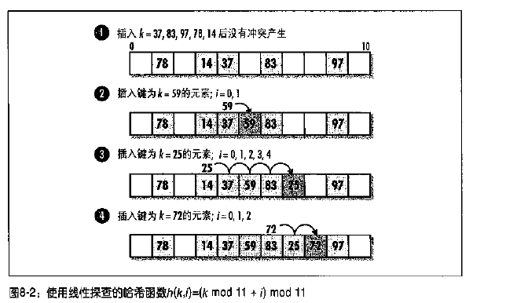

在链式哈希表中，元素存放在每个地址的"桶"中。

开地址哈希表中，元素存放在表本身中.这种特性对于某些依赖固定大小表的应用来说非常有用。
然而每个槽位没有一个"桶"来存储冲突的元素，所以开地址哈希表需要通过另一个方法来解决冲突.

# 冲突解决

开地址哈希表中解决冲突的方法就是探究这个表，知道找到一个可以放置元素的槽。

* 如果要插入一个元素，探查槽位直到定位到该元素或直到找到一个空槽.
* 如果删除或查找一个元素，探查槽位知道定位到该元素或直到一个空槽。

负载因子 `a = n / m` n为元素的个数，m为可以散列的槽位个数。

一般开地址哈希表探查槽位函数:`h(k, i) = x;`

* k为键
* i是目前为止探查的次数
* x是得到的哈希编码

## 线性探查
线性探查：开地址哈希表中一种简单的探查方法就是探查表中连续的槽位。

如果i大于0小于m-1(m为表中的槽位个数),那么线性探查方法的哈希函数定义为：

`h(k, i) = (h'(k) + i) mod m`

* `h'()`是一个辅助哈希函数。尽可能地将元素随机和均匀地分布在表中。
* 可以使用取余法`h'(k) = k mod m`

将一个元素(键k=2998)散列到表(容量m=1000)，得到的哈希编码为

* `(998 + 0) mod 1000 = 998` (当i=0时)
* `(998 + 1) mod 1000 = 999` (当i=1时)
* `(998 + 2) mod 1000 = 0`   (当i=2时)

当要插入一个键k=2998的元素时，会找到一个空的槽位，首先查找槽位998，然后999，然后槽位0，依次类推.

线性探查优点是简单，而且没有m限制。但是线性探查不能均匀散列。当遇到基本聚集的情况时，
产生很长的查询序列，从而使表变得越来越长.这种过度查询会降低表的性能

其中，i值表示探查次相同的时候增加

## 双散列

最有效地查询开地址哈希表的方法之一,通过计算两个辅助哈希函数哈希编码的和来得到哈希编码。正式表述为，如果i的大小在0和m之间(m为槽位个数)，双散列的哈希函数定义为：

`h(k,i)=(h1(k) + i * h2(k)) mod m`

尽可能地将元素随机和均匀散列到表中。为了保证第二次访问任何一个槽之前其他所有槽都访问过了，遵循如下规则：

* 一种方法是，m必须是2次幂，让h2返回一个奇数值
* 另一种方法，选择m为一个素数，h2,返回的值在 `1 << h2(k) << m-1`之间

通常情况下，`h1(k) = k mod m`,`h2(k) = 1 + (k mod m')`,通常m'略小于m，类似m-1或m-2

`h(k, i) = (k mod 11 + i*(i + k mod 9)) mod 11`

