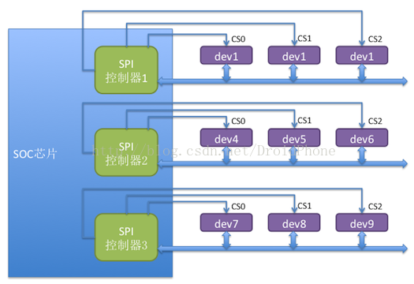
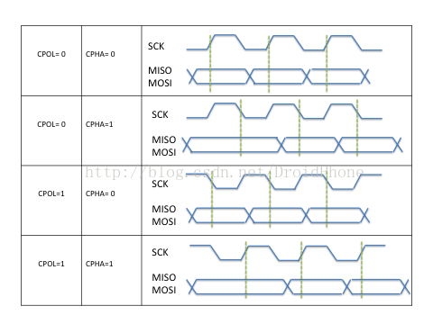
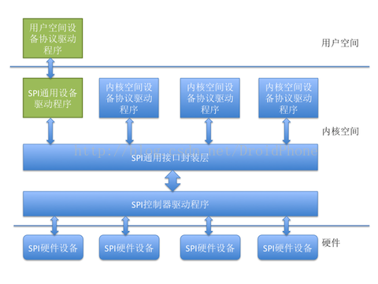

# Linux SPI总线和设备驱动架构之一：系统概述
SPI协议是一种同步的串行数据连接标准，可工作全双工模式。相关通讯设备可以工作于m/s模式。主设备发起数据数帧，允许多个从设备的存在。每个从设备有独立的片选信息，SPI一般来说SPI一般来说是四线串行总线结构。

* `SCLK`：Serial Clock(output from master)时钟(主设备发出)
* `MOSI/SIMO`:Master Output,Slave Input(out from slave)数据信号线mosi(主设备发出)
* `MISO/SOMI`:Master Input,Slave Output(output from slave)数据信号线(从设备)
* `SS`:Slave Select(active low;output from master)片选信号.

因为在大多数情况下，`CPU`或`SoC`一侧通常都是工作在主设备模式，所以，**目前的Linux内核版本中**，**只实现了主模式的驱动框架**。

# 硬件结构
通常，负责发出时钟信号的设备我们称之为主设备，另一方则作为从设备，下图是一个SPI系统的硬件连接示例：

如上图所示，主设备对应SOC芯片中的SPI控制器，通常，一个SOC中可能存在多个SPI控制器，像上面的例子所示，SOC芯片中有3个SPI控制器。每个控制器下可以连接多个SPI从设备，每个从设备有各自独立的CS引脚。每个从设备共享另外3个信号引脚：`SCK`、`MISO`、`MOSI`。**任何时刻**，**只有一个CS引脚处于有效状态**，与该有效CS引脚连接的设备此时可以与主设备（SPI控制器）通信，其它的从设备处于等待状态，并且它们的3个引脚必须处于高阻状态。

# 工作时序
按照时钟信号和数据信号之间的相位关系，SPI有4种工作时序模式：

我们用CPOL表示`时钟信号的初始电平的状态`，CPOL为0表示时钟信号初始状态为低电平，为1表示时钟信号的初始电平是高电平。另外，我们用CPHA来表示`在那个时钟沿采样数据`，CPHA为`0`表示在首个时钟变化沿采样数据，而CPHA为`1`则表示要在第二个时钟变化沿来采样数据。内核用CPOL和CPHA的组合来表示当前SPI需要的工作模式：

* CPOL＝0，CPHA＝1        模式0
* CPOL＝0，CPHA＝1        模式1
* CPOL＝1，CPHA＝0        模式2
* CPOL＝1，CPHA＝1        模式3

我想，由于人们的习惯都是上升沿采样数据，由这个习惯决定了模式0最常用。
# 软件架构

在内核的SPI驱动的软件架构中，进行了合理的分层和抽象，如下图所示：

# SPI通用接口封装层
为了简化SPI驱动程序的编程工作，同时也为了降低协议驱动程序和控制器驱动程序的耦合程度，内核把控制器驱动和协议驱动的一些通用操作封装成标准的接口，加上一些通用的逻辑处理操作，组成了SPI通用接口封装层。这样的好处是，对于控制器驱动程序，只要实现标准的接口回调API，并把它注册到通用接口层即可，无需直接和协议层驱动程序进行交互。而对于协议层驱动来说，只需通过通用接口层提供的API即可完成设备和驱动的注册，并通过通用接口层的API完成数据的传输，无需关注SPI控制器驱动的实现细节。
# SPI控制器驱动程序
SPI控制器不用关心设备的具体功能，它只负责把上层协议驱动准备好的数据按SPI总线的时序要求发送给SPI设备，同时把从设备收到的数据返回给上层的协议驱动，因此，内核把SPI控制器的驱动程序独立出来。**SPI控制器驱动负责控制具体的控制器硬件**，诸如`DMA`和`中断`操作等等，因为多个上层的协议驱动可能会通过控制器请求数据传输操作，所以，**SPI控制器驱动同时也要负责对这些请求进行队列管理**，保证先进先出的原则。
# SPI协议驱动程序
上面我们提到，控制器驱动程序并不清楚和关注设备的具体功能，SPI设备的具体功能是由SPI协议驱动程序完成的，SPI协议驱动程序了解设备的功能和通信数据的协议格式。向下，协议驱动通过通用接口层和控制器交换数据，向上，协议驱动通常会根据设备具体的功能和内核的其它子系统进行交互，例如，和MTD层交互以便把SPI接口的存储设备实现为某个文件系统，和TTY子系统交互把SPI设备实现为一个TTY设备，和网络子系统交互以便把一个SPI设备实现为一个网络设备，等等。当然，如果是一个专有的SPI设备，我们也可以按设备的协议要求，实现自己的专有协议驱动。
# SPI通用设备驱动程序
有时候，考虑到连接在SPI控制器上的设备的可变性，在内核没有配备相应的协议驱动程序，对于这种情况，内核为我们准备了通用的SPI设备驱动程序，该通用设备驱动程序向用户空间提供了控制SPI控制的控制接口，具体的协议控制和数据传输工作交由用户空间根据具体的设备来完成，在这种方式中，只能采用同步的方式和SPI设备进行通信，所以通常用于一些数据量较少的简单SPI设备。
