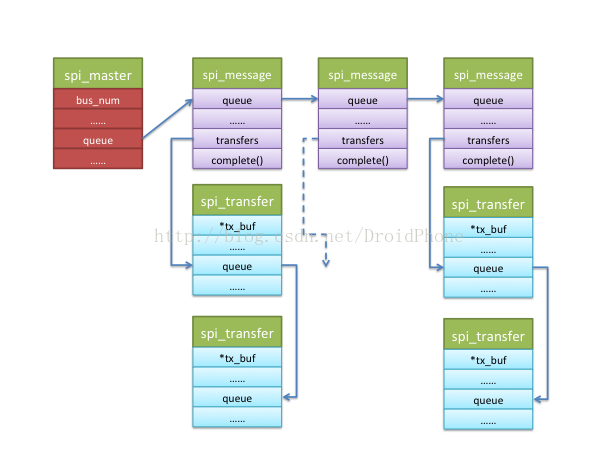

# Linux SPI总线和设备驱动架构之二：SPI通用接口层
我们知道，SPI通用接口层用于把具体`SPI设备的协议驱动`和`SPI控制器驱动`联接在一起，通用接口层除了为协议驱动和控制器驱动提供一系列的标准接口API，同时还为这些接口API定义了相应的数据结构，这些数据结构一部分是SPI设备、SPI协议驱动和SPI控制器的数据抽象，一部分是为了协助数据传输而定义的数据结构。另外，通用接口层还负责SPI系统与Linux设备模型相关的初始化工作。本章的我们就通过这些数据结构和API的讨论来对整个通用接口层进行深入的了解。

SPI通用接口层的代码集中在：`/drivers/spi/spi.c`中。
## SPI设备模型的初始化
通常地，根据linux设备模型的组织方式，各种设备会挂在合适的总线上，设备驱动和设备通过总线互相进行匹配，使得设备能够找到正确的驱动程序进行控制和驱动。同时，性质相似的设备可以归为某一个类的设备，它们具有某些共同的设备属性，在设备模型上就是所谓的class。SPI设备也不例外，它们也遵循linux的设备模型的规则：

```c
struct bus_type spi_bus_type = {
        .name           = "spi",
        .dev_attrs      = spi_dev_attrs,
        .match          = spi_match_device,
        .uevent         = spi_uevent,
        .pm             = &spi_pm,
};  
    
static struct class spi_master_class = {
        .name           = "spi_master",
        .owner          = THIS_MODULE,
        .dev_release    = spi_master_release,
};
 
static int __init spi_init(void)
{
        int     status;
 
        buf = kmalloc(SPI_BUFSIZ, GFP_KERNEL);
        ......
        status = bus_register(&spi_bus_type);
        ......
        status = class_register(&spi_master_class);
        ......
        return 0;
        ......
}
 
 
postcore_initcall(spi_init);
```
可见，在初始化阶段，spi_init函数向系统注册了一个名为spi的总线类型，同时也为SPI控制器注册了一个名为spi_master的设备类。这样，以后在sysfs中就会出现以下两个文件节点：

* `sys/bus/spi`
* `sys/class/spi_master`
代表spi总线的spi_bus_type结构的match字段指向了spi_match_device函数，该函数用于匹配spi总线上的设备和驱动，具体的代码这里就不贴了，各位可以自行查看内核的代码树。

## spi_master结构

SPI控制器负责按照设定的物理信号格式在主控和spi设备之间交换数据，SPI控制器数据是如何被传输的，而不关心数据的内容。SPI通用接口层用`spi_master`结构来表示一个**spi控制器**，我们看看它的主要字段的意义：

```c
struct device   dev spi;//控制器对应的device结构
struct list_head list;//	系统可能有多个控制器，用该链表链接在一个全局链表变量上
s16  bus_num;// 该控制器对应的spi总线编号，从0开始，通常由板级代码设定
u16 num_chipselect;// 连接到该spi控制器的片选信号的个数
u16 mode_bits;// 工作模式，由驱动解释该模式的意义
u32  min_speed_hz;//	最低工作时钟
u32   max_speed_hz	最高工作时钟
u16   flags;//	用于设定某些限制条件的标志位
int (*setup)(struct spi_device *spi);//回调函数，用于设置某个spi设备在该控制器上的工作参数
int (*transfer)(......）;//	回调函数，用于把包含数据信息的mesg结构加入控制器的消息链表中
void (*cleanup)(struct spi_device *spi);//回调函数，当spi_master被释放时，该函数被调用
struct kthread_worker   kworker	用于管理数据传输消息队列的工作队列线程
struct kthread_work pump_messages;//具体实现数据传输队列的工作队列
struct list_head queue;//该控制器的消息队列，所有等待传输的消息队列挂在该链表下
struct spi_message  *cur_msg	;//当前正带处理的消息队列
int (*prepare_transfer_hardware)(......);//回调函数，正式发起传送前会被调用，用于准备硬件资源
int (*transfer_one_message)(......);//单个消息的原子传送回调函数，队列中的每个消息都会调用一次该回调来完成传输工作
int (*unprepare_transfer_hardware)(......);//清理回调函数
int *cs_gpios;//片选信号所用到的gpio
```
spi_master结构通常由控制器驱动定义，然后通过以下通用接口层的API注册到系统中：`int spi_register_master(struct spi_master *master);`

## spi_device结构
SPI通用接口层用spi_device结构来表示一个spi设备，它的各个字段的意义如下：

```
struct device dev;//代表该spi设备的device结构
struct spi_master *master;//指向该spi设备所使用的控制器
u32  max_speed_hz;//该设备的最大工作时钟频率
u8 chip_select;//在控制器中的片选引脚编号索引
u16  mode;//设备的工作模式，包括时钟格式，片选信号的有效电平等等
u8 bits_per_word;//设备每个单位数据所需要的比特数
int irq;//	设备使用的irq编号
char modalias[SPI_NAME_SIZE];//该设备的名字，用于spi总线和驱动进行配对
int cs_gpio;//片选信号的gpio编号，通常不用我们自己设置，接口层会根据上面的chip_select字段在spi_master结构中进行查找并赋值
```
要完成向系统增加并注册一个SPI设备，我们还需要另一个数据结构：

```c
struct spi_board_info {
        char            modalias[SPI_NAME_SIZE];
        const void      *platform_data;
        void            *controller_data;
        int             irq;
        u32             max_speed_hz;
        u16             bus_num;
        u16             chip_select;
        u16             mode;
};
```
`spi_board_info`结构大部分字段和spi_device结构相对应，bus_num字段则用来指定所属的控制器编号，通过spi_board_info结构，我们可以有两种方式向系统增加spi设备。

* 第一种方式是在SPI控制器驱动已经被加载后，我们使用通用接口层提供的如下API来完成：`struct spi_device *spi_new_device(struct spi_master *master, struct spi_board_info *chip);`
* 第二种方式是在板子的初始化代码中，定义一个spi_board_info数组，然后通过以下API注册spi_board_info：`int spi_register_board_info(struct spi_board_info const *info, unsigned n);`

上面这个API会把每个spi_board_info挂在全局链表变量board_list上，并且遍历已经在系统中注册了的控制器，匹配上相应的控制器并取得它们的spi_master结构指针，最终也会通过spi_new_device函数添加SPI设备。因为spi_register_board_info可以在板子的初始化代码中调用，可能这时控制器驱动尚未加载，此刻无法取得相应的spi_master指针，不过不要担心，控制器驱动被加载时，一定会调用spi_register_master函数来注册spi_master结构，而spi_register_master函数会反过来遍历全局链表board_list上的spi_board_info，然后通过spi_new_device函数添加SPI设备。
## spi_driver结构
根据linux的设备模型，有device就必定有driver与之对应，上一节介绍的spi_device结构中内嵌了device结构字段dev，同样地，代表驱动程序的spi_driver结构也内嵌了device_driver结构：

```c
struct spi_driver {
        const struct spi_device_id *id_table;
        int                     (*probe)(struct spi_device *spi);
        int                     (*remove)(struct spi_device *spi);
        void                    (*shutdown)(struct spi_device *spi);
        int                     (*suspend)(struct spi_device *spi, pm_message_t mesg);
        int                     (*resume)(struct spi_device *spi);
        struct device_driver    driver;
};
```
id_table字段用于指定该驱动可以驱动的设备名称，总线的匹配函数会把id_table中指定的名字和spi_device结构中的modalias字段进行比较，两者相符即表示匹配成功，然后出发spi_driver的probe回调函数被调用，从而完成驱动程序的初始化工作。通用接口层提供如下API来完成spi_driver的注册：

```c
int spi_register_driver(struct spi_driver *sdrv)
{
        sdrv->driver.bus = &spi_bus_type;
        if (sdrv->probe)
                sdrv->driver.probe = spi_drv_probe;
        if (sdrv->remove)
                sdrv->driver.remove = spi_drv_remove;
        if (sdrv->shutdown)
                sdrv->driver.shutdown = spi_drv_shutdown;
        return driver_register(&sdrv->driver);
}
```
需要注意的是，这里的`spi_driver`结构代表的是具体的**SPI协议驱动程序**。

## spi_message和spi_transfer结构
要完成和SPI设备的数据传输工作，我们还需要另外两个数据结构：`spi_message`和`spi_transfer`。

* spi_message包含了一个的spi_transfer结构序列，一旦控制器接收了一个spi_message，其中的spi_transfer应该按顺序被发送，并且不能被其它spi_message打断，所以我们认为spi_message就是一次SPI数据交换的原子操作。下面我们看看这两个数据结构的定义：

```c
struct spi_message {
        struct list_head        transfers;
 
        struct spi_device       *spi;
 
        unsigned                is_dma_mapped:1;
 
        /* completion is reported through a callback */
        void                    (*complete)(void *context);
        void                    *context;
        unsigned                frame_length;
        unsigned                actual_length;
        int                     status;
 
        struct list_head        queue;
        void                    *state;
};
```
链表字段queue用于把该结构挂在代表控制器的spi_master结构的queue字段上，控制器上可以同时被加入多个spi_message进行排队。另一个链表字段transfers则用于链接挂在本message下的spi_tranfer结构。`complete回调函数`则会在该message下的所有spi_transfer都被传输完成时被调用，以便通知协议驱动处理接收到的数据以及准备下一批需要发送的数据。我们再来看看spi_transfer结构：

```c
struct spi_transfer {
        const void      *tx_buf;
        void            *rx_buf;
        unsigned        len;
 
        dma_addr_t      tx_dma;
        dma_addr_t      rx_dma;
 
        unsigned        cs_change:1;
        u8              tx_nbits;
        u8              rx_nbits;
        u8              bits_per_word;
        u16             delay_usecs;
        u32             speed_hz;
 
        struct list_head transfer_list;
};
```
首先，transfer_list链表字段用于把该transfer挂在一个spi_message结构中，tx_buf和rx_buf提供了非dma模式下的数据缓冲区地址，len则是需要传输数据的长度，tx_dma和rx_dma则给出了dma模式下的缓冲区地址。原则来讲，spi_transfer才是传输的最小单位，之所以又引进了spi_message进行打包，我觉得原因是：有时候希望往spi设备的多个不连续的地址（或寄存器）一次性写入，如果没有spi_message进行把这样的多个spi_transfer打包，因为通常真正的数据传送工作是在另一个内核线程（工作队列）中完成的，不打包的后果就是会造成更多的进程切换，效率降低，延迟增加，尤其对于多个不连续地址的小规模数据传送而言就更为明显。

通用接口层为我们提供了一系列用于操作和维护spi_message和spi_transfer的API函数，这里也列一下。
用于

* 初始化spi_message结构：`void spi_message_init(struct spi_message *m);`
* 把一个spi_transfer加入到一个spi_message中（注意，只是加入，未启动传输过程），和移除一个spi_transfer：`void spi_message_add_tail(struct spi_transfer *t, struct spi_message *m);`和` void spi_transfer_del(struct spi_transfer *t);`
* 以上两个API的组合，初始化一个spi_message并添加数个spi_transfer结构：`void spi_message_init_with_transfers(struct spi_message *m, struct spi_transfer *xfers, unsigned int num_xfers);`
* 分配一个自带数个spi_transfer机构的spi_message：`struct spi_message *spi_message_alloc(unsigned ntrans, gfp_t flags);`
* 发起一个spi_message的传送操作：
	* 异步版本:`int spi_async(struct spi_device *spi, struct spi_message *message);`
	* 同步版本:`int spi_sync(struct spi_device *spi, struct spi_message *message);`

利用以上这些API函数，SPI设备的协议驱动程序就可以完成与某个SPI设备的数据交换工作，同时也可以看到，因为有通用接口层的隔离，控制器驱动对于协议驱动程序来说是透明的，也就是说，协议驱动程序只关心具体需要处理和交换的数据，无需关心控制器是如何传送这些数据的。spi_master，spi_message，spi_transfer这几个数据结构的关系可以用下图来描述：



总结一下，协议驱动发送数据的流程大致是这样的：

* 定义一个spi_message结构；
* 用spi_message_init函数初始化spi_message；
* 定义一个或数个spi_transfer结构，初始化并为数据准备缓冲区并赋值给spi_transfer相应的字段（tx_buf，rx_buf等）；
* 通过spi_message_init函数把这些spi_transfer挂在spi_message结构下；
* 如果使用同步方式，调用spi_sync()，如果使用异步方式，调用spi_async()；

另外，通用接口层也为一些简单的数据传输提供了独立的API来完成上述的组合过程：
* `int spi_write(struct spi_device *spi, const void *buf, size_t len);`    ----    同步方式发送数据。
* `int spi_read(struct spi_device *spi, void *buf, size_t len); `   ----    同步方式接收数据。
* `int spi_sync_transfer(struct spi_device *spi, struct spi_transfer *xfers, unsigned int num_xfers);`    ----   同步方式，直接传送数个spi_transfer，接收和发送。
* `int spi_write_then_read(struct spi_device *spi, const void *txbuf, unsigned n_tx, void *rxbuf, unsigned n_rx);`    ----    先写后读。
* `ssize_t spi_w8r8(struct spi_device *spi, u8 cmd);`    ----    写8位，然后读8位。
* `ssize_t spi_w8r16(struct spi_device *spi, u8 cmd);`    ----    写8位，然后读16位。
