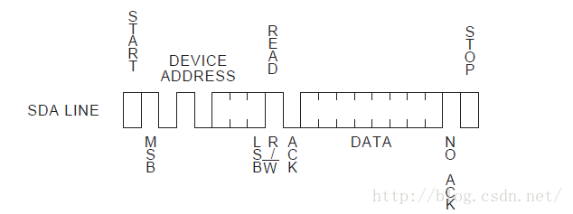
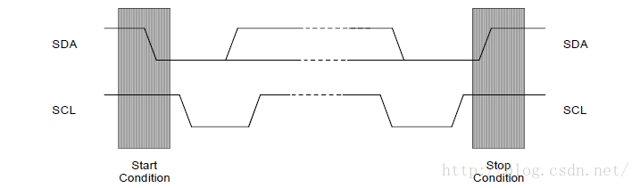
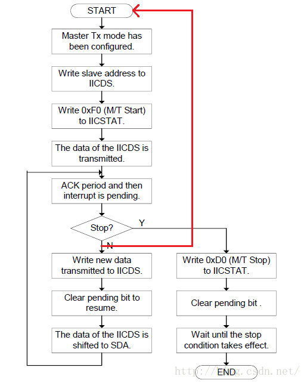
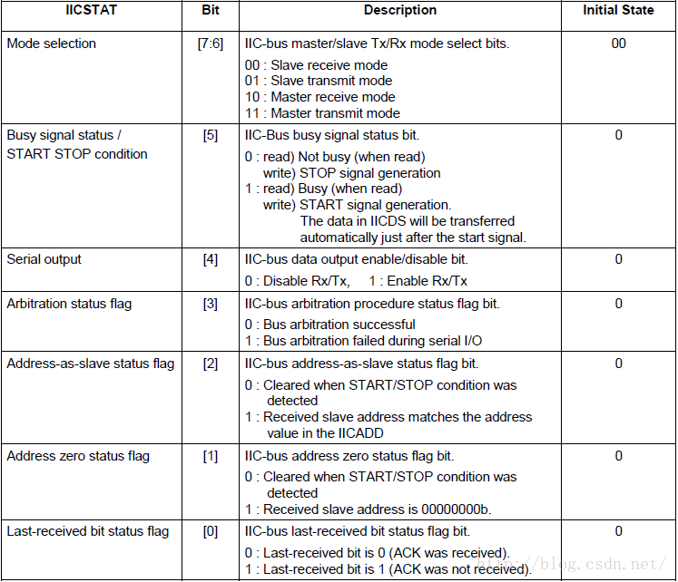
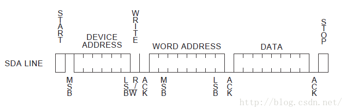
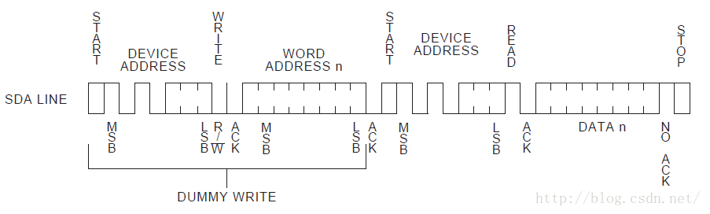
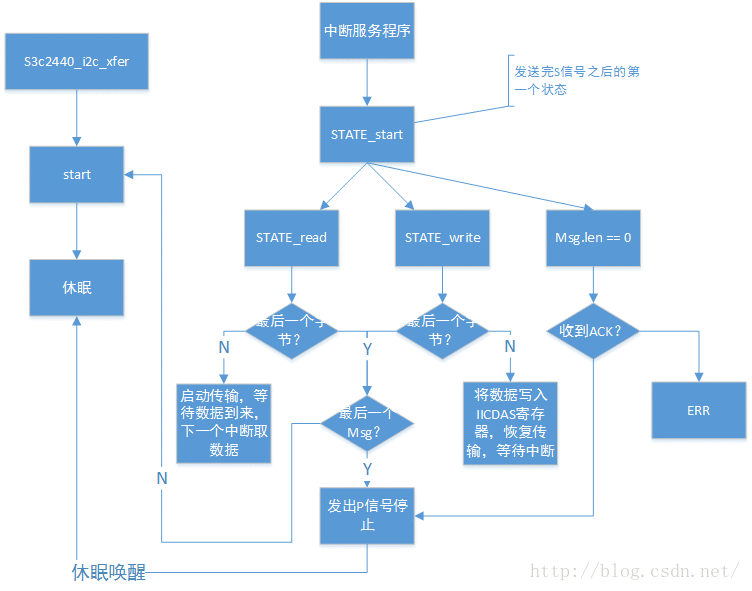

# 1.i2c协议简要分析
i2c中线是一种由 PHILIPS 公司开发的串行总线，用于连接微控制器及其外围设备，它具有以下特点。

* 只有两条总线线路：**一条串行数据线SDA**,**一条串行时钟线SCL**。
* 每个连接到总线的**器件**都可以使用软件根据它的**唯一的地址**来确定。
* 传输数据的设备之间是简单的**主从关系**。
* 机可以用作主机发送器或者主机接收器
* 它是一个真正的多主机总线，两个或多个主机同时发起数据传输时，可以通过冲突检测和仲裁来防止数据被破坏。
* **串行的8位双向传输**，位速在标准模式下可达 100kbit/s,在快速模式下可达400kbit/s，在高速模式下可待3.4Mbit/s。
* 片上的滤波器可以增加抗干扰能力，保证数据的完整性.
* 连接到同一总线上的IC数量只受到总线的**最大电容400Pf**的限制



如上图所示，启动一个传输时，主机先发送一个**S信号**，然后发送8位数据。这8位数据的**前7位为从机地址**，**第八位表示传输的方向**（0表示写，1表示读），如果有数据则继续发送，最后发出**P信号**停止。



信号类型：**注意**：正常数据传输时，`SDA`在SCL为低电平时改变，在SCL为高电平时保持稳定。SCL高电平，SDA电平改变时改变状态。

* **开始信号 S 信号**：SCL 为高电平时，SDA由高电平向低电平跳变，开始传送数据。
* **结束信号 P 信号**：SCL 为高电平时，SDA由低电平向高电平跳变，结束传送数据。
* **响应信号 ACK**：接收器在接收到8位数据后，在第9个时钟周期，**拉低SDA电平**

**注意**：在第9个时钟周期，发送器保持SDA为高，**如果有ACK**，那么**第9个时钟周期SDA为低电平**，如果没有为高电平，发送器根据电平高低分辨是否有ACK信号。如果使能了IIC中断，发送完8bit数据后，主机自动进入中断处理函数，此时SCL被发送器拉低，让接收器被迫等待。恢复传输只需要清除中断挂起。

# 2.s3c2440 读写流程



* 1.设置传输模式`IICSTAT[7-6]`，我们做实验与`AT24C08`通信时，2440作为主机，因此只用到**主机发模式**和**主机收模式**。
* 2.写入从机地址到`IICDS[7-1]`，此时`IICDS[7-1]`位表示从机地址，第0位不关心。如AT24C08为 0xA0(最低位写0了，发送到数据线上的7位地址的后边以为才表示收发，这里虽然写0但并不是根据这里的0来真正发送的)。
* 3.写0xF0(写)或0xB0(读)到IICSTAT寄存器, 高两位表示 传输模式前边设置过了，设置IICSTT[5-4] 为 11,使能传输，发送S信号。
* 4.IIC控制器自动将第2步中设置的`IICDS[7-1]`再根据 传输模式 补充 IICDS[0]位，发送出去。
* 5.进入第9个时钟周期，此时，从机决定是否发出ACK信号，主机进入中断，判断是否收到ACK信号，以及是否继续传输。
* 继续发送：
	* 1.将数据写入 IICDS 
	* 2.清除中断挂起，SCL时钟恢复，IICDS的数据被自动发送到 SDA 线上，回到第5步。
* 停止发送：
	* 1.写 0xD0(写) 和 0x90(读) 到 IICATAT ，IICATAT[7-6]还是表示的传输模式，`IICATAT[5-4] == 0 1`，发送停止信号
	* 2.清除中断挂起，SCL时钟恢复，发出停止信号
	* 3.延时，等待停止信号发出



# 3.AT24C08 读写分析
## 3.1 写过程



写过程与2440芯片的里的写流程相一致，按照流程写就OK

## 3.2 读过程



读过程是由2440芯片里的一个写流程加一个读流程组合而成，其中**写流程结束没有发出P信号**，而是直接发出了S信号开始读流程，也就是我为什么加了一道红线的原因。


# 附上一份简单的裸机程序，仅供参考：基于MINI2440

```c
#include <stdio.h>
#include "s3c2440.h"

void Dealy(int time);

#define WRDATA (1)
#define RDDATA (2)

typdef struct tI2C {
	unsigned char *pData; //数据缓冲区
	volatile int DataCount; //等待传输的数据长度
	volatile int Status;    //状态
	volatile int Mode;      //模式  读/写
	volatile int Pt;        //pData 中等待传输数据的位置
}tS3C24XX_I2C,*ptS3C24xx_I2C;

//I2C初始化
void i2c_init(void){
	GPEUP |= 0xc000;  //禁止内部上拉
	//AT24C08 两根线 I2CSCL I2CSDA 与 2440芯片相连
	//配置2440 GPECON GPE15 GPE14引脚为I2C功能
	GPECON |=0xa000000;  // 选择引脚功能：GPE15:IICSDA, GPE14:IICSCL
	
	//开INT_IIC中断
	//INTMSK &= ~(BIT_IIC);
	
	//bit[7]=1,使能ACK
	//bit[6]=0,IICCLK = PLK/16
	//bit[5] = 1,使能中断
	//bit[3:0] = 0xf,Tx clock = IICCLK/16
	//PCLK= 50MHz,IICCLK = 3.125MHz,Tx Clock = 0.195MHz
	
	IICCON = (1<<7) | (0<<6) | (1<<5) | (0xf); //0xaf
	//IICADD = 0x10; //S3C24XX slave address = [7:1]
	IICSTAT = 0x10;  //I2C串行输出使能(Rx/Tx)
}

void I_Write(unsigned int slvaddr, unsigned char addr, unsigned char data)  
{  
    unsigned int ack;  
	// 写从地址
	IICSTAT |= 0x1<<6;//主机写模式   
    IICSTAT |= 0x1<<7;  
    IICDS = slvaddr;//0xa0;  //write slave address to IICDS   
    IICCON&=~0x10; //clear pending bit   
    IICSTAT = 0xf0;  //(M/T start)   
    while((IICCON & 1<<4) == 0);//udelay(10);//ack period and then interrupt is pending   
    // 写寄存器地址    
    IICDS = addr;  
    IICCON&=~0x10; //clear pending bit   
    while((IICCON & 1<<4) == 0);//udelay(10);//ack period and then interrupt is pending   
	// 写数据
    IICDS = data;  
    IICCON&=~0x10; //clear pending bit   
    while((IICCON & 1<<4) == 0);//udelay(10);//ack period and then interrupt is pending   
	// 发出停止信号
    IICSTAT = 0xD0; //write (M/T stop to IICSTAT)   
    IICCON&=~0x10; //clear pending bit   
 
    while((IICSTAT & 1<<5) == 1);  
}  
unsigned char I_Read(unsigned int slvaddr, unsigned char addr)  
{  
    unsigned char data  = 1;  
    int ack;  
	// 写从地址
	IICSTAT |= 0x1<<6;//主机写模式   
    IICSTAT |= 0x1<<7;  
	slvaddr = 0xA0;    
    IICDS = slvaddr;//0xa0;  //write slave address to IICDS   
    IICCON&=~0x10; //clear pending bit   
    IICSTAT = 0xf0;  //(M/T start)   
    while((IICCON & 1<<4) == 0);//udelay(10);//ack period and then interrupt is pending   
  
    // 写寄存器地址
    IICDS = addr;  
    IICCON&=~0x10; //clear pending bit   
    while((IICCON & 1<<4) == 0);//udelay(10);//ack period and then interrupt is pending   
 
    // 写从地址(读模式)
    slvaddr = 0xA1;
    IICSTAT &= ~(0x1<<6);//主机接受模式  
    IICSTAT |= 0x1<<7;  
    IICDS = slvaddr;  
    IICCON&=~0x10; //clear pending bit   
    IICSTAT = 0xb0;  //(M/R Start)   
    while((IICCON & 1<<4) == 0);//udelay(10);//uart_SendByte('o');//ack period and then interrupt is pending::   
 
	// 读数据
    data = IICDS;  
    //IICCON&=~0x10; //clear pending bit
	IICCON = 0x2f;	//清挂起状态，并设置无应答
    while((IICCON & 1<<4) == 0);//udelay(10);//ack period and then interrupt is pending   
    data = IICDS;  
    
	//IICCON&=~0x10; //clear pending bit   
	IICCON = 0x2f;	//清挂起状态，并设置无应答
    while((IICCON & 1<<4) == 0);//udelay(10);//ack period and then interrupt is pending   
 
 
    IICSTAT = 0x90;  
	IICCON = 0xaf;
    //IICCON &= ~0x10; //clear pending bit   
 
    while((IICSTAT & 1<<5) == 1);  
 
    return data;  
      
}
```

# 4.adapter驱动程序
这里，我们主要分析驱动里的发送核心算法，至于注册中断，IO内存映射，设置寄存器不在讨论。`static int xxx_i2c_xfer(struct i2c_adapter *adpap, struct i2c_msg *msg,int num)`这个算法函数的作用就是将上层封装好的一些i2c_msg 进行解析，将数据写入寄存器，发送出去。在设备驱动层，我们使用了类似i2c_smbus_write_byte 等函数，类似的函数有很多，它们的作用就是封装i2c_msg 结构(比如读和写的 msg 肯定不一样，读一个字节和读多个字节也不一样)，然后调用`i2c_smbus_xfer_emulated->i2c_transfer`，最终调用到我们的xxx_i2c_xfer函数进行传输。通过分析i2c_smbus_xfer_emulated函数，我们可以了解i2c_msg是如何封装的。下面，我们简单分析一下，知道最上层想干什么，我们才能知道实现哪些底层的功能不是。

```c
struct i2c_msg {
	__u16 addr;		//从机地址
	__u16 flags;
	__u16 len;		// buf 里 有多少个字节
	__u8 *buf;		// 本 msg 含有的数据，可能是1个字节，可有可能是多个字节
};	
```
此函数，省略了很多内容，举例分析而已~，细节请看源码

```c
static s32 i2c_smbus_xfer_emulated(struct i2c_adapter * adapter, u16 addr,
                                   unsigned short flags,
                                   char read_write, u8 command, int size,
                                   union i2c_smbus_data * data)
{	
	unsigned char msgbuf0[I2C_SMBUS_BLOCK_MAX+3];
	unsigned char msgbuf1[I2C_SMBUS_BLOCK_MAX+2];
	int num = read_write == I2C_SMBUS_READ?2:1;	// 写操作两个Msg 读操作一个msg 这和我们前面分析AT24c08是一致的
	struct i2c_msg msg[2] = { { addr, flags, 1, msgbuf0 },
	                          { addr, flags | I2C_M_RD, 0, msgbuf1 }
	                        };
	msgbuf0[0] = command;	// 从机地址右移1位得到的，比如AT24C08  为 0x50
	switch(size) {
	case I2C_SMBUS_BYTE_DATA:	// 单字节读写
		if (read_write == I2C_SMBUS_READ)
			msg[1].len = 1;
			/*
			 * 读：	
			 *	msgbuf0[0] = command
			 *  msg[1].len = 1	,数据会读到 msgbuf0[1] 里
			 */
		else {
			msg[0].len = 2;
			msgbuf0[1] = data->byte;
			/*
			 * 写：
			 *	msgbuf0[0] = command
			 *	msgbuf0[1] = data->byte
			 */
		}
		break;
	}
	status = i2c_transfer(adapter, msg, num);
}
```
上面代码跟我们分析AT24C08的时候如出一辙，对于一个写操作，我们只需要一个2440的写流程对应于这里的一个Msg，然而对于读操作，我们需要2440的两个流程，对应于这里的两个Msg。那么，我们底层控制器驱动需要做的工作就是，取出所有的Msg，将每一个Msg里buf里的数据发送出去，如果有下一个Msg, 那么再将下一个Msg里的buf发送完毕，最后发出P停止信号。还有一点，每发送一个Msg都要先发出S开始信号。


 在看adapter程序之前，我们先来简单思考一下，发出S开始信号之后，可能有以下3中情况：

* 1.当前`msg.len == 0` ，如果有ACK直接发出stop信号。这种情况出现在，控制器枚举设备的时候，因为它只发送S信号以及设备地址，不发送数据。
* 2.根据`msg->flags` 为 I2C_M_RD 等信息判断读写，`msg->flags` 最低位为1表示读，最低位为0表示写。
	* 2.1如果是读,恢复 IIC 传输，开始读就行了，在下一个中断里将寄存器数据取出，如果是最后一个要读取的数据，不能发送ACK（禁用ACK）。
	* 2.2如果是写,将数据写入IICDS 寄存器，恢复 IIC 传输。

```c
#define I2C_M_TEN0x0010          /* this is a ten bit chip address */
#define I2C_M_RD0x0001           /* read data, from slave to master */
#define I2C_M_NOSTART0x4000      /* if I2C_FUNC_PROTOCOL_MANGLING */
#define I2C_M_REV_DIR_ADDR0x2000 /* if I2C_FUNC_PROTOCOL_MANGLING */
#define I2C_M_IGNORE_NAK0x1000   /* if I2C_FUNC_PROTOCOL_MANGLING */
#define I2C_M_NO_RD_ACK0x0800    /* if I2C_FUNC_PROTOCOL_MANGLING */
#define I2C_M_RECV_LEN0x0400     /* length will be first received byte */
```

# 源码

看程序之前，看一个大致的流程图，对于理解程序有帮助



```c
#include <linux/kernel.h>
#include <linux/module.h>
 
#include <linux/i2c.h>
#include <linux/init.h>
#include <linux/time.h>
#include <linux/interrupt.h>
#include <linux/delay.h>
#include <linux/errno.h>
#include <linux/err.h>
#include <linux/platform_device.h>
#include <linux/pm_runtime.h>
#include <linux/clk.h>
#include <linux/cpufreq.h>
#include <linux/slab.h>
#include <linux/io.h>
#include <linux/of_i2c.h>
#include <linux/of_gpio.h>
#include <plat/gpio-cfg.h>
#include <mach/regs-gpio.h>
 
#include <asm/irq.h>
 
#include <plat/regs-iic.h>
#include <plat/iic.h>
 
//#define PRINTK printk
#define PRINTK(...) 
 
enum s3c24xx_i2c_state {
	STATE_IDLE,
	STATE_START,
	STATE_READ,
	STATE_WRITE,
	STATE_STOP
};
 
struct s3c2440_i2c_regs {
	unsigned int iiccon;
	unsigned int iicstat;
	unsigned int iicadd;
	unsigned int iicds;
	unsigned int iiclc;
};
 
struct s3c2440_i2c_xfer_data {
	struct i2c_msg *msgs;
	int msn_num;
	int cur_msg;
	int cur_ptr;
	int state;
	int err;
	wait_queue_head_t wait;
};
 
static struct s3c2440_i2c_xfer_data s3c2440_i2c_xfer_data;
 
 
static struct s3c2440_i2c_regs *s3c2440_i2c_regs;
 
 
static void s3c2440_i2c_start(void)
{
	s3c2440_i2c_xfer_data.state = STATE_START;
	
	if (s3c2440_i2c_xfer_data.msgs->flags & I2C_M_RD) /* 读 */
	{
		s3c2440_i2c_regs->iicds		 = s3c2440_i2c_xfer_data.msgs->addr << 1;
		s3c2440_i2c_regs->iicstat 	 = 0xb0;	// 主机接收，启动
	}
	else /* 写 */
	{
		s3c2440_i2c_regs->iicds		 = s3c2440_i2c_xfer_data.msgs->addr << 1;
		s3c2440_i2c_regs->iicstat    = 0xf0; 		// 主机发送，启动
	}
}
 
static void s3c2440_i2c_stop(int err)
{
	s3c2440_i2c_xfer_data.state = STATE_STOP;
	s3c2440_i2c_xfer_data.err   = err;
 
	PRINTK("STATE_STOP, err = %d\n", err);
 
 
	if (s3c2440_i2c_xfer_data.msgs->flags & I2C_M_RD) /* 读 */
	{
		// 下面两行恢复I2C操作，发出P信号
		s3c2440_i2c_regs->iicstat = 0x90;
		s3c2440_i2c_regs->iiccon  = 0xaf;
		ndelay(50);  // 等待一段时间以便P信号已经发出
	}
	else /* 写 */
	{
		// 下面两行用来恢复I2C操作，发出P信号
		s3c2440_i2c_regs->iicstat = 0xd0;
		s3c2440_i2c_regs->iiccon  = 0xaf;
		ndelay(50);  // 等待一段时间以便P信号已经发出
	}
 
	/* 唤醒 */
	wake_up(&s3c2440_i2c_xfer_data.wait);
	
}
 
static int s3c2440_i2c_xfer(struct i2c_adapter *adap,
			struct i2c_msg *msgs, int num)
{
	unsigned long timeout;
	
	/* 把num个msg的I2C数据发送出去/读进来 */
	s3c2440_i2c_xfer_data.msgs    = msgs;
	s3c2440_i2c_xfer_data.msn_num = num;
	s3c2440_i2c_xfer_data.cur_msg = 0;
	s3c2440_i2c_xfer_data.cur_ptr = 0;
	s3c2440_i2c_xfer_data.err     = -ENODEV;
 
	s3c2440_i2c_start();
 
	/* 休眠 */
	timeout = wait_event_timeout(s3c2440_i2c_xfer_data.wait, (s3c2440_i2c_xfer_data.state == STATE_STOP), HZ * 5);
	if (0 == timeout)
	{
		printk("s3c2440_i2c_xfer time out\n");
		return -ETIMEDOUT;
	}
	else
	{
		return s3c2440_i2c_xfer_data.err;
	}
}
 
static u32 s3c2440_i2c_func(struct i2c_adapter *adap)
{
	return I2C_FUNC_I2C | I2C_FUNC_SMBUS_EMUL | I2C_FUNC_PROTOCOL_MANGLING;
}
 
 
static const struct i2c_algorithm s3c2440_i2c_algo = {
//	.smbus_xfer     = ,
	.master_xfer	= s3c2440_i2c_xfer,
	.functionality	= s3c2440_i2c_func,
};
 
/* 1. 分配/设置i2c_adapter
 */
static struct i2c_adapter s3c2440_i2c_adapter = {
 .name			 = "s3c2440_100ask",
 .algo			 = &s3c2440_i2c_algo,
 .owner 		 = THIS_MODULE,
};
 
static int isLastMsg(void)
{
	return (s3c2440_i2c_xfer_data.cur_msg == s3c2440_i2c_xfer_data.msn_num - 1);
}
 
static int isEndData(void)
{
	return (s3c2440_i2c_xfer_data.cur_ptr >= s3c2440_i2c_xfer_data.msgs->len);
}
 
static int isLastData(void)
{
	return (s3c2440_i2c_xfer_data.cur_ptr == s3c2440_i2c_xfer_data.msgs->len - 1);
}
 
static irqreturn_t s3c2440_i2c_xfer_irq(int irq, void *dev_id)
{
	unsigned int iicSt;
    iicSt  = s3c2440_i2c_regs->iicstat; 
 
	if(iicSt & 0x8){ printk("Bus arbitration failed\n\r"); }
 
	switch (s3c2440_i2c_xfer_data.state)
	{
		case STATE_START : /* 发出S和设备地址后,产生中断 */
		{
			PRINTK("Start\n");
			/* 如果没有ACK, 返回错误 */
			if (iicSt & S3C2410_IICSTAT_LASTBIT)
			{
				s3c2440_i2c_stop(-ENODEV);
				break;
			}
 
			if (isLastMsg() && isEndData())
			{
				s3c2440_i2c_stop(0);
				break;
			}
 
			/* 进入下一个状态 */
			if (s3c2440_i2c_xfer_data.msgs->flags & I2C_M_RD) /* 读 */
			{
				s3c2440_i2c_xfer_data.state = STATE_READ;
				goto next_read;
			}
			else
			{
				s3c2440_i2c_xfer_data.state = STATE_WRITE;
			}	
		}
 
		case STATE_WRITE:
		{
			PRINTK("STATE_WRITE\n");
			/* 如果没有ACK, 返回错误 */
			if (iicSt & S3C2410_IICSTAT_LASTBIT)
			{
				s3c2440_i2c_stop(-ENODEV);
				break;
			}
 
			if (!isEndData())  /* 如果当前msg还有数据要发送 */
			{
				s3c2440_i2c_regs->iicds = s3c2440_i2c_xfer_data.msgs->buf[s3c2440_i2c_xfer_data.cur_ptr];
				s3c2440_i2c_xfer_data.cur_ptr++;
				
				// 将数据写入IICDS后，需要一段时间才能出现在SDA线上
				ndelay(50);	
				
				s3c2440_i2c_regs->iiccon = 0xaf;		// 恢复I2C传输
				break;				
			}
			else if (!isLastMsg())
			{
				/* 开始处理下一个消息 */
				s3c2440_i2c_xfer_data.msgs++;
				s3c2440_i2c_xfer_data.cur_msg++;
				s3c2440_i2c_xfer_data.cur_ptr = 0;
				s3c2440_i2c_xfer_data.state = STATE_START;
				/* 发出START信号和发出设备地址 */
				s3c2440_i2c_start();
				break;
			}
			else
			{
				/* 是最后一个消息的最后一个数据 */
				s3c2440_i2c_stop(0);
				break;				
			}
 
			break;
		}
 
		case STATE_READ:
		{
			PRINTK("STATE_READ\n");
			/* 读出数据 */
			s3c2440_i2c_xfer_data.msgs->buf[s3c2440_i2c_xfer_data.cur_ptr] = s3c2440_i2c_regs->iicds;			
			s3c2440_i2c_xfer_data.cur_ptr++;
next_read:
			if (!isEndData()) /* 如果数据没读写, 继续发起读操作 */
			{
				if (isLastData())  /* 如果即将读的数据是最后一个, 不发ack */
				{
					s3c2440_i2c_regs->iiccon = 0x2f;   // 恢复I2C传输，接收到下一数据时无ACK
				}
				else
				{
					s3c2440_i2c_regs->iiccon = 0xaf;   // 恢复I2C传输，接收到下一数据时发出ACK
				}				
				break;
			}
			else if (!isLastMsg())
			{
				/* 开始处理下一个消息 */
				s3c2440_i2c_xfer_data.msgs++;
				s3c2440_i2c_xfer_data.cur_msg++;
				s3c2440_i2c_xfer_data.cur_ptr = 0;
				s3c2440_i2c_xfer_data.state = STATE_START;
				/* 发出START信号和发出设备地址 */
				s3c2440_i2c_start();
				break;
			}
			else
			{
				/* 是最后一个消息的最后一个数据 */
				s3c2440_i2c_stop(0);
				break;								
			}
			break;
		}
 
		default: break;
	}
 
	/* 清中断 */
	s3c2440_i2c_regs->iiccon &= ~(S3C2410_IICCON_IRQPEND);
 
	return IRQ_HANDLED;	
}
 
 
/*
 * I2C初始化
 */
static void s3c2440_i2c_init(void)
{
	struct clk *clk;
 
	clk = clk_get(NULL, "i2c");
	clk_enable(clk);
	
    // 选择引脚功能：GPE15:IICSDA, GPE14:IICSCL
    s3c_gpio_cfgpin(S3C2410_GPE(14), S3C2410_GPE14_IICSCL);
	s3c_gpio_cfgpin(S3C2410_GPE(15), S3C2410_GPE15_IICSDA);
 
    /* bit[7] = 1, 使能ACK
     * bit[6] = 0, IICCLK = PCLK/16
     * bit[5] = 1, 使能中断
     * bit[3:0] = 0xf, Tx clock = IICCLK/16
     * PCLK = 50MHz, IICCLK = 3.125MHz, Tx Clock = 0.195MHz
     */
    s3c2440_i2c_regs->iiccon = (1<<7) | (0<<6) | (1<<5) | (0xf);  // 0xaf
 
    s3c2440_i2c_regs->iicadd  = 0x10;     // S3C24xx slave address = [7:1]
    s3c2440_i2c_regs->iicstat = 0x10;     // I2C串行输出使能(Rx/Tx)
}
 
static int i2c_bus_s3c2440_init(void)
{
	/* 2. 硬件相关的设置 */
	s3c2440_i2c_regs = ioremap(0x54000000, sizeof(struct s3c2440_i2c_regs));
	
	s3c2440_i2c_init();
 
	request_irq(IRQ_IIC, s3c2440_i2c_xfer_irq, 0, "s3c2440-i2c", NULL);
 
	init_waitqueue_head(&s3c2440_i2c_xfer_data.wait);
	
	/* 3. 注册i2c_adapter */
	i2c_add_adapter(&s3c2440_i2c_adapter);
	
	return 0;
}
 
static void i2c_bus_s3c2440_exit(void)
{
	i2c_del_adapter(&s3c2440_i2c_adapter);	
	free_irq(IRQ_IIC, NULL);
	iounmap(s3c2440_i2c_regs);
}
 
module_init(i2c_bus_s3c2440_init);
module_exit(i2c_bus_s3c2440_exit);
MODULE_LICENSE("GPL");
```