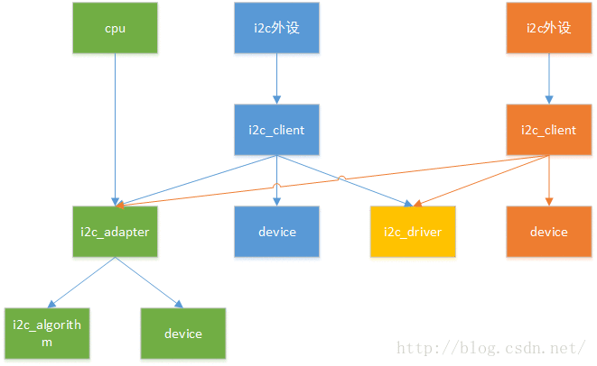
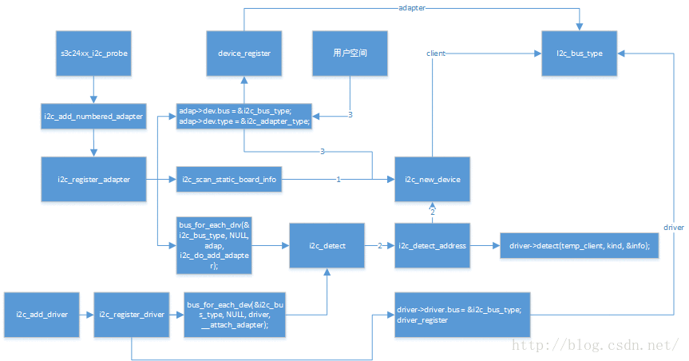

# i2c驱动程序全面分析，从adapter驱动程序到设备驱动程序
# 1.adapter client 简介
在内核里，i2c 驱动框架大概分为两层，adapter 驱动 和 设备驱动，adapter 英文翻译过来为 “适配器”，适配器并不恰当，根据我的理解，adapter 指的是我们 mcu 里的 i2c 控制模块，就是那堆寄存器，因为一个 mcu 里的i2c控制模块是固定的（寄存器参数、以及收发数据的方法），因此大多数情况下，它们都有芯片厂商写好了，然而我们学习的过程中自己动手写一写也并不困难。
对于s3c2440仅仅有一个`i2c_adapter`，但是别的Mcu可能有多个。至于Client，它对应于muc外围的I2c设备，每一个**i2c设备**都由一个唯一的`client`来描述。



```c
struct i2c_adapter {
	struct module *owner;
	unsigned int id;
	unsigned int class;//class to allow probing for
	const struct i2c_algorithm *algo;//the algorithm to access the bus
	void *algo_data;
	
	//data fields that are valid for all devices
	u8 level;       //nesting level for lockdef
	struct mutex bus_lock;
	
	int timeout;  // in jiffies
	int retires;
	struct device dev; //the adapter device
	
	int nr;
	char name[48];
	struct completion dev_released;
}；
```
简单扫一眼，i2c_adapter 封装了 `struct device` ，因此它是作为一个设备注册到内核中去的（稍后我们会知道，它是注册到`i2c_bus_type`里），此外非常重要的一个成员`struct i2c_algorithm *algo` ，这就是我们上边提到的 i2c 控制器**收发数据的方法**。

```c
struct i2c_algorithm {
	int (*master_xfer)(struct i2c_adapter *adap,struct i2c_msg *msgs,int num);
	int (*smbus_xfer)(struct i2c_adapter *adap,u16 adder,unsigned short flags,char read_write,
		u8 command,int size,union i2c_smbus_data *data);
	//to determine what the adapter support
	u32 (*functionality)(struct i2c_adapter *);
};
```

* master_xfer:对应于i2c协议子集 smbus ，有些设备只支持这个协议
* smbus_xfer:对应于普通的 i2c 传输协议
* functionality:用来描述，adapter所具有的功能，比如是否支持`smbus`

```c
struct i2c_client {
	unsigned short flags;    //div. see below
	unsigned short addr;     // chip address NOTE:7bit,address are stored in the _LOWER_ 7 bits
	
	char name[I2C_NAME_SIZE];
	struct i2c_adapter *adapter;  //the adapter we sit on
	struct i2c_driver *driver;    //and our access routines
	struct device dev;            //the device structure
	int irq;					  //irq issued by device;
	struct list_head detected;
};
```
i2c_client 本质上是一个 i2c_"dev", 它包含了与它配对的 driver ，以及它所在的 adapter（i2c设备在物理连接上，连接到了哪个adapter），后面分析时会看到，它也是作为**设备**注册到`i2c_bus_type`.

# 2.adapter驱动框架
在我所使用的这个内核里，2440的i2c_adapter框架是基于 platform_bus_type 的，关于 platform_bus_type 别的文章已经分析过了，这里不做赘述，只简单提一下，当设备或驱动注册到 platform_bus_type 时，首先会查找驱动是否有id_table，如果有根据id_table进行匹配（就是看id_table里有无设备的名字），否则匹配设备名字和驱动名字。匹配成功则调用驱动里的probe函数。

## 2.1 设备侧

根据设备总线驱动模型的分层思想，将一个驱动程序分为 device 和 driver 两层，那么 device 里提供底层的硬件资源，在 driver 中取出这些资源进行使用。那么我们就可以猜测到 i2c_adapter 驱动的设备侧 至少应该含有哪些资源？

* 存器地址必须有吧，因为我们要使用这些寄存器，不然怎么传输。
* 中断必须有吧，i2c传输过程中可是离不开中断的。
下面，我们就开详细的看一看，i2c_adapter 驱动的设备侧提供了哪些设备资源。`mach-smdk2410.c (arch\arm\mach-s3c2410)` 中定义了个指针数组，这里面有我们想要的 s3c_device_i2c0.

```c
static struct platform_device *smdk2410_devices[] __initdata = {
	&s3c_device_usb,
	&s3c_device_lcd,
	&s3c_device_wdt,
	&s3c_device_i2c0,
	&s3c_device_iis,
};
dev-i2c0.c (arch\arm\plat-s3c)
struct platform_device s3c_device_i2c0 = {
	.name		  = "s3c2410-i2c",
#ifdef CONFIG_S3C_DEV_I2C1
	.id		  = 0,
#else
	.id		  = -1,
#endif
	.num_resources	  = ARRAY_SIZE(s3c_i2c_resource),
	.resource	  = s3c_i2c_resource,
};
static struct resource s3c_i2c_resource[] = {
	[0] = {
		.start = S3C_PA_IIC1,
		.end   = S3C_PA_IIC1 + SZ_4K - 1,
		.flags = IORESOURCE_MEM,
	},
	[1] = {
		.start = IRQ_IIC1,
		.end   = IRQ_IIC1,
		.flags = IORESOURCE_IRQ,
	},
};
```
是不是正如我们所料，在资源文件中提供了 物理寄存器 以及 中断资源。`Mach-smdk2410.c (arch\arm\mach-s3c2410)`，将 s3c_device_i2c0 注册到 平台设备总线上去

```c
static void __init smdk2410_init(void)
{
	s3c_i2c0_set_platdata(NULL);
	platform_add_devices(smdk2410_devices, ARRAY_SIZE(smdk2410_devices));
	smdk_machine_init();
}
dev-i2c0.c (arch\arm\plat-s3c)
static struct s3c2410_platform_i2c default_i2c_data0 __initdata = {
	.flags		= 0,
	.slave_addr	= 0x10,
	.frequency	= 100*1000,
	.sda_delay	= 100,
};		
void __init s3c_i2c0_set_platdata(struct s3c2410_platform_i2c *pd)
{
	struct s3c2410_platform_i2c *npd;
 
	if (!pd)
		pd = &default_i2c_data0;
 
	npd = kmemdup(pd, sizeof(struct s3c2410_platform_i2c), GFP_KERNEL);
	if (!npd)
		printk(KERN_ERR "%s: no memory for platform data\n", __func__);
	else if (!npd->cfg_gpio)
		npd->cfg_gpio = s3c_i2c0_cfg_gpio;
 
	s3c_device_i2c0.dev.platform_data = npd;
}
setup-i2c.c (arch\arm\plat-s3c24xx)
void s3c_i2c0_cfg_gpio(struct platform_device *dev)
{
	s3c2410_gpio_cfgpin(S3C2410_GPE(15), S3C2410_GPE15_IICSDA);
	s3c2410_gpio_cfgpin(S3C2410_GPE(14), S3C2410_GPE14_IICSCL);
}
//S3c244x.c (arch\arm\plat-s3c24xx)
void __init s3c244x_map_io(void)
{
	/* register our io-tables */
 
	iotable_init(s3c244x_iodesc, ARRAY_SIZE(s3c244x_iodesc));
 
	/* rename any peripherals used differing from the s3c2410 */
 
	s3c_device_sdi.name  = "s3c2440-sdi";
	s3c_device_i2c0.name  = "s3c2440-i2c";
	s3c_device_nand.name = "s3c2440-nand";
	s3c_device_usbgadget.name = "s3c2440-usbgadget";
}
```
 在将 s3c_device_i2c0 注册到 平台设备总线上去之前，还提供了以上的其它信息，包括i2c控制器作为从机的默认slave_addr等，以及引脚的配置函数。注意，`s3c_device_i2c0.name  = "s3c2440-i2c";`

## 2.2驱动侧
驱动侧的工作大概是**取出设备侧的资源进行利用**，比如**Ioremap**，**配置寄存器**，**注册中断**等等

```c
//i2c-s3c2410.c(driver/i2c/buses)

static struct platform_driver s3c24xx_i2c_driver = {
	.probe = s3c24xx_i2c_probe,	
	.remove = s3x24xx_i2c_remove,
	.id_table = s3c24xx_drivers_ids,
	.driver = {
		.owner = THIS_MODULE,
		.name = "s3c-i2c",
		.pm = S3C24XX_DEV_PM_OPS,
	}，
};

static struct platform_device_id s3c24xx_driver_ids[] = {
	{
		.name		= "s3c2410-i2c",
		.driver_data	= TYPE_S3C2410,
	}, {
		.name		= "s3c2440-i2c",
		.driver_data	= TYPE_S3C2440,
	}, { },
};
static int __init i2c_adap_s3c_init(void){
	return platform_driver_register(&s3c24xx_i2c_driver);
}
subsys_initcall(i2c_adap_s3c_init);
```
我们在分析platform总线模型的时候，我们知道`platform_bus_type->match`函数是首先根据`driver->id_table`来进行匹配device的，前面讲了`s3c_device_i2c0.name  = "s3c2440-i2c"`，因此，匹配成功会调用 `s3c24xx_i2c_driver->probe`函数，也就是`s3c24xx_i2c_probe`，它是个重点。

## 2.3probe函数分析

```c
//i2c-s3c2410.c (driver/i2c/buses
static int s3c24xx_i2c_probe(struct platform_device *pdev) {
	struct s3c24xx_i2c *i2c;
	struct s3c2410_platform_i2c *pdata;
	struct resource *res;
	int ret;
	
	//去除platform_data
	pdata = pdev-dev.platform_data;
	i2c = kzalloc(sizeof(struct s3c24xx_i2c),GP_KERNEL);
	
	//1.使能i2c时钟
	i2c->dev = &pdev-dev;
	i2c->clk = clk_get(&pdev->dev,"i2c");
	clk_enable(i2c->clk);
	
	//2.io内存映射
	res = platform_get_resource(pdev,IORESOURCE_MEM,0);
	i2c->ioarea = request_mem_region(res->start,resource_size(res),pdev->name);
	i2c->regs = ioremap(res->start,resource_size(res));
	
	//3.设置adap的相关消息
	strlcpy(i2c->adap.name,"s3c2410-i2c",sizeof(i2c->adap.name));
	i2c->adap.owner = THIS_MODULE;
	i2c->adap.algo = &s3c24xx_i2c_algorithm;    //i2c控制器的收发函数
	i2c->adp.reties = 2;
	i2c->adp.class = I2C_CLASS_HWMON | I2C_CLASS_SPD;
	i2c->tx_setup = 50;
	i2c->adp.algo_data = i2c;
	i2c->adap.dev.parent = &pdev->dev;

	//4.初始化i2c controller
	ret = s3c24xx_i2c_init(i2c);
	i2c->irq = ret = platform_get_irq(pdev,0);
	
	//5.注册中断
	ret = request_irq(i2c->irq,s3c24xx_i2c_irq,IRQF_DISABLE,dev_name(&pdev->dev),i2c);
	ret = s3c24xx_i2c_register_cpufreq(i2c);

	//TODO note:previous versions of the driver used i2c_add_apater()
	//to add the bus ad any number.we now pass the bus number via the platform data,so if
	//unset it will now defualt to always being bus 0
	//6.适配器编号
	//阅读上面的英文，大概意思就是device侧pdata中没设置bus_num，那么就默认为0，显然这里是0
	i2c->adap.nr = pdata->bus_num;
	
	//7.注册adapter
	ret = i2c_add_numbered_adapter(&i2c_adap);//i2c_register_adapter（&i2c->adap）;
	platform_set_drdata(pdev,i2c);
	return 0;
}
//i2c-core.c (driver/i2c)
static int i2c_register_adapter(struct i2c_adapter *adap){
	int res = 0,dummy;
	mutex_init(&adapter->bus_lock);
	
	//set default timeout to 1 second if not already set
	if(adapter->timeout == 0)
		adapter->timeout = HZ;
	
	//设置adap->dev.kobj.name 为i2c-0 ,它将出现在sysfs中
	dev_set_name(&adap->dev,"i2c-%d",adap->nr);
	
	//设置它所属的总线i2c_bus_type
	adpa->dev.bus = &i2c_bus_type;
	
	//设置属性，用户创建device就靠它了
	apap->dev.type = &i2c_adapter_type;
	
	//将adap->dev注册到i2c_bus_type
	res = device_register(&adap->dev);
//大概是创建devices目录到class目录的符号链接
#ifdef CONFIG_I2C_COMPAT
	res = class_compat_create_link(i2c_adapter_compat_class,&adap->dev,adap->dev.parent);
	if(res)
		dev_warn(&adap->dev,"Failed to create compatibility class link \n");
#endif
	//重点,扫描__i2c_board_list 链表里面的设备信息，自动创建client，并注册到i2c_bus_type
	if(adapter->nr <__i2c_first_dynamic_bus_num)
		i2c_scan_static_board_info(adap);
	//重点：遍历i2c_bus_type的driver链表，取出每一个driver，调用i2c_do_add_adapter
	mutex_lock(&core_lock);
	dummy = bus_for_each_drv(&i2c_bus_type,NULL,adap,i2c_do_add_adapter);
	mutex_unlock(&core_lock);
	return 0;
}
```
这一个 probe 函数的内容是在是太多了，慢慢来吧，至于 ioremap 申请中断啥的就不讲了,上个图



在内核帮助文档 instantiating-devices 中说，有4种方法可以创建`i2c_device` ，其中第四种是在用户空间创建的：

Example:

```
#echo eeprom 0x50 > /sys/bus/i2c/devices/i2c-0/new_device
分析过设备模型的都知道，i2c-0 是我们上面设置的 dev_set_name(&adap->dev, "i2c-%d", adap->nr)，new_device 就是它的一个属性了，这个属性在哪里？在i2c_adapter_type 中
```

```c
static struct device_type i2c_adapter_type = {
	.groups = i2c_adapter_attr_groups,
	.release = i2c_adapter_dev_relese,
};
static const struct attribute_group *i2c_adapter_attr_groups[] = {
};
static DEVICE_ATTR(new_device,S_IWUSR,NULL,i2c_sysfs_new_device);
static DEVICE_ATTR(delete_device,S_IWUSR,NULL,i2c_sysfs,delete,device);
static struct attribute *i2c_adapter_attrs[] = {
	&dev_attr_name.attr,
	&dev_attr_new_device.attr,
	&dev_attr_delete_device.attr,
	NULL
};
```
 这里，我就不将宏展开了，大概说一下，当 device_register 注册 device 时，会设置`dev.kobj.ktype = device_ktype`, device_ktype 提供通用的属性show 与 store函数，当用户空间访问属性文件时，通用的 show 与 store 就会 调用具体的show 与 store。
`DEVICE_ATTR(new_device, S_IWUSR, NULL, i2c_sysfs_new_device)`，就会创建一个device_attribute结构体，`name = “new_device”，.mode = S_IWUSR , show = NULL ,store = i2c_sysfs_new_device `,显然上面`echo eeprom 0x50 > /sys/bus/i2c/devices/i2c-0/new_device`，**就会调用 i2c_sysfs_new_device 函数了**。

```c
static ssize_t i2c_sysfs_new_device(struct device *dev,struct device_attribute *attr,const char *buf,size_t count){
	struct i2c_adapter *adap = to_i2c_adapter(dev);
	struct i2c_board_info info;
	char *blank,end;
	int res;
	
	memset(&info,0,sizeof(struct i2c_board_info));
	blanck = strchr(buf,' ');
	memcpy(info.type,buf,blank-buf);
	//parse remaining parameters ,reject extra parameters
	res = sscanf(++blank,"%hi%c",&info.addr,&end);
	client = i2c_new_device(adap,&info);
	return count;
}
struct i2c_client *i2c_new_device(struct i2c_adapter *adap,struct  i2c_board_info const *info){
	struct i2c_client *client;
	int status;
	client = kalloc(sizeof *client,GFP_KERNEL);
	client->adapter = adap;
	client->dev.platform_data = info->platform_data;
	if(info->archdata)
		client->dev.archdata = *info->archdata;
	client->flags = info->flags;
	client->addr = info->addr;//设备地址
	client->irq = info->irq;
	strlcpy(client->name,info->type,sizeof(client->name));//名字很重要
	//check for address business
	status = i2c_check_addr(adap,client->addr);

	client->dev.paraent = &client->adapter->dev;
	client->dev.bus = &i2c_bus_type;
	client->dev.type =&i2c_client_type;

	dev_set_name(&client->dev,"%d-%4x",i2c_adapter_id(adap),client->addr);
	status = device_register(&client->dev);
	return client;
}
```
`i2c_sysfs_new_device`函数，将**用户空间传递进来的命令**进行解析 生成info结构体`(addr ,type)`，然后调用i2c_new_device, 在i2c_new_device中构造client ，设置它的属性并将它注册到`i2c_bus_type`，其中两个必须提的属性`client->name = info->type`,为什么说名字重要，如果看**i2c_bus_type的match***函数就可以知道，`driver`是根据client的名字是否在其idtable中判断是否支持这个client的。另外一个就是addr了，不用多说，每一个i2c设备必须都有个地址。空说无凭，看代码。

```c
static int i2c_device_match(struct device *dev,struct device_driver *drv){
	struct i2c_client *client= i2c_verify_client(dev);
	struct i2c_driver *driver;
	
	if(!client)
		return 0;
	driver = to_i2c_driver(drv);
	//match on an id table if there is one
	if(driver->id_table)
		return i2c_match_id(driver->id_table,client)!=NULL;
	return 0;
}
static const struct i2c_device_id *i2c_match_id(const struct i2c_device_id *id,
	const struct i2c_client *client){
	while(id->name[0]){
		if(strcmp(client->name,id->name)==0)
			return id;
		id++;
	}
	return NULL;
}
```

分析一下 i2c_scan_static_board_info **第二种创建 device 的方式**

```c
static void i2c_scan_static_board_info(struct i2c_adapter *adapter){
	struct i2c_devinfo *devinfo;
	down_read(&__i2c_board_lock);
	//遍历__i2c_board_list链表，取出每一个devinfo
	list_for_each_entry(devinfo,&__i2c_board_list,list){
		//adapter->nr == 0 devinfo->busnum
		if(devinfo->busnum == adapter->nr && !i2c_new_device(adapter,&devinfo->board_info)){
			dev_err(&adapter->dev,"Can't create device at 0x%02x\n",devinfo->board_info.addr);
		}
	}
	up_read(&__i2c_board_lock);
}
```
  来看一下 `__i2c_board_list`这个链表是哪里填充的。

```c
//mach-mini2440.c arch/arm/mach-s3c2440
static struct i2c_board_info i2c_devs[] __initdata = {
	{I2C_BOARD_INFO("eeprom",0x50)},
};
#define I2C_BOARD_INFO(dev_type,dev_addr) \
	.type=dev_type,.addr=(dev_addr)
static void __init mini2440_machine_init(void){
	i2c_register_board_info(0,i2c_devs,ARRAY_SIZE(i2c_devs));
	...
}
int __init i2c_register_board_info(int busnum,struct i2c_board_info const *info,unsigned len){
	int status;
	down_write(&__i2c_board_lock);
	if(busnum>=__i2c_first_dynamic_bus_num)
		__i2c_first_dynamic_bus_num = busnum + 1;
	
	for(status = 0 ; len;len--,info++){
		struct i2c_devinfo *devinfo;
		devinfo = kzalloc(sizeof(*devinfo),GFP_KERNEL);
	
		devinfo->busnum = busnum;
		devinfo->board_info = *info;
		list_add_tail(&devinfo->list,&__i2c_board_list);
	}
	up_write(&__i2c_board_lock);
}
```
这种方法与第一种用户空间创建device的方法相类似，都是提供一个`addr `和` 名字`,只不过这种方法还有一个限制，前面看代码的时候我们知道，在注册adapter的时候，它会去访问`__i2c_board_list`链表，那么如果想成功创建，你必须在**注册adater之前i2c_register_board_info**.


**第二种创建 device 的方式 **:`bus_for_each_drv(&i2c_bus_type, NULL, adap, i2c_do_add_adapter)`分析取出 i2c_bus_type 每一个driver 调用 i2c_do_add_adapter

```c
static int i2c_do_add_adapter(struct device_driver *d,void *data){
	struct i2c_driver *driver = to_i2c_driver();
	struct i2c_adapter *adap = data;
	
	//detect supported devices on that bus ,and instantiate them
	i2c_detect(adap,driver);
	
	//let legacy driver scan this bus for matching devices
	if(driver->attach_adapter){
		//we ignore the reurn code;if it ails ;too bad
		driver->attach_adapter(adap);
	}
	return 0;
}
static int i2c_detect(struct i2c_adapter *adapter,struct i2c_driver *driver){
	const struct i2c_client_address_data *address_data;
	struct i2c_client *temp_client;
	int i,err = 0;
	int adap_id = i2c_adapter_id(adapter);
	
	//driver 设置了address_data，是创建device的前提
	//因为address_data中保存了设备的addr 与 名字，看设备驱动的时候会知道
	address_data = driver->address_daata;
	if(!driver->detect || !dress_data)
		return 0;
	//set up a temporary client to help detect callback
	temp_client = kzalloc(sizeof(struct i2c_client),GFP_KERNEL);
	if(!temp_client)
		return -ENOMEM;
	temp_client->adapter = adapter;
	
	//force entries are done first,and not affected by ignore entries
	if(address_data->forces){
		...
	}

	//stop here if the classes do not match
	if(!(adapter->class & driver->class)
		goto exit_free;
	//stop here if we can't use SMBUS_QUICK
	if(!i2c_check_functionality(adapter,I2_FUNC_SMBUS_QUICK)){
		...
	}
	//probe entries are done second ,and are not affected by ifnore entries either
	for (i = 0;address_adata->probe[i]!=I2C_CLIENT_END;i+=2){
		...
	}
	//normal entries are done last,unless shadowed by an ignore entry
	for(i=0;address_data->normal_i2c[i]!=I2C_CLIENT_END;i+=1){
		int j,ignore;
		ignore=0;
		...
		temp_client->addr = address_data->normal_i2c[i];
		err = i2c_detect_address(temp_client,-1,driver);
	}
}
static int i2c_detect_address(struct i2c_client *temp_client,int kind,struct i2c_driver *driver){
	struct i2c_board_info info;
	struct i2c_adapter *adapter = temp_client->adapter;
	int addr = temp_client->addr;
	int err;
	//发送start信号，以及i2c设备地址；看是否能收到ack信号，判断设备是否存在，不存在返回
	if(kind < 0){
		// 最终就会调用到adapter驱动中我们设置的 i2c_algorithm
		if(i2c_smbus_xfer(adapter,addr,0,0,0,
				I2C_SMBUS_QUICK,NULL)<0)
			return 0;
	}
	//Finally call the custom detection funtion
	memset(&info,0,sizeof(struct i2c_board_info));
	info.addr = addr;
	//要在driver->detect设置info->type
	err = driver->detect(temp_client,kind,&info);
	
	//如果设置了info.type,创建client,调用i2c_new_device
	if(info.type[0] == '\0'){
		....
	} else {
		struct i2c_client *client;
		//detection succeed,instantiate the device
		client = i2c_new_device(adapter,&info);
		if(client)
			list_add_tail(&client->detected,&driver->clients);
	}
	return 0;
}
```
我们在 向`i2c_bus_type`注册driver时，与上面的方法是一样的，因此，我们可以动态加载driver时，创建对应的device，**但是并不推荐这样做**。
i2c_add_driver-》i2c_register_driver-》bus_for_each_dev(&i2c_bus_type, NULL, driver, __attach_adapter);__attach_adapter 和 i2c_do_add_adapter 内容是同理的。

# 3.i2c 设备驱动框架
## 3.1 i2c_bus_type
前面已经分析过了它的 match 函数，稍后我们会注意一下它的probe函数。
## 3.2  i2c_driver
注册driver的过程，创建 device 前面也分析过了
## 3.3 i2c_device
device 就更不用提了，前面讲了3中创建它的方法，还有第四种 直接 i2c_new_device ，岂不是更来得痛快。
关于以上3点，就不再分析了，后面直接看 代码更直接，这里再记录一下 我分析这里时遇到的一个小问题。

```c
static struct i2c_driver eeprom_driver = {
	.driver = {
		.name	= "eeprom",
	},
	.probe		= eeprom_probe,
	.remove		= eeprom_remove,
	.id_table	= eeprom_id,
 
	.class		= I2C_CLASS_DDC | I2C_CLASS_SPD,
	.detect		= eeprom_detect,
	// 由I2C_CLIENT_INSMOD_1(eeprom)宏定义
	.address_data	= &addr_data,
};
```
 我们在写i2c_driver时，在 .driver 中没有指定 probe函数，那么配对成功后是如何调用到 eeprom_probe 的，对于platform平台，它是在注册platform_driver时，给.driver设置了通用的probe接口，platform_probe，使用它跳转到 上层的 probe 也就类似于这里的 eeprom_probe。但是搜遍代码 i2c_bus_type 并没有这样做呀，奇怪奇怪。回想在分析设备总线驱动模型，设备与驱动的配对过程，在调用probe函数时，首先会看bus->probe有没有，有就调用，没有才会调用driver->probe，platform_bus_type 是没有Probe函数的，但是i2c_bus_type有！！！所以，来看看 i2c_bus_type->probe吧。

```c
static int i2c_device_probe(struct device *dev){
	struct i2c_clinet *client = i2c_verify_client(dev);
	struct i2c_driver *driver;
	int status;
	
	if(!client)
		return 0;
	driver = to_i2c_client(dev->driver);
	if(!driver->probe || !driver->id_table)
		return -ENODEV;
	client->driver = driver;
	if(!device_cal_wakeup(&client->dev))
		device_init_wakeup(&client->dev,client->flags & I2C_CLIENT_WAKE);
	dev_dbg(dev,"probe\n");
	status = driver->probe(client,i2c_match_id(driver->id_table,client));
	if(status)
		client->driver = NULL;
	return status;
}
```
不难分析，原来是通过 Bus->probe 函数进行了跳转，以后分析别的总线模型又涨知识了。

# 4.写设备程序
 我们使用最简单粗暴的方法，直接在设备侧使用 i2c_new_device 创建一个设备注册到 i2c_bus_type里，再写个驱动与它配对。

```c
#include <linux/kernel.h>
#include <linux/moudle.h>
#include <linux/platform_device.h>
#include <linux/i2c.h>
#include <linxu/err.h>
#include <linux/regmap.h>
#include <linux/slab.h>

static struct i2c_board_info at24cxx_info = {
	I2C_BOARD_INFO("at24c08",0x50);
};
static struct i2c_client *at24cxx_client;
static int at24cxx_dev_init(void){

	struct i2c_adapter *i2c_adap;
	//获取设备号为0的adapter，也就是adapter->nr == 0
	i2c_adapter = i2c_get_adapter(0);
	
	//直接使用i2c_new_device 创建client自动注册到i2c_bus_type中去
	//client->name == "at24cxx08",client->addr = 0x50
	at24cxx_client = i2c_new_device(i2c_adap,&at24cxx_info);
	//释放掉adapter
	i2c_put_adapter(i2c_adap);
	return 0;
}
static void at24cxx_dev_exit(void){
	i2c_unregister_device(at24cxx_client);
}
module_init(at24cxx_dev_init);
module_exit(at24cxx_dev_exit);
```
设备侧的程序相对简单，我们只需要构造一个board_info结构体，设置名字`Info->type`以及地址`info->addr`，然后使用 i2c_new_device 将其注册到I2c_bus_type 即可。

```c
#include <linux/kernel.h>
#include <linux/module.h>
#include <linux/platform_device.h>
#include <linux/i2c.h>
#include <linux/err.h>
#include <linux/regmap.h>
#include <linux/slab.h>
#include <linux/fs.h>
#include <asm/uaccess.h>
static int major;
static struct class *class;
static struct i2c_client *at24cxx_client;


//输入:buf[0]:addr,输出:buf[0]:data
static ssize_t at24cxx_read(struct file *file,char __user *buf,size_t count,loff_t *off){
	unsigned char addr,data;
	
	copy_from_user(&addr,buf,1);
	data = i2c_smbus_read_byte_data(at24cxx_client,addr);
	copy_to_user(buf,&data,1);
	return 1;
}

//buf[0]:addr,buf[1]:data
static ssize_t at24cxx_write(struct file *file,const char __user *buf,size_t count,loff_t *off){
	unsigned char ker_buf[2];
	unsigned char addr，data;
	
	copy_from_user(ker_buf,buf,2);
	addr = ker_buf[0];
	data = ker_buf[1];
	printk("addr =0x%02x, data = 0x%02x\n",addr,data);
	if(!i2c_smbus_write_byte_data(at24cxx_client,addr,data)){
		return 2;
	}else{
		return -EIO;
	}
}

static struct file_operations at24cxx_fops = {
	.owner = THIS_MODULE,
	.read = at24cxx_read,
	.write = at24cxx_write,
};

static int __devinit at24cxx_probe(struct i2c_client *client,const struct i2c_client_id *id){
	at24cxx_client = client;
	printk("%s %s %d\n",__FILE__,__FUNCITON__,__LINE);
	major = register_chrdev(0,"at24cxx",&at24cxx_fops);
	/* /dev/at24cxx */
	device_create(class,NULL,MKDEV(major,0),NULL,"at24cxx");
	return 0;
}

static int __devexit at24cxx_remove(struct i2c_client *client){
	//printk("%s %s %d\n",__FILE__,__FUNCTION__,__LINE__);
	device_destory(class,MKDEV(major,0));
	class_destory(class);
	unregister_chrdev(major,"at24cxx");
	return 0;
}

static const struct i2c_device_id at24cxx_id_table[] = {
	{"at24c08",0}，
	{}
};
//1.分配/设置 i2c_driver
static struct i2c_driver at24cxx_driver = {
	.driver = {
		.name = "100ask",
		.owner = THIS_MODULE,
	},
	.probe = at24cxx_probe,
	.remove = __devexit_p(at24cxx_remove),
	.id_table = at24cxx_id_table,
};
static int at24cxx_drv_init(void){
	//2.注册i2c_driver
	i2c_add_driver(&at24cxx_driver);
	return 0;
}
static void at24cxx_drv_exit(void){
	i2c_del_driver(&at24cxx_driver);
}
module_init(at24cxx_drv_init);
module_exit(at24cxx_drv_exit);
MODULE_LICENSE("GPL");
```

驱动侧的程序，思路：

1、分配一个 i2c_driver 结构体
2、设置它的名字，仅仅是出现在 sysfs 的目录名
3、设置 id_table ，根据 id_table 与 client 的名字进行匹配
4、设置 probe 函数，配对成功后调用它，我们往往在这里面创建类，在类下面创建设备，让Mdev自动帮我们创建设备节点。
5、设备 remove 函数  ，与 i2c_add_driver 相反，我们在remove函数里 将driver删除掉，使用 i2c_del_driver 。

还有需要注意的是，我们在Probe函数里，注册了一个字符设备驱动，在它的 read 和 write 函数里，用到了两个简单的函数，i2c_smbus_read_byte_data 与 i2c_smbus_write_byte_data，这两个函数是什么东西，我们之前用过 i2c_transfer 使用 mesg 结构体进行传输过，i2c_transfer 最终会调用到 adapter 里我们设置的传输函数。这里就不再分析代码了，根据我个人的理解，我们现在使用的 i2c_smbus_read_byte_data 等函数，是对 i2c_transfer 与 meag 进行了更深层次的封装，我们以前向读数据时，需要用两个mesg 结构体，因为要先发送地址，再读取数据，i2c_smbus_read_byte_data 函数我们只需要提供一个要读取的地址，它就会帮我们去构造那两个Mesg 结构体，总而言之，我们写程序更方便了。
