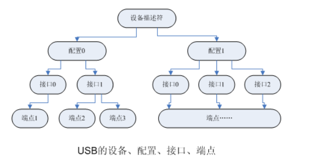

在USB设备的逻辑组织中，包含`设备`、`配置`、`接口`和`端点`4个层次

# 关系

每个USB设备都提供了不同级别的配置信息，可以包含一个或多个配置，不同的配置使设备表现出不同的功能组合（在`探测/连接`期间需从其中选定一个），**配置由多个接口**组成。

在USB协议中，**接口由多个端点组成**，代表一个基本的功能，端点是USB设备驱动程序控制的对象，一个功能复杂的USB设备可以具有多个接口。每个配置中可以有多个接口，而设备接口是端点的汇集（collection）。

例如USB扬声器可以包含一个音频接口以及对旋钮和按钮的接口。**一个配置中的所有接口可以同时有效**，并可被不同的驱动程序连接。每个接口可以有备用接口，以提供不同质量的服务参数。


# 端点
端点是USB通信的最基本形式，每一个USB设备接口在主机看来就是一个端点的集合。主机只能通过端点与设备进行通信，以使用设备的功能。

* 在**USB系统中每一个端点都有惟一的地址**，这是由`设备地址`和`端点号`给出的。
* 每个端点都有一定的属性，其中包括传输方式、总线访问频率、带宽、端点号和数据包的最大容量等。
* 一个USB端点只能在一个方向承载数据，或者从主机到设备（称为输出端点），或者从设备到主机（称为输入端点），因此端点可看作一个单向的管道。

端点0通常为控制端点，用于设备初始化参数等。**只要设备连接到USB上并且上电端点0**就可以被访问。

端点1、2等一般用作**数据端点**，存放主机与设备间往来的数据。

总体而言，USB设备非常复杂，由许多不同的逻辑单元组成，如图20.2所示，这些单元之间的关系如下：



## 小结

* 设备通常有一个或多个配置；
* 配置通常有一个或多个接口；
* 接口通常有一个或多个设置；
* 接口有零或多个端点。

# 2.结构描述

这种层次化配置信息在设备中通过一组标准的描述符来描述，如下所示。

## 2.1 设备描述符
* 设备描述符：关于设备的通用信息，如供应商ID、产品ID和修订ID，支持的设备类、子类和适用的协议以及默认端点的最大包大小等。在Linux内核中，USB设备用usb_device结构体来描述，USB设备描述符定义为usb_device_descriptor结构体，如代码清单20.1所示。 

```c
struct usb_device_descriptor {
 __u8 bLength; // 此描述表的字节数
 __u8 bDescriptorType; // 描述符的类型（此处应为0x01，即设备描述符）
 __le16 bcdUSB; //此设备与描述表兼容的USB设备说明版本号
 __u8 bDeviceClass; // 设备类码：
                    // 如果此域的值为0则一个设置下每个接口指出它自己的类，各个接口各自独立工作。
                    // 如果此域的值处于1~FEH之间，则设备在不同的接口上支持不同的类。并这些接口可能不能独立工作。
                    // 此值指出了这些接口集体的类定义。
                    // 如果此域设为FFH，则此设备的类由厂商定义。
 __u8 bDeviceSubClass;// USB分配的子类,这些码值的具体含义根据bDeviceClass 域来看。
                      // 如bDeviceClass 域为零，此域也须为零
                      // 如bDeviceClass 域为FFH，此域的所有值保留。
 __u8 bDeviceProtocol; // 协议码
                       // 这些码的值视bDeviceClass 和 bDeviceSubClass 的值而定。
                       // 如果设备支持设备类相关的协议，此码标志了设备类的值。
                       // 如果此域的值为零，则此设备不支持设备类相关的协议，然而，可能它的接口支持设备类相关的协议。
                       // 如果此域的值为FFH，此设备使用厂商定义的协议。
 __u8 bMaxPacketSize0; // 端点0的最大包大小（仅8,16,32,64为合法值）
 __le16 idVendor; // 厂商标志（由USB-IF组织赋值）
 __le16 idProduct; // 产品标志（由厂商赋值）
 __le16 bcdDevice; // 设备发行号（BCD 码）
 __u8 iManufacturer; // 描述厂商信息的字符串描述符的索引值。
 __u8 iProduct; // 描述产品信息的字串描述符的索引值。
 __u8 iSerialNumber; // 描述设备序列号信息的字串描述符的索引值。
 __u8 bNumConfigurations; // 可能的配置描述符数目
} __attribute__ ((packed));
```

其中bDescriptorType为描述符的类型:
* 标准描述符:
  * 设备描述符（Device Descriptor)=0x01
  * 配置描述符（Configuration Descriptor=0x02
  * 字符串描述符(String Descriptor)=0x03
  * 接口描述符(Interface Descriptor)=0x04
  * 端点描述符（EndPont Descriptor）=0x05
* 类描述符:
  * 集线器类描述符（Hub Descriptor）=0x29
  * 人机接口类描述符（HID）=0x21
* 厂商定义的描述符
  * =0xFF

设备类代码bDeviceClass可查下表：
* 接口描述符中提供类的值=0x00
* 通信类=0x02
* 集线器类=0x09
* 用于诊断用途的设备类=0xDC
* 无线通信设备类=0xE0
* 厂商定义的设备类=0xFF


## 2.2 配置描述符
* 配置描述符：此配置中的接口数、支持的挂起和恢复能力以及功率要求。USB配置在内核中使用usb_host_config结构体描述，USB配置描述符定义为结构体usb_config_descriptor，如代码清单20.2所示

```c
struct usb_config_descriptor 
{
	__u8 bLength; // 此描述表的字节数长度。
	__u8 bDescriptorType; // 配置描述表类型（此处为0x02）

	__le16 wTotalLength;  // 此配置信息的总长（包括配置,接口,端点和设备类及厂商定义的描述符）
	__u8 bNumInterfaces; // 此配置所支持的接口个数
	__u8 bConfigurationValue; // 在SetConfiguration() 请求中用作参数来选定此配置。
	__u8 iConfiguration; // 描述此配置的字串描述表索引
	__u8 bmAttributes; // 配置特性：
                     // D7： 保留（设为一）
                     // D6： 自给电源
                     // D5： 远程唤醒
                     // D4..0：保留（设为一）
                     // 一个既用总线电源又有自给电源的设备会在MaxPower域指出需要从总线取的电量。并设置D6为一。
                     // 运行时期的实际电源模式可由GetStatus(DEVICE) 请求得到。
	__u8 bMaxPower; // 在此配置下的总线电源耗费量。以 2mA 为一个单位。
} 	__attribute__ ((packed));
```
## 2.3 接口描述符

* 接口描述符：接口类、子类和适用的协议，接口备用配置的数目和端点数目。USB接口在内核中使用usb_interface结构体描述，USB接口描述符定义为结构体usb_interface_descriptor，如代码清单20.3

配置描述符中包含了一个或多个接口描述符，这里的“接口”并不是指物理存在的接口，在这里把它称之为“功能”更易理解些，例如一个设备既有录音的功能又有扬声器的功能，则这个设备至少就有两个“接口”。

如果一个配置描述符不止支持一个`接口描述符`，并且每个接口描述符都有一个或多个端点描述符，那么在响应USB主机的配置描述符命令时，USB设备的`端点描述符`总是紧跟着相关的接口描述符后面，*作为配置描述符的一部分被返回*。接口描述符不可直接用Set_Descriptor和Get_Descriptor来存取。

如果一个接口仅使用**端点0**，则接口描述符以后就不再返回端点描述符，并且此接口表现的是一个控制接口的特性，它使用与端点0相关联的默认管道进行数据传输。在这种情况下`bNumberEndpoints`域应被设置成0。**接口描述符在说明端点个数并不把端点0计算在内**。

```c
struct usb_interface_descriptor 
{
	__u8 bLength;           // 此表的字节数
	__u8 bDescriptorType; // 接口描述表类（此处应为0x04）

	__u8 bInterfaceNumber;   // 接口号，当前配置支持的接口数组索引（从零开始）
	__u8 bAlternateSetting; // 可选设置的索引值。
	__u8 bNumEndpoints;      // 此接口用的端点数量，如果是零则说明此接口只用缺省控制管道。
	__u8 bInterfaceClass;    // 接口所属的类值：零值为将来的标准保留。
                           // 如果此域的值设为FFH，则此接口类由厂商说明。
                           // 所有其它的值由USB 说明保留。
 	__u8 bInterfaceSubClass; // 子类码
                           // 这些值的定义视bInterfaceClass域而定。
                           // 如果bInterfaceClass域的值为零则此域的值必须为零。
                           // bInterfaceClass域不为FFH则所有值由USB 所保留。
	__u8 bInterfaceProtocol; // 协议码：bInterfaceClass 和bInterfaceSubClass 域的值而定.
                           // 如果一个接口支持设备类相关的请求此域的值指出了设备类说明中所定义的协议.
	__u8 iInterface; //描述此接口的字串描述表的索引值。
}  __attribute__ ((packed));
```

USB协议定义的接口类别（bInterfaceClass）
* 0x01 音频类
* 0x02 CDC控制类
* 0x03  人机接口类（HID）
* 0x05	物理类
* 0x06	图像类
* 0x07	打印机类
* 0x08	大数据存储类
* 0x09	集线器类
* 0x0A	CDC数据类
* 0x0B	智能卡类
* 0x0D	安全类
* 0xDC	诊断设备类
* 0xE0	无线控制器类
* 0xFE	特定应用类（包括红外的桥接器等）
* 0xFF	厂商定义的设备


## 2.4 端点描述符

* 端点描述符：端点地址、方向和类型，支持的最大包大小，如果是中断类型的端点则还包括轮询频率。在Linux内核中，USB端点使用usb_host_endpoint结构体来描述，USB端点描述符定义为usb_endpoint_descriptor结构体，如代码清单20.4所示

端点是设备与主机之间进行数据传输的逻辑接口，除配置使用的端点0（控制端点，一般一个设备只有一个控制端点）为双向端口外，其它均为单向。端点描述符描述了数据的传输类型、传输方向、数据包大小和端点号（也可称为端点地址）等。

除了描述符中描述的端点外，每个设备必须要有一个默认的控制型端点，地址为0，它的数据传输为双向，而且没有专门的描述符，只是在设备描述符中定义了它的最大包长度。主机通过此端点向设备发送命令，获得设备的各种描述符的信息，并通过它来配置设备。

```c
struct usb_endpoint_descriptor 

	__u8 bLength; //此描述表的字节数长度
	__u8 bDescriptorType; //端点描述表类（此处应为0x05）
	__u8 bEndpointAddress; //此描述表所描述的端点的地址、方向：
                        // Bit 3..0 : 端点号.
                        // Bit 6..4 : 保留,为零
                        // Bit 7:    方向,如果控制端点则略。
                        // 0：输出端点（主机到设备）
                        // 1：输入端点（设备到主机）
	__u8 bmAttributes; //此域的值描述的是在bConfigurationValue域所指的配置下端点的特性。
                      // Bit 1..0 :传送类型:00=控制传送,01=同步传送,10=批传送,11=中断传送
                      // 所有其它的位都保留。
	__le16 wMaxPacketSize; //当前配置下此端点能够接收或发送的最大数据包的大小。
                        // 对于实进传输，此值用于为每帧的数据净负荷预留时间。
                        // 在实际运行时，管道可能不完全需要预留的带宽，实际带宽可由设备通过一种非USB定义的机制汇报给主机。
                        // 对于中断传输，批量传输和控制传输，端点可能发送比之短的数据包
	__u8 bInterval;//周期数据传输端点的时间间隙。
                    //对于批量传送的端点以及控制传送的端点，此域忽略
                   //对于同步传送的端点，此域必须为1ms
                   //对于中断传送的端点此域值的范围为1ms到255ms
	__u8 bRefresh;
	__u8 bSynchAddress;
} __attribute__ ((packed));
```

## 2.5 字符串描述符

* 字符串描述符：在其他描述符中会为某些字段提供字符串索引，它们可被用来检索描述性字符串，可以以多种语言形式提供。字符串描述符是可选的，有的设备有，有的设备没有，字符串描述符对应于usb_string_descriptor结构体，如代码清单20.5所示。

字符串描述符是一种可选的USB标准描述符，描述了如制商、设备名称或序列号等信息。如果一个设备无字符串描述符，则其它描述符中与字符串有关的索引值都必须为0。字符串使用的是Unicode编码。

　　主机请示得到某个字符串描述符时一般分成两步：首先主机向设备发出USB标准命令Get_Descriptor，其中所使用的字符串的索引值为0，设备返回一个字符串描述符，此描述符的结构如下：

```c
struct usb_string_descriptor 
{
	__u8 bLength; //描述符长度
	__u8 bDescriptorType; //描述符类型

	__le16 wData[1];/* 以UTF-16LE编码 */
} __attribute__ ((packed));
```

例如，笔者在运行Linux 2.6.15.5的系统上插入一个SanDisk U盘后，通过lsusb命令得到这个U盘相关的描述符，从中可以显示这个U盘包含了一个设备描述符、一个配置描述符、一个接口描述符以及批量输入和批量输出两个端点描述符。呈现出来的信息内容直接对应于usb_device_descriptor、usb_config_descriptor、usb_interface_descriptor、usb_endpoint_descriptor、usb_string_descriptor结构体，如下所示： 

```
Bus 001 Device 004: ID 0781:5151 SanDisk Corp. 
Device Descriptor:
bLength                18
bDescriptorType         1
bcdUSB               2.00
bDeviceClass            0 Interface
bDeviceSubClass         0 
bDeviceProtocol         0 
bMaxPacketSize0        64
idVendor           0x0781 SanDisk Corp.
idProduct          0x5151 
bcdDevice            0.10
iManufacturer           1 SanDisk Corporation
iProduct                2 Cruzer Micro
iSerial                 3 20060877500A1BE1FDE1
bNumConfigurations      1
Configuration Descriptor:
    bLength                 9
    bDescriptorType         2
    wTotalLength           32
    bNumInterfaces          1
    bConfigurationValue     1
    iConfiguration          0
    bmAttributes         0x80
    MaxPower              200mA
    Interface Descriptor:
      bLength                 9
      bDescriptorType         4
      bInterfaceNumber        0
      bAlternateSetting       0
      bNumEndpoints           2
      bInterfaceClass         8 Mass Storage
      bInterfaceSubClass      6 SCSI
      bInterfaceProtocol     80 Bulk (Zip)
      iInterface              0 
      Endpoint Descriptor:
        bLength                 7
        bDescriptorType         5
        bEndpointAddress     0x81 EP 1 IN
        bmAttributes            2
          Transfer Type            Bulk
          Synch Type               none
        wMaxPacketSize        512
        bInterval               0
      Endpoint Descriptor:
        bLength                 7
        bDescriptorType         5
        bEndpointAddress     0x01 EP 1 OUT
        bmAttributes            2
          Transfer Type            Bulk
          Synch Type               none
        wMaxPacketSize        512
        bInterval               1
Language IDs: (length=4)
     0409 English(US)
```

