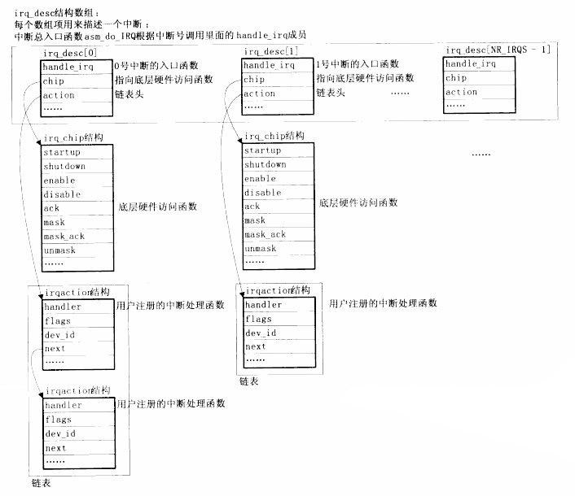

# LINUX 的中断框架：内核中断框架

了解“asm_do_IRQ”，理解中断处理的过程。
A,单片机下的中断处理：
1，分辨是哪个中断。
2，调用处理函数（哪个中断就调用哪个处理函数）。
3，清中断。

```c
#include "s3c24xx.h"

void EINT_Handle() {
	unsigned long oft = INTOFFSET; //先读下此寄存器，看当前是在处理哪个中断
	unsigned long val;
	
	switch(oft)
	{
		case 0: // S2被按下
			GPFDAT |= (0x7 << 4); //所有LED熄灭
			GPFDAT &= ~(1<<4);    //LED1点亮
			break;
		case 2: //S3被按下
			GPFDAT |= (0x7<<4); //所有LED熄灭
			GPFDAT &= ~(1<<5);  // LED2点亮
			break;
		case 5:
			GPFDAT |= (0x7 << 4); //所有LED熄灭
			GPFDAT &= ~(1<<6);    //LED4点亮
            break;
		default:
			break; 

		//清中断
		if (oft == 5)
			EINTPEND = (1<<11); // EINT8_23合用IRQ5
		
		SRCPND = 1<<oft;
		INTPEND = 1<<oft;
	}
}
```

1，上面是先读寄存器“INTOFFSET”，看是哪个中断。
2，中间是中断处理。
3，最后是清中断。
内核的也差不多。

B,内核的中断处理：

以上单片机的3 个过程，都是在 asm_do_IRQ 中实现的。最终在“handle_irq”中实现的。

```c
asmlinkage void __exception asm_do_IRQ(unsigned int irq, struct pt_regs *regs)
{
	struct pt_regs *old_regs = set_irq_regs(regs);
	struct irq_desc = irq_desc + irq;

	//some hardware gives randomly wrong interrupts. Rather than crashing,
	// do something sensible
	if(irq >= NR_IRQS)
		desc = &bad_irq_desc;

	irq_enter();
	desc_handler_irq(irq, desc);

	// AT91 specific workaround
	irq_finish(irq);

	irq_exit();
	set_irq_regs(old_regs);
}
```
1，首先是根据传进来的 IRQ 中断号（参 1），
`struct irq_desc *desc = irq_desc + irq;`

irq_desc 是一个数组。在“Handle.c”中定义：

```c
struct irq_desc[NR_IRQS] __cacheline_aligned_in_smp = {
	[0...NR_IRQS - 1] = {
		.status = IRQ_DISABLED,
		.chip = &no_irq_chip,
		.handle_irq = handle_bad_irq,
		.depth = 1,
		.lock = __SPIN_LOCK_UNLOCKED(irq_desc->lock),
#ifdef CONFIG_SMP
		.affinity = CPU_MASK_ALL
#endif
	}
};
```
从名字上看可知这是一个“中断描述”数组。以中断号“NR_IRQS”为下标.

`struct irq_desc *desc = irq_desc + irq;`在这个数组下标处取到一个“数组项”。`irq_enter();`不用管。

`[0...NR_IRQ-1]`,从0到NR_IRQ-1项，都赋值为`{}`的值信息.

然后进入处理：
`desc_handle_irq(irq, desc);`

```c
static inline void desc_handle_irq(unsigned int irq, struct irq_desc *desc)
{
	desc->handle_irq(irq, desc);
}
```
其中:

```c
asmlinkage void __exception asm_do_IRQ(unsigned int irq, struct pt_regs *regs)
-->struct irq_desc *desc = irq_desc + irq;
 desc_handle_irq(irq, desc);
static inline void desc_handle_irq(unsigned int irq, struct irq_desc *desc)
--> desc->handle_irq(irq, desc);
desc->handle_irq(irq, desc);
即为：
(irq_desc + irq)->handle_irq(irq, desc);
```

desc 是全局数组“irq_desc（中断号为下标） ”
裸机程序中的 3 过程是在这个“handle_irq”中实现的。

2，查找“handle_irq”时，发现它有在“`/kernel/irq/Chip.c`”中的“`__set_irq_handler（）`”函数中有被用到。其中handle_bad_irq;不是我们想要的

```c
/* set a highlevel flow handler for a given IRQ */
static inline void set_irq_handler(unsigned int irq, irq_flow_handler_t handle)
{
	__set_irq_handler(irq, handle, 0, NULL);
}
```
再搜索“set_irq_handler”时在“`arch/arm/plat-s3c24xx/Irq.c`”中找到一个函数：

```c
void __init s3c24xx_init_irq(void)
{
	for (irqno = IRQ_EINTO; irqno <= IRQ_EINT3; irqno ++) {
		irqdbf("registering irq %d (exit init)\n");
		set_irq_chip(irqno, &s3c_irq_eint0t4);
		set_irq_handler(irqno, handle_edge_irq);
		set_irq_flags(irqno, IRQF_VALID);
	}
}
```
下面是在"Chip.c"中

```c
void __set_irq_handler(unsigned int irq, irq_flow_handler_t handle, int is_chained, const char *name)
{
	struct irq_desc *desc;
	desc= irq_desc+irq;
	desc->handle_irq = handle;
	desc->name = name;
}
```
是以形参“irq”这索引，在“irq_desc”中断描述数组中找到一项，将这一项给“desc”.
将通过“形参 irq”索引找到的那一项“desc”的“handle_irq”指向传进函数“__set_irq_handler”
的形参“irq_flow_handler_t handle”。

这样显然在“`void __init s3c24xx_init_irq(void)`”函数中就构造了这个数组的很多项。
结构体“desc”的原型的成员：

```c
struct irq_desc {
	irq_flow_handler_t handle_irq;
	struct irq_chip *chip;
	struct msi_desc *msi_desc;
	void            *handler_data;
	void            *chip_data;
	struct irqaction  *action;   /* IRQ action list*/
	unsigned int status;         /* IRQ status */
	
	unsigned int depth;
	unsigned int wake_depth;
	unsigned int irq_count;
	unsigned int irqs_unhandled;
	spinlock_t lock;
#ifdef CONFIG_SMP
	cpumask_t    affinity;
	unsigned int cpu;
#endif
#if defined(CONFIG_GENERIC_PENDING_IRQ) || defined(CONFIG_IRQBLANCE)
	cpumask_t pending_mask;
#endif
#ifdef CONFIG_PROC_FS
	struct proc_dir_entry *dir
#endif
	const char *name;
};
```
在这个“irq_desc”结构中有“handle_irq”等于“某个函数”；如下举例，看此结构成员 handle_irq
等于什么函数，"*chip" 等于什么函数。

举例：IRQ_EINT0 到 IRQ_EINT3

在 Irq.c 中`/*external interrupts*/`外部中断中。IRQ_EINT0 到 IRQ_EINT3 （外部中断 0 到外部中断 3）。设置了上面结构中的“handle_irq”和“*chip”

```c
	for (irqno = IRQ_EINT0; irqno <= IRQ_EINT3; irqno++) {
		irqdbf("registering irq %d (exit int)\n", irqno);
		set_irq_chip(irqno, &s3c_irq_eint0t4);
		set_irq_handler(irqno, handle_edge_irq);
		set_irq_flags(irqno, IRQF_VALID);
	}
```

1，成员“handle_irq”：
如上外部中断 0“IRQ_EINT0”（从名字猜测这是中断号），在`\arch-s3c2410\Irqs.h`中有定义。

```c
/* main cpu interrupts */
#define IRQ_EINT0  S3C2410_IRQ(0)  /* 16 */
#define IRQ_EINT1  S3C2410_IRQ(1)
#define IRQ_EINT2  S3C2410_IRQ(2)
#define IRQ_EINT3  S3C2410_IRQ(3)
#define IRQ_EINT4  S3C2410_IRQ(4) /* 20 */
#define IRQ_EINT5  S3C2410_IRQ(5)
```

那么“16”这个数组项（`irq_desc[16]`）的“handle_irq”就等于这个函数“handle_edge_irq”
边缘触发。（`set_irq_handler(irqno, handle_edge_irq);`）
从“handle_edge_irq”名字中“edge”可猜测到是处理那些**边缘触发的中断**。

2.成员“*chip”：

对于上面的“set_irq_chip(irqno, &s3c_irqext_chip);”也是找到相应的数组项：

```c
int set_irq_chip(unsigned int irq, struct irq_chip *chip)
{
	desc = irq_desc + irq;
}
```
所以这里“chip”等于“s3c_irq_eint0t4”是 s3c 外部中断`0－4`.

举例 2：外部中断 IRQ_EINT4;到外部中断IRQ_EINT23.

```c
	for (irqno = IRQ_EINT4; irqno <= IRQ_EINT23; irqno ++) {
		irqdbf("registering irq %d (extended s3c irq)\n", irqno);
		set_irq_chip(irqno, &s3c_irqext_chip);
		set_irq_handler(irqno, handle_edge_irq);
		set_irq_flags(irqno, IRQF_VALID);
	}
```

`Irq_desc[外部中断 4 到 外部中断 23]`

```c
Handle_irq = handle_edge_irq;
Chip = s3c_irqext_chip;
```

总结：

```c
Irq_desc[外部中断 0 ~ 3 ]：｛
	Handle_irq = handle_edge_irq;
	Chip = s3c_irq_eint0t4;
｝
Irq_desc[外部中断 4 到 外部中断 23]：｛
	Handle_irq = handle_edge_irq;
	Chip = s3c_irqext_chip;
｝
```

以上就是初始化，在“`void __init s3c24xx_init_irq(void)`”中实现的.中断处理 C 函数入口 “asm_do_IRQ”会调用到事先初始的“handle_irq”函数。如外部中断
调用“handle_edge_irq”.是处理边缘触发的中断。

```c
void __init s3c24xx_init_irq(void)
	-->for (irqno = IRQ_EINT0; irqno <= IRQ_EINT3; irqno++) {
		set_irq_chip(irqno, &s3c_irq_eint0t4);
		set_irq_handler(irqno, handle_edge_irq);
	}

	for (irqno = IRQ_EINT4; irqno <= IRQ_EINT23; irqno++) {
		set_irq_chip(irqno, &s3c_irqext_chip);
		set_irq_handler(irqno, handle_edge_irq);
	}
```

在函数“`/kernel/irq/Chip.c`”中，可以看到“handle_edge_irq”做的事情。

```c
void fastcall handle_edge_irq(unsigned int irq, struct irq_desc *desc)
	kstat_cpu(cpu).irqs[irq]++; /* 发生了多少次中断的计数 */
	desc->chip->ack(irq); /* Start handling the irq 开始处理中断*/
 	if (unlikely(!action)) { /*这里是出错处理。 action 是链表。若此链表为空 */
		desc->chip->mask(irq); /* 若链表为空则屏蔽中断 */
		goto out_unlock;
	}

	action_ret = handle_IRQ_event(irq, action); /* 这是真正的中断处理过程 */
	action_ret = handle_IRQ_event(irq, action);
```
其中"irq"是“handle_edge_irq”

参 1；“action”是“`struct irqaction *action = desc->action;`”

参 2 结构中的成员。`handle_edge_irq(unsigned int irq, struct irq_desc *desc)`


**总结**

```
handle_edge_irq
	-->desc->chip->ack(irq). 清中断
	-->handle_IRQ_event(irq, action). 处理中断
```
“handle_edge_irq”的处理过程：处理边缘触发的中断。

1.`desc->chip->ack(irq)`：清中断

假设是如下外部中断，irq.c 中 “`s3c24xx_init_irq()`”初始化中断中

```c
for (irqno = IRQ_EINT4; irqno <= IRQ_EINT23; irqno++) {
	irqdbf("registering irq %d (extended s3c irq)\n", irqno);
	set_irq_chip(irqno, &s3c_irq_ext_chip);
	set_irq_handler(irqno, handle_edge_irq);
	set_irq_flags(irqno, IRQF_VALID);
}
```
在“chip：s3c_irqext_chip”定义如下：`desc->chip` 就是“s3c_irqext_chip”：S3c_irqext_chip 名字上猜测是 irq(中断)ext(外部)。


```c
static struct irq_chip s3c_irqext_chip = {
	.name = "s3c-ext",
	.mask = s3c_irqext_mask,
	.unmask = s3c_irqext_unmask,
	.ack = s3c_irqext_ack,
	.set_type = s3c_irqext_type,
	.set_wake = s3c_irqext_wake
};
```
那么：desc->chip->ack：这个成员"ack"即：

```c
.ack = s3c_irqext_ack,
```

```
static void s3c_irqext_ack(unsigned int irqno)
-->mask = __raw_readl(S3C24XX_EINTMASK); /* 读出外部中断屏蔽寄存器 */
-->__raw_writel(bit, S3C24XX_EINTPEND); /* 外部中断等待寄存器‘pending’。这里是清
0 */
```
从这个函数的具体实现，可知它应该是“清中断”。

2.如果链表“action”是空的，就将它屏蔽。（出错处理）

```c
if(unlikely(!action) {
	desc->chip->mask(irq);
	goto out_unlock;
}
```

3.`handle_IRQ_event`这是真正的正理过程：处理中断

```c
irqreturn_t handle_IRQ_event(unsigned int irq, struct rqaction *action)
{
	irqreturn_t ret, retval = IRQ_NONE;
	unsigned int status = 0;
	
	handle_dynamic_tick(aciton);
	
	if(!(action->flags & IRQF_DISABLED))
		local_irq_enable_in_handleirq();

	do｛
		ret = action->handler(irq, aciton->dev_id);
		if(ret == IRQ_HANDLED)
			status |= aciton->flags;
		retval |= ret;
		action = action->next;
	} while(aciton);

	if(status & IRQF_SAMPLE_RANDOM)
		add_interrupt_randomness(irq);
	
	local_irq_disable();
	
	return retval;
}
```

### 总结：“中断框架”（按下按键）
1.CPU 自动进入“异常模式”。调用“异常处理函数”。

```
linux-2.6.22.6\arch\arm\kernel\entry-armv.S 中
```

2.在“异常处理函数”中如跳到“b vector_irq + stubs_offset”。

```c
	.globl __vectors_start
__vectors_start:
	swi SYS_ERROR0
	b vector_und + stubs_offset
	ldr pc, .Lcvswi + stubs_offset
	b vector_pabt + stubs_offset
	b vector_dabt + stubs_offset
	b vector_addrexcptn + stubs_offset
	b vector_irq + stubs_offset
	b vector_fiq + stubs_offset
	.global __vectors_end
__vectors_end:
```
“vector_irq”是一个宏定义的。找到这个“宏”，假设它调用“__irq_usr”。`vector_stub irq, IRQ_MODE, 4`

此宏展开：

```
Vector_irq:
Sub lr, lr, #4
@
@ Save r0, lr_<exception> (parent PC) and spsr_<exception>
@ (parent CPSR)
@
stmia sp, {r0, lr} @ save r0, lr
mrs lr, spsr
str lr, [sp, #8] @ save spsr
@
@ Prepare for SVC32 mode. IRQs remain disabled.
@
mrs r0, cpsr
eor r0, r0, #(\mode ^ SVC_MODE)
msr spsr_cxsf, r0
@
@ the branch table must immediately follow this code
@ 这里调用某个列表。如下图：
and lr, lr, #0x0f
mov r0, sp
ldr lr, [pc, lr, lsl #2]
movs pc, lr @ branch to handler in SVC mode
```

```
vector_stub und, UND_MODE

.long __und_usr      @ 0 (USR_26/USR_32)
.long __und_invalid  @ 1 (FIQ_26/FIQ_32)
.long __und_invalid  @ 2 (IRQ_26/FIQ_32)
.long __und_svc      @ 3 (SVC_26/SVC_32)
.long __und_invalid  @ 4
.long __und_invalid  @ 5
.long __und_invalid  @ 6
.long __und_invalid  @ 7
.long __und_invalid  @ 8
.long __und_invalid  @ 8
.long __und_invalid  @ 9
.long __und_invalid  @ a
.long __und_invalid  @ b
.long __und_invalid  @ c
.long __und_invalid  @ d
.long __und_invalid  @ e
.long __und_invalid  @ f

.align 5
```
假若是调用的列表中的“__irq_usr”。

3.，调用到列表中的“`__irq_usr`”后，可以具体分析这个“`__irq_usr`”中处理的情况：

```c
__irq_user:
	user_entry

#ifdef CONFIG_TRACE_IRQFLAGS
	bl traces_hardirqs_off
#endif
	get_thread_info_tsk

#ifdef CONFIG_PREEMPT
	ldr r8, [tsk, #TI_PREEMPT]  @get preempt count
	add r7, r8, #1				@increment it
	str r7, [tsk, #TI_PREEMPT]
#endif
	irq_handler
#ifdef CONFIG_PREEMPT
	ldr r0, [tsk, #TI_PREEMPT]
	str r0, [tsk, #TI_PREEMPT]
	teq r0, r7
	strne r0, [r0, -r0]
#endif

#ifdef CONFIG_TRACE_IRQFLAGS
	bl trace_hardirqs_on
#endif
	mov why, #0
	b ret_to_user
	
	.ltorg
	.algin 5
```
__irq__usr 是用户态中断。
“usr_entry”这是它的入口，其中保存寄存器（中断现场）。
再调用“irq_handler”，这也是一个宏

```c
	.macro irq_handler
	get_irqnr_preemable r5, lr
1:	get_irqnr_and_base r0, r6, r5, lr
	movne r1, sp
	@ routine called with r0 = irq number, r1 = struct pt_regs
	adrne lr, b
	bne asm_do_IRQ
```
最终会调用到“asm_do_IRQ”这个 C 函数

4.“asm_do_IRQ”调用“irq_desc[IRQ 中断下标]以中断为下标取出里面的一项“handle_irq””

```c
desc_handle_irq(irq, desc);

static inline void desc_handle_irq(unsigned int irq, struct irq_desc *desc)
{
	desc->handle_irq(irq, desc);
}
```
`desc->handle_irq(irq, desc);`指向谁
举例说明：在：linux-2.6.22.6\arch\arm\plat-s3c24xx\Irq.c 中，s3c24xx_init_irq(void)初始化中
断时，若是外部中断 0-3，或外部中断 4-23 时，，指向“handle_edge_irq 函数”

```c
	for (irqno = IRQ_EINT0; irqno <= IRQ_EINT03; irqno++) {
		irqdbf("registering irq %d (ext int)\n");
		set_irq_chip(irqno, &s3c_irq_sint0t4);
		set_irq_handler(irqno, handle_edge_irq);
		set_irq_flags(irqno, IRQF_VALID);
	}

	for (irqno = IRQ_EINT4; irqno <= IRQ_EINT23; irqno ++) {
		irqdbf("registering irq %d (extended s3c irq)\n");
		set_irq_chip(irqno, &s3c_irqext_chip):
		set_irq_handler(irqno, handle_edge_irq);
		set_irq_flags(irqno, IRQ_VALID);
	}
```
指向“handle_edge_irq 函数”

5.“handle_edge_irq”做的事： 

`desc->chip->ack()`清中断
`handle_IRQ_event()` 处理中断
取出“action”链表中的成员，执行“action->handler”。

6.核心在“irq_desc” 结构数组

分析“`irq_desc[]`”结构数组：里面有“action 链表”，有“chip”等

```c
struct irq_desc {
	irq_flow_handler_t handle_irq;
	struct irq_chip *chip;
	struct msi_desc *msi_desc;
	void            *handler_data;
	void            *chip_data;
	struct irqaction  *action;   /* IRQ action list*/
	unsigned int status;         /* IRQ status */
	
	unsigned int depth;
	unsigned int wake_depth;
	unsigned int irq_count;
	unsigned int irqs_unhandled;
	spinlock_t lock;
#ifdef CONFIG_SMP
	cpumask_t    affinity;
	unsigned int cpu;
#endif
#if defined(CONFIG_GENERIC_PENDING_IRQ) || defined(CONFIG_IRQBLANCE)
	cpumask_t pending_mask;
#endif
#ifdef CONFIG_PROC_FS
	struct proc_dir_entry *dir
#endif
	const char *name;
};
```
handle_irq:是函数指针。在上面的例子中这个函数指针指向了“handle_edge_irq”。
首先是清中断，然后把链表“action”中的成员取出，一一执行里面的“action->handler”
*chip ：是芯片相关底层的一些处理函数。在例子中是指向"&s3c_irqext_chip”
 这个结构体“irq_chip”作些底层的操作：
起动、关闭、使用、禁止、ack 响应中断（响应中断即清中断而已）、

```c
struct irq_chip {
	cosnt char *name;
	unsigned int (*startup)(unsigned int irq); //启动中断
	void         (*shutdown)(unsigned int irq); //关闭中断
	void         (*enable)(unsigned int irq);   //使能中断
	void         (*disable)(unsigned int irq);  //禁止中断
	void (*ack)(unsigned int irq); //响应中断，通过分析应该是清中断
	void (*mask)(unsigned int irq);
	void (*mask_ack)(unsigned int irq);
	void (*unmask)(unsigned int irq);
	void (*eoi)(unsigned int irq);
	
	void (*end)(unsigned int irq);
	void (*set_affinity)(unsigned int irq, cpumask)t desc);
	int (*retrigger)(unsigned int irq);
	int (*set_type)(unsigned int irq, unsigend int flow_type);
	int (*set_wake)(unsigned int irq, unsigned int on);
	const char *typename;
};
``` 
`*action`:中断的动作列表。
里面有：handler（处理函数），还有“flags”等

```c
struct irqaction {
	irq_handler_t handler; //处理函数
	unsigned long flags;   //标志
	cpumask_t mask;
	void *dev_id;
	struct irqaction *next;
	int irq;
	struct proc_dir_entry *dir;
};
```

以上 `1－6`都是系统做好的，这便是**系统的**“中断处理框架”。
但是我 们写 中断处 理时 ，是想 执行 自已的 中断 代码。 那么 我们的 代码 就应该 在
“`action->handler`”这里。

我们要用“request_irq()”告诉内核我们的处理函数是什么。

内核中断框架:


首先内核中有个数组“irq_desc[]”IRQ 的描述结构数组，这个结构数组是以“中断号”为下
标。

结构中有：

* handle_irq:中断入口函数。这个入口函数中，是做**清中断**，再调用action链表中的各种处理
函数。
	* chip: 指向**底层硬件的访问函数**，它做屏蔽中断、使能中断，响应中断等。
	* action：链表头，它指向“irqaction 结构”，这个结构中存放“handler **用户注册**的中断处理
函数”等。

我们想使用自已的中断处理函数时，就是在内核的这个中断框架里在其中的“action 链表”
中添加进我们的“中断函数”。