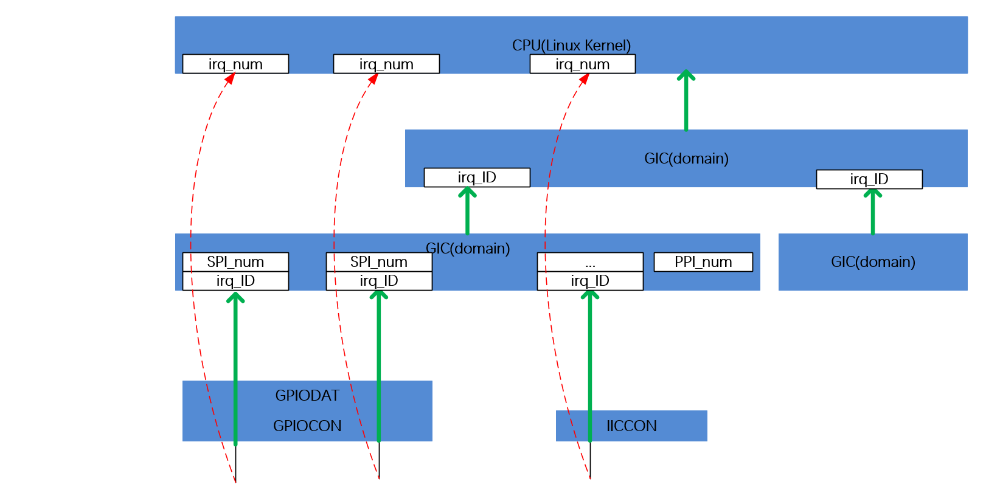
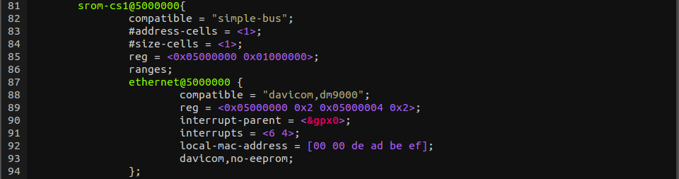
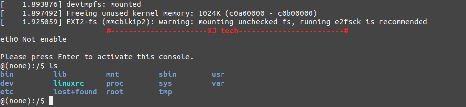

# 概念

引入了设备树之后，驱动代码只负责处理驱动的逻辑，而关于设备的具体信息存放到设备树文件中，这样，如果只是硬件接口信息的变化而没有驱动逻辑的变化，驱动开发者只需要修改设备树文件信息，不需要改写驱动代码。比如在ARM Linux内，一个`.dts`(device tree source)文件对应一个ARM的machine，一般放置在内核的"arch/arm/boot/dts/"目录内，比如exynos4412参考板的板级设备树文件就是"arch/arm/boot/dts/exynos4412-origen.dts"。这个文件可以通过`$make dtbs`命令编译成二进制的.dtb文件供内核驱动使用。

基于同样的软件分层设计的思想，由于一个SoC可能对应多个machine，如果每个machine的设备树都写成一个完全独立的.dts文件，那么势必相当一些.dts文件有重复的部分，为了解决这个问题，Linux设备树目录把一个SoC公用的部分或者多个machine共同的部分提炼为相应的.dtsi文件。这样每个.dts就只有自己差异的部分，公有的部分只需要"include"相应的.dtsi文件, 这样就是整个设备树的管理更加有序。我这里用`Linux4.8.5源码自带的dm9000网卡为例来分析设备树的使用和移植。这个网卡的设备树节点信息在`Documentation/devicetree/bindings/net/davicom-dm9000.txt`有详细说明，其网卡驱动源码是"drivers/net/ethernet/davicom/dm9000.c"。

```
Devicom DM900 Fast Ethernet controller

Required properties:
- compatible = "davicom,dm9000"
- reg : physical address and size fo registers,must contain 2 entries:
	first entry : address register ,
	second entry: data register.
- interrupt-parent : interrupt controller to which the device is conneted
- interrupts : interrupt specifier specific to interrupt controller
Optional properties:
- davicom,no-eeprom : Configuration EEPROM is not avaliable
- davicom,ext-phy : Use external PHY
- reset-gpios : phandle of gpio that will be used to reset chip during probe
- vcc-supply : phandle of the regulator that will be used to enable power to chip

Example:
	
	ethernet@18000000 {
		compatible = "davicom,dm900";
		reg = <0x18000000 0x02 0x180000004 0x2>;
		interrupt-parent = <&gpn>;
		interrupts = <7 4>;
		local-mac-address = [00 00 de ad be ef];
		davicom,no-eeprom;
		reset-gpios = <&gpf 12 GPIO_ACTIVE_LOW>;
		vcc-supply = <&eth0_power>;
	};
```

# 设备树框架

设备树用树状结构描述设备信息，它有以下几种特性

* 1.每个设备树文件都有一个根节点，每个设备都是一个节点。
* 2.节点间可以嵌套，形成父子关系，这样就可以方便的描述设备间的关系。
* 3.每个设备的属性都用一组key-value对(键值对)来描述。
* 4.每个属性的描述用`;`结束

所以，一个设备树的基本框架可以写成下面这个样子，一般来说，`/`表示板子，它的子节点node1表示SoC上的某个控制器，控制器中的子节点node2表示挂接在这个控制器上的设备(们)。

```
/{                                  //根节点
    node1{                          //node1是节点名，是/的子节点
        key=value;                  //node1的属性
        ...
        node2{                      //node2是node1的子节点
            key=value;              //node2的属性
            ...
        }
    }                               //node1的描述到此为止
    node3{
        key=value;
        ...
    }
}
```

## 节点名
理论各节点名只要是长度不超过31个字符的ASCII字符串即可，此外
Linux内核还约定设备名应写成形如`<name>[@<unit_address>]`的形式，其中name就是设备名，最长可以是31个字符长度。unit_address一般是设备地址，用来`唯一标识一个节点`，下面就是典型节点名的写法,有reg就用第一个地址，否则可以忽略.

```dts
firmware@020F000 {
	compatible = "samsung,secure-firmware";
	reg = <0x020F000 0x1000>;
};
```
上面的节点名是`firmware`，节点路径是`/firmware@0203f000`,这点要**注意**，因为根据节点名查找节点的API的参数是不能有`@xxx`这部分的。

Linux中的设备树还包括几个特殊的节点，比如`chosen`，`chosen`节点不描述一个真实设备，而是用于firmware传递一些数据给OS，比如bootloader传递内核启动参数给内核.

```
chosen {
	bootargs = "console=ttySAC2,115200";
	stdout-path = &serial_2;
};
```

## 引用
当我们**找一个节点**的时候，我们必须书写**完整的节点路径**(`/firmware@203f000`路径)，这样当一个节点嵌套比较深的时候就不是很方便，所以，设备树允许我们用下面的形式为节点标注引用(起别名)，借以省去冗长的路径。这样就可以实现**类似函数调用**的效果。

编译设备树的时候
* 相同的节点的不同属性信息都会被合并
* 相同节点的相同的属性会被重写，使用引用可以避免移植者四处找节点，直接在板级`.dts`增改即可。

```
gpx0: gpx0 {
	gpio-controller;
	#gpio-cells = <2>;
	
	interrupt-controller;
	interrupt-parent = <&gic>;
	interrupts =<0 16 0>,<0 17 0>,<0 18 0>,<0 19 0>,
				<0 20 0>,<0 21 0>,<0 22 0>,<0 23 0>;
	#interrupt-cells = <2>;
};
```

下面的例子中就是直接引用了dtsi中的一个节点，并向其中`添加/修改`新的属性信息

```
&cpu0 {
	cpu0-supply = <&buck2_reg>;
};
```

## KEY
在设备树中，键值对是描述属性的方式，比如，Linux驱动中可以通过设备节点中的"compatible"这个属性查找设备节点。
Linux设备树语法中定义了一些具有规范意义的属性，包括：compatible, address, interrupt等，这些信息能够在内核初始化找到节点的时候，自动解析生成相应的设备信息。此外，还有一些Linux内核定义好的，一类设备通用的有默认意义的属性，这些属性一般不能被内核自动解析生成相应的设备信息，但是内核已经编写的相应的解析提取函数，常见的有 "mac_addr"，"gpio"，"clock"，"power"。"regulator" 等等。

## compatible
设备节点中对应的节点信息已经被内核构造成`struct platform_device`。驱动可以通过相应的函数从中提取信息。compatible属性是用来查找节点的方法之一，另外还可以通过节点名或节点路径查找指定节点。dm9000驱动中就是使用下面这个函数通过设备节点中的"compatible"属性提取相应的信息，所以二者的字符串需要严格匹配。
在下面的这个dm9000的例子中，我们在相应的板级dts中找到了这样的代码块：

```
ethernet@5000000 {
	compatible = "davicom,dm9000";
};
```

然后我们取内核源码中找到dm9000的网卡驱动，从中可以发现这个驱动是使用的设备树描述的设备信息(这不废话么，显然用设备树好处多多)。我们可以找到它用来描述设备信息的结构体，可以看出，**驱动**中用于匹配的结构使用的compatible和设备树中一模一样，否则就可能无法匹配，这里另外的一点是struct of_device_id数组的最后一个成员一定是空，因为**相关的操作API会读取这个数组直到遇到一个空**。

```c
#ifdef CONFIG_OF
static const struct of_device_id dm90000_matches[] = {
	{.compatible = "davicom,dm9000",},
	{/*sentinel*/}
};
MODULE_DEVICE_TABLE(of,dm9000_of_matches);
static struct platform_driver dm9000_driver = {
	.driver = {
		.name = "dm9000",
		.pm = &dm9000_drv_pm_ops,
		.of_match_table = of_match_ptr(dm9000_of_matches),
	},
	.probe = dm9000_probe,
	.remove = dm9000_drv_remove,
}; 
```

## address-cess和size-cells
属性名字：`#address-cells`和`#size-cells`，值为`<u32>`。这两个属性用在有子节点继承中，用来描述子设备地址,reg属性使用。

* address-cells，地址的个数
* size-cess:尺寸的个数

缺损情况 `#address-cells`是2,`#size-cells`是1.

```dts
soc {
	#address-cells = <1>;
	#size-cells = <1>;
	
	serial {
		compatible = "nsl6550";
		reg = <0x4600 0x100>;
		clock-frequency = <0>;
		interrupts = <0xA 0x8>;
		interrupt-parent = <&ipic>;
	};
};
```

## reg
reg值:`<prop-encoded-array>`数值队,`(address, length)`。reg用来描述设备资源地址空间，这个地址由父总线决定.

这个地址大部分是映射IO内存，寄存器块。偏移和长度。由根节点定义是真的cpu地址.

```
reg = <0x3000 0x20 0xFE00 0x100>;
```
板上有个设备(`#address-cells`和`#size-cells`的值都是1)，一个32字节从0X3000偏移开始，一个256字节从0XFE00偏移。

## virtual-reg
值为:u32.

virtual-reg属性定义一个地址，这个地址映射有reg属性设备节点定义的第一个物理地址。这个是的boot给kernel提供virtual到physical映射转换.

## ranges
值为：empty或`<prop-encoded-array>`由`(child-bus-address,parent-bus-address,length)`。

ranges属性用来映射或转换子与父节点之间。如果为空，说明子和父节点之间是一致的。

```dts
soc {
	compatible = "simple-bus";
	#address-cells = <1>;
	#size-cells = <1>;
	ranges = <0x0 0xe0000000 0x00100000>;
	
	serial {
		device_type = "serial";
		compatible = "nsl6550";
		reg = <0x4600 0x100>;
		clock-frequency = <0>;
		interrupts = <0xA 0x8>;
		interrupt-parent = <&ipic>;
	};
};
```

1024kb范围，child地址是0x0映射到父节点是0xe0000000,
## interrupts
**一个计算机系统中大量设备都是通过中断请求CPU服务的**，所以设备节点中就需要在指定`中断号`。常用的属性有

* `interrupt-controller`:一个空属性用来声明这个node接收中断信号，即这个node是一个`中断控制器`。
* `#interrupt-cells`，是中断控制器节点的属性，用来标识这个控制器需`要几个单位`做中断描述符,用来描述子节点中"interrupts"属性使用了父节点中的interrupts属性的具体的哪个值。一般，如果父节点的该属性的值是3，则子节点的interrupts一个cell的三个32bits整数值分别为:`<中断域 中断 触发方式>`,如果父节点的该属性是2，则是`<中断 触发方式>`
* `interrupt-parent`,标识此设备节点属于哪一个中断控制器，如果没有设置这个属性，会自动依附父节点的
* `interrupts`,一个中断标识符列表，表示每一个中断输出信号

设备树中中断的部分涉及的部分比较多，interrupt-controller表示这个节点是一个中断控制器，需要注意的是，一个SoC中可能有`不止一个中断控制器`，这就会涉及到设备树中断组织的很多概念，下面是在文件"`arch/arm/boot/dts/exynos4.dtsi`"中对exynos4412的`中断控制器`(GIC)节点描述：

```
gic: interrupt-controller@10490000 {
	compatible = "arm,cortex-a9-gic";
	#interrupt-cells = <3>;
	interrupt-controller;
	reg = <0x104900000 0x10000>,<0x104800000 0x10000>;
};
```
要说interrupt-parent，就得首先讲讲Linux设备管理中对中断的设计思路演变。随着linux kernel的发展，在内核中将interrupt controller抽象成irqchip这个概念越来越流行，甚至GPIO controller也可以被看出一个interrupt controller chip，这样，系统中至少有两个中断控制器了，另外，在硬件上，随着系统复杂度加大，外设中断数据增加，实际上系统可以需要多个中断控制器进行级联，形成事实上的硬件中断处理结构：



在这种趋势下，内核中原本的中断源直接到中断号的方式已经很难继续发展了，为了解决这些问题，linux kernel的大牛们就创造了irq domain(中断域)这个概念。domain在内核中有很多，除了irqdomain，还有power domain，clock domain等等，所谓domain，就是领域，范围的意思，也就是说，任何的定义出了这个范围就没有意义了。如上所述，系统中所有的interrupt controller会形成树状结构，对于每个interrupt controller都可以连接若干个外设的中断请求（interrupt source，中断源），interrupt controller会对连接其上的interrupt source（根据其在Interrupt controller中物理特性）进行编号（也就是HW interrupt ID了）。有了irq domain这个概念之后，这个编号仅仅限制在本interrupt controller范围内，有了这样的设计，CPU(Linux 内核)就可以根据级联的规则一级一级的找到想要访问的中断。当然，通常我们关心的只是内核中的中断号，具体这个中断号是怎么找到相应的中断源的，我们作为程序员往往不需要关心，除了在写设备树的时候，设备树就是要描述嵌入式软件开发中涉及的所有硬件信息，所以，设备树就需要准确的描述硬件上处理中断的这种树状结构，如此，就有了我们的interrupt-parant这样的概念：用来连接这样的树状结构的上下级，用于表示这个中断归属于哪个interrupt controller，比如，一个接在GPIO上的按键，它的组织形式就是：

```
中断源--interrupt parent-->GPIO--interrupt parent-->GIC1--interrupt parent-->GIC2--...-->CPU
```

有了parant，我们就可以使用一级一级的偏移量来最终获得当前中断的绝对编号，这里，可以看出，在我板子上的dm9000的的设备节点中，它的"interrupt-parent"引用了"exynos4x12-pinctrl.dtsi"（被板级设备树的exynos4412.dtsi包含）中的`gpx0节点`：

```
ethernet@500000 {
	compatible = "davicom,dm9000";
	reg = <0x05000000 0x2 0x0500004 0x2>;
	interrupt-parent = <&gpx0>;
	interrupts = <6 4>;
};
```

而在gpx0节点中，指定了`#interrupt-cells = <2>;`，所以在dm9000中的属性`interrupts = <6 4>;`表示dm9000的的中断在作为`irq parant`的gpx0中的`中断偏移量`，即gpx0中的属性"interrupts"中的`<0 22 0>`，通过查阅`exynos4412的手册`知道，对应的中断号是`EINT[6]`。

```
gpx0: gpx0 {
	gpio-controller;
	#gpio-cells = <2>;
	
	interrupt-controller;
	interrupt-parent = <&gic>;
	interrupts = <0 16 0>,<0 17 0>,<0 18 0>,<0 19 0>,
				<0 20 0>,<0 21 0>,<0 22 0>,<0 23 0>;
	#interrupt-cells = <2>;
};
```

## gpio
**gpio也是最常见的IO口**，常用的属性有

* "gpio-controller"，用来说明该节点描述的是一个gpio控制器
* "#gpio-cells"，用来描述gpio使用节点的属性一个cell的内容，即 属性 = `<&引用GPIO节点别名 GPIO标号 工作模式>`

GPIO的设置同样采用了上述偏移量的思想，比如下面的这个led的设备书，表示使用GPX2组的第7个引脚：

```
led@4 {
	comptible = "xj4412,key";
	gpx2_7 = <&gpx2 7 0>;
	gpx1_0 = <&gpx1 0 0>;
	gpf3)45 =<&gpf3 4 0>,<gpf3 5 0>;
};
```

## 驱动自定义key

针对具体的设备，有部分属性很难做到通用，需要驱动自己定义好，通过内核的属性提取解析函数进行值的获取，比如dm9000节点中的下面这句就是自定义的节点属性，用以表示配置EEPROM不可用。

```
davicom,no-eeprom;
```
# VALUE
dts描述一个键的值有多种方式，当然，一个键也可以没有值

## 字符串信息

```
compatible = "samsung,clock-xubxti";
```

## 32bit无符号整型数组信息

```
reg = <0x050000000 0x2 0x05000004 0x2>;
```
## 二进制数数组

```
local-mac-address = [00 00 de ad be ef]
```

## 字符串哈希表

```
compatible = "insignal,origen4412,"samsung,exynos4412","samsung,exynos4";
```

## 混合形式
上述几种的混合形式

# 设备树/驱动移植实例

设备树就是为驱动服务的，配置好设备树之后还需要配置相应的驱动才能检测配置是否正确。比如dm9000网卡，就需要首先将示例信息挂接到我们的板级设备树上，并根据芯片手册和电路原理图将相应的属性进行配置，再配置相应的驱动。需要注意的是，dm9000的地址线一般是接在片选线上的，所以设备树中就应该归属与相应片选线节点，我这里用的exynos4412，接在了bank1，所以是"<0x50000000 0x2 0x50000004 0x2>"
最终的配置结果是：



勾选相应的选项将dm9000的驱动编译进内核。

```
make menuconfig
[*] Networking support  --->
    Networking options  --->
        <*> Packet socket
        <*>Unix domain sockets 
        [*] TCP/IP networking
        [*]   IP: kernel level autoconfiguration
Device Drivers  --->
    [*] Network device support  --->
        [*]   Ethernet driver support (NEW)  --->
            <*>   DM9000 support
File systems  --->
    [*] Network File Systems (NEW)  --->
        <*>   NFS client support
        [*]     NFS client support for NFS version 3
        [*]       NFS client support for the NFSv3 ACL protocol extension
        [*]   Root file system on NFS
```
执行`make uImage;make dtbs`,tftp下载，成功加载nfs根文件系统并进入系统，表示网卡移植成功


