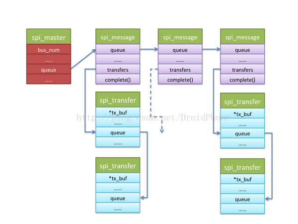
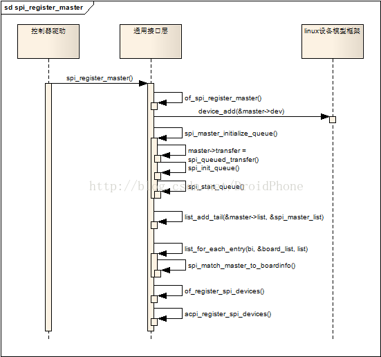
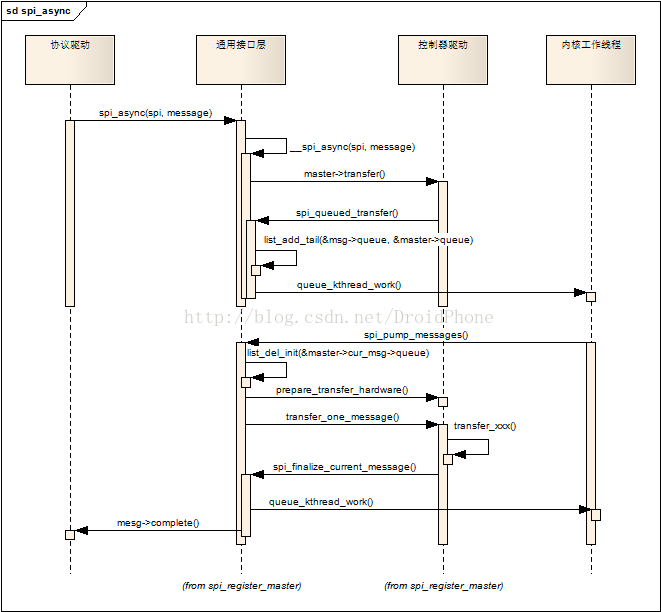

SPI数据传输可以有两种方式：同步方式和异步方式。所谓同步方式是指数据传输的发起者必须等待本次传输的结束，期间不能做其它事情，用代码来解释就是，调用传输的函数后，直到数据传输完成，函数才会返回。而异步方式则正好相反，数据传输的发起者无需等待传输的结束，数据传输期间还可以做其它事情，用代码来解释就是，调用传输的函数后，函数会立刻返回而不用等待数据传输完成，我们只需设置一个回调函数，传输完成后，该回调函数会被调用以通知发起者数据传送已经完成。同步方式简单易用，很适合处理那些少量数据的单次传输。但是对于数据量大、次数多的传输来说，异步方式就显得更加合适。

* 1.对于同一个数据传输的发起者，既然异步方式无需等待数据传输完成即可返回，返回后，该发起者可以立刻又发起一个message，而这时上一个message还没有处理完。
* 2.对于另外一个不同的发起者来说，也有可能同时发起一次message传输请求。

队列化正是为了为了解决以上的问题，所谓队列化，是指把等待传输的message放入一个等待队列中，发起一个传输操作，其实就是把对应的message按先后顺序放入一个等待队列中，系统会在不断检测队列中是否有等待传输的message，如果有就不停地调度数据传输内核线程，逐个取出队列中的message进行处理，直到队列变空为止。SPI通用接口层为我们实现了队列化的基本框架.

# spi_transfer的队列化
回顾一下通用接口层的介绍，对协议驱动来说，一个spi_message是一次数据交换的原子请求，而**spi_message由多个spi_transfer结构组成**，这些spi_transfer通过一个链表组织在一起，我们看看这两个数据结构关于spi_transfer链表的相关字段

```c
struct spi_transfer {
        ......
        const void      *tx_buf;
        void            *rx_buf;
        ......
 
        struct list_head transfer_list;
};
 
struct spi_message {
        struct list_head        transfers;
        
        struct spi_device       *spi;
        ......        
        struct list_head        queue;
        ......
};
```
可见，一个spi_message结构有一个链表头字段：transfers，而每个spi_transfer结构都包含一个链表头字段：transfer_list，通过这两个链表头字段，所有属于这次message传输的transfer都会挂在spi_message.transfers字段下面。我们可以通过以下API向spi_message结构中添加一个spi_transfer结构：

```c
static inline void
spi_message_add_tail(struct spi_transfer *t, struct spi_message *m)
{
        list_add_tail(&t->transfer_list, &m->transfers);
}
```
通用接口层会以一个message为单位，在工作线程中调用控制器驱动的transfer_one_message回调函数来完成spi_transfer链表的处理和传输工作，关于工作线程，我们留在后面讨论。

# spi_message的队列化
一个或者多个协议驱动程序可以同时向控制器驱动申请多个spi_message请求，这些spi_message也是以链表的形式被过在表示控制器的spi_master结构体的queue字段下面：

```c
struct spi_master {
        struct device   dev;
        ......
        bool                            queued;
        struct kthread_worker           kworker;
        struct task_struct              *kworker_task;
        struct kthread_work             pump_messages;
        spinlock_t                      queue_lock;
        struct list_head                queue;
        struct spi_message              *cur_msg;
        ......
}
```
以下的API可以被协议驱动程序用于发起一个message传输操作：

```c
extern int spi_async(struct spi_device *spi, struct spi_message *message);
```
spi_async函数是发起一个异步传输的API，它会把spi_message结构挂在spi_master的queue字段下，然后启动专门为spi传输准备的内核工作线程，由该工作线程来实际处理message的传输工作，因为是异步操作，所以该函数会立刻返回，不会等待传输的完成，这时，协议驱动程序（可能是另一个协议驱动程序）可以再次调用该API，发起另一个message传输请求，结果就是，当工作线程被唤醒时，spi_master下面可能已经挂了多个待处理的spi_message结构，工作线程会按先进先出的原则来逐个处理这些message请求，每个message传送完成后，对应spi_message结构的complete回调函数就会被调用，以通知协议驱动程序准备下一帧数据。这就是spi_message的队列化。工作线程唤醒时，spi_master、spi_message和spi_transfer之间的关系可以用下图来描述：



# 队列以及工作线程的初始化

通过Linux SPI总线和设备驱动架构之三：SPI控制器驱动这篇文章，SPI控制器驱动在初始化时，会调用通用接口层提供的API：spi_register_master，来完成控制器的注册和初始化工作，和队列化相关的字段和工作线程的初始化工作正是在该API中完成的。我先把该API的调用序列图贴出来：



如果spi_master设置了transfer回调函数字段，表示控制器驱动不准备使用通用接口层提供的队列化框架，有关队列化的初始化就不会进行，否则，spi_master_initialize_queue函数就会被调用：

```c
/* If we're using a queued driver, start the queue */
        if (master->transfer)
                dev_info(dev, "master is unqueued, this is deprecated\n");
        else {
                status = spi_master_initialize_queue(master);
                if (status) {
                        device_del(&master->dev);
                        goto done;
                }
        }
```
我们当然不希望自己实现一套队列化框架，所以，如果你在实现一个新的SPI控制器驱动，请记住，不要在你打控制器驱动中实现并赋值spi_master结构的transfer回调字段！进入spi_master_initialize_queue函数看看：

```c
static int spi_master_initialize_queue(struct spi_master *master)
{
        ......
        master->queued = true;
        master->transfer = spi_queued_transfer;
        if (!master->transfer_one_message)
                master->transfer_one_message = spi_transfer_one_message;
 
        /* Initialize and start queue */
        ret = spi_init_queue(master);
        ......
        ret = spi_start_queue(master);
        ......
}
```
该函数把master->transfer回调字段设置为默认的实现函数：spi_queued_transfer，如果控制器驱动没有实现transfer_one_message回调，用默认的spi_transfer_one_message函数进行赋值。然后分别调用spi_init_queue和spi_start_queue函数初始化队列并启动工作线程。spi_init_queue函数最主要的作用就是建立一个内核工作线程:

```c
static int spi_init_queue(struct spi_master *master)
{
        ......
 
        INIT_LIST_HEAD(&master->queue);
        ......
        init_kthread_worker(&master->kworker);
        master->kworker_task = kthread_run(kthread_worker_fn,
                                           &master->kworker, "%s",
                                           dev_name(&master->dev));
        ......
        init_kthread_work(&master->pump_messages, spi_pump_messages);
 
        ......
 
        return 0;
}
```
内核工作线程的工作函数是：spi_pump_messages，该函数是整个队列化关键实现函数，我们将会在下一节中讨论该函数。spi_start_queue就很简单了，只是唤醒该工作线程而已：

```c
static int spi_start_queue(struct spi_master *master)
{
        ......
 
        master->running = true;
        master->cur_msg = NULL;
        ......
        queue_kthread_work(&master->kworker, &master->pump_messages);
 
        return 0;
}
```
自此，队列化的相关工作已经完成，系统等待message请求被发起，然后在工作线程中处理message的传送工作。

# 队列化的工作机制及过程
当协议驱动程序通过spi_async发起一个message请求时，队列化和工作线程被激活，触发一些列的操作，最终完成message的传输操作。我们先看看spi_async函数的调用序列图：


spi_async会调用控制器驱动的transfer回调，前面一节已经讨论过，transfer回调已经被设置为默认的实现函数：spi_queued_transfer，该函数只是简单地把spi_message结构加入spi_master的queue链表中，然后唤醒工作线程。工作线程的工作函数是spi_pump_messages，它首先把该spi_message从队列中移除，然后调用控制器驱动的prepare_transfer_hardware回调来让控制器驱动准备必要的硬件资源，然后调用控制器驱动的transfer_one_message回调函数完成该message的传输工作，控制器驱动的transfer_one_message回调函数在完成传输后，必须要调用spi_finalize_current_message函数，通知通用接口层继续处理队列中的下一个message，另外，spi_finalize_current_message函数也会调用该message的complete回调函数，以便通知协议驱动程序准备下一帧数据。

关于控制器驱动的transfer_one_message回调函数，我们的控制器驱动可以不用实现该函数，通用接口层已经为我们准备了一个标准的实现函数：spi_transfer_one_message，这样，我们的控制器驱动就只要实现transfer_one回调来完成实际的传输工作即可，而不用关心何时需压气哦调用spi_finalize_current_message等细节。这里顺便也贴出transfer_one_message的代码：

```c
static int spi_transfer_one_message(struct spi_master *master,
                                    struct spi_message *msg)
{
        ......
        spi_set_cs(msg->spi, true);
 
        list_for_each_entry(xfer, &msg->transfers, transfer_list) {
                ......
                reinit_completion(&master->xfer_completion);
 
                ret = master->transfer_one(master, msg->spi, xfer);
                ......
 
                if (ret > 0)
                        wait_for_completion(&master->xfer_completion);
 
                ......
 
                if (xfer->cs_change) {
                        if (list_is_last(&xfer->transfer_list,
                                         &msg->transfers)) {
                                keep_cs = true;
                        } else {
                                cur_cs = !cur_cs;
                                spi_set_cs(msg->spi, cur_cs);
                        }
                }
 
                msg->actual_length += xfer->len;
        }
 
out:
        if (ret != 0 || !keep_cs)
                spi_set_cs(msg->spi, false);
 
        ......
 
        spi_finalize_current_message(master);
 
        return ret;
}
```
逻辑很清晰，这里就不再解释了。因为很多时候读者使用的内核版本和我写作时使用的版本不一样，经常会有人问有些函数或者结构不一样，所以这里顺便声明一下我使用的内核版本：3.13.0 -rc6。


