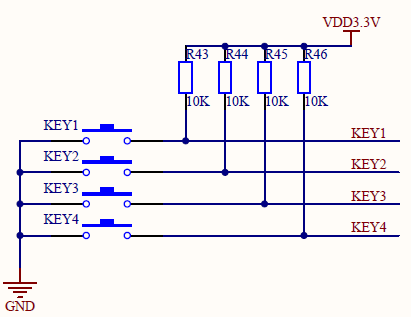

# 查询方式获取按键值

## 1.驱动框架实现

1.先定义file_operations结构体，其中有对折别的打开，读和写操作函数
2.分别定义相关的操作函数
3.定义好对折别的操作函数的结构体(file_operations)后，将其注册到内核的file_operatins结构体数组中，此设置的主设备号为此结构在数组中的下标
4.定义出口函数，卸载注册到内核的设备相关资源
5.修饰入口和出口函数
6.给系统提供更多的内核信息，在sys目录下提供设备的相关信息。应用程序udev可以更具此自动创建一个class设备类，在此类下创建设备

```c
#include <linux/kernel.h>
#include <linux/module.h>
#include <linux/fs.h>
#include <linux/device.h>
#include <linux/init.h>
#include <linux/delay.h>
#include <asm/uaccess.h>
#include <asm/irq.h>
#include <asm/arch/regs-gpio.h>
#include <asm/hardware.h>

#define DEV_NAME "second_drv"

/* 为系统提供sys目录下设备相关信息，让应用程序udev自动创建设备节点 */
static struct class *second_drv_class;
static struct class_device *second_drv_class_dev;

static int second_drv_open(struct inode *inde, struct file *file)
{
	return 0;
}

ssize_t second_drv_read(struct file *file, char __user *buf, size_t size, loff_t *ppos)
{
	return 0;
}

static struct file_operaiton second_drv_fops = {
	.owner = THIS_MODULE,
	.open = second_drv_open,
	.read = second_drv_read,
};

int major;
static int second_drv_init(void)
{
	/* 1.注册file_operation结构，主设备号自动分配，设备名为second_drv */
	major = register_chrdev(0， DEV_NAME， &second_drv_fops);
	
	/*2. 创建设备类和类统一的设备 */
	second_drv_class = class_create(THIS_MODULE, DEV_NAME);
	
	/*3.要自动创建设备节点，则要为MKDEV(主设备号，此设备号)*/
	second_drv_class_dev = class_device_create(second_drv_class, NULL, MKDEV(major, 10), NULL, "buttons");
	
	return 0;
}

static void second_drv_exit(void)
{
	unregister_chrdev(major, DEV_NAME); //注销设备
	class_device_unregister(second_drv_class_dev);
	class_unregister(second_drv_class);
}

module_init(second_drv_init);
module_exit(second_drv_exit);
MODULE_LICENSE("GPL");
```

## 2.硬件操作

1.看原理图：查找引脚定义



所以可以知道：

```c
KEY1 - GPF4
KEY2 - GPF5
KEY3 - GPF6
KEY4 - GPF7
```

2，设置 4 个引脚为输入引脚：从上面的原理图可以看到，低电平要从开关接地端输入。
要有电流流过，就是有压差，从上面的原理图上知道，KEY 一端接了高电平，当KEY 没按下
时，这个KEY 接2440 的引脚都是高电平。当KEY 按键按下，就接通了地，这时这些引脚就
返回 0 。

```c
//GPFCON 0x56000050
//GPFDAT 0x56000054

gpfcon = (volatile unsigned long *)ioremap(0x56000050, 4);
gpdat  = gpfcon + 1;

//配置为输入引脚

*gpfcon &= ~((0x3 << (4*2) | (0x3 << (5*2) | (0x3 <<(6*2)) | (0x3<<(7*2)));
```

3，在read 操作中，返回4 个引脚的状态。然后将状态值从内核空间拷贝到用户空间。当
驱动测试程序读设备节点时，调用到驱动中的“second_drv_read()”函数。

```c
ssize_t second_drv_read(struct file *file, char __user *buf, size_t size, lofft_t *ppos)
{
	unsigned char key_value[4];

	int regval;5
	if(size != sizeof(key_value)) {
		return -EINVAL;
	}

	regval = *gpfdat;
	key_value[0] = (regval & (1<<4) ? 1:0);
	key_value[1] = (regval & (1<<5) ? 1:0);
	key_value[2] = (regval & (1<<6) ? 1:0);
	key_value[3] = (regval & (1<<7) ? 1:0);

	if(copy_to_user((char __user*)buf, key_value, sizeof(key_vals)))
		return -EFAULT;

	return sizeof(key_value);
}
```

4.测试程序

```c
#include <sys/types.h>
#include <sys/stat.h>
#include <fcntl.h>
#include <stdio.h>

#define DEV_NAME "/dev/buttons"

int main (int argc, char **argv)
{
	int fd;
	unsigned char key_value[4];
	int cnt = 0;
	
	fd = open(DEV_NAMM, O_RDWR);
	if (fd < 0 ) {
		printf("can't open\n");
		return -1;
	}
	while (1) {
		read(fd, key_value, sizeof(key_value));
		if(!key_vals[0] || !key_vals[1] || !key_vals[2] || !key_vals[3]) {
			printf("%04d key pressed: %d %d %d %d\n", cnt++, key_vals[0], key_vals[1], key_vals[2], key_vals[3]);
		}
	}

	close(fd);
	return 0;
}
```
