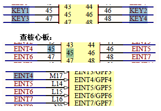

# 按键中断处理实例

要配置成‘中断引脚’，request_irq()中会自动将相关引脚配置成‘中断引脚’。再根据它的参
3 flags 决定是什么触发方式。

要配置成中断引脚: request_irq 函数会将引脚自动配置成中断引脚
由其中的参数"flages"要决定是上升沿等等方式触发中断.
其中有几个参数，我们不知道IRQ 号是什么 。找到按键的原理图：



从原理图上知道是“外部中断4、5、6、7”

```
request_irq(IRQ_EINT0, buttons_irq, IRQT_BOTHEDGE, "S2", 1)
```
1，有一个初始化中断的函数例子“s3c24xx_init_irq”里面设置“irq_desc 数组”里面用到了很
多“IRQ_EINT3”等这样的中断号。找其中一个可见其在头文件“Irqs.h”有定义：

```c
/* main cpu interrupts */
#define IRQ_EINT0  S3C2410_IRQ(0)  /* 16 */
#define IRQ_EINT1  S3C2410_IRQ(1)
#define IRQ_EINT2  S3C2410_IRQ(2)
#define IRQ_EINT3  S3C2410_IRQ(3)
#define IRQ_EINT4  S3C2410_IRQ(4) /* 20 */
#define IRQ_EINT5  S3C2410_IRQ(5)
```
这些便是它的中断号。

2，参2 是一个处理函数，这里还没有写，但先将名字写出来“buttons_irq”。

3，参3 是“irqflags”。查看有哪些宏可以来用。可以看实例：`linux-2.6.22.6\arch\arm\plats3c24xx\Irq.c` 看“request_irq”这个函数。

```c
for (irqno = IRQ_EINT0; irqno <= IRQ_EINT3; irqno++) {
	irqdbf("registering irq %d (ext int)\n", irqno);
	set_irq_chip(irqno, &s3c_irq_eint0t4);
	set_irq_handler(irqno, handle_edge_irq);
	set_irq_flags(irqno, IRQF_VALID);
}
static struct irq_chip s3c_irq_eint0t4 = {
	.name = "s3c-ext0",
	.ack = s3c_irq_ack,
	.mask = s3c_irq_mask,
	.unmask = s3c_irq_unmask,
	.set_wake = s3c_irq_wake,
	.set_type = s3c_irqext_type,
};
```
里面会根据“set_type”函数设置：
那些引脚，比如“s3c_irqext_chip”这个结构中成员“`.set_type = s3c_irqext_type`”

```c
int s3c_irqext_type(unsigned int irq, unsigned int type)
```
里面有个“type”。有比较多，如下想用一个“双边沿触发”上升沿和下降沿都可以触发中
断：

```c
	case IRQ_BOTHEDGE: //双边研触发 
		newvalue = S3C2410_EXTINT_BOTHEDGE;
		break;
```

所以在“request_irq” ，函数的第3 个参数写成“IRQT_BOTHEDGE”.它在“include\asmarm\
Irq.h”中定义：

```c
/* Mirgration helpers*/
#define __IRQT_FALEDGE 		IRQ_TYPE_EDGE_FALLING
#define __IRQT_RIASEDGE		IRQ_TYPE_EDGE_RISING
#define __IRQT_LOWLVL		IRQ_TYPE_LEVEL_LOW
#define __IRQT_HIGHLVL      IRQ_TYPE_LEVEL_HIGH

#define IRQT_NOEDGE	(0)
#define IRQT_RISING (__IRQT_RISEDGE)
#define IRQT_FALLING (__IRQT_FALEDGE)
#define IRQT_BOTHEDGE	(__IRQT_RISEDGE | __IRQT_FALEDGE)
#define IRQT_LOW     (__IRQT_LOWLVL)
#define IRQT_HIGH    (__IRQT_HIGHLVL)
#define IRQT_PROBE   IRQ_TYPE_PROBE
```

4，参4，取一个名字。如“原理图”有按键key4，所以这个名字用“S4”

5,参5，是`dev_id`，它是“free_irq”函数用来从“action”链表中删除“irqaction”结构。使
用参1 中断号“irq”定位“action”链表，再使用“dev_id”在“action”链表中找到卸载的表
项。**同一个中断**的**不同中断处理函数**必须使用不同的“dev_id”来区分，这要求注册共享中
断时参数“dev_id”必须惟一。
这里参5 先写成“1”。

6，对于其他按键的中断也和上面一样设置方法。

```c
/* 1.1 定义file_operations结构中，"打开"操作。struct file 表示打开的文件，struct node表示磁盘上具体的文件*/

static int second_drv_open(struct inode *inode, struct file *file)
{
	/*
	 *6.3，以中断处理的方式控制开关时，要配置“中断引脚”
	 * request_irq会自动将引脚配置为中断引脚，再根据它的参数3 flags决定是什么触发方式
	 * request_irq参数：
	 * irq:可以从按键原理图上知道,'EINT4-7'.再从s3c24xx_init_irq()初始化函数知道中断号定义
	 *  #define EINT4T7 S3C2410_IRQ(4)  /*20*/
	 *  handler: buttons_irq先定义一个处理函数，一会再去实现
	 *  irqflags: 可以从实例中找到相关的宏，出发方式
	 *  devname:中断名字
	 *  dev_id:它是free_irq函数用来从action链表删除，同一中断中断，且中断函数相同，则dev_id要相同
	 */
	request_irq(IRQ_EINT4t7, buttons_irq, IRQT_BOTHEDGE, "KEY1", 1);
	request_irq(IRQ_EINT4t7, buttons_irq, IRQT_BOTHEDGE, "KEY2", 1);
	request_irq(IRQ_EINT4t7, buttons_irq, IRQT_BOTHEDGE, "KEY3", 1);
	request_irq(IRQ_EINT4t7, buttons_irq, IRQT_BOTHEDGE, "KEY4", 1);

	return 0;
}
```
这是“open 函数”中“request_irq 函数”。在“关闭”这个设备时，去释放这些“request_irq
函数”。

a.在file_operations 结构中加一个函数

```c
static struct file_operations third_drv_fops = {
	.owner = THIS_MODULE,
	.open = third_drv_open,
	.read = third_drv_read,
	.release = third_drv_close,
};
```

b.定义关闭设备时，释放去中断

```c
int second_drv_release(struct inode *inode, struct file *file)
{
	/* 释放中断 */
	free_irq(IRQ_EINT4t7, 1);
	
	return 0;
}
```

7，定义：“buttons_irq”函数。从内核中搜索“request_irq()”初调用的地址，找一个相应的
例子来仿写：

a.定义中断处理函数

```c
static irqreturn_t buttons_irq(int irq, void *dev_id)
{
	printk("irq = %d\n", irq);
	return IRQ_HANDLED;
}
```
以上驱动写好了。可以编译下到开发板检验。

这里我遇到一个问题，因为开发板的4 个按键，对应的外部中断是 “IRQ_EINT4t7”，都是
占用中断号 “20”。
在2440 芯片中，有些中断是需要共享一个中断寄存器中的一位，如EINT4——EINT7，它们
是共享寄存器SRCPEND 的第4 位。

```c
request_irq (IRQ_EINT4, buttons_irq, IRQT_BOTHEDGE, "KEY1", (int *)1);
```

这里加上：

```c
static inline void
s3c_irq_ack(unsigned int irqno)
{
	unsigned long bitval = 1UL << (irqno - IRQ_EINT0);
	__raw_writel(bitval, S3C2410_SRCPND);
	__raw_writel(bitval, S3C2410_INTPND);
}
```
修改中断代码

```c
	s3c_irq_ack(IRQ_EINT4t7);
	request_irq(IRQ_EINT4t7, buttons_irq, IRQT_BOTHEDGE, "KEY1", 1);
	request_irq(IRQ_EINT4t7, buttons_irq, IRQT_BOTHEDGE, "KEY2", 1);
	request_irq(IRQ_EINT4t7, buttons_irq, IRQT_BOTHEDGE, "KEY3", 1);
	request_irq(IRQ_EINT4t7, buttons_irq, IRQT_BOTHEDGE, "KEY4", 1);
```
加上对共享中断的处理后，会有“`cat /proc/interrupts`”：但是有乱码。并且按下按键时，不
会触发中断服务程序显示中断号。

后面没有使用共享中断号，而是如下：

```c
	request_irq(IRQ_EINT4, buttons_irq, IRQT_BOTHEDGE, "KEY1", 1);
	request_irq(IRQ_EINT5, buttons_irq, IRQT_BOTHEDGE, "KEY2", 1);
	request_irq(IRQ_EINT6, buttons_irq, IRQT_BOTHEDGE, "KEY3", 1);
	request_irq(IRQ_EINT7, buttons_irq, IRQT_BOTHEDGE, "KEY4", 1);
```

验证中断:

```
#insmod second_irq.ko
second_drv_init
#insomd /dev/buttons -l
second_irq 2900 0 - Live 0xbf0000000
#cat /proc/devices | grep secon
252 second_irq_drv
```
在驱动程序中只要调用“third_drv_open”打开设备，就会去调用“request_irq”
在系统中查看当前“中断”。

加载驱动后：打开设备。
打开设备“/dev/buttons”定位到“5”去。
关闭这个设备：`exec 5<&-`
这时可以看到中断信息：


```
#ps

773 0 0:00 -/bin/sh

#ls /proc/773/fd -l

lr--x----- 1 0 0 64 Jan 1 00:001 5 -> /dev/buttons
```


```
$cat /proc/interrupts

48:		0		s3c-ext		KEY1
49:     0       s3c-ext     KEY2
50:     0       s3c-ext     KEY3
51:     0       s3c-ext     KEY4
```
这时按下4 个按键，会由中断处理程序打印中断号出来。

```
irq = 49
```

驱动成功后，可以“`exec 5</dev/buttons`”后，可以按单板上的按键，会有相关的irq 中断
号显示出来。按下松开都有中断“双边沿触发”。

接着完善中断处理函数，确定按键值，从原理图上看到，是按键按下后，管脚成低电平，松
开后是高电平：

在“中断服务”程序中判断是哪个按键被按下了。根据“irq”号就知道是哪个按键被按下了。
是按下还是松开也是确定。
原理图上，当发生了某个中断后，这个引脚是按下还是松开，要去读“管脚”，若按下则这
个
“管脚”是低电平，松开时是高电平。
可以用“switch”来判断，但比较麻烦。用结构体。

内核中有一个系统函数，这个系统函数可以去读出那些引脚值。在第2 个驱动程序中，是读
那些寄存器，
再移位再判断，对这些步骤有一个系统函数可以完成。

1.定义一个结构体和一个结构数组

```c
struct pin_desc {
	unsigned int pin;
	unsigned int key_val; //按键值
};

/* 按值：按下时，值0x1,0x2,0x3,0x4*/
/* 键值：松开时，值0x81,0x82,0x83,0x84*/

struct pin_desc pins_desc[4] = {
	{s3c2410_GPF0, 0x01},
	{s3c2410_GPF2, 0x02},
	{s3c2410_GPF3, 0x03},
	{s3c2410_GPF11, 0x04},
};
```
给原理图上的按键赋几个值

```c
static int third_drv_open(struct inode *inode, struct file *file)
{
	request_irq(IRQ_EINT0, buttons_irq, IRQ_BOTHEDGE, "S2", &pin_desc[0]);
	request_irq(IRQ_EINT2, buttons_irq, IRQ_BOTHEDGE, "S3", &pin_desc[1]);
	request_irq(IRQ_EINT11, buttons_irq, IRQ_BOTHEDGE, "S4", &pin_desc[2]);
	request_irq(IRQ_EINT19, buttons_irq, IRQ_BOTHEDGE, "S5", &pin_desc[3]);

	return 0;
}

int third_drv_close(struct inode *inode, struct file *file)
{
	free_irq(IRQ_EINT0, &pins_desc[0]);
	free_irq(IRQ_EINT2, &pins_desc[1]);
	free_irq(IRQ_EINT11, &pins_desc[2]);
	free_irq(IRQ_EINT19, &pins_desc[3]);

	return 0;
}
```
当发生“IRQ_EINT0”这个中断时，就会调用“buttons_irq”这个中断处理函数。这个中断处
理函数有
两个参数：

```c
static irqreturn_t buttons_irq(int irq, void *dev_id);
```

* 参1 中断号 ＝ “IRQ_EINT0”
* 参2 是dev_id = “&pins_desc[0]”

中断处理函数“buttons_irq”如何用这些东西：
定义一个指针“`sturct pin_desc * pindesc = (sturct pin_desc * )dev_id`”

```c
static irqreturn_t buttons_irq(int irq, void *dev_id)
{
	struct pin_desc *pindesc = (struct pin_desc*)dev_id;
	unsigned pinval;

	pinval = s3c2410_gpio_getpin(pindesc->pin);
	return IRQ_HANDLED;
}
```

接下来：如果这个引脚值为1，表明按键是松开的。若这个引脚的值为0，表明按键是按下
的。

将键值保存在一个全局数组中。

```c
static unsigned char key_val;

if(pinval)
	key_val = 0x80 | pindesc->key_val;
else
	key_val = pindesc->key_val;

```
以上在“中断服务程序 buttons_irq” 中已经可以确定键值了。接着要将键值返回给应用
程序。

```c
#define wait_even_interruptible(wq, condition) \
({ \
	int __ret = 0; \
	if(!(condition)) \
		__wait_event_interruptible(wq, condition, __ret); \
	__ret; \
})
```
这个函数是先判断“condition”，如果它等于0，就会调用函数“`__wait_event_interruptible(wq,condition, __ret);`”让这个应用程序“休眠”。
若休眠被唤醒，则会继续往下跑。

要定义两个全局变量：

```c
/* 中断事件标志，中断程序将它置1，second_drv_read将它清0 */
static volatile int ev_press = 0;
static DECLARE_WAIT_QUEUE_HEAD(button_waitq);
```
这个宏在“wait.h”中定义：

```c
#define DECLARE_WAIT_QUEUE_HEAD(name) \
	wait_queue_head_t name = __WAIT_QUEUE_HEAD_INITILIZER(name)
```
定义一个`wait_queue_head_t`等待队列头这样一个结构体。这个结构体用后面的宏初始化。
休眠后若有动作发生，就将“键值”拷贝回去。
有休眠谁来唤醒：

```c
ev_press = 1; /*表示发生中断*/
wake_up_interruptible(&button_waitq); /* 唤醒休眠的进程 */
```
休眠时是将进程挂到队列里面：唤醒是将挂在这个队列中的进程唤醒。

```c
/* 如果没有按键动作，休眠 */
wait_event_interruptible(&button_wait, ev_press);
```
