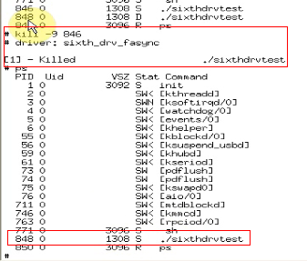

# 2. 信号量

信号量（semaphore）是用于保护临界区的一种常用方法，只有得到信号量的进程才能执行
临界区代码。

当获取不到信号量时，进程进入休眠等待状态。

定义信号量:`struct semaphore sem;`


初始化信号量

```c
void sema_init (struct semaphore *sem, int val);
void init_MUTEX(struct semaphore *sem);//初始化为0
static DECLARE_MUTEX(button_lock); //定义互斥锁
```

获得信号量

```c
void down(struct semaphore * sem);//获取信号量
int down_interruptible(struct semaphore * sem); //这是获取不到信号量就去休眠。休眠状态可被打断。
int down_trylock(struct semaphore * sem);
```

释放信号量

```c
void up(struct semaphore * sem);
```

就是在操作之前申请一个“信号量”。申请不到，则要么等待，要么休眠；如果申请到了“信
号量”则继续往下执行代码。操作完毕，要释放这个信号量。这时若有其他程序在等待信号
量，就去唤醒那个应用程序。

①，先定义“信号量”：这里用“DECLARE_MUTEX”宏，这个宏定义的初始化一起做好了。

```c
#define __SEMAPHORE_INIT(name, cnt)	\
{	\
	.count = ATOMIC_INIT(cnt),	\
	.wait = __WAIT_QUEUE_HEAD_INITIALIZER((name).wait), \
}

#define __DECLARE_SEMPHORE_GENERIC(name, count) \
	struct semaphore name = __SEMAPHORE_INIT(name, count)

#define DECLARE_MUTEX(name) __DECLARE_SEMPHORE_GENERIC(name , 1)

static DECLARE_MUTEX(button_lock); // 定义互斥锁
```
②，在“open”中获取“信号量”。

```c
/* 获取信号量 */
down(&button_lock);
```

如果是第一次执行“open”时，这里便会获取到“信号量”。若是另一个程序又来调用“open”
设备，这时`down(&button_lock);`是无法获取信号量的。

第一个程序执行完成后，这个信号量就要释放出来给其他程序“open”这个设备时用。释放
是在“close”、函数中：

```c
up(&button_lock);
```
这时编译执行测试程序：

可见可以同时运行两个测试程序。不像“原子变量”中：

```c
fd = open("/dev/buttons", O_RDWR);
if(fd < 0)
{
	printf("can't open!");
	return -1;
}
```
一次打开一次，第二次直接打印信息了。
而“信号量”申请操作中，第二个程序的进程处于“D”状态，是种“僵死”状态或称为一
种不可中断的“睡眠”状态。

这是因为第2 次在“open”函数中在“获取信号量”时休眠。

```c
down(&button_lock);
```

这个休眠只有在第一个应用程序“close”：

```c
up(&button_lock);
```

释放“信号量”后，才会唤醒：

```c
down(&button_lock);
```

释放“信号量”后，才会唤醒：
这时杀掉一个进程：发现程序继续进行。


这时PID848 处于正常的运行状态了。


