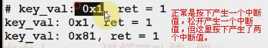
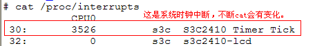

# 按键消抖



这里产生了“抖动”，按键是机械开关，按下松开时里面的金属弹片可能抖动了好几次。这
种抖动产生了多次“脉冲”导致多次中断。2410 核心

## 1.定时器：引入这个概念将“抖动”去掉

定时器有两个概念：

1，超时时间：
2，时间到了之后的“处理函数”。

可以在中断处理中，如定时10ms 后处理确定按键值上报。

在中断中加定时器，当遇到A 中断时加一个10ms 的定时器，过了10ms 后就去执行“处理
函数”（确定按键值上报)。因为机械的抖动会非常快，没等到10ms 后的处理，这时因为抖动又来了一个中断B，

这时中断B 把之前的那个定时器修改了。所以A 中断的定时器就取消了。最后又来了一个
中断C，同样会修改掉B 中断的定时器。上图中是假设抖动时产生了3 个中断，所以对于同
一个“定时器”，最终中断C 的定时器没有被修改，所以10ms 后由中断C 的处理函数上报
了按键值。最后这个10ms 是从抖动C 处开始。
这样3 个抖动的中断只会导致**最后处理一个**“上报按键值”（定时器过后的处理函数只会执
行一次）。以上便是用定时器消除抖动的原理。

因为是修改同一个定时器，所以前面的定时又取消，相当于把“闹钟”时间往后调整时，最
终只要响一次闹铃

1.在内核中比较`add_timer(&timer)`的用法

```c
static struct timer_list timer;
```
定义一个timer_list结构体变量timer

```c
init_timer(&timer); //初始化时间
timer.data = (unsigned long)SCpnt;
timer.expires = jiffies + 100*HZ; /* 超时10ms */
timer.funcion = (void(*)(unsigned long))) timer_expired;
```

2.在自已的驱动程序中可以仿照着上面“定义-->初始化-->使用”

定时器的定义和触发时间：jiffies 相关概念。

* 在入口函数中使用：`static int sixth_drv_init(void)：`
* 初始化定时器：`buttons_timer_function()。`
* 设备定时器处理函数：`buttons_timer.function = buttons_timer_function；`
* 将定时器加到内核：`add_timer(&buttons_timer);`

当按下按键后--->到中断处理函数“buttons_irq()”中去。

中断处理函数以前是确实热键值，唤醒应用程序或者发信号等等操作。现在并没先做这些事
情，而是为了防止按键抖动。加了定时器，让唤醒APP 或发信号让定时器到达时间时的“定
时器处理函数”中完成。而这里“中断处理函数”中先是修改定时器的超时时间为10ms：
`Mod_timer(&buttons_timer, jiffies+HZ/100);`

这里产生中断到到这个中断处理函数时，会来一个抖动就把时间基于当前时间值推后10ms。
（看上图），这样就把多个中断合并成了一个定时器处理。接着“中断处理函数 buttons_irq()”就不再操作，返回：`return IRQ_RETVAL(IRQ_HANDLED);`上

```c
static struct timer_list buttons_timer; //定时器去抖：1.定义一个time_list结构的变量

static int sixth_drv_init(void)
{
	//定义器去抖 2，接着在入口函数中初始化buttons_times
	init_timer(&buttons_timer);

	buttons_timer.fuction = buttons_timer_function;
}
```
上面最后的处理函数我们自已定义的是“buttons_timer_function”，可以查看timer_list 结构
中function 的定义原型：

```c
struct timer_list {
	struct list_head entry;
	unsigned long expires;
	void (*function)(unsigned long);
	unsigned long data'
	struct tvec_t_base_s *base;
#ifdef CONFIG_TIMER_STATS
	void *start_site;
	char start_comm[16];
	int start_pid;
#endif
};
```
根据定时器处理函数原型写一个定时器处理函数：

```c
void buttons_timer_function(unsigned long data)
{
	//定时器消抖，定义定时器处理函数
}
```

用“add_timer()”去使用这个时间，它是把“定时器”告诉内核，当定时器中的超时时间到
了后，定时器处理函数“buttons_timer_function()”就会被调用。
在中断处理程序中启动修改定时器的超时时间，下面是以前的中断程序：

```c
static irqreturn_t buttons_irq(int irq, void *dev_id)
{
	struct pin_desc *pindesc = (struct pin_desc*)dev_id;
	
	unsigned int pinval;
	pinval = s3c2410_gpio_getpin(pindesc->pin);
	if(pinval) {
		/*松开*/
		key_val = 0x80 | pindesc->key_val;
	} else {
		/*拉下*/
		key_val = pindesc->key_val;
	}
	
	// 中断发生了
	ev_press = 1;
	
	wake_up_interruptibel(&buttons_irq); //唤醒休眠的进程
	kill_fasync(&button_async, SIGIO, POLL_IN);
	return IRQ_RETVAL(IRQ_HANDLED);
}
```
这个中断程序中只需要修改超时时间。Mod_timer();超时是指“闹钟”什么时间闹铃。基于
“jiffles”这个值，这是一个全局变量，系统每隔10ms,这个值就会产生一个系统时钟中断。



每隔10ms就有一个系统时钟中断。在系统时钟中断中这个jiffies值就会累加。

这里的定时器 超时就是基于jiffies值。这里先设定一个值，看timer_list结构的定义

```c
struct timer_list {
	struct list_head entry;
	unsigned long expires;
	void (*funciton)(unsigned long);
	unsigned long data;

#define HZ 100
};

static irqreturn_t buttons_irq(int irq, void *dev_id)
{
	add_timer(&buttons_timer, jiffies + HZ/100);

	return IRQ_RETVAL(IRQ_HANDLED);
}
```
超时时间可以设置成“当前值”加上某个值。如1 秒就是HZ，从定义中可以看到HZ 是100.
这里的意思是1 秒钟里这个当前的jiffies 值会增加100.

`add_timer(&buttons_timer,jiffies+HZ);`是指当前jiffies 时间过了100 个系统时钟中断（系统滴答）后，这个定时器的超时时间“buttons_timer”就到达了。**HZ 是1 秒**，那么定时器在10ms
时启动的话，就是`HZ/100` 即10ms。

假设现在，jiffies 的值为“50”，HZ 为“100”，那么这个定时器buttons_timer 的超时时间为：
`Buttons_times.expires = 50+100/100(jieeies+HZ/100) = 51`.

系统是每隔 10ms 产生一个系统时钟中断，系统时钟中断中这个jiffies 的值会累加。这里假
设jiffies 为50，则下一个系统时钟时，jiffies 就变成51 了，51 一到，在这个系统时钟中断处
理函数里面会从这个定时器链表里面把这里的定时器找出来，看看哪个定时器的时间已经到
了（buttons_timer 这个定时器就在这个链表中）。

若这里的 jiffies 已经大于等于这个“buttons_timer”的定时器超时时间“expires”时
（`jiffies>=buttons_timer.expirs`）,就去调用与这个定时器相关的定时器处理函数。这里要是
buttons_timer.expirs 已经超时，就会调用上面自已定义的“`buttons_timer_function()`”这个
定时器处理函数。

当定时器超时时，定时器处理函数的工作：
首先“dev_id”要记录下来：
要定义一个结构体，`static struct pid_desc *irq_pd;`发生中断时的引脚描述。

```c
static struct pin_desc *irq_pid; //发生中断时引脚描述
```
将它记录下来，在“buttons_irq()”中断处理函数中记录下来。

```c
static struct pin_desc *irq_pd; //发生中断时的引脚描述

// static atomic_t canopen = ATOMIC_INIT(1); //定义原子变量并初始化为1

static DECLARE_MUTEX(button_lock); //定义互斥锁

static irqreturn_t buttons_irq(int irq, void *dev_id)
{
	/* 10ms 后启动定时器 HZ是1秒，除以100就是10ms */
	irq_pd = (struct pin_desc *)dev_id;
	add_timer(&buttons_timer, jiffies + HZ/100);
	return IRQ_RETVAL(IRQ_HANDLED);
}
```

接着这个“irq_pd”就可以在“定时器”处理函数“`buttons_timer_function()`”中使用了：

```c
void buttons_timer_function(unsigned long data)
{	
	struct pin_desc *pindesc = irq_pd;
	unsigned int pinval;
```

这里要判断下，因为在**入口函数中没有设置超时时间**，这样超时时间就为0，一旦`add_timer()`
把这个定时器放到内核中去，那么在这个系统时钟中断里面，就会 jiffies >= 0 .这样就立即
调用了定时器处理函数

`buttons_timer_function()`。但这个时间并没有按键中断产生。所以上面的“pindesc”要判断
下。

```c
void buttons_timer_function(unsigned long data)
{	
	struct pin_desc *pindesc = irq_pd;
	unsigned int pinval;
	if(!pindesc) //若pindesc 是空时直接return 并不处理
		return;

	//pindec不为空时就接着下面的处理
	pinval = s3c2410_gpio_getpin(pindesc->pin); //确定按
```