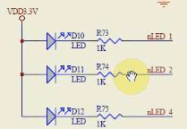

# 用平台分层分离思想点LED

## 1.有三个LED 灯



```c
// 配置GPF4，5，6为输出
*gpfcon &= ~((0x3 << (4*2)) | (0x3 <<(5*2) | (0x3<<(6*2)));
*gpfcon |= ~((0x1 << (4*2)) | (0x1 <<(5*2) | (0x1<<(6*2)));
```

现在只想点一个LED 灯，这里强制的把代码分成左右两边：
想写一个驱动，想达到一个目的：
左边“device”表示某一个LED 灯。要想修改是哪个LED 灯，就只需要修改左边这个
led_platform_dev.c 即可。而
右边那个“led_platform_drv.c”保持稳定不变。

Led_platform_dev.c
模仿：这是打过补丁后的“linux-2.6.22.6\arch\arm\mach-s3c2440\Mach-smdk2440.c"中的
代码。

```c
static struct platform_device s3c2440_device_sdi = {
	.name = "s3c2440-sdi",
	.id = 1,
	.num_resource= ARRY_SIZE(s3c2440_sid_resource),
	.resource = s3c2440_sdi_resource,
};
```
“s3c2440_sdi_resource”：平台设备结构“platform_device”有所谓的资源。

下面是“s3c2440_sdi_resource”平台资源具体的内容：

平台资源结构体

```c
struct resource {
	resource_size_t start; //资源开始地址
	resource_size_t end;   //资源结束地址
	const char *name;      //资源名字
	unsigned long flags;   //flags表示是哪一类资源
	struct resource *parent, *sibing, *child;
};
```

“flags”表示是指哪一类资源，也只是定义而已，也是一些结构体：

```c
#define IORESOURCE_MEM 0x00000200
#define IORESOURCE_IRQ 0x00000400
```

查看LED1 是哪个引脚：`*gpfdat &= ~((1<<4) | (1<<5) | (1<<6));`

```c
#define S3C2410_PA_SDI (0x5A000000)
#define S3C24XX_SZ_SDI SZ_1M
static struct resource s3c2440_sdi_resource[] = {
	[0] = { //寄存器的物理地址
		.start = S3C2410_PA_SDI,
		.end = S3C2410_PA_SDI + S3C24XX_SZ_SDI - 1,
		.flags = IORESOURCE_MEM,
	},
	[1] = {
		.start = IRQ_SDI,
		.end = IRQ_SDI,
		.flags = IORESOURCE_IRQ,
	}
};
```

仿照上面的示例写：

```c
gpfcon = (volatile unsigned long *)ioremap(0x56000050, 16);
gpfdat = gpfcon + 1;
```

还有硬件地址，看LED 灯的寄存器：

初始物理地址：0x56000050
结束地址：0x56000050 + 8 - 1;

## 驱动程序里定义了一个平台设备：

`struct platform_device led_dev`，这个平台设备里还有一些所谓的平台资源。

资源里有它的寄存器地址：

```c
[0] = {
.start = 0x56000050, //LED 的寄存器起始地址:gpfcon = (volatile unsigned long
*)ioremap(0x56000050, 16);
.end = 0x56000050 + 8 - 1, //LED 寄存器结束地址:gpfdat = gpfcon + 1;
.flags = IORESOURCE_MEM,
},
```
要修改寄存器，就直接修改上面的寄存器起始地址就可以.
资源里还有哪一个引脚的信息：

```c
[1] = {
.start = 4, //LED1 引脚4 是"4,5,6"中的第一个LED 灯。
.end = 4,
.flags = IORESOURCE_IRQ,
```

以后想换另一个LED 灯，就只需要换这里的引脚就好，如第2 个LED 灯引脚是5：

```c
[1] = {
.start = 5, //LED2 引脚5 是"4,5,6"中的第二个LED 灯。
.end = 5,
.flags = IORESOURCE_IRQ,
}
```

### 写“平台设备”：
Led_dev.c 设备部分：

#### 1.定义平台设备

##### 1.1分配、设置、注册一个platform_device 结构体。

```c
static struct resource led_resource[] = {
	[0] = {//哪个寄存器：LED的寄存器起始地址:gpfcon = (volatile unsigned long *)ioremap(0x56000050,
16);
		.start = 0x56000050, //ioremap
		.end = 0x56000050 + 8 - 1, //LED寄存器结束地址:gpfdat = gpfcon + 1;
		.flags = IORESOURCE_MEM, //内存资源
	},
	[1] = { //哪个引脚
		.start = 4, //LED1引脚4是"4,5,6"中的第1个LED灯
		.end = 4,
		.flags = IORESOURCE_IRQ, //中断资源
	}
};

static struct platform_device led_dev = {
	.name = "myled",
	.id = -1,
	.num_resources = ARRAY_SIZE(led_resource),
	.resource = led_resource,
};
```

##### 2.入口函数

```c
static int led_dev_init(void)
{
	platform_device_register(&led_dev);
	return 0;
}
```

###### 2.1 看注册平台设备的过程

```
platform_deivce_register(&led_dev)
	--->platform_device_add(pdev);
		--->device_add(&pdev->dev); //将device放到平台总线的dev链表中去
```

##### 3.出口函数

```c
static void led_dev_exit(void)
{
	platform_device_unregister(&led_dev);
}
```

##### 4.修饰入口函数

```c
module_exit(led_dev_init);
MODULE_LICENSE("GPL");
module_init(led_dev_init);
```
以上便写好了平台设备部分代码。

# 接着写“平台驱动”
## 1.定义平台驱动

```c
//1,分配、设置、注册一个platform_driver 结构体。
//1,1，定义一个平台驱动.因为平台总线的.match 函数比较的是"平台设备"和"平台驱动"的名
字.所以两边名字要相同.
//这样才会认为这个drv 能支持这个dev。才会调用平台驱动里面的".probe"函数。

struct platform_driver led_drv = {
	.probe = led_probe, //自己写一个probe函数
	.remove = led_remove, //自己写led_remove函数与led_remove倒过来写
	.driver = {
		.name = "mylead",  // 名字要与平台设备结构体中的名字一致
	}
};
```

## 2.构造平台驱动结构中的“.probe”函数

```c
//2.平台驱动结构图中.probe函数。这个函数是自己按照自己的要求写的

static int led_probe(struct platform_device *pdev)
{
	// 2.1根据platform_device 的资源进行ioremap
	// 2.2注册字符设备驱动程序
	printk("led_probe, found led\n");

	return 0;
}
```

## 3.构造平台驱动结构中的“.remove”函数：做与“.probe”相反的事件

```c
//3. led_remove与 .probe函数相反
static int led_remove(struct platform_device *pdev)
{
	// 3.1根据platform_device 的资源进行iounmap
	//3.2 卸载字符设备驱动程序
	printk("led_remove, remove led\n");
	return 0;
}
```

## 4.入口函数

```c
// 4.入口函数
static int led_drv_init(void)
{
	// 4.1注册一个平台驱动
	platform_driver_register(&led_drv);
	return 0;
}
```

## 5.出口函数

```c
static void led_drv_exit(void)
{
	// 5.1 卸载平台驱动
	platform_driver_unreigster(&led_drv);
}
```

运行效果

```
#insmod led_platform_drv.ko
#insmod led_platform_dev.ko
led_probe, found led 两边有同名设备注册
```
这时候insmod led_platform_dev.ko 后没有任何输入，是因为只是把平台驱动结构放到了bus平台总线的“drv”链表中。而此时另一边的“设备链表”中还没有同名的“device”。接着
再注册“led_platform_dev.ko”

卸载时，就会打印“platform_driver led_drv”结构的“`.remove = led_remove`”函
数：

```
platform_driver led_drv->(.remove = led_remove)
	-->int led_remove(struct platform_device *pdev)
		-->printk("led_remove, remove led\n");
卸载是“void led_drv_exit(void)”
	-->platform_driver_unregister (&led_drv);
		-->driver_unregister(&drv->driver);
			-->bus_remove_driver(drv);
卸载是从平台总线的“derive”链表上取下注册上的平台设备结构，根据设备的“同名名字”
找到“平台驱动”层之前相对应的“平台驱动结构”，调用里面的“.remove”函数。
卸载时出错：提示为没有“release()”函数。
#rmmod led_dev

Device myled does not have a release() function, it is broken and must be fixed.
```
找一个类似的release()函数的用法（平台设备里的release()函数用法）：

```c
struct platform_device {
	const char *name;
	u32 id;
	struct device dev;
	u32 num_resources;
	struct resource *resource;
};
```
平台设备 结构体定义中有一个“device”结构，这个“device”结构在“device.h”中定义：
其中有定义“void (*release)(struct device * dev);”。我们要提供这个relase 函数，这里什么都不用做。以后可以放一些硬件相关的到里面。这个例子里暂时不做任何事情。

修改代码如下：

```
void led_release(struct device *dev)
{
	// 都nothing,不然提示没有release函数
}

static struct platform_device led_dev = {
	.name = "myled",
	.id = -1,
	.num_resources = ARRAY_SIZE(led_resource),
	.resource = led_resource,
	.dev = {
		.release = led_release,
	},
};
```

# 第二部分:下面在“.probe”函数中做有意义的事情：注册字符设备

## 6.1 定义主设备号

```
static int major;
	-->int led_probe(struct platform_device *pdev);
	-->//6.2 注册字符设备:major = register_chrdev(0, "myled", led_fops);
```

## 7.1构造一个file_operations结构体

```c
static struct file_operations led_fops = {
	.owner = THIS_MODULE, 
	.open = led_open,
	.write = led_write,
};
```

## 8.1创建类

（可以不需要，只是让系统自动创建‘设备节点’）,先定义class 结构。

```
static struct class *cls;
	-->int led_probe(struct platform_device *pdev);
	-->// 8.2创建设备类cls = class_create(THIS_MODULE, "myled");
	-->//8.3在cls类中创建设备class_device_create(cls, NULL, MKDEV(major,0), NULL, "led");
		//则设备节点为/dev/led
```


# 要操作硬件（哪个寄存器等等操作)

则要：根据platform_device 的资源进行ioremap

`int led_probe(struct platform_device *pdev)`

## 2.1 根据 platform_device 的资源进行 ioremap

```
// 2.1.1 定义资源
struct resource *res;

// 2.1.2获得资源： led_dev 中IORESOURCE_MEM 内存资源 IERSOURCE_IRQ中断资源

res = platform_get_resources(pdev, IORESOURCE_MEM, 0);// pdev平台设备，IORESOURCE_MEM内存类资源

//2.1.3定义GPIO_CONG控制寄存器，和GPIO_DAT寄存器
static volatile unsigned long *gpio_con;
static volatile unsigned long *gpio_dat;

int led_probe(struct platform_device *pdev);

//2.1.4ioremap：res资源里有start,ioremap需要大小，资源res中有大小资源其实地址减去资源结束地址加1
gpio_con = ioremap(res->start, rest->end, rest->start + 1);
gpio_dat = gpio_con + 1; //指针家1，加4个字节就指向了gpio_dat寄存器了

//2.1.5哪个pin引脚

static int pin;
int led_probe(struct platform_device *pdev);
// 2.1.6 获得IOREOURCE_IRQ中断资源
res = platform_get_resource(pdev, IORESOURCE_IRQ, 0);//0表示IORESOURC_IRQ资源里的第0个
pin = res->start;

//以上寄存器有了gpio_con gpio_dat pin引脚也有了， led_probe 就操作完成了
```

# 第四部分：file_operations led_fops 结构中的open 函数的处理

## 9.1open 后，要把引脚配置成“输出”引脚。

```c
static int led_open(struct inode *inode, struct file *file)
{
	// 9.1 配置为输出引脚
	*gpio_con &= ~(0x3 <<(pin * 2);   // pin清为0
	*gpio_con |= ~(0x1 << (pin * 2)); // pin清胃0后再或上1
	return 0;
}

// 9.2write 函数
static ssize_t led_write(struct file *file, const char __user*buf, size_t count, loff_t *ppos)
{
	int val;
	copy_from_user(&val, buf, count); //copy_to_user();
	if(val == 1) {
		//点亮
		*gpio_dat &= ~(1<<pin);
	} else {
		*gpio_dat |= (1<<pin);
	}
	
	return 0;
}
```

# 第五部分：出口函数

```c
static void led_drv_exit(void)
{
	// 5.1卸载平台驱动
	platform_driver_unregister(&led_drv);
	
	// 卸载设备类
	class_device_destroy(cls, MKDEV(major, 0));
	
	// 去掉泪
	class_destroy(cls);

	// 卸载字符设备
	unregister_chrdev(major, "myled");

	iounmap(gpio_con);
}
```