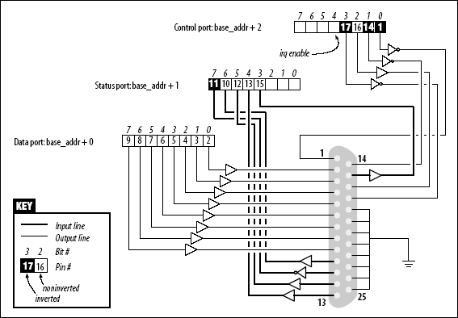

# 一个 I/O 端口例子
一个数字`I/O`端口, 在它的大部分的普通的化身中, 是一个字节宽的`I/O`位置,`内存映射的`或者`端口映射的`.

* 当你对一个输出位置写一个值, 在输出管脚上见到的电信号根据**写入的单个位而改变**. 
* 当你从一个输入位置读取一个值, 输入管脚上所见的当前逻辑电平作为单个位的值被返回.

这样的 I/O 端口和软件接口的实际实现各个系统不同. 大部分时间, `I/O`管脚由2个`I/O`位置控制: 

* 一个允许选择使用那些位作为输入, 哪些位作为输出
* 一个可以实际读或写逻辑电平的. 

但是有时,事情可能更简单, 并且这些位是**硬连线**为输入或输出(但是, 在这个情况下, 它们不再是所谓的"通用 I/O"); 在所有个人计算机上出现的并口是这样一个非通用`I/O`端口. 任一方式, I/O 管脚对我们马上介绍的例子代码是可用的.

# 1.并口纵览
因为我们期望大部分读者以所谓的"个人计算机"的形式使用一个 x86 平台, 我们觉得值得解释一下 PC 并口如何设计的. 并口是在个人计算机上运行数字`I/O`例子代码的外设接口选择. 尽管大部分读者可能有并口规范用, 为你的方便, 我们在这里总结一下它们.

**并口**, **在它的最小配置中**( 我们浏览一下 ECP 和 EPP 模式)**由3个8-位端口组成**. PC标准在`0x378`开始第一个并口的`I/O`端口并且第2个在`0x278`.

*  第1个端口是一个双向数据寄存器; 它直接连接到物理连接器的管脚`2-9`.
*  第2个端口是一个只读状态寄存器; 当并口为打印机使用, 这个寄存器报告打印机状态的几个方面, 例如正在线, 缺纸, 或者忙. 
*  第3个端口是一个只出控制寄存器, 它, 在其他东西中, 控制是否中断使能.

并口通讯中使用的信号电平是标准的TTL电平:0和5V, 逻辑门限在大概1.2V. 你可依靠端口至少符合标准 TTL LS 电流规格,尽管大部分现代并口在电流和电压额定值都工作的好.

并口连接器和计算机内部电路不隔离, 当你想直接连接逻辑门到这个端口是有用的. 但是你不得不小心地正确连接线; 并口电路当你使用你自己的定制电路时容易损坏, 除非你给你的电路增加绝缘. 你可以选择使用插座并口如果你害怕会损坏你的主板.

位的规范在图 并口的管脚 中概述. 你可以存取 12 个输出位和 5 个输入位, 有些是在它们地信号路径上逻辑地翻转了. 唯一的没有关联信号管脚的位是端口 2 的位 4 (0x10), 它使能来自并口的中断. 我们使用这个位作为我们的在第 10 章中的中断处理的实现的一部分.



# 2.一个例子驱动
我们介绍的驱动称为 short (Simple Hardware Operations and Raw Tests). 所有它做的是**读和写几个8-位端口**, 从你在加载时选择的开始. 缺省地, 它使用分配给 PC 并口的端口范围. 每个设备节点(有一个独特的次编号)存取一个不同的端口. short 驱动不做任何有用的事情; 它只是隔离来作为操作端口的单个指令给外部使用. 如果你习惯端口 I/O, 你可以使用 short 来熟悉它; 你能够测量它花费来通过端口传送数据的时间或者其他游戏的时间.

为 short 在你的系统上运行, 必须有存取底层硬件设备的自由(缺省地, 并口); 因此, 不能有其他驱动已经分配了它. 大部分现代发布设置并口驱动作为只在需要时加载的模块, 因此对 I/O 地址的竞争常常不是个问题. 如果, 但是, 你从 short 得到一个"无法获得 I/O 地址" 错误(在控制台上或者在系统 log 文件), 一些其他的驱动可能已经获得这个端口. 一个快速浏览 `/proc/ioports `常常告诉你哪个驱动在捣乱. 同样的告诫应用于另外 I/O 设备如果你没有在使用并口.

从现在开始, 我们只是用"并口"来简化讨论. 但是, 你能够设置基本的模块参数在加载时来重定向 short 到其他 I/O 设备. 这个特性允许例子代码在任何 Linux 平台上运行, 这里你对一个数字 I/O 接口有权限通过 outb 和 inb 存取( 尽管实际的硬件是内存映射的, 除 x86 外的所有平台). 后面, 在"使用 I/O 内存"的一节, 我们展示 short 如何用来使用通用的内存映射数字 I/O.

为观察在并口上发生了什么以及如果你有使用硬件的爱好, 你可以焊接尽管 LED 到输出管脚. 每个 LED 应当串连一个 1-K 电阻导向一个地引脚(除非, 当然, 你的 LED 有内嵌的电阻). 如果你连接一个输出引脚到一个输入管脚, 你会产生你自己的输入能够从输入端口读到.

注意, 你无法只连接一个打印机到并口并且看到数据发向 short. 这个驱动实现简单的对 I/O 端口的存取, 并且没有进行与打印机需要的来操作数据的握手; 在下一章, 我们展示了一个例子驱动(称为 shortprint ), 它能够驱动并口打印机; 这个驱动使用中断, 但是, 因此我们还是不能到这一点.

只考虑到short, `/dev/short0`写到和读自位于`I/O`基地址的8-bit端口(`0x378`, 除非在加载时间改变). `/dev/short1`写到位于基址+ 1的8-位, 等等直到基址+7.

`/dev/short0`进行的实际输出操作是基于使用 outb 的一个紧凑循环. 一个内存屏障指令用来保证输出操作实际发生并且不被优化掉:

```c
while(count--){
	outb(*(ptr++),port);
	wmb();
}
```
你可以运行下列命令来点亮你的 LED:

```
echo -n "any string" > /dev/short0 
```

每个 LED 监视一个单个的输出端口位. 记住只有最后写入的字符, **保持稳定在输出管脚上足够长时间你的眼睛能感觉到**. 因此, 我们建议你阻止自动插入一个结尾新行, 通过传递一个`-n`选项给 echo.

读是通过一个类似的函数, 围绕 inb 而不是 outb 建立的. 为了从并口读"有意义的"值, 你需要某个硬件连接到连接器的输入管脚来产生信号. 如果没有信号, 你会读到一个相同字节的无结尾的流. 如果你选择从一个输出端口读取, 你极可能得到写到端口的最后的值(这适用于并口和普通使用的其他数字 I/O 电路). 因此, 那些不喜欢拿出他们的烙铁的人可以读取当前的输出值在端口 0x378, 通过运行这样一个命令:

```c
dd if=/dev/short0 bs=1 count=1 | od -t x1 
```

为演示所有`I/O`指令的使用, 每个 short 设备有 3 个变形:`/dev/short0`进行刚刚展示的循环, `/dev/short0p`使用 outb_p 和 inb_p 代替"快速"函数, 并且`/dev/short0s`使用字串指令. 有 8 个这样的设备, 从 short0 到 short7. 尽管 PC 并口只有 3 个端口, 你可能需要它们更多如果使用不同的 I/O 设备来运行你的测试.

short 驱动进行一个非常少的硬件控制, 但是足够来展示如何使用 I/O 端口指令. 感兴趣的读者可能想看看 parpor 和 parport_pc 模块的源码, 来知道这个设备在真实生活中能有多复杂来支持一系列并口上的设备(打印机, 磁带备份, 网络接口)


