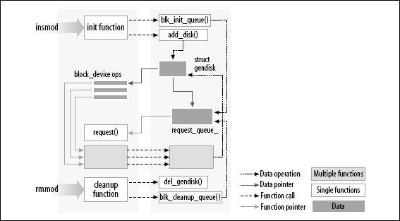

# Hello World 模块

```c
#include <linux/init.h>
#include <linux/module.h>

MODULE_LICENSE("Dual BSD/GPL");

static int hello_init(void)
{
	//TODO 后面没有逗号
	printk(KERN_ALERT "Hello ,world/n");
}

static void hello_exit(void)
{
	printk(KERN_ALERT "Goodbye ,cruel world\n");
}

module_init(hello_init);
module_exit(hello_exit);
```
模块能够调用 `printk` 是因为, 在`insmod`之后, 模块被连接到内核并且可使用内核的公用符号 (函数和变量, 下一节详述).

字串 KERN_ALERT 是消息的优先级.此模块中指定了一个高优先级, 因为使用缺省优先级的消息可能不会在任何有用的地方显示, 这依赖于你运行的内核版本.klogd版本，以及配置。

```
//运行
root# insmod ./hello.ko
Hello ,world
root#rmmod hello
Goodbye cruel world
```

# 1.内核模块相比于应用程序
大部分应用支持从开始到结束处理单一任。模块(事件编程)只注册自己以便自己来服务，初始化后立即终止.z应用程序释放资源可以不做清理工作，但是模块退出必须恢复初始化的东西，否则保持到**系统重启**：

* 模块初始化函数为后面模块调用函数做好准备(我在这里，我能做这些)
* 模块推出函数卸载调用(我不在这了，别想我做任何事情)

图 **连接一个模块到内核**展示了函数调用和函数指针在模块中如何使用来增加新功能到一个运行中的内核.


因为没有库连接到模块中, 源文件不应当包含通常的头文件`<stdarg.h>`,也有特例进行包含。只有实际上是内核的一部分的函数才可以在内核模块里使用。
内核相关的任何东西都在头文件里声明, 大部分相关的头文件位于 `include/linux` 和 `include/asm`, 但是别的 include 的子目录系统中。

**错误问题**：应用使无害的，内核错误可能会终止系统。

## 1.1用户空间和内核空间

> 一个模块在内核空间运行, 而应用程序在用户空间运行. 这个概念是操作系统理论的基础.每个模式有它自己的内存映射 -- 它自己的地址空间.

操作系统的角色是给程序提供一个**一致的计算机硬件的视角**. 操作系统必须承担程序的独立操作和保护对于非授权的资源存取.

程序代码只能通过有限的几个入口从一种级别切换到另一个. Unix 系统设计成利用了这种硬件特性, 使用了两个这样的级别. 所有当今的处理器至少有两个保护级别, 并且某些, 例如 x86 家族, 有更多级别;

Unix 从用户空间转换执行到内核空间, 无论何时一个应用程序发出一个系统调用或者被硬件中断挂起时. **执行系统调用的内核代码**在进程的上下文中工作--它代表调用进程并且可以存取该进程的地址空间. 换句话说, **处理中断的代码对进程来说是异步的**, **不和任何特别的进程有关**.

模块的角色是扩展内核的功能; 模块化的代码在内核空间运行. 经常地一个驱动进行之前提到的两种任务: 模块中一些的函数作为系统调用的一部分执行, 一些负责中断处理.

## 1.2内核并发

内核编程中有几个并发的来源：

* Linux 系统运行多个进程, 在同一时间, 不止一个进程能够试图使用你的驱动. 
	* 大部分设备能够中断处理器，**中断处理异步运行**, 并且可能在你的驱动试图做其他事情的同一时间被调用.
	* 几个软件抽象( 例如内核定时器, 第 7 章介绍 )也异步运行. 
	*  Linux 可以在对称多处理器系统( SMP )上运行, 结果是你的驱动可能在多个 CPU 上并发执行.
	*  在 2.6, 内核代码已经是可抢占的了; 这个变化使得即便是单处理器会有许多与多处理器系统同样的并发问题.

Linux内核代码, 包括驱动代码, 必须是**可重入的**： 它必须能够同时在多个上下文中运行. 

数据结构必须小心设计以保持多个执行线程分开, 并且代码必须小心存取共享数据, 避免数据的破坏.编写处理并发和避免竞争情况( 一个不幸的执行顺序导致不希望的行为的情形 )的代码需要仔细考虑并可能是微妙的. 正确的并发管理在编写正确的内核代码时是必须的; 由于这个理由, 本书的每一个例子驱动都是考虑了**并发下编写的**. 

## 1.3当前进程
尽管内核模块不象应用程序一样顺序执行, 内核做的大部分动作是**代表一个特定进程的**. 内核代码可以引用当前进程, 通过存取**全局项current**, 它在`<asm/current.h>`中定义, 它产生一个指针指向结构`task_struct`, 在`<linux/sched.h>`定义. current 指针指向当前在运行的进程. 在一个系统调用执行期间, 例如 open 或者 read, 当前进程是发出调用的进程. 

实际上, current 不真正地是一个全局变量.支持 SMP 系统的需要强迫内核开发者去开发一种机制, 在相关的 CPU 上来找到当前进程. 这种机制也必须快速, 因为对 current 的引用非常频繁地发生. 结果就是一个依赖体系的机制, 常常, 隐藏了一个指向 task_struct 的指针在内核堆栈内. 实现的细节对别的内核子系统保持隐藏, 一个设备驱动可以只包含 `<linux/sched.h>` 并且引用当前进程. 例如, 下面的语句打印了当前进程的进程 ID 和命令名称, 通过存取结构 task_struct 中的某些字段.

```c
printk(KERN_INFO "The process is \"%s\" (pid %i)\n",current->comm,current->pid);
```
存于`current->comm`的命令名称是由当前进程执行的程序文件的基本名称( 截短到 15 个字符, 如果需要 ).

## 1.4
**记住几点**：

* 应用程序存在虚拟内存在有非常大的堆栈区，保存函数调用历史以及当前活跃函数创建的自动变量。内核有一个非常小的堆栈，可能笑道4096字节页.你的函数必须与这个内核空间**调用链共享这个堆栈**。声明一个巨大的自动变量不是个好主意，需要大结构时，当调用时候动态分配。
* `__`双下划线，底层接口组件，要小心使用。
* 内核代码不能浮点算术，使能浮点将要求内核在每次进出内核空间的时候保存和恢复浮点处理器的状态 -- 至少, 在某些体系上. 在这种情况下, 内核代码真的没有必要包含浮点, 额外的负担不值得.

# 2.编译和加载

## 2.1 编译内核

`Document/kbuild` 目录下发现的文件,了解详情。. 在内核文档目录下的文件 `Documentation/Changes`一直列出了需要的工具版本; 

给你的模块创建一个 makefile 就是直截了当的. 实际上, 对于本章前面展示的" hello world" 例子, 单行就够了:

```
obj-m :=hello.o
```

内核建立系统处理了余下的工作. 上面的安排( 它利用了由 GNU make 提供的扩展语法 )表明有一个模块要从目标文件 hello.o 建立. 在从目标文件建立后结果模块命名为 hello.ko.如果你有一个模块名为 module.ko, 是来自 2 个源文件( 姑且称之为, file1.c 和 file2.c ), 正确的书写应当是:

```
obj-m :=module.o
module-objs : file1.o file2.o
```
对于一个象上面展示的要工作的 makefile, 它必须在更大的内核建立系统的上下文被调用. 你的 ~/kernel-2.6 目录, 用来建立你的模块的 make 命令( 在包含模块源码和 makefile 的目录下键入 )会是:

```
make -C ~kernel-2.6 M =`pwd` modules
```
这个命令开始是改变它的目录到用 -C 选项提供的目录下( 就是说, 你的内核源码目录 ). 它在那里会发现内核的顶层 makefile. 这个 M= 选项使 makefile 在试图建立模块目标前, 回到你的模块源码目录. 这个目标, 依次地, 是指在 obj-m 变量中发现的模块列表, 在我们的例子里设成了 module.o.

键入前面的 make 命令一会儿之后就会感觉烦, 所以内核开发者就开发了一种 makefile 方式, 使得生活容易些对于那些在内核树之外建立模块的人. 这个窍门是如下书写你的 makefile:

```
# If KERNELRELEASE is defined, we've been invoked from the
# kernel build system and can use its language.
ifneq ($(KERNELRELEASE),)

 obj-m := hello.o 
# Otherwise we were called directly from the command
# line; invoke the kernel build system.
else

 KERNELDIR ?= /lib/modules/$(shell uname -r)/build
 PWD := $(shell pwd) 
default:
 $(MAKE) -C $(KERNELDIR) M=$(PWD) modules

endif 
```
再一次, 我们看到了扩展的 GNU make 语法在起作用. 这个 makefile 在一次典型的建立中要被读 2 次. 当从命令行中调用这个 makefile , 它注意到 KERNELRELEASE 变量没有设置. 它利用这样一个事实来定位内核源码目录, 即已安装模块目录中的符号连接指回内核建立树. 如果你实际上没有运行你在为其而建立的内核, 你可以在命令行提供一个 KERNELDIR= 选项, 设置 KERNELDIR 环境变量, 或者重写 makefile 中设置 KERNELDIR 的那一行. 一旦发现内核源码树, makefile 调用 default: 目标, 来运行第 2 个 make 命令( 在 makefile 里参数化成 $(MAKE))象前面描述过的一样来调用内核建立系统. 在第 2 次读, makefile 设置 obj-m, 并且内核的 makefile 文件完成实际的建立模块工作.

这种建立模块的机制你可能感觉笨拙模糊. 一旦你习惯了它, 但是, 你很可能会欣赏这种已经编排进内核建立系统的能力. 注意, 上面的不是一个完整的 makefile; 一个真正的 makefile 包含通常的目标类型来清除不要的文件, 安装模块等等. 一个完整的例子可以参考例子代码目录的 makefile.

## 2.2加载和卸载模块
模块建立之后, 下一步是加载到内核`insmod`。这个程序加载模块的代码段和数据段到内核, 接着, 执行一个类似 ld 的函数, 它连接模块中**任何未解决的符号**连接到内核的符号表上. 但是不象连接器, 内核不修改模块的磁盘文件, 而是内存内的拷贝. 

**insmod**: 它依赖一个在`kernel/module.c`中定义的系统调用. 函数`sys_init_module`分配内核内存来存放模块 ( 这个内存用`vmalloc`分配; 看第 8 章的 "vmalloc 和其友" ); 它接着拷贝模块的代码段到这块内存区, 借助内核符号表解决模块中的内核引用, 并且调用模块的初始化函数来启动所有东西.

内核代码, 你会发现系统调用的名子以`sys_`为前缀. 这对所有系统调用都是成立的, 并且没有别的函数. modprobe, 如同 insmod, 加载一个模块到内核. 它的不同在于它会查看要加载的模块, 看是否它引用了当前内核没有定义的符号. 如果发现有, modprobe 在定义相关符号的当前模块搜索路径中寻找其他模块. 当 modprobe 找到这些模块( 要加载模块需要的 ), 它也把它们加载到内核. 如果你在这种情况下代替以使用 insmod , 命令会失败, 在系统日志文件中留下一条 " unresolved symbols "消息.

**rmmod**工具从内核去除.注意, 如果内核认为模块还在用( 就是说, 一个程序仍然有一个打开文件对应模块输出的设备 ), 或者内核被配置成不允许模块去除, 模块去除会失败. 可以配置内核允许"强行"去除模块, 甚至在它们看来是忙的. 如果你到了需要这选项的地步, 但是, 事情可能已经错的太严重以至于最好的动作就是重启了.

**lsmod**:使用了一个特定模块的其他模块, 也提供了`. lsmod`通过读取`/proc/modules`虚拟文件工作. 当前加载的模块的信息也可在位于`/sys/module`的sysfs虚拟文件系统找到.

内核版本和平台可能会导致加载模块问题