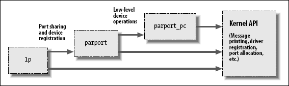

# 内核符号表
 insmod 如何对应共用的内核符号来解决未定义的符号. 表中包含了全局内核项的地址 -- 函数和变量 -- 需要来完成模块化的驱动.

新的模块可以用你的模块输出的符号, 你可以堆叠新的模块在其他模块之上. 模块堆叠在主流内核源码中也实现了: `msdos文件系统`依赖 `fat 模块`输出的符号, 某一个输入`USB设备模块`堆叠在 `usbcore` 和`输入模块`之上.

模块堆叠在复杂的工程中有用处. 如果一个新的抽象以驱动程序的形式实现, 它可能提供一个特定硬件实现的插入点. 例如, `video-for-linux`系列驱动分成一个通用模块, 输出了由特定硬件的低层设备驱动使用的符号. 根据你的设置, 你加载通用的视频模块和你的已安装硬件对应的特定模块. 对并口的支持和众多可连接设备以同样的方式处理, 如同 USB 内核子系统. 在并口子系统的堆叠在图 并口驱动模块的堆叠 中显示; 箭头显示了模块和内核编程接口间的通讯.

 并口驱动模块的堆叠



linux 内核头文件提供了方便来管理你的符号的可见性, 因此减少了命名空间的污染( 将与在内核别处已定义的符号冲突的名子填入命名空间), 并促使了正确的信息隐藏. 如果你的模块需要输出符号给其他模块使用, 应当使用下面的宏定义:

```c
EXPORT_SYMBOL(name);
EXPORT_SYMBOL_GPL(name);
```
_GPL 版本的宏定义只能使符号对 GPL 许可的模块可用.

# 1.初始化和关停
实际的初始化函数定义常常如：

```c
static int __init initialization_function(void)
{

 /* Initialization code here */
}
module_init(initialization_function);
```
初始化函数应当声明成**静态的**, 因为它们不会在特定文件之外可见; 声明中的`__init`标志可能看起来有点怪; 它是一个给内核的暗示, 给定的函数只是在初始化使用. 模块加载者在模块加载后会丢掉这个初始化函数, 使它的内存可做其他用途.

使用 __init 和 __initdata 是可选的, 但是它带来的麻烦是值得的. 只是要确认不要用在那些在**初始化完成后还使用的函数**(或者**数据结构**)上. 你可能还会遇到 __devinit 和 __devinitdata 在内核源码里; 这些只在内核没有配置支持 hotplug 设备时转换成 __init 和 _initdata. 

内核源码里查找 EXPORT_SYMBOL , 找到由不同驱动提供的入口点. 大部分注册函数以`register_`做前缀, 因此找到它们的另外一个方法是在内核源码里查找`register_`.

## 1.1 清理函数

每个非试验性的模块也要求有一个清理函数, 它注销接口, 在模块被去除之前返回所有资源给系统. 这个函数定义为:

```c
static void __exit cleanup_function(void)
{
 /* Cleanup code here */
}

module_exit(cleanup_function);
```
清理函数没有返回值, 因此它被声明为 void. __exit 修饰符标识这个代码是只用于模块卸载( 通过使编译器把它放在特殊的 ELF 段). 
如果你的模块没有定义一个清理函数, 内核不会允许它被卸载.

## 1.2初始化的错误处理
你必须记住一件事, 在注册内核设施时, **注册可能失败**.如果证实你的模块在一个特别类型的失败后完全不能加载, 你必须取消任何在失败前注册的动作.如果初始化在某个点失败, 模块必须能自己退回所有东西. 如果你**无法注销你获取的东西**, 内核就被置于**一个不稳定状态**; 它包含了不存在的代码的内部指针. 这种情况下, 经常地, 唯一的方法就是重启系统. 在初始化错误发生时, 你确实要小心地将事情做正确.

错误恢复有时用goto语句处理是最好的. 下面例子代码( 使用设施注册和注销函数)在初始化在任何点失败时做得正确:

```c
int __init my_init_function(void)
{
	int err;
	/*registration takes a pointer and a name*/
	err = register_this(ptr,"skull");
	if(err)
		goto fail_this;
	err = register_that(ptr2, "skull");
        if (err)
                goto fail_that;
        err = register_those(ptr3, "skull");
        if (err)
                goto fail_those;
        return 0; /* success */
fail_those:
        unregister_that(ptr2, "skull");
fail_that:
        unregister_this(ptr1, "skull");
fail_this:
        return err; /* propagate the error */
}
```
my_init_function 的返回值, err, 是一个错误码. 在 Linux 内核里, 错误码是负数, 属于定义于 `<linux/errno.h>`的集合. 如果你需要产生你自己的错误码代替你从其他函数得到的返回值, 你应当包含 `<linux/errno.h>` 以便使用符号式的返回值, 例如 `-ENODEV`, `-ENOMEM`, 等等. 返回适当的错误码总是一个好做法, 因为用户程序能够把它们转变为有意义的字串, 使用 perror 或者类似的方法.

模块清理函数必须撤销任何由初始化函数进行的注册, 并且惯例(但常常不是要求的)是按照注册时相反的顺序注销设施.

```c
void __exit my_cleanup_function(void) 
{
 unregister_those(ptr3, "skull");
 unregister_that(ptr2, "skull");
 unregister_this(ptr1, "skull");
 return;
} 
```
如果你的初始化和清理比处理几项复杂, goto 方法可能变得难于管理, 因为所有的清理代码必须在初始化函数里重复, 包括几个混合的标号. 有时, 因此, 一种不同的代码排布证明更成功.

使代码重复最小和所有东西流线化, 你应当做的是无论何时发生错误都从初始化里调用清理函数. 清理函数接着必须在撤销它的注册前检查每一项的状态. 以最简单的形式, 代码看起来象这样:

```c
struct something *item1;
struct somethingelse *item2;
int stuff_ok;

void my_cleanup(void)
{
        if (item1)
                release_thing(item1);
        if (item2)
                release_thing2(item2);
        if (stuff_ok)
                unregister_stuff();
        return;
}

int __init my_init(void)
{
        int err = -ENOMEM;

        item1 = allocate_thing(arguments);
        item2 = allocate_thing2(arguments2);
        if (!item2 || !item2)
                goto fail;

        err = register_stuff(item1, item2);
        if (!err)
                stuff_ok = 1;
        else
                goto fail;
        return 0; /* success */

fail:
        my_cleanup();
        return err;
}
```
如这段代码所示, 你也许需要, 也许不要**外部的标志来标识初始化步骤的成功**, 要依赖你调用的注册/分配函数的语义. 不管要不要标志, 这种初始化会变得包含大量的项, 常常比之前展示的技术要好. 注意, 但是, 清理函数当由非退出代码调用时不能标志为 __exit, 如同前面的例子.

## 1.3模块加载竞争

* 内核的某些别的部分会在注册完成之后马上使用任何你注册的设施. 内核将调用进你的模块, 在你的初始化函数仍然在运行时. 所以你的代码必须准备好被调用, 一旦它完成了它的第一个注册. 不要注册任何设施, 直到所有的需要支持那个设施的你的内部初始化已经完成.

# 2.模块参数

驱动需要知道的几个参数因不同的系统而不同.从使用的设备号( 如我们在下一章见到的 )到驱动应当任何操作的几个方面. 例如：

*  SCSI 适配器的驱动常常有选项控制标记命令队列的使用
*  IDE 驱动允许用户控制 DMA 操作. 

如果你的驱动控制老的硬件, 还需要被明确告知哪里去找硬件的 I/O 端口或者 I/O 内存地址. 内核通过在加载驱动的模块时指定可变参数的值, 支持这些要求.这些参数的值可由 insmod 或者 modprobe 在加载时指定; 

后者也可以从它的配置文件(`/etc/modprobe.conf`)读取参数的值. 这些命令在命令行里接受几类规格的值. 作为演示这种能力的一种方法, 想象一个特别需要的对本章开始的"hello world"模块(称为 hellop)的改进. 我们增加 2 个参数: 一个整型值, 称为 howmany, 一个字符串称为 whom. 我们的特别多功能的模块就在加载时, 欢迎 whom 不止一次, 而是 howmany 次. 这样一个模块可以用这样的命令行加载:

```c
insmod hellop howmany=10 whom = "Mom"
```
但是, 在 insmod 可以修改模块参数前, 模块必须使它们可用. 参数用 moudle_param 宏定义来声明, 它定义在`moduleparam.h`. 

module_param 使用了 3 个参数: `变量名`, `它的类型`, 以及一个`权限掩码`用来做一个辅助的 sysfs 入口.

```c
static char *whom = "world";
static int howmany = 1;
module_param(howmany, int, S_IRUGO);
module_param(whom, charp, S_IRUGO);
```
模块参数支持许多类型:

* bool
* invbool
	* 一个布尔型( true 或者 false)值(相关的变量应当是 int 类型). invbool 类型颠倒了值, 所以真值变成 false, 反之亦然.
* charp:一个字符指针值. 内存为用户提供的字串分配, 指针因此设置.
* int
* long
* short
* uint
* ulong
* ushort:基本的变长整型值. 以 u 开头的是无符号值.

数组参数, 用逗号间隔的列表提供的值, 模块加载者也支持. 声明一个数组参数, 使用:

```
module_param_array(name,type,num,perm);
```

最后的 module_param 字段是一个权限值; 你应当使用 `<linux/stat.h>` 中定义的值. 这个值控制谁可以存取这些模块参数在 sysfs 中的表示. 如果 perm 被设为 0, 就根本没有 sysfs 项. 否则, 它出现在 `/sys/module[5] `下面, 带有给定的权限. 使用 S_IRUGO 作为参数可以被所有人读取, 但是不能改变; S_IRUGO|S_IWUSR 允许 root 来改变参数. 注意, 如果一个参数被 sysfs 修改, 你的模块看到的参数值也改变了, 但是你的模块没有任何其他的通知. 你应当不要使模块参数可写, 除非你准备好检测这个改变并且因而作出反应.