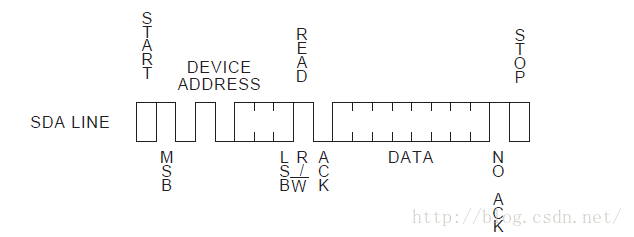
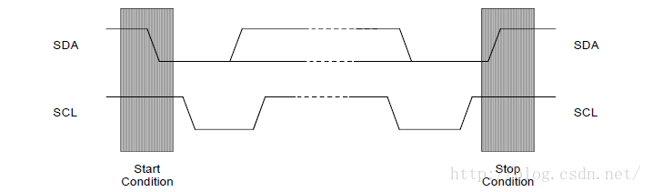

# 1.i2c协议简要分析
i2c中线是一种由 PHILIPS 公司开发的串行总线，用于连接微控制器及其外围设备，它具有以下特点。

* 只有两条总线线路：**一条串行数据线SDA**,**一条串行时钟线SCL**。
* 每个连接到总线的**器件**都可以使用软件根据它的**唯一的地址**来确定。
* 传输数据的设备之间是简单的**主从关系**。
* 机可以用作主机发送器或者主机接收器
* 它是一个真正的多主机总线，两个或多个主机同时发起数据传输时，可以通过冲突检测和仲裁来防止数据被破坏。
* **串行的8位双向传输**，位速在标准模式下可达 100kbit/s,在快速模式下可达400kbit/s，在高速模式下可待3.4Mbit/s。
* 片上的滤波器可以增加抗干扰能力，保证数据的完整性.
* 连接到同一总线上的IC数量只受到总线的**最大电容400Pf**的限制

如上图所示，启动一个传输时，主机先发送一个**S信号**，然后发送8位数据。这8位数据的**前7位为从机地址**，**第八位表示传输的方向**（0表示写，1表示读），如果有数据则继续发送，最后发出**P信号**停止。

信号类型：**注意**：正常数据传输时，`SDA`在SCL为低电平时改变，在SCL为高电平时保持稳定。SCL高电平，SDA电平改变时改变状态。

* **开始信号 S 信号**：SCL 为高电平时，SDA由高电平向低电平跳变，开始传送数据。
* **结束信号 P 信号**：SCL 为高电平时，SDA由低电平向高电平跳变，结束传送数据。
* **响应信号 ACK**：接收器在接收到8位数据后，在第9个时钟周期，**拉低SDA电平**

**注意**：在第9个时钟周期，发送器保持SDA为高，**如果有ACK**，那么**第9个时钟周期SDA为低电平**，如果没有为高电平，发送器根据电平高低分辨是否有ACK信号。如果使能了IIC中断，发送完8bit数据后，主机自动进入中断处理函数，此时SCL被发送器拉低，让接收器被迫等待。恢复传输只需要清除中断挂起。