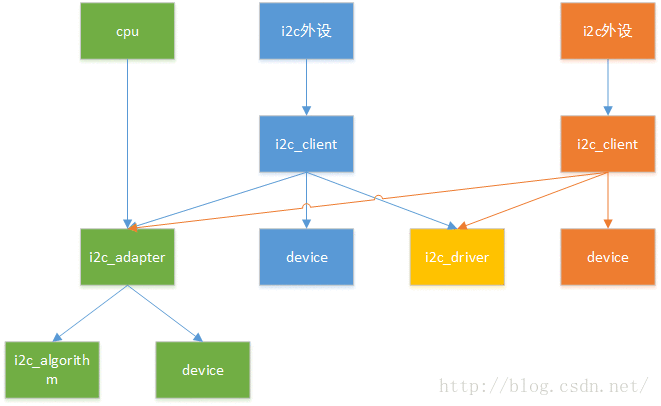
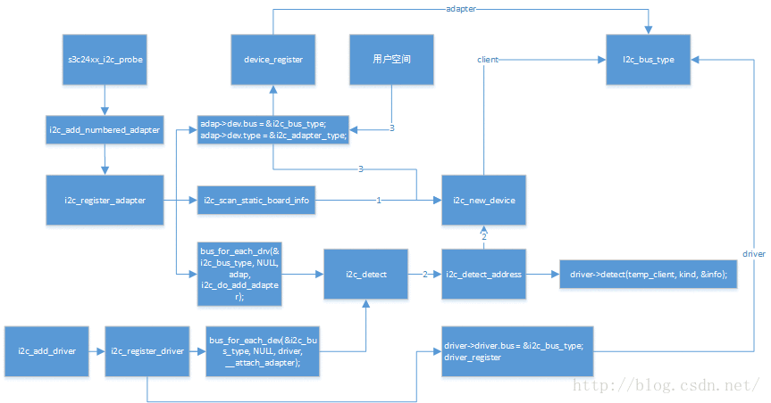

# i2c驱动程序全面分析，从adapter驱动程序到设备驱动程序
# 1.adapter client 简介
在内核里，i2c 驱动框架大概分为两层，adapter 驱动 和 设备驱动，adapter 英文翻译过来为 “适配器”，适配器并不恰当，根据我的理解，adapter 指的是我们 mcu 里的 i2c 控制模块，就是那堆寄存器，因为一个 mcu 里的i2c控制模块是固定的（寄存器参数、以及收发数据的方法），因此大多数情况下，它们都有芯片厂商写好了，然而我们学习的过程中自己动手写一写也并不困难。
对于s3c2440仅仅有一个`i2c_adapter`，但是别的Mcu可能有多个。至于Client，它对应于muc外围的I2c设备，每一个**i2c设备**都由一个唯一的`client`来描述。



```c
struct i2c_adapter {
	struct module *owner;
	unsigned int id;
	unsigned int class;//class to allow probing for
	const struct i2c_algorithm *algo;//the algorithm to access the bus
	void *algo_data;
	
	//data fields that are valid for all devices
	u8 level;       //nesting level for lockdef
	struct mutex bus_lock;
	
	int timeout;  // in jiffies
	int retires;
	struct device dev; //the adapter device
	
	int nr;
	char name[48];
	struct completion dev_released;
}；
```
简单扫一眼，i2c_adapter 封装了 `struct device` ，因此它是作为一个设备注册到内核中去的（稍后我们会知道，它是注册到`i2c_bus_type`里），此外非常重要的一个成员`struct i2c_algorithm *algo` ，这就是我们上边提到的 i2c 控制器**收发数据的方法**。

```c
struct i2c_algorithm {
	int (*master_xfer)(struct i2c_adapter *adap,struct i2c_msg *msgs,int num);
	int (*smbus_xfer)(struct i2c_adapter *adap,u16 adder,unsigned short flags,char read_write,
		u8 command,int size,union i2c_smbus_data *data);
	//to determine what the adapter support
	u32 (*functionality)(struct i2c_adapter *);
};
```

* master_xfer:对应于i2c协议子集 smbus ，有些设备只支持这个协议
* smbus_xfer:对应于普通的 i2c 传输协议
* functionality:用来描述，adapter所具有的功能，比如是否支持`smbus`

```c
struct i2c_client {
	unsigned short flags;    //div. see below
	unsigned short addr;     // chip address NOTE:7bit,address are stored in the _LOWER_ 7 bits
	
	char name[I2C_NAME_SIZE];
	struct i2c_adapter *adapter;  //the adapter we sit on
	struct i2c_driver *driver;    //and our access routines
	struct device dev;            //the device structure
	int irq;					  //irq issued by device;
	struct list_head detected;
};
```
i2c_client 本质上是一个 i2c_"dev", 它包含了与它配对的 driver ，以及它所在的 adapter（i2c设备在物理连接上，连接到了哪个adapter），后面分析时会看到，它也是作为**设备**注册到`i2c_bus_type`.

# 2.adapter驱动框架
在我所使用的这个内核里，2440的i2c_adapter框架是基于 platform_bus_type 的，关于 platform_bus_type 别的文章已经分析过了，这里不做赘述，只简单提一下，当设备或驱动注册到 platform_bus_type 时，首先会查找驱动是否有id_table，如果有根据id_table进行匹配（就是看id_table里有无设备的名字），否则匹配设备名字和驱动名字。匹配成功则调用驱动里的probe函数。

## 2.1 设备侧

根据设备总线驱动模型的分层思想，将一个驱动程序分为 device 和 driver 两层，那么 device 里提供底层的硬件资源，在 driver 中取出这些资源进行使用。那么我们就可以猜测到 i2c_adapter 驱动的设备侧 至少应该含有哪些资源？

* 存器地址必须有吧，因为我们要使用这些寄存器，不然怎么传输。
* 中断必须有吧，i2c传输过程中可是离不开中断的。
下面，我们就开详细的看一看，i2c_adapter 驱动的设备侧提供了哪些设备资源。`mach-smdk2410.c (arch\arm\mach-s3c2410)` 中定义了个指针数组，这里面有我们想要的 s3c_device_i2c0.

```c
static struct platform_device *smdk2410_devices[] __initdata = {
	&s3c_device_usb,
	&s3c_device_lcd,
	&s3c_device_wdt,
	&s3c_device_i2c0,
	&s3c_device_iis,
};
dev-i2c0.c (arch\arm\plat-s3c)
struct platform_device s3c_device_i2c0 = {
	.name		  = "s3c2410-i2c",
#ifdef CONFIG_S3C_DEV_I2C1
	.id		  = 0,
#else
	.id		  = -1,
#endif
	.num_resources	  = ARRAY_SIZE(s3c_i2c_resource),
	.resource	  = s3c_i2c_resource,
};
static struct resource s3c_i2c_resource[] = {
	[0] = {
		.start = S3C_PA_IIC1,
		.end   = S3C_PA_IIC1 + SZ_4K - 1,
		.flags = IORESOURCE_MEM,
	},
	[1] = {
		.start = IRQ_IIC1,
		.end   = IRQ_IIC1,
		.flags = IORESOURCE_IRQ,
	},
};
```
是不是正如我们所料，在资源文件中提供了 物理寄存器 以及 中断资源。`Mach-smdk2410.c (arch\arm\mach-s3c2410)`，将 s3c_device_i2c0 注册到 平台设备总线上去

```c
static void __init smdk2410_init(void)
{
	s3c_i2c0_set_platdata(NULL);
	platform_add_devices(smdk2410_devices, ARRAY_SIZE(smdk2410_devices));
	smdk_machine_init();
}
dev-i2c0.c (arch\arm\plat-s3c)
static struct s3c2410_platform_i2c default_i2c_data0 __initdata = {
	.flags		= 0,
	.slave_addr	= 0x10,
	.frequency	= 100*1000,
	.sda_delay	= 100,
};		
void __init s3c_i2c0_set_platdata(struct s3c2410_platform_i2c *pd)
{
	struct s3c2410_platform_i2c *npd;
 
	if (!pd)
		pd = &default_i2c_data0;
 
	npd = kmemdup(pd, sizeof(struct s3c2410_platform_i2c), GFP_KERNEL);
	if (!npd)
		printk(KERN_ERR "%s: no memory for platform data\n", __func__);
	else if (!npd->cfg_gpio)
		npd->cfg_gpio = s3c_i2c0_cfg_gpio;
 
	s3c_device_i2c0.dev.platform_data = npd;
}
setup-i2c.c (arch\arm\plat-s3c24xx)
void s3c_i2c0_cfg_gpio(struct platform_device *dev)
{
	s3c2410_gpio_cfgpin(S3C2410_GPE(15), S3C2410_GPE15_IICSDA);
	s3c2410_gpio_cfgpin(S3C2410_GPE(14), S3C2410_GPE14_IICSCL);
}
//S3c244x.c (arch\arm\plat-s3c24xx)
void __init s3c244x_map_io(void)
{
	/* register our io-tables */
 
	iotable_init(s3c244x_iodesc, ARRAY_SIZE(s3c244x_iodesc));
 
	/* rename any peripherals used differing from the s3c2410 */
 
	s3c_device_sdi.name  = "s3c2440-sdi";
	s3c_device_i2c0.name  = "s3c2440-i2c";
	s3c_device_nand.name = "s3c2440-nand";
	s3c_device_usbgadget.name = "s3c2440-usbgadget";
}
```
 在将 s3c_device_i2c0 注册到 平台设备总线上去之前，还提供了以上的其它信息，包括i2c控制器作为从机的默认slave_addr等，以及引脚的配置函数。注意，`s3c_device_i2c0.name  = "s3c2440-i2c";`

## 2.2驱动侧
驱动侧的工作大概是**取出设备侧的资源进行利用**，比如**Ioremap**，**配置寄存器**，**注册中断**等等

```c
//i2c-s3c2410.c(driver/i2c/buses)

static struct platform_driver s3c24xx_i2c_driver = {
	.probe = s3c24xx_i2c_probe,	
	.remove = s3x24xx_i2c_remove,
	.id_table = s3c24xx_drivers_ids,
	.driver = {
		.owner = THIS_MODULE,
		.name = "s3c-i2c",
		.pm = S3C24XX_DEV_PM_OPS,
	}，
};

static struct platform_device_id s3c24xx_driver_ids[] = {
	{
		.name		= "s3c2410-i2c",
		.driver_data	= TYPE_S3C2410,
	}, {
		.name		= "s3c2440-i2c",
		.driver_data	= TYPE_S3C2440,
	}, { },
};
static int __init i2c_adap_s3c_init(void){
	return platform_driver_register(&s3c24xx_i2c_driver);
}
subsys_initcall(i2c_adap_s3c_init);
```
我们在分析platform总线模型的时候，我们知道`platform_bus_type->match`函数是首先根据`driver->id_table`来进行匹配device的，前面讲了`s3c_device_i2c0.name  = "s3c2440-i2c"`，因此，匹配成功会调用 `s3c24xx_i2c_driver->probe`函数，也就是`s3c24xx_i2c_probe`，它是个重点。

## 2.3probe函数分析

```c
//i2c-s3c2410.c (driver/i2c/buses
static int s3c24xx_i2c_probe(struct platform_device *pdev) {
	struct s3c24xx_i2c *i2c;
	struct s3c2410_platform_i2c *pdata;
	struct resource *res;
	int ret;
	
	//去除platform_data
	pdata = pdev-dev.platform_data;
	i2c = kzalloc(sizeof(struct s3c24xx_i2c),GP_KERNEL);
	
	//1.使能i2c时钟
	i2c->dev = &pdev-dev;
	i2c->clk = clk_get(&pdev->dev,"i2c");
	clk_enable(i2c->clk);
	
	//2.io内存映射
	res = platform_get_resource(pdev,IORESOURCE_MEM,0);
	i2c->ioarea = request_mem_region(res->start,resource_size(res),pdev->name);
	i2c->regs = ioremap(res->start,resource_size(res));
	
	//3.设置adap的相关消息
	strlcpy(i2c->adap.name,"s3c2410-i2c",sizeof(i2c->adap.name));
	i2c->adap.owner = THIS_MODULE;
	i2c->adap.algo = &s3c24xx_i2c_algorithm;    //i2c控制器的收发函数
	i2c->adp.reties = 2;
	i2c->adp.class = I2C_CLASS_HWMON | I2C_CLASS_SPD;
	i2c->tx_setup = 50;
	i2c->adp.algo_data = i2c;
	i2c->adap.dev.parent = &pdev->dev;

	//4.初始化i2c controller
	ret = s3c24xx_i2c_init(i2c);
	i2c->irq = ret = platform_get_irq(pdev,0);
	
	//5.注册中断
	ret = request_irq(i2c->irq,s3c24xx_i2c_irq,IRQF_DISABLE,dev_name(&pdev->dev),i2c);
	ret = s3c24xx_i2c_register_cpufreq(i2c);

	//TODO note:previous versions of the driver used i2c_add_apater()
	//to add the bus ad any number.we now pass the bus number via the platform data,so if
	//unset it will now defualt to always being bus 0
	//6.适配器编号
	//阅读上面的英文，大概意思就是device侧pdata中没设置bus_num，那么就默认为0，显然这里是0
	i2c->adap.nr = pdata->bus_num;
	
	//7.注册adapter
	ret = i2c_add_numbered_adapter(&i2c_adap);//i2c_register_adapter（&i2c->adap）;
	platform_set_drdata(pdev,i2c);
	return 0;
}
//i2c-core.c (driver/i2c)
static int i2c_register_adapter(struct i2c_adapter *adap){
	int res = 0,dummy;
	mutex_init(&adapter->bus_lock);
	
	//set default timeout to 1 second if not already set
	if(adapter->timeout == 0)
		adapter->timeout = HZ;
	
	//设置adap->dev.kobj.name 为i2c-0 ,它将出现在sysfs中
	dev_set_name(&adap->dev,"i2c-%d",adap->nr);
	
	//设置它所属的总线i2c_bus_type
	adpa->dev.bus = &i2c_bus_type;
	
	//设置属性，用户创建device就靠它了
	apap->dev.type = &i2c_adapter_type;
	
	//将adap->dev注册到i2c_bus_type
	res = device_register(&adap->dev);
//大概是创建devices目录到class目录的符号链接
#ifdef CONFIG_I2C_COMPAT
	res = class_compat_create_link(i2c_adapter_compat_class,&adap->dev,adap->dev.parent);
	if(res)
		dev_warn(&adap->dev,"Failed to create compatibility class link \n");
#endif
	//重点,扫描__i2c_board_list 链表里面的设备信息，自动创建client，并注册到i2c_bus_type
	if(adapter->nr <__i2c_first_dynamic_bus_num)
		i2c_scan_static_board_info(adap);
	//重点：遍历i2c_bus_type的driver链表，取出每一个driver，调用i2c_do_add_adapter
	mutex_lock(&core_lock);
	dummy = bus_for_each_drv(&i2c_bus_type,NULL,adap,i2c_do_add_adapter);
	mutex_unlock(&core_lock);
	return 0;
}
```
这一个 probe 函数的内容是在是太多了，慢慢来吧，至于 ioremap 申请中断啥的就不讲了,上个图



在内核帮助文档 instantiating-devices 中说，有4种方法可以创建`i2c_device` ，其中第四种是在用户空间创建的：

Example:

```
#echo eeprom 0x50 > /sys/bus/i2c/devices/i2c-0/new_device
分析过设备模型的都知道，i2c-0 是我们上面设置的 dev_set_name(&adap->dev, "i2c-%d", adap->nr)，new_device 就是它的一个属性了，这个属性在哪里？在i2c_adapter_type 中
```

```c

```
