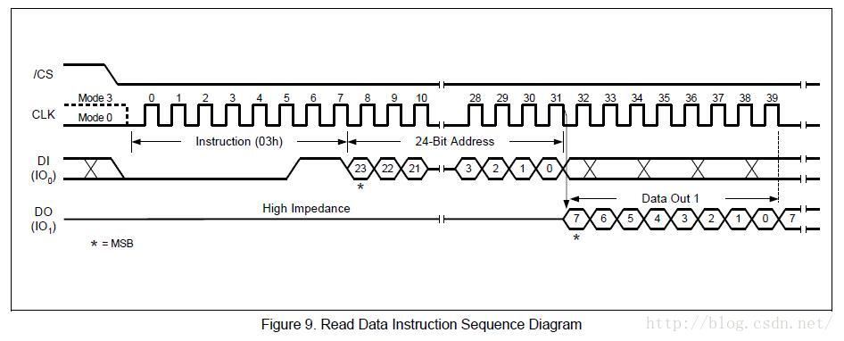

# 1.SPI 框架简单介绍
对于SPI的大框架分为两层

* **控制器驱动程序层**叫 spi_master,主要提供`transfer`函数，进行spi协议的收发。spi_master 也是基于Platform模型的，注册spi_master时也会扫描一个链表进行注册设备.
* 另一层是**设备驱动层**,基于`spi_bus_type`,需要有`名字`、`片选`、`最大速率`、`模式`、`中断号`等等，在driver里则使用`spi_read`、`spi_writer`等函数，最终也会调用到`master->transfer`函数进行发送接收。

SPI只需要片选选中就行了.

# 2.master 驱动框架
发现 atmel_spi.c(`drivers\spi`)，里 atmel 实现的底层控制器驱动简单清晰多了，因此就拿它开刀，分析Master驱动框架。

## 2.1 驱动侧
前面简介里，我提到 master 驱动框架是基于platform平台的（我分析的这俩都是，其它的不清楚），那么肯定就要注册platform_driver了，下面我们就开看看。分配一个platfrom_driver结构。首先使用的`module_platform_driver`,这个宏，相当于初始化注册的platform的过程.

```c
static struct platform_driver atmel_spi_driver = {
	.driver		= {
		.name	= "atmel_spi",
		.owner	= THIS_MODULE,
	},
	.suspend	= atmel_spi_suspend,
	.resume		= atmel_spi_resume,
	.remove		= __exit_p(atmel_spi_remove),
};
```
 将 atmel_spi_driver 注册到 platform_bus_type ，匹配设备 probe

```c
static int __init atmel_spi_init(void)
{
	return platform_driver_probe(&atmel_spi_driver, atmel_spi_probe);
}	
```
我们之前都是将probe函数，直接放在driver结构体里，这里不是，而是调用`platform_driver_probe`，就不贴代码了，还看段函数介绍，大致了解下什么意思。

```
platform_driver_probe - register driver for non-hotpluggable device
 * @drv: platform driver structure
 * @probe: the driver probe routine, probably from an __init section
 *
 * Use this instead of platform_driver_register() when you know the device
 * is not hotpluggable and has already been registered, and you want to
 * remove its run-once probe() infrastructure from memory after the driver
 * has bound to the device.
 *
 * One typical use for this would be with drivers for controllers integrated
 * into system-on-chip processors, where the controller devices have been
 * configured as part of board setup.
 *
 * Returns zero if the driver registered and bound to a device, else returns
 * a negative error code and with the driver not registered.
 */
```
* 1适用于**非热插拔设备**
* 2通常Probe位于`__init`段
* 3当你知道device是**非热拔插**的，而且**设备已经被注册了**，而且你想在probe函数调用一次之后就销毁它节省空间，使用`platform_driver_probe`而非 `platform_driver_register`。
4一个典型的应用是，用在完整的**控制器驱动**，控制器设备被当作`board setup`的一部分（在板子初始化的时候，设备就已经被注册了，放在board_info里）
* 5返回0 ，如果driver注册成功且匹配到一个device ，以后再也无法被别的device probe了。
* 6.否则，返回一个错误，且driver未注册。

显然，我们写的正式一个控制器驱动程序，设备侧确实是早已注册（后边会讲）。

疑问：有人说使用 platform_driver_probe 时 driver 只能被一个 device 匹配绑定，之后再也无法被别的device probe，难道说，我有俩spi控制器还需要写两个控制器驱动程序么？我认为这种说法是不对的，我猜大概是driver注册时，会匹配一遍device链表，把能支持的device都probe，之后再有deivce注册进来就不行了。这个有待验证。

i2c驱动框架里，是在driver->probe 分配设置注册adapter，想必**spi**也是在driver->probe里分配设置注册master。

```c
static int __init atmel_spi_probe(struct platform_device *pdev){
	struct resource *regs;
	int 			irq;
	struct clk		*clk;
	int 			ret;
	struct spi_master *master;
	struct atmel_spi  *as;

	//获取device侧提供的IO内存以及中断
	regs = platform_get_resource(pdev,IORESOURCE_MEM,0);
	irq = platform_get_irq(pdev,0);
	
	//获取spi时钟，一会好使能它
	clk = clk_get(&pdev->dev,"spi_clk");

	//先设置spi核心，然后具体化atmel-specific驱动状态
	master = spi_alloc_master(&pdev->dev,sizeof *as);

	//设置master
	master->mode_bits = SPI_CPOL | SPI_CPHA | SPI_CS_HIGH;//所支持的模式
	master->bus_num = pdev_id;//控制器编号，用于分辨外围spi设备是连接在哪一个控制器
	master->num_chipselect = 4;//片选最大值+1，spi设备的片选值要小于它
	master->setup = atmel_spi_setup;//一个控制器上可能接有多个spi设备，他们的频率和模式是不一样的，用于设备之间切换时设置这些信息
	master->transfer = atmel_spi_tansfer;//最重要的发送函数
	master->cleanup = atmel_spi_cleanup;
	
	//将Master放入pdev->dev->p->driver_data
	platform_set_drvdata(pdev,master);
	
	//as指向master->dev->p->driver_data
	//填充多出来那个atmel_spi结构
	as = spi_master_get_devdata(master);

	//连贯的，一致的coherent,用来传递rx 和 tx 数据
	as->buffer = dma_alloc_coherent(&pdev->dev,BUFFER_SIZE,
				&as->buffer_dma,GFP_KERNEL);
	spin_lock_init(&as->lock);
	INIT_LIST_HEAD(&as->queue);
	as->pdev = pdev;
	as->regs = ioremap(regs->start,(regs->end - regs->start)+1);
	as->irq = irq;
	as->clk = clk;
	
	//注册中断——使能时钟
	ret = request_irq(irq,atmel_spi_interrupt,0,
			dev_name(&pdev->dev),master);
	clk_enable(clk);
	
	//初始化硬件
	ret = clk_prepare_enable(clk);

	//设置硬件寄存器
	spi_writel(as,CR,SPI_BIT(SWRST));
	spi_writel(as,CR,SPI_BIT(SWRST));/* AT91SAM9263 Rev B workaround */
	spi_writel(as,MR,SPI_BIT(MSTR)|SPI_BIT(MODFDIS));
	spi_writel(as,PTR,SPI_BIT(RXTDIS) | SPI_BIT(TETDIS));
	spi_writel(as,CR,SPI_BIT(SPIEN));
	
	//起来了
	dev_info(&pdev->dev,"Atmel SPI Controller at 0x%081x (irq %d)\n",(unsigned long)reg->start,irq);
	
	
	//注册master
	ret = spi_register_master(master);
	return 0;
}
```
对于master的设置过程注释已经说的很明白了，我们还得看看分配和注册过程。

```c
struct spi_master *spi_alloc_master(struct device* dev,unsigned size){
	struct spi_master *master;
	
	master = kzalloc(size+sizeof *master,GFP_KERNEL);
	//初始化设备
	device_initialize(&master->dev);
	master->dev.class = &spi_master_class;
	
	master->dev.parent = get_device(&dev);
	spi_master_set_devdata(master,&master[1]);
	return master;
}
```

* 1.`spi_alloc_master`:际申请的内存大小为一个`struct master + struct atmel_spi`,并用`master->dev->p->driver_data`指向这个多出来的`struct atmel_spi `空间，用来存放maste的**中断** **寄存器**等东西。
* 2.初始化`master->dev`，设置它的父设备等。

```c
int spi_register_master(struct spi_master *master){
	//将master注册到内核中去
	dev_set_name(&master->dev,"spi%u",master->bus_num);
	status = device_add(&master->dev);
	
	//扫描spi设备信息，创建设备
	scan_boardinfo(master);
}
```

* 1.设置master->dev的名字，例如spi0,spi1 ...
* 2.device_add注册设备
* 3.扫描spi设备信息：`scan_boardinfo(master);`

```c
static void scan_boardinfo(struct spi_master *master){
	struct boardinfo *bi;
	mutex_lock(&board_lock);
	list_for_each_entry(bi,&board_list,list){
		struct spi_board_info *chip = bi->board_info;
		unsigned n;
		
		//如果说board_info 提供的bus_num和master->bus_num一致，则调用spi_new_device
		for(n=bi->n_board_info;n>0;n--,chip++){
			if(chip->bus_num !=master->bus_num){
				continue;
			}
			//我们放的驱动，一直在分析它
			(void)spi_new_device(master,chip);
		}
	}
	mutex_unlock(&board_lock);
}
```
扫描`board_lis`t，取出每一个`boardinfo`,对，如果 boardinfo 里的`bus_num`和`master`的`bus_num`相等，则认为这个spi设备在硬件物理连接上是接到这个控制器的(master相当于spi1，意思，对整个spi1这条线进行控制)，则使用 spi_new_device 创建 spi 设备。这个过程和i2c是多么的相似。至于在哪里**填充的board_list**，到后边设备层驱动框架时再说不迟。

## 2.2.设备侧
**device设备信息被新版本的**，DTS取代了。

有`platform_driver`必然有`platform_device`与之对应，`At91sam9260_devices.c`中定义

```c
static struct resource spi0_resources[] = {
	[0] = {
		.start	= AT91SAM9260_BASE_SPI0,
		.end	= AT91SAM9260_BASE_SPI0 + SZ_16K - 1,
		.flags	= IORESOURCE_MEM,
	},
	[1] = {
		.start	= AT91SAM9260_ID_SPI0,
		.end	= AT91SAM9260_ID_SPI0,
		.flags	= IORESOURCE_IRQ,
	},
};
```
 资源文件，提供寄存器范围，spi中断。

```c
static struct platform_device at91sam9260_spi0_device = {
	.name		= "atmel_spi",		// 名字与driver一致
	.id		= 0,
	.dev		= {
				.dma_mask		= &spi_dmamask,
				.coherent_dma_mask	= DMA_BIT_MASK(32),
	},
	.resource	= spi0_resources,	// 资源文件
	.num_resources	= ARRAY_SIZE(spi0_resources),
};
```
与 driver 所配对的设备，显然名字是一样的。一般会有两个spi控制器，`at91sam9260_spi1_device`和`at91sam9260_spi0_device`一样一样的，这里就不贴代码了。
既然分配了platform_device那么肯定会在某个地方调用`platform_device_register`将它注册到platform_bus_type, 就是在`at91_add_device_spi`。

```c
void __init at91_add_device_spi(struct spi_board_info *devices,int nr_devices){
	spi_register_board_info(devices,nr_devices);
	
	//configure SPI bus(es）
	if(enable_spi0){
		... 
		platform_device_register(&at91sam9260_spi0_device);
	}
	if(enable_spi1){
		...
		platform_device_register(&at91sam9260_spi1_device);
	}
}
```

* 1添加spi设备信息，这应该是在设备驱动层要说的东西~就是前边的填充 Board_list 链表。
* 2.将我们的 master 的设备侧 at91sam9260_spi0_device 注册到 platform_bus_type

思考：**这样做有什么好处呢**？
这样可以保证，master driver 与 device 匹配成功调用 probe 函数 scan_boardinfo 时，**spi设备已经被添加到board_list中去**~！**如果先注册成功了 master 驱动**，**再添加spi设备信息就无用了**。根 i2c 也是一样的。

至此，Master 驱动的框架就分析完了，至于 master 的那些设置，我们到下篇文件写 master 驱动里细究。

# 3.SPI 设备驱动框架

设备驱动层，参考韦东山老师的 SPI Flash 驱动来分析，设备驱动层，device driver 都是注册到spi_bus_type的，因此，我们现在看看`spi_bus_type->match`函数，看看它们如何匹配。

```c
static int spi_match_device(struct device *dev, struct device_driver *drv)
{
	const struct spi_device	*spi = to_spi_device(dev);
	const struct spi_driver	*sdrv = to_spi_driver(drv);
 
	if (sdrv->id_table)
		return !!spi_match_id(sdrv->id_table, spi);
 
	return strcmp(spi->modalias, drv->name) == 0;
}
```
如果，driver里有id_table，则根据id_table进行匹配，没有就根据`spi->moadlias`(设备名），和`driver->name`进行比较了。一样则配对成功。

## 3.1设备层
设备层比较简单，先来分析它吧，目的只有一个分配 spi_board_info 设置 注册。

```c
static struct spi_board_info spi_info_jz2440[] = {
	{
		.modalias = "100ask_spi_flash",  /* 对应的spi_driver名字也是"oled" */
		.max_speed_hz = 80000000,	/* max spi clock (SCK) speed in HZ */
		.bus_num = 1,     /* jz2440里OLED接在SPI CONTROLLER 1 */
		.mode    = SPI_MODE_0,
		.chip_select   = S3C2410_GPG(2), /* flash_cs, 它的含义由spi_master确定 */
	}
};
static int spi_info_jz2440_init(void)
{
    return spi_register_board_info(spi_info_jz2440, ARRAY_SIZE(spi_info_jz2440));	// list_add_tail(&bi->list, &board_list);
}
```
注册`list_add_tail(&spi_info_jz2440->list, &board_list)`

前面我们提到，**master注册成功时**会扫描board_list注册`spi设备`，现在来看看 spi 设备的注册过程,虽然没有啥重要的。

```c
struct spi_device *spi_new_device(struct spi_master *master,
									struct spi_board_info *chip){
	struct spi_device *proxy;
	int 			  status;
	
	proxy = spi_alloc_device(master);
	
	proxy->chip_select = chip->chip_select;
	proxy->max_speech_hz = chip->max_speed_hz;
	proxy->mode = chip->mode;
	proxy->irq = chip->irq;
	strlcpy(proxy->modalias,chip->modalias,sizeof(proxy->modalias));
	proxy->dev.platform_data = (void *)chip->platform_data;
	proxy->controller_data = chip->controller_data;
	proxy->controller_state = NULL;
	
	status = spi_add_device(proxy);
	
	return proxy;
}

struct spi_device *spi_alloc_device(struct spi_master *master){
	struct spi_device *spi;
	struct device *dev=master->dev.parent;
	
	spi = kzalloc(sizeof *spi,GFP_KERNEL);
	
	spi->master = master;
	spi->dev.parent = dev;
	spi->dev.bus = &spi_bus_type;
	spi->dev.release = spidev_release;
	device_initialize(&spi->dev);
	return spi;
}

int spi_add_device(struct spi_device *spi){
	static DEFINE_MUTEX(spi_add_lock);
	/* 片选限制 */
	if (spi->chip_select >= spi->master->num_chipselect) {
		dev_err(dev, "cs%d >= max %d\n",
			spi->chip_select,
			spi->master->num_chipselect);
		return -EINVAL;
	}
 
	/* Set the bus ID string */
	dev_set_name(&spi->dev, "%s.%u", dev_name(&spi->master->dev),
			spi->chip_select);
		
	status = spi_setup(spi);
	/*
		if (!spi->bits_per_word)
			spi->bits_per_word = 8;
		status = spi->master->setup(spi);
	*/
 
	status = device_add(&spi->dev);
}
```
有一点，需要留意的吧，我们在写 master 驱动时，`master->num_chipselect`要大于我们将要注册进来的spi设备的 chip_select 。

## 3.2 驱动侧

```c
static struct spi_driver spi_flash_drv = {
	.driver = {
		.name = "100ask_spi_flash",
		.owner = THIS_MODULE,
	},
	.probe = spi_flash_probe,
	.remove = __devexit_p(spi_flush_remove),
};
```
分配一个 spi_driver ，没有 id_table ，要根据名字进行匹配了，显然跟前面的设备是一样的。

```c
static int spi_flash_init(void)
{
    return spi_register_driver(&spi_flash_drv);
}
```

注册到 spi_bus_type ,匹配成功好调用 probe 函数，韦东山老师是将spi flash 作为一个mtd设备来使用的，因此在probe函数中分配、设置、注册 mtd_info

```c
static int __devinit spi_flash_probe(struct spi_device *spi)
{
    int mid, did;
    
    spi_flash = spi;
 
    s3c2410_gpio_cfgpin(spi->chip_select, S3C2410_GPIO_OUTPUT);
    SPIFlashInit();
    SPIFlashReadID(&mid, &did);
    printk("SPI Flash ID: %02x %02x\n", mid, did);
        memset(&spi_flash_dev, 0, sizeof(spi_flash_dev));
    /* 构造注册一个mtd_info
     * mtd_device_register(master, parts, nr_parts)
     *
     */
 
	/* Setup the MTD structure */
	spi_flash_dev.name = "100ask_spi_flash";
	spi_flash_dev.type = MTD_NORFLASH;
	spi_flash_dev.flags = MTD_CAP_NORFLASH;
	spi_flash_dev.size = 0x200000;  /* 2M */
	spi_flash_dev.writesize = 1;
	spi_flash_dev.writebufsize = 4096; /* 没有用到 */
	spi_flash_dev.erasesize = 4096;  /* 擦除的最小单位 */
 
	spi_flash_dev.owner = THIS_MODULE;
	spi_flash_dev._erase = spi_flash_erase;
	spi_flash_dev._read  = spi_flash_read;
	spi_flash_dev._write = spi_flash_write;
 
    mtd_device_register(&spi_flash_dev, NULL, 0);
     
    return 0;
}
```
 i2c 设备驱动程序中，我们使用 i2c_read 等函数调用 adapter 里的底层收发函数进行与i2c设备通信，spi肯定也有相应的函数，例如 spi_read、spi_write ，下面我们来仔细看看，这个很重要~不然我们怎么写设备驱动呢，光写个框架不能收发那不白扯么。

```c
static inline int spi_write(struct spi_device *spi, const u8 *buf, size_t len)
{
	struct spi_transfer	t = {
			.tx_buf		= buf,
			.len		= len,
		};
	struct spi_message	m;
 
	spi_message_init(&m);
	spi_message_add_tail(&t, &m);
	return spi_sync(spi, &m);
}
```

以 spi_write 为例，看看它是如何调用到底层收发函数的。它构造了一个 spi_message 并由 spi_transfer组成，然后调用`spi_sync(spi, &m)->spi_async(spi,&m)->master->transfer(spi, &m)`.过程我们了解了，那么如何组织 spi_messgae ，它对应于时序图怎样的一个过程我们还不明白。

整个spi_messgae 传输过程我们只片选一次就够了。下面看个实例分析。



上图是spi flash读取任意字节的时序图，片选之后，我们先发送一个0x30命令(1字节），再发送24bit(3字节）地址(先发高位)，然后读取len，最后取消片选。

```c
void SPIFlashRead(unsigned int addr,unsigned char *buf,int len){
	unsigned char tx_buf[4];
	struct spi_transfer t[]={
			{
				.tx_buf = tx_buf,
				.len    = 4,
			},
			{
				.rx_buf = buf,
				.len    = len,
			},
	};
	struct spi_messsage m;
	tx_buf[0] = 0x03;
	tx_buf[1] = addr >> 16;
	tx_buf[2] = addr >> 8;
	tx_buf[3] = addr & 0xff;
	
	spi_message_init(&m);
	spi_message_add_tail(&t[0],&m);
	spi_message_add_tail(&t[1],&m);
	spi_sync(spi_flash,&m);
}
```
* 韦老大的程序里，构造一个`struct spi_transfer`类型的数组，两个成员.
	* 第一个有一个tx_buf（**表示写**），长度为4，用来发送`1字节命令`和`3字节地址`。
	* 第二个成员有一个rx_buf（**表示读**），长度由参数决定，用来读取长度len字节的内容。

然后分配一个`struct spi_message`并使用`spi_message_init`进行初始化，然后将 `spi_transfer`数组成员依次添加到`spi_message`中去，最后`spi_sync(spi_flash, &m)`

纸上谈兵一大堆，现在来看看，我们在写一个spi设备驱动的时候需要做哪些工作。

**设备侧**：
	* 1.分配一个 spi_board_info 结构体
	* 2.设置 spi_board_info 里的名字、最大频率、控制器编号、模式、片选
	* 3.注册 spi_register_board_info
**驱动侧**：
	* 1、分配一个 spi_driver 结构
	* 2、设置名字、probe等函数
    * 3、注册 spi_register_driver
    * 4、使用spi_write等系统调用，搞明白`spi_transfer spi_message`，会使用它们进行收发

一个 spi_message 对应于一个不可打断的spi传输过程，可以理解为片选选中直到取消选中的过程（特殊情况下，一个spi_message里面是可以取消片选再选中的），而 spi_message 由 spi_transfer 组成，根据 `tx_buf`, `rx_buf`是否为空来判断是 写还是读操作。
至此，整个 spi 的框架分析完毕

