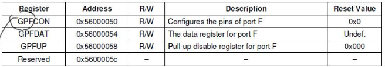
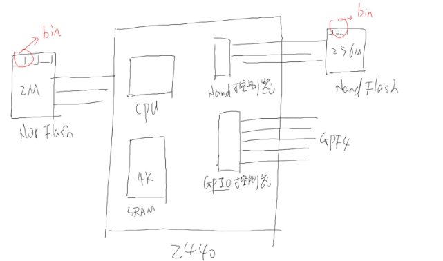

# 1.点亮LED

1.怎么做？

* 首先，看原理图确定控制LED的引脚
* 然后，看主芯片手册确定如何`设置/控制`引脚
* 最后，写程序

原理图中，n表示低电平有效

2.怎么将GPF4输出低电平

* 首先，配置为输出引脚
* 然后，设置状态



* GPF4配置为输出：设置`GPFCON[9:8] = 0b01`
* 设置状态：设置`GPFDAT[4]`
	* `GPFDAT[4] = 1`:输出为高电平
	* `GPFDAT[5] = 0`:输出为低电平

## 1.1.S3C2440框架与启动过程
S3C2440是SoC(System on chip)



其中elf生成是带系统结构体的，bin文件用于裸板程序，顺序执行。

启动过程：**大多数ARM芯片从0地址启动**

* NOR启动：NOR FLASH基地址为0，片内RAM地址为`0x40000000`
	* CPU读出NOR上第1个指令(前4字节)，执行CPU延续读出其它指令执行
* Nand启动：片内4K RAM基地址为0，NOR Flash不可访问
	* 2440硬件把Nand前4k内容复制到片内RAM，然后CPU从0地址去除第1条指令执行

## 1.2 ARM 几条命令

```
R0 R1 R2 R3 R4 R5 R6 R7 R8 R9 R10 R11
a1 a2 a3 a4 v1 v2 v3 v4 v5 v6 s1  fp
--------------------------------------
R12 R13 R14 R15
ip  sp  lr  pc
```

其中sp(stack pointer栈),lr(link register返回地址)，pc(programe counter=当前指令地址+8)

**几个指令**

* LDR：读内存，`LDR R0,[R1]`;假设R1的值为x，读取地址x上的**数据**(4个字节)保存到R0中
* STR：写内存命令,`STR R0, [R1]`:假设值为x，把R0的值写到地址x(4字节)
* B:跳转
* MOV:`MOV R0, R1`，把R1的值赋给R0，R0=R1；`MOV R0, #0x100`,R0=0x100
* LDR:`LDR R0,=任意值`
* `add r0, r1, #4`:r0 = r1 +4;`sub r0, r1, #4`:r0 = r1 - 4;`sub r0, r1, r2`:r0 = r1 - r2;
* BL:branch and link,`bl xxx`
	* 跳到xxx
	* 把返回地址(下一条指令)保存在lr寄存器
* ldm,读多个寄存器，stm写多个寄存器。
	* ldmia:先存后加
	* stmdb:先减后存

1.`stmdb sp!, {fp, ip, lr, pc}`，假设sp=4096

* 先减后存
* `sp!`,其中`!`表示最终修改sp的值
* 高编号寄存器，存在高地址`{}`内顺序不影响。fp(r11),ip(r12),lr(r14),pc(r15)

```

4096 ________
4095|		 |
4094|	PC	 |
4093|		 |
4092|________|
	|
	|
	|
	|
	|
	|
内存  
```

假设`sp = 4096`

* 1.先减，sp' = sp - 4 = 4096 - 4 = 4092
* 2.后存， `4092~4095`存放PC(高地址，高编号)的值
* 3.先减：sp' = sp - 4 = 4092 - 4 = 4088
* 4.后存：`4088 ~ 4091`存放lr的值
* 可得：`4084~4087`存放ip，`4080 ~ 4084`存放fp,且最终`sp=4080`


`MOV`和`ldr区别`:mov表示简单值(立即数），ldr表示任意值
流水线：

* 当前执行地址A的指令
* 已经对地址A+4的地址进行译码
* 已经在读取地址地A+8(**pc的值**)的指令

2.`ldmia sp,{fp,sp,pc}`

* 先读后加
* `sp`没有!号，sp修改后的地址值，不存入sp中

假设`sp=4080`

* 1.先读：fp=`4080~4083`的值等于原来的fp
* 2.后增,sp' = sp + 4 = 4084
* 3.先读：`4084~4087`的值等于原来保存的ip
* 4.后增，sp'=sp+4=4088
* 5.先读：`4088~4091`的值保存的lr值
* 6.后增:sp' = sp + 4 = 4092
```
led_on.elf:     file format elf32-littlearm


Disassembly of section .text:

00000000 <_start>:
   0:	e59f1014	ldr	r1, [pc, #20]	; 1c <halt+0x4>
   4:	e3a00c01 	mov	r0, #256	    ; 0x100
   8:	e5810000 	str	r0, [r1]
   c:	e59f100c 	ldr	r1, [pc, #12]	; 20 <halt+0x8>
  10:	e3a00000 	mov	r0, #0
  14:	e5810000 	str	r0, [r1]

00000018 <halt>:
  18:	eafffffe 	b	18 <halt>
  1c:	56000050 			; <UNDEFINED> instruction: 0x56000050
  20:	56000054 			; <UNDEFINED> instruction: 0x56000054

Disassembly of section .ARM.attributes:

00000000 <.ARM.attributes>:
   0:	00001e41 	andeq	r1, r0, r1, asr #28
   4:	61656100 	cmnvs	r5, r0, lsl #2
   8:	01006962 	tsteq	r0, r2, ror #18
   c:	00000014 	andeq	r0, r0, r4, lsl r0
  10:	412d3705 	teqmi	sp, r5, lsl #14
  14:	070a0600 	streq	r0, [sl, -r0, lsl #12]
  18:	09010841 	stmdbeq	r1, {r0, r6, fp}
  1c:	Address 0x000000000000001c is out of bounds.
```

* 其中start第一行： `0:	e59f1014	ldr	r1, [pc, #20]	; 1c <halt+0x4>`
	* 0表示相对地址
	* `e59f1014`：机器码，操作符号和操作数
	* `;`作为注解，帮计算值等,`pc= 0 + 8 = 8`,`8 + 20 = 28 = 0x1c`,将1c地址的内容(0x56000050)存放到r1中
* `.text`:段，顺序执行.


# 2.ARM程序调用规则