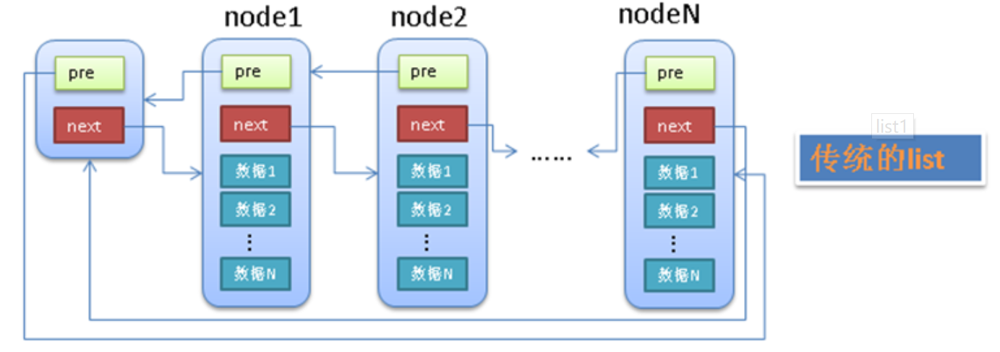
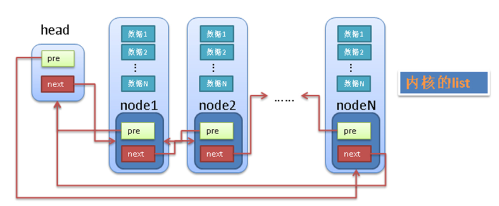
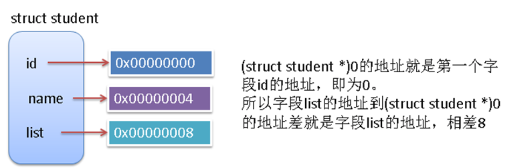
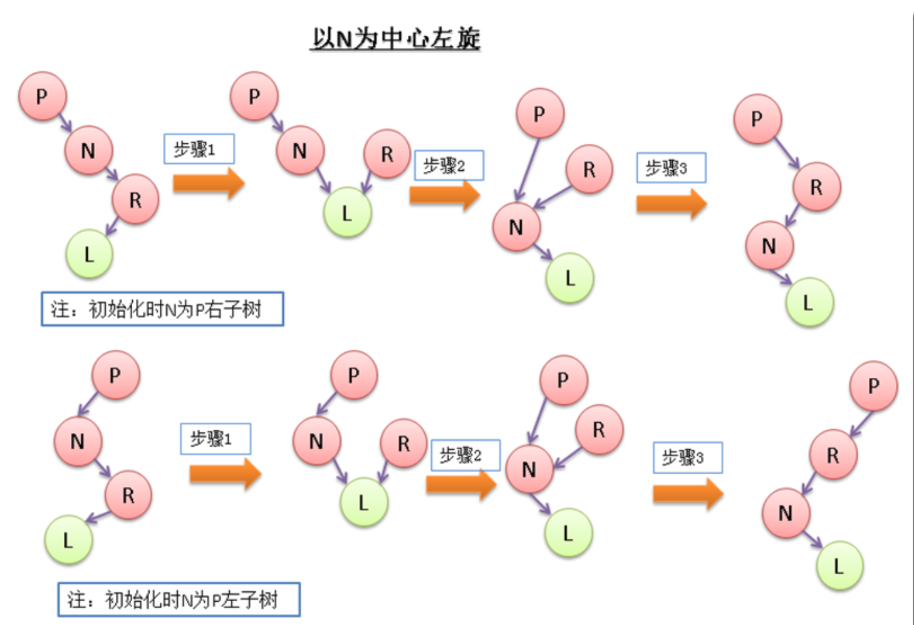

内核数据结构贯穿于整个内核代码中，这里介绍4个基本的内核数据结构。利用这4个基本的数据结构，可以在编写内核代码时节约大量时间。

主要内容：

* 链表
* 队列
* 映射
* 红黑树

# 1.链表
链表是linux内核中最简单，同时也是应用最广泛的数据结构。内核中定义的是双向链表。

## 1.1 头文件简介
内核中关于链表定义的代码位于： `include/linux/list.h`list.h文件中对每个函数都有注释，这里就不详细说了。

其实刚开始只要先了解一个常用的链表操作（追加，删除，遍历）的实现方法，其他方法基本都是基于这些常用操作的。
## 1.2 链表代码的注意点

在阅读list.h文件之前，有一点必须注意：linux内核中的链表使用方法和一般数据结构中定义的链表是有所不同的。一般的双向链表一般是如下的结构:

* 有个单独的头结点(head)
* 每个节点(node)除了包含必要的数据之外，还有2个指针(pre,next)
* pre指针指向前一个节点(node)，next指针指向后一个节点(node)
* 头结点(head)的pre指针指向链表的最后一个节点
* 最后一个节点的next指针指向头结点(head)


统的链表有个最大的缺点就是不好共通化，因为每个node中的data1，data2等等都是不确定的(无论是个数还是类型)。linux中的链表巧妙的解决了这个问题，linux的链表不是将用户数据保存在链表节点中，而是将链表节点保存在用户数据中。linux的链表节点只有2个指针(pre和next)，这样的话，链表的节点将独立于用户数据之外，便于实现链表的共同操作。


linux链表中的最大问题是怎样通过链表的节点来取得用户数据？

和传统的链表不同，linux的链表节点(node)中没有包含用户的用户data1，data2等。

整个list.h文件中，我觉得最复杂的代码就是获取用户数据的宏定义

```c
#define list_entry(ptr, type, member) \
    container_of(ptr, type, member)
```
这个宏没什么特别的，主要是container_of这个宏

```c
#define container_of(ptr, type, member) ({          \
    const typeof(((type *)0)->member)*__mptr = (ptr);    \
             (type *)((char *)__mptr - offsetof(type, member)); })
```
这里面的type一般是个结构体，也就是包含**用户数据**和**链表节点的结构体**。

ptr是指向type中**链表节点的指针**.member则是type中定义**链表节点是用的名字**

```c
struct student
{
	int id;
	char *name;
	struct list_head list;
};
```

* type是struct student
* ptr是指向struct list_head,也就指向member类型的指针
* member就是list

分析container_of宏：

```c
// 步骤1：将数字0强制转型为type*，然后取得其中的member元素
((type *)0)->member  // 相当于((struct student *)0)->list

// 步骤2：定义一个临时变量__mptr，并将其也指向ptr所指向的链表节点
const typeof(((type *)0)->member)*__mptr = (ptr);

// 步骤3：计算member字段距离type中第一个字段的距离，也就是type地址和member地址之间的差
// offset(type, member)也是一个宏，定义如下：
#define offsetof(TYPE, MEMBER) ((size_t) &((TYPE *)0)->MEMBER)

// 步骤4：将__mptr的地址 - type地址和member地址之间的差
// 其实也就是获取type的地址
```
步骤1，2，4比较容易理解，下面的图以sturct student为例进行说明步骤3：

首先需要知道`((TYPE *)0)`表示将地址0转换为TYPE类型的地址

由于TYPE的地址是0，所以`((TYPE *)0)->MEMBER`也就是MEMBER的地址和TYPE地址的差，如下图所示：



## 1.3 使用示例

```c
#include<linux/init.h>
#include<linux/slab.h>
#include<linux/module.h>
#include<linux/kernel.h>
#include<linux/list.h>
MODULE_LICENSE("Dual BSD/GPL");
void print_student(struct student*);
struct student 
{
	int id;
	char *name;
	struct list_head list;
};
static int testlist_init(void)
{
	struct student *stu1,*stu2,*stu3,*stu4;
	struct student *stu;

	//init a list head
	LIST_HEAD(stu_head);
	
	// init four list nodes
    stu1 = kmalloc(sizeof(*stu1), GFP_KERNEL);
    stu1->id = 1;
    stu1->name = "wyb";
    INIT_LIST_HEAD(&stu1->list);

    stu2 = kmalloc(sizeof(*stu2), GFP_KERNEL);
    stu2->id = 2;
    stu2->name = "wyb2";
    INIT_LIST_HEAD(&stu2->list);

    stu3 = kmalloc(sizeof(*stu3), GFP_KERNEL);
    stu3->id = 3;
    stu3->name = "wyb3";
    INIT_LIST_HEAD(&stu3->list);

    stu4 = kmalloc(sizeof(*stu4), GFP_KERNEL);
    stu4->id = 4;
    stu4->name = "wyb4";
    INIT_LIST_HEAD(&stu4->list);

    // add the four nodes to head
    list_add (&stu1->list, &stu_head);
    list_add (&stu2->list, &stu_head);
    list_add (&stu3->list, &stu_head);
    list_add (&stu4->list, &stu_head);

    // print each student from 4 to 1
    list_for_each_entry(stu, &stu_head, list)
    {
        print_student(stu);
    }
    // print each student from 1 to 4
    list_for_each_entry_reverse(stu, &stu_head, list)
    {
        print_student(stu);
    }

    // delete a entry stu2
    list_del(&stu2->list);
    list_for_each_entry(stu, &stu_head, list)
    {
        print_student(stu);
    }

    // replace stu3 with stu2
    list_replace(&stu3->list, &stu2->list);
    list_for_each_entry(stu, &stu_head, list)
    {
        print_student(stu);
    }

    return 0;
}
static void testlist_exit(void)
{
    printk(KERN_ALERT "*************************\n");
    printk(KERN_ALERT "testlist is exited!\n");
    printk(KERN_ALERT "*************************\n");
}
void print_student(struct student *stu)
{
    printk (KERN_ALERT "======================\n");
    printk (KERN_ALERT "id  =%d\n", stu->id);
    printk (KERN_ALERT "name=%s\n", stu->name);
    printk (KERN_ALERT "======================\n");
}
module_init(testlist_init);
module_exit(testlist_exit);
```

Makefile

```makefile
obj-m += testlist.o

#generate the path
CURRENT_PATH:=$(shell pwd)
#the current kernel version number
LINUX_KERNEL:=$(shell uname -r)
#the absolute path
LINUX_KERNEL_PATH:=/usr/src/kernels/$(LINUX_KERNEL)
#complie object
all:
    make -C $(LINUX_KERNEL_PATH) M=$(CURRENT_PATH) modules
    rm -rf modules.order Module.symvers .*.cmd *.o *.mod.c .tmp_versions *.unsigned
#clean
clean:
    rm -rf modules.order Module.symvers .*.cmd *.o *.mod.c *.ko .tmp_versions *.unsigned
```
安装,卸载内核模块以及查看内核模块的运行结果：

```
insmod testlist.ko
rmmod testlist
dmesg | tail -100
```

# 2.队列
内核中的队列是以**字节形式保存数据的**，所以获取数据的时候，需要知道数据的大小。如果从队列中取得数据时指定的大小不对的话，取得数据会不完整或过大。

## 2.1 头文件简介
内核中关于队列定义的头文件位于：`<linux/kfifo.h>` include/linux/kfifo.h

头文件中定义的函数的实现位于：`kernel/kfifo.c`

## 2.2  队列代码的注意点
内核队列编程需要注意的是：

* 队列的size在初始化时，始终设定为2的n次方
* 使用队列之前将队列结构体中的锁(spinlock)释放

## 2.3 使用示例

```c
#include<linux/init.h>
#include<linux/slab.h>
#include<linux/module.h>
#include<linux/kernel.h>
#include<linux/kfifo.h>
#include<linux/time.h>

void print_current_time(int);
MODULE_LICENSE("Dual BSD/GPL");
struct student
{
    int id;
    char* name;
};

static void print_student(struct student*);


static int testkfifo_init(void)
{
    struct kfifo *fifo;
    struct student *stu1, *stu2, *stu3, *stu4;
    struct student *stu_tmp;
    char* c_tmp;
    int i;
    // !!importent  init a unlocked lock
    spinlock_t sl = SPIN_LOCK_UNLOCKED;

    // init kfifo
    fifo = kfifo_alloc(4*sizeof(struct student), GFP_KERNEL, &sl);
    
    stu1 = kmalloc(sizeof(struct student), GFP_KERNEL);
    stu1->id = 1;
    stu1->name = "wyb1";
    kfifo_put(fifo, (char *)stu1, sizeof(struct student));

    stu2 = kmalloc(sizeof(struct student), GFP_KERNEL);
    stu2->id = 1;
    stu2->name = "wyb2";
    kfifo_put(fifo, (char *)stu2, sizeof(struct student));

    stu3 = kmalloc(sizeof(struct student), GFP_KERNEL);
    stu3->id = 1;
    stu3->name = "wyb3";
    kfifo_put(fifo, (char *)stu3, sizeof(struct student));

    stu4 = kmalloc(sizeof(struct student), GFP_KERNEL);
    stu4->id = 1;
    stu4->name = "wyb4";
    kfifo_put(fifo, (char *)stu4, sizeof(struct student));

    c_tmp = kmalloc(sizeof(struct student), GFP_KERNEL);
    printk(KERN_ALERT "current fifo length is : %d\n", kfifo_len(fifo));
    for (i=0; i < 4; i++) {

        kfifo_get(fifo, c_tmp, sizeof(struct student));
        stu_tmp = (struct student *)c_tmp;
        print_student(stu_tmp);
        printk(KERN_ALERT "current fifo length is : %d\n", kfifo_len(fifo));
    }
    
    printk(KERN_ALERT "current fifo length is : %d\n", kfifo_len(fifo));
    kfifo_free(fifo);
    kfree(c_tmp);
    return 0;
}

static void print_student(struct student *stu)
{
    printk(KERN_ALERT "=========================\n");
    print_current_time(1);
    printk(KERN_ALERT "id = %d\n", stu->id);
    printk(KERN_ALERT "name = %s\n", stu->name);
    printk(KERN_ALERT "=========================\n");
}

static void testkfifo_exit(void)
{
    printk(KERN_ALERT "*************************\n");
    printk(KERN_ALERT "testkfifo is exited!\n");
    printk(KERN_ALERT "*************************\n");
}

module_init(testkfifo_init);
module_exit(testkfifo_exit);
```
kn_common.c

```c
void print_current_time(int is_new_line)
{
    struct timeval *tv;
    struct tm *t;
    tv = kmalloc(sizeof(struct timeval), GFP_KERNEL);
    t = kmalloc(sizeof(struct tm), GFP_KERNEL);

    do_gettimeofday(tv);
    time_to_tm(tv->tv_sec, 0, t);

    printk(KERN_ALERT "%ld-%d-%d %d:%d:%d",
           t->tm_year + 1900,
           t->tm_mon + 1,
           t->tm_mday,
           (t->tm_hour + 8) % 24,
           t->tm_min,
           t->tm_sec);

    if (is_new_line == 1)
        printk(KERN_ALERT "\n");
    
    kfree(tv);
    kfree(t);
}

```
Makefile

```makefile
obj-m += fifo.o
fifo-objs := testkfifo.o kn_common.o

#generate the path
CURRENT_PATH:=$(shell pwd)
#the current kernel version number
LINUX_KERNEL:=$(shell uname -r)
#the absolute path
LINUX_KERNEL_PATH:=/usr/src/kernels/$(LINUX_KERNEL)
#complie object
all:
    make -C $(LINUX_KERNEL_PATH) M=$(CURRENT_PATH) modules
    rm -rf modules.order Module.symvers .*.cmd *.o *.mod.c .tmp_versions *.unsigned
#clean
clean:
    rm -rf modules.order Module.symvers .*.cmd *.o *.mod.c *.ko .tmp_versions *.unsigned
```
安装,卸载内核模块以及查看内核模块的运行结果：

```
insmod fifo.ko
rmmod fifo
dmesg | tail -40
```

# 3.映射
映射的有点想其他语言(C#或者python)中的字典类型，每个唯一的id对应一个自定义的数据结构。
## 3.1 头文件简介

内核中关于映射定义的头文件位于：`<linux/idr.h> include/linux/idr.h`

头文件中定义的函数的实现位于：`lib/idr.c`,[idr映射](http://blog.csdn.net/paomadi/article/details/8539794)

## 3.2映射代码的注意点

映射的使用需要注意的是，给自定义的数据结构申请一个id的时候，不能直接申请id，先要分配id(函数idr_pre_get)，分配成功后，在获取一个id(函数idr_get_new)。

## 3.3 使用实例
构造了一个内核模块来实际使用一下内核中的映射

```c
#include<linux/idr.h>
#include "kn_common.h"

MODULE_LICENSE("Dual BSD/GPL");
struct student
{
    int id;
    char* name;
};

static int print_student(int, void*, void*);

static int testidr_init(void)
{
    DEFINE_IDR(idp);
    struct student *stu[4];
    //    struct student *stu_tmp;
    int id, ret, i;

    // init 4 struct student
    for (i=0; i<4; i++) {

        stu[i] = kmalloc(sizeof(struct student), GFP_KERNEL);
        stu[i]->id = i;
        stu[i]->name = "wyb";
    }

    // add 4 student to idr
    print_current_time(0);
    for (i=0; i < 4; i++) {

        do {
            if (!idr_pre_get(&idp, GFP_KERNEL))
                return -ENOSPC;
            ret = idr_get_new(&idp, stu[i], &id);
            printk(KERN_ALERT "id=%d\n", id);
        } while(ret == -EAGAIN);
    }

    // display all student in idr
    idr_for_each(&idp, print_student, NULL);

    idr_destroy(&idp);
    kfree(stu[0]);
    kfree(stu[1]);
    kfree(stu[2]);
    kfree(stu[3]);
    return 0;
}

static int print_student(int id, void *p, void *data)
{
    struct student* stu = p;
       
    printk(KERN_ALERT "=========================\n");
    print_current_time(0);
    printk(KERN_ALERT "id = %d\n", stu->id);
    printk(KERN_ALERT "name = %s\n", stu->name);
    printk(KERN_ALERT "=========================\n");

    return 0;
}

static void testidr_exit(void)
{
    printk(KERN_ALERT "*************************\n");
    print_current_time(0);
    printk(KERN_ALERT "testidr is exited!\n");
    printk(KERN_ALERT "*************************\n");
}

module_init(testidr_init);
module_exit(testidr_exit);
```
其中用到的kn_common.h和kn_common.c文件与队列的示例中一样。
Makefile:

```makefile
obj-m += idr.o
idr-objs := testidr.o kn_common.o

#generate the path
CURRENT_PATH:=$(shell pwd)
#the current kernel version number
LINUX_KERNEL:=$(shell uname -r)
#the absolute path
LINUX_KERNEL_PATH:=/usr/src/kernels/$(LINUX_KERNEL)
#complie object
all:
    make -C $(LINUX_KERNEL_PATH) M=$(CURRENT_PATH) modules
    rm -rf modules.order Module.symvers .*.cmd *.o *.mod.c .tmp_versions *.unsigned
#clean
clean:
    rm -rf modules.order Module.symvers .*.cmd *.o *.mod.c *.ko .tmp_versions *.unsigned
```
安装，卸载内核模块：

```
insmod idr.ko
rmmod idr
dmesg | tail -30
```

# 4.红黑树
红黑树由于节点颜色的特性，保证其是一种自平衡的二叉搜索树。红黑树的一系列规则虽然实现起来比较复杂，但是遵循起来却比较简单，而且红黑树的插入，删除性能也还不错。所以红黑树在内核中的应用非常广泛，掌握好红黑树，即有利于阅读内核源码，也可以在自己的代码中借鉴这种数据结构。

红黑树必须满足的规则：

* 所有节点都有颜色，要么红色，要么黑色
* 根节点是黑色，所有叶子节点也是黑色
* 叶子节点中不包含数据
* 非叶子节点都有2个子节点
* 如果一个节点是红色，那么它的父节点和子节点都是黑色的
* 从任何一个节点开始，到其下叶子节点的路径中都包含相同数目的黑节点

红黑树中最长的路径就是红黑交替的路径，最短的路径是全黑节点的路径，再加上根节点和叶子节点都是黑色，从而可以保证红黑树中最长路径的长度不会超过最短路径的2倍。

## 4.1 头文件简介
内核中关于红黑树定义的头文件位于：`<linux/rbtree.h>` `include/linux/rbtree.h `
头文件中定义的函数的实现位于：`lib/rbtree.c`

## 4.2 红黑树代码的注意点
内核中红黑树的使用和链表(list)有些类似，是将红黑树的节点放入自定义的数据结构中来使用的。

首先需要注意的一点是红黑树节点的定义：

```c
struct rb_node
{
	unsigned long rb_parent_color;
#define RB_RED 0
#define RB_BLACK 1
	struct rb_node *rb_right;
	struct rb_node *rb_left;
}__attribute__((aligned)(sizeof(long));
```
刚开始看到这个定义的时候，我觉得很奇怪，等到看懂了之后，才知道原来作者巧妙的利用内存对齐来将2个内容存入到一个字段中（不服不行啊^_^!）。

字段 rb_parent_color 中保存了2个信息：

1. 父节点的地址
2. 本节点的颜色

这2个信息是如何存入一个字段的呢？主要在于`__attribute__((aligned(sizeof(long))));`这行代码的意思就是`struct rb_node`在内存中的地址需要按照4 bytes或者8 bytes对齐。

**注**：`sizeof(long)`在32bit系统中是4 bytes，在64bit系统中是8 bytes

struct rb_node的地址按4 bytes对齐，意味着分配的地址都是4的倍数。4 的二进制为 100 ，所以申请分配的 struct rb_node 的地址的最后2位始终是零，struct rb_node 的字段 rb_parent_color 就是利用最后一位来保存节点的颜色信息的。
明白了这点之后，rb_tree.h 中很多宏的定义也就很好懂了。

```c
/*rb_parent_color 保存了父节点的地址和本节点颜色*/

/*将rb_parent_color的最后2位置成0，即将颜色去掉，剩下的就是parent节点地址*/
#define rb_parent(r) ((struct rb_node *)((r)->rb_parent_color & ~3))

/*取得 rb_parent_color 二进制表示最后一位，用于保存颜色信息的那一位*/
#define rb_color(r) ((r)->rb_parent_color & 1)

/*将rb_parent_color二进制表示最后一位为0，即颜色红色*/
#define rb_set_red(r) do{(r)->rb_parent_color &= ~1}while(0);

/*将rb_parent_color 二进制表示最后一位为1，即为黑色*/
#define rb_set_black(r) do{(r)->rb_parent_color |= 1}while(0)
```
还有需要重点看的就是rb_tree.c中的5个函数，下面对这5个函数进行一些注释：

**函数1**：左旋操作，当右子树的长度过大导致树不平衡时，进行左旋操作

```c
/*
 *  左旋操作其实就3个动作：见图left
 *  1. node的右子树关联到right的左子树
 *  2. right的左子树关联到node
 *  3. right取代node的位置
 *  其他带代码都是一些相应的parent指针的变化
 */
static void __rb_rotate_left(struct rb_node *node, struct rb_root *root)
{
	/*初始化相对于node节点的父节点(图中P）和右节点(图中R)*/
	struct rb_node *right=node->rb_right;
	struct rb_node *parent=rb_parent(node);

	/*步骤1*/
	if(node->rb_right == right->rb_left)
		rb_set_parent(right->rb_left, node);

	/*步骤2*/
	right->rb_left = node;
	rb_set_parent(right,parent);

	/*node 的parent NOT NULL时，right 取代原先的Node位置*/
	if(parent) {
		if(node == parent->rb_left)
			parent->rb_left = right;
		else 
			parent->rb_right = right;
	/* node的parent NULL 时，说明node原先时root节点，将新的root指向root即可 */
	} else {
		 root->rb_node = right;
	}
	rb_set_parent(node, right);
}
```



**函数2**：右旋操作，和左旋操作类似。

**函数3**：追加节点后，设置此节点的颜色。

```c
/*
 *  本函数没有插入节点的功能，只是在插入新节点后，设置新节点的颜色，从而保证红黑树的平衡性。
 *  新插入的节点默认都是红色的。
 *  
 *  下面的代码看着复杂，其实只要时时记住红黑树的几个重要特性，就会发现下面的都是在尽量保持住红黑树的这些特性。
 *  1. 无论从哪个节点开始，到其叶子节点的路径中包含的黑色节点个数时一样的
 *  2. 不能有连续的2个红色节点，即父节点和子节点不能同时为红色
 *  所以最简单的情况就是：插入节点的父节点是黑色的。那么插入一个红节点后不会有任何影响。
 *  3. 左旋操作有减少右子树高度的作用
 *  4. 同理，右旋操作有减少左子树高度的作用
 */
void rb_insert_color(struct rb_node *node, struct rb_root *root)
{
    struct rb_node *parent, *gparent;

    while ((parent = rb_parent(node)) && rb_is_red(parent))
    {
        gparent = rb_parent(parent);

        /* parent 是 gparent的左子树时 */
        if (parent == gparent->rb_left)
        {
            {
                /* gparent的左右子树的黑色节点都增加一个，仍然平衡 */
                register struct rb_node *uncle = gparent->rb_right;
                if (uncle && rb_is_red(uncle))
                {
                    rb_set_black(uncle);
                    rb_set_black(parent);
                    rb_set_red(gparent);
                    node = gparent;
                    continue;
                }
            }

            /* node为parent右子树时 */
            if (parent->rb_right == node)
            {
                register struct rb_node *tmp;
                /* 左旋后，parent的位置被node取代，然后再交换parent和node的位置，
                 * 相当于node是parent的左子树
                 * 由于node和parent都是红色（否则到不了这一步），parent左右子树的黑色节点数仍然是相等的
                 */
                __rb_rotate_left(parent, root);
                tmp = parent;
                parent = node;
                node = tmp;
            }

            /* parent 红->黑，gparent左子树比右子树多一个黑色节点
             * 右旋后，gparent左子树高度减一，减少的节点即parent，减少了一个黑色节点，parent变为新的gparent。
             * 所以右旋后，新的gparent的左右子树的黑色节点数再次平衡了
             */
            rb_set_black(parent);
            rb_set_red(gparent);
            __rb_rotate_right(gparent, root);
        /* parent 是 gparent的右子树时，和上面的过程类似 */
        } else {
            {
                register struct rb_node *uncle = gparent->rb_left;
                if (uncle && rb_is_red(uncle))
                {
                    rb_set_black(uncle);
                    rb_set_black(parent);
                    rb_set_red(gparent);
                    node = gparent;
                    continue;
                }
            }

            if (parent->rb_left == node)
            {
                register struct rb_node *tmp;
                __rb_rotate_right(parent, root);
                tmp = parent;
                parent = node;
                node = tmp;
            }

            rb_set_black(parent);
            rb_set_red(gparent);
            __rb_rotate_left(gparent, root);
        }
    }

    rb_set_black(root->rb_node);
}
```
**函数4**：删除一个节点，并且调整删除后各节点的颜色。其中调整节点颜色其实是另一个单独的函数。

```c
/* 删除节点时，如果被删除的节点左子树==NULL或右子树==NULL或左右子树都==NULL
 * 那么只要把被删除节点的左子树或右子树直接关联到被删节点的父节点上即可，剩下的就是调整各节点颜色。
 * 只有被删节点是黑色才需要调整颜色，因为删除红色节点不影响红黑树的特性。
 *
 * 被删节点左右子树都存在的情况下，其实就是用中序遍历中被删节点的下一个节点来替代被删节点。
 * 代码中的操作只是将各个指针指向新的位置而已。
 */
void rb_erase(struct rb_node *node, struct rb_root *root)
{
    struct rb_node *child, *parent;
    int color;

    if (!node->rb_left)
        child = node->rb_right;
    else if (!node->rb_right)
        child = node->rb_left;
    else
    {
        struct rb_node *old = node, *left;

        /* 寻找中序遍历中被删节点的下一个节点 */
        node = node->rb_right;
        while ((left = node->rb_left) != NULL)
            node = left;

        /* 替换要删除的节点old */
        if (rb_parent(old)) {
            if (rb_parent(old)->rb_left == old)
                rb_parent(old)->rb_left = node;
            else
                rb_parent(old)->rb_right = node;
        } else
            root->rb_node = node;

        child = node->rb_right;
        parent = rb_parent(node);
        color = rb_color(node);

        if (parent == old) {
            parent = node;
        } else {
            if (child)
                rb_set_parent(child, parent);
            parent->rb_left = child;

            node->rb_right = old->rb_right;
            rb_set_parent(old->rb_right, node);
        }

        node->rb_parent_color = old->rb_parent_color;
        node->rb_left = old->rb_left;
        rb_set_parent(old->rb_left, node);

        goto color;
    }

    parent = rb_parent(node);
    color = rb_color(node);

    if (child)
        rb_set_parent(child, parent);
    if (parent)
    {
        if (parent->rb_left == node)
            parent->rb_left = child;
        else
            parent->rb_right = child;
    }
    else
        root->rb_node = child;

 color:
    if (color == RB_BLACK)
        __rb_erase_color(child, parent, root);
}
```
**函数5**：删除一个黑色节点后，重新调整相关节点的颜色。

```c
/* 这里的node就是上面函数中的child，所有node节点的左右子树肯定都是NULL
 * 不满足红黑树规则的就是从parent节点开始的子树，只要给从parent开始的子树增加一个黑色节点就行
 * 如果从parent节点开始的节点全是黑色，node和parent都继续向上移动
 */
static void __rb_erase_color(struct rb_node *node, struct rb_node *parent,
                 struct rb_root *root)
{
    struct rb_node *other;

    /* （node不为NULL 且 node是黑色的） 或者 node == NULL */
    while ((!node || rb_is_black(node)) && node != root->rb_node)
    {
        if (parent->rb_left == node)
        {
            other = parent->rb_right;
            if (rb_is_red(other))
            {
                rb_set_black(other);
                rb_set_red(parent);
                __rb_rotate_left(parent, root);
                other = parent->rb_right;
            }
            /* 如果从parent节点开始的节点全是黑色，node和parent都继续向上移动 */
            if ((!other->rb_left || rb_is_black(other->rb_left)) &&
                (!other->rb_right || rb_is_black(other->rb_right)))
            {
                rb_set_red(other);
                node = parent;
                parent = rb_parent(node);
            }
            else
            {
                if (!other->rb_right || rb_is_black(other->rb_right))
                {
                    rb_set_black(other->rb_left);
                    rb_set_red(other);
                    __rb_rotate_right(other, root);
                    other = parent->rb_right;
                }
                rb_set_color(other, rb_color(parent));
                rb_set_black(parent);
                rb_set_black(other->rb_right);
                __rb_rotate_left(parent, root);
                node = root->rb_node;
                break;
            }
        }
        else
        {
            other = parent->rb_left;
            if (rb_is_red(other))
            {
                rb_set_black(other);
                rb_set_red(parent);
                __rb_rotate_right(parent, root);
                other = parent->rb_left;
            }
            if ((!other->rb_left || rb_is_black(other->rb_left)) &&
                (!other->rb_right || rb_is_black(other->rb_right)))
            {
                rb_set_red(other);
                node = parent;
                parent = rb_parent(node);
            }
            else
            {
                if (!other->rb_left || rb_is_black(other->rb_left))
                {
                    rb_set_black(other->rb_right);
                    rb_set_red(other);
                    __rb_rotate_left(other, root);
                    other = parent->rb_left;
                }
                rb_set_color(other, rb_color(parent));
                rb_set_black(parent);
                rb_set_black(other->rb_left);
                __rb_rotate_right(parent, root);
                node = root->rb_node;
                break;
            }
        }
    }
    if (node)
        rb_set_black(node);
}
```

## 4.3 使用实例
构造了一个内核模块来实际使用一下内核中的红黑树

```c
#include<linux/rbtree.h>
#include <linux/string.h>
#include "kn_common.h"

MODULE_LICENSE("Dual BSD/GPL");
struct student
{
    int id;
    char* name;
    struct rb_node node;
};

static int insert_student(struct student*, struct rb_root*);
static int remove_student(struct student*, struct rb_root*);
static int display_student(struct rb_root*, int);
static void display_student_from_small(struct rb_node*);
static void display_student_from_big(struct rb_node*);
static void print_student(struct student*);

static int testrbtree_init(void)
{
#define N 10
    struct rb_root root = RB_ROOT;
    struct student *stu[N];
    char tmp_name[5] = {'w', 'y', 'b', '0', '\0'};
    int i;

    // init N struct student
    for (i=0; i<N; i++)
    {
        stu[i] = kmalloc(sizeof(struct student), GFP_KERNEL);
        stu[i]->id = i;
        stu[i]->name = kmalloc(sizeof(char)*5, GFP_KERNEL);
        tmp_name[3] = (char)(i+48);
        strcpy(stu[i]->name, tmp_name);
        // stu_name[3] = (char)(i+48);
        stu[i]->node.rb_left = NULL;
        stu[i]->node.rb_right = NULL;
    }

    for (i=0; i < N; ++i)
    {
        printk(KERN_ALERT "id=%d   name=%s\n", stu[i]->id, stu[i]->name);
    }
    
    // add N student to rbtree
    print_current_time(0);
    for (i=0; i < N; i++)
        insert_student(stu[i], &root);

    // display all students
    printk(KERN_ALERT "print from small to big!\n");
    display_student(&root, -1);
    printk(KERN_ALERT "print from big to small!\n");
    display_student(&root, 1);

    // delete student 8
    remove_student(stu[7], &root);
    display_student(&root, -1);
    
    // free all student
    for (i=0; i<N; ++i)
    {
        kfree(stu[i]->name);
        kfree(stu[i]);
    }
                    
    return 0;
}

static int insert_student(struct student* stu, struct rb_root* root)
{
    struct rb_node* parent;
    struct rb_node* tmp_rb;
    struct student* tmp_stu;

    /* first time to insert node */
    if (!root->rb_node) 
    {
        root->rb_node = &(stu->node);
        rb_set_parent(&(stu->node), NULL);
        rb_set_black(&(stu->node));
        return 0;
    }

    /* find where to insert node */
    tmp_rb = root->rb_node;
    while(tmp_rb)
    {
        parent = tmp_rb;
        tmp_stu = rb_entry(tmp_rb, struct student, node);

        if (tmp_stu->id > stu->id) 
            tmp_rb = parent->rb_left;
        else if (tmp_stu->id < stu->id)
            tmp_rb = parent->rb_right;
        else
            break;
    }

    /* the student's id  is already in the rbtree */
    if (tmp_rb)
    {
        printk(KERN_ALERT "this student has been inserted!\n");
        return 1;
    }
    
    if (tmp_stu->id > stu->id)
        parent->rb_left = &(stu->node);
    else
        parent->rb_right = &(stu->node);

    rb_set_parent(&(stu->node), parent);
    rb_insert_color(&(stu->node), root);
    
    return 0;
}

static int remove_student(struct student* stu, struct rb_root* root)
{
    rb_erase(&(stu->node), root);
    
    return 0;
}

static int display_student(struct rb_root *root, int order)
{
    if (!root->rb_node)
        return 1;
    if (order < 0)
        display_student_from_small(root->rb_node);
    else
        display_student_from_big(root->rb_node);
    
    return 0;
}

static void display_student_from_small(struct rb_node* node)
{
    struct student *tmp_stu;
    
    if (node)
    {
        display_student_from_small(node->rb_left);
        tmp_stu = rb_entry(node, struct student, node);
        print_student(tmp_stu);
        display_student_from_small(node->rb_right);
    }
}

static void display_student_from_big(struct rb_node* node)
{
    struct student *tmp_stu;
    
    if (node)
    {
        display_student_from_big(node->rb_right);
        tmp_stu = rb_entry(node, struct student, node);
        print_student(tmp_stu);
        display_student_from_big(node->rb_left);
    }
}

static void print_student(struct student* stu)
{
    printk(KERN_ALERT "=========================\n");
    print_current_time(0);
    printk(KERN_ALERT "id=%d\tname=%s\n", stu->id, stu->name);
    printk(KERN_ALERT "=========================\n");
}

static void testrbtree_exit(void)
{
    printk(KERN_ALERT "*************************\n");
    print_current_time(0);
    printk(KERN_ALERT "testrbtree is exited!\n");
    printk(KERN_ALERT "*************************\n");
        
}

module_init(testrbtree_init);
module_exit(testrbtree_exit);
```
注：其中用到的kn_common.h和kn_common.c文件与队列的示例中一样。

Makefile:

```makefile
obj-m += rbtree.o
rbtree-objs := testrbtree.o kn_common.o

#generate the path
CURRENT_PATH:=$(shell pwd)
#the current kernel version number
LINUX_KERNEL:=$(shell uname -r)
#the absolute path
LINUX_KERNEL_PATH:=/usr/src/kernels/$(LINUX_KERNEL)
#complie object
all:
    make -C $(LINUX_KERNEL_PATH) M=$(CURRENT_PATH) modules
    rm -rf modules.order Module.symvers .*.cmd *.o *.mod.c .tmp_versions *.unsigned
#clean
clean:
    rm -rf modules.order Module.symvers .*.cmd *.o *.mod.c *.ko .tmp_versions *.unsigned
```
安装,卸载内核模块以及查看内核模块的运行结果：

```
insmod rbtree.ko
rmmod rbtree
dmesg | tail -135
```
