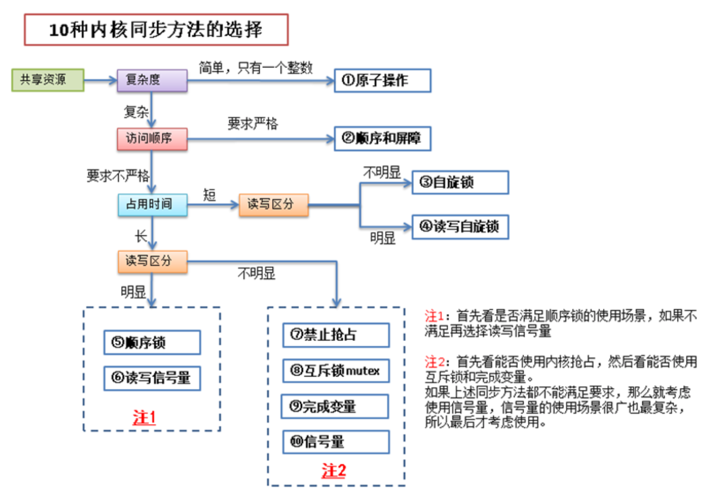

内核中提供了多种方法来防止竞争条件，理解了这些方法的使用场景有助于我们在编写内核代码时选用合适的同步方法，

从而即可保证代码中临界区的安全，同时也让性能的损失降到最低

主要内容：

* 原子操作
* 自旋锁
* 读写自旋锁
* 信号量
* 读写信号量
* 互斥体
* 完成变量
* 大内核锁
* 顺序锁
* 禁止抢占
* 顺序和屏障
* 总结

# 1.原子操作
原子操作是由**编译器**来保证的，保证一个线程对数据的操作不会被其他线程打断。
原子操作有2类：

* 1.原子整数操作，有32位和64位。头文件分别为`<asm/atomic.h>`和`<asm/atomic64.h>`
* 2.原子位操作。头文件`<asm/bitops.h>`

原子操作的api很简单，参见相应的头文件即可。

原子操作头文件与具体的体系结构有关，比如x86架构的相关头文件在`arch/x86/include/asm/*.h`

# 2.自旋锁
原子操作只能用于临界区只有一个变量的情况，实际应用中，临界区的情况要复杂的多。对于复杂的临界区，linux内核中也提供了多种同步方法，自旋锁就是其中一种。 

自旋锁的特点就是当一个线程获取了锁之后，其他试图获取这个锁的线程一直在循环等待获取这个锁，直至锁重新可用。

由于线程实在一直循环的获取这个锁，所以会造成CPU处理时间的浪费，因此最好将自旋锁用于能很快处理完的临界区。

自旋锁的实现与体系结构有关，所以相应的头文件`<asm/spinlock.h>`位于相关体系结构的代码中。自旋锁使用时有2点需要注意：

1. 自旋锁是不可递归的，递归的请求同一个自旋锁会自己锁死自己
2. 线程获取自旋锁之前，要**禁止当前处理器上的中断**。（防止获取锁的线程和中断形成竞争条件）比如：当前线程获取自旋锁后，在临界区中被中断处理程序打断，中断处理程序正好也要获取这个锁， 于是中断处理程序会等待当前线程释放锁，而当前线程也在等待中断执行完后再执行临界区和释放锁的代码。

中断处理下半部的操作中使用自旋锁尤其需要小心：

1. 下半部处理和进程上下文共享数据时，由于下半部的处理可以抢占进程上下文的代码,所以进程上下文在对共享数据加锁前要禁止下半部的执行，解锁时再允许下半部的执行。
2. 中断处理程序（上半部）和下半部处理共享数据时，由于中断处理（上半部）可以抢占下半部的执行,所以下半部在对共享数据加锁前要禁止中断处理（上半部），解锁时再允许中断的执行。
3. 同一种tasklet不能同时运行，所以同类tasklet中的共享数据不需要保护。
4. 不同类tasklet中共享数据时，其中一个tasklet获得锁后，不用禁止其他tasklet的执行，因为同一个处理器上不会有tasklet相互抢占的情况
5. 同类型或者非同类型的软中断在共享数据时，也不用禁止下半部，因为同一个处理器上不会有软中断互相抢占的情况

自旋锁方法列表如下：

* `spin_lock()`:获取指定的自旋锁
* `spin_lock_irq()`:禁止本地中断并获取指定的锁
* `spin_lock_irqsave()`:保存本地中断的当前状态，禁止本地中断，并获取指定的锁
* `spin_unlock()`:释放指定的锁
* `spin_unlock_irq()`:释放指定的锁，并激活本地中断
* `spin_unlock_irqstore()`:释放指定的锁，并让本地中断恢复到以前状态
* `spin_lock_init()`:动态初始化指定的spinlock_t
* `spin_trylock()`:试图获取指定的锁，如果未获取，则返回0
* `spin_is_locked()`:如果指定的锁当前正在被获取，则返回非0，否则返回0

# 3.读写自旋锁

1. 读写自旋锁除了和普通自旋锁一样有自旋特性以外，还有以下特点：读锁之间是共享的即一个线程持有了读锁之后，其他线程也可以以读的方式持有这个锁
2. 写锁之间是互斥的.即一个线程持有了写锁之后，其他线程不能以读或者写的方式持有这个锁
3. 读写锁之间是互斥的 . 即一个线程持有了读锁之后，其他线程不能以写的方式持有这个锁

**注**：读写锁要分别使用，不能混合使用，否则会造成死锁。
正常的使用方法：

```c
DEFINE_RWLOCK(mr_rwlock);

read_lock(&mr_rwlock);
/* 临界区(只读).... */
read_unlock(&mr_rwlock);

write_lock(&mr_lock);
/* 临界区(读写)... */
write_unlock(&mr_lock);
```
混合使用时：

```c
/* 获取一个读锁 */
read_lock(&mr_lock);
/* 在获取写锁的时候，由于读写锁之间是互斥的，
 * 所以写锁会一直自旋等待读锁的释放，
 * 而此时读锁也在等待写锁获取完成后继续下面的代码。
 * 因此造成了读写锁的互相等待，形成了死锁。
 */
write_lock(&mr_lock);
```
读写锁相关文件参照 各个体系结构中的 <asm/rwlock.h>

读写锁的相关函数如下：

* `read_lock()`:获取指定的读锁
* `read_lock_irq()`:禁止本地中断并获得指定读锁
* `read_lock_irqsave()`:存储本地中断的当前状态，禁止本地中断并获得指定读锁
* `read_unlock()`:释放指定的读锁
* `read_unlock_irq()`:释放指定的读锁并激活本地中断
* `read_unlock_irqrestore()`:释放指定的读锁并将本地中断恢复到指定前的状态
* `write_lock()`:获得指定的写锁
* `write_lock_irq()`:禁止本地中断并获得指定写锁
* `write_lock_irqsave()`:存储本地中断的当前状态，禁止本地中断并获得指定写锁
* `write_unlock()`:释放指定的写锁
* `write_unlock_irq()`:释放指定的写锁并激活本地中断
* `write_unlock_irqrestore()`:释放指定的写锁并将本地中断恢复到指定前的状态
* `write_trylock()`:试图获得指定的写锁；如果写锁不可用，返回非0值
* `rwlock_init()`:初始化指定的rwlock_t

# 4. 信号量
信号量也是一种锁，和自旋锁不同的是，线程获取不到信号量的时候，不会像自旋锁一样循环的去试图获取锁，

而是进入睡眠，直至有信号量释放出来时，才会唤醒睡眠的线程，进入临界区执行。

由于使用信号量时，线程会睡眠，所以等待的过程不会占用CPU时间。所以信号量适用于等待时间较长的临界区。

信号量消耗的CPU时间的地方在于使线程睡眠和唤醒线程，

如果`（使线程睡眠 + 唤醒线程）的CPU时间` > `线程自旋等待的CPU时间`，那么可以考虑使用自旋锁
信号量有二值信号量和计数信号量2种，其中二值信号量比较常用。

**二值信号量**:表示信号量只有2个值，即0和1。信号量为1时，表示临界区可用，信号量为0时，表示临界区不可访问。

二值信号量表面看和自旋锁很相似，区别在于争用自旋锁的线程会一直循环尝试获取自旋锁，而争用信号量的线程在信号量为0时，会进入睡眠，信号量可用时再被唤醒。

计数信号量有个计数值，比如计数值为5，表示同时可以有**5个线程访问临界区**。
信号量相关函数参照: <linux/semaphore.h> 实现方法参照：kernel/semaphore.c

使用信号量的方法如下：

```c
/* 定义并声明一个信号量，名字为mr_sem，用于信号量计数 */
static DECLARE_MUTEX(mr_sem);

/* 试图获取信号量....， 信号未获取成功时，进入睡眠
 * 此时，线程状态为 TASK_INTERRUPTIBLE
 */
down_interruptible(&mr_sem);
/* 这里也可以用：
 * down(&mr_sem);
 * 这个方法把线程状态置为 TASK_UNINTERRUPTIBLE 后睡眠
 */

/* 临界区 ... */

/* 释放给定的信号量 */
up(&mr_sem);
```
一般用的比较多的是`down_interruptible()`方法，因为以 TASK_UNINTERRUPTIBLE 方式睡眠无法被信号唤醒。

对于 TASK_INTERRUPTIBLE 和 TASK_UNINTERRUPTIBLE 补充说明一下：

* TASK_INTERRUPTIBLE - 可打断睡眠，可以接受信号并被唤醒，也可以在等待条件全部达成后被显式唤醒(比如`wake_up()`函数)。
* TASK_UNINTERRUPTIBLE - 不可打断睡眠，只能在等待条件全部达成后被显式唤醒(比如`wake_up()`函数)。

信号量方法如下：

* `sema_init(struct semaphore *, int)`:以指定的计数值初始化动态创建的信号量
* `init_MUTEX(struct semaphore *)`:以计数值1初始化动态创建的信号量
* `init_MUTEX_LOCKED(struct semaphore *)`:以计数值0初始化动态创建的信号量（初始为加锁状态）
* `down_interruptible(struct semaphore *)`:以试图获得指定的信号量，如果信号量已被争用，则进入可中断睡眠状态
* `down(struct semaphore *)`:以试图获得指定的信号量，如果信号量已被争用，则进入不可中断睡眠状态
* `down_trylock(struct semaphore *)`:以试图获得指定的信号量，如果信号量已被争用，则立即返回非0值
* `up(struct semaphore *)`:以释放指定的信号量，如果睡眠队列不空，则唤醒其中一个任务

信号量结构体具体如下：

```c
/* Please don't access any members of this structure directly */
struct semaphore {
    spinlock_t        lock;
    unsigned int        count;
    struct list_head    wait_list;
};
```
可以发现信号量结构体中有个自旋锁，这个自旋锁的作用是保证信号量的down和up等操作不会被中断处理程序打断。

# 5. 读写信号量
读写信号量和信号量之间的关系 与 读写自旋锁和普通自旋锁之间的关系 差不多。

读写信号量都是二值信号量，即计数值最大为1，增加读者时，计数器不变，增加写者，计数器才减一。

也就是说读写信号量保护的临界区，最多只有一个写者，但可以有多个读者。

 

读写信号量的相关内容参见：`<asm/rwsem.h>` 具体实现与硬件体系结构有关。

# 6. 互斥体
互斥体也是一种可以睡眠的锁，相当于二值信号量，只是提供的API更加简单，使用的场景也更严格一些，如下所示：

1. mutex的计数值只能为1，也就是最多只允许一个线程访问临界区
2. 在同一个上下文中上锁和解锁
3. 不能递归的上锁和解锁
4. 持有个mutex时，进程不能退出
5. mutex不能在中断或者下半部中使用，也就是mutex只能在进程上下文中使用
6. mutex只能通过官方API来管理，不能自己写代码操作它

在面对互斥体和信号量的选择时，只要满足互斥体的使用场景就尽量优先使用互斥体。在面对互斥体和自旋锁的选择时，参见下表：

* 低开销加锁：优先使用自旋锁
* 短期锁定：优先使用自旋锁
* 长期加锁：优先使用互斥体
* 中断上下文中加锁：使用自旋锁
* 持有锁需要睡眠：使用互斥体

互斥体头文件：`<linux/mutex.h>`

常用的互斥体方法如下：

* `mutex_lock(struct mutex *)`:为指定的mutex上锁，如果锁不可用则睡眠
* `mutex_unlock(struct mutex *)`:为指定的mutex解锁
* `mutex_trylock(struct mutex *)`:试图获取指定的mutex，如果成功则返回1；否则锁被获取，返回0
* `mutex_is_locked(struct mutex *)`:如果锁已被争用，则返回1；否则返回0

# 7.completion变量

完成变量的机制类似于信号量，

比如一个线程A进入临界区之后，另一个线程B会在完成变量上等待，线程A完成了任务出了临界区之后，使用完成变量来唤醒线程B。

完成变量的头文件：`<linux/completion.h>`

完成变量的API也很简单：

* `init_completion(struct completion *)`:初始化指定的动态创建的完成变量
* `wait_for_completion(struct completion *)`:等待指定的完成变量接受信号
* `complete(struct completion *)`:发信号唤醒任何等待任务

使用完成变量的例子可以参考：`kernel/sched.c` 和 `kernel/fork.c`

一般在2个任务需要简单同步的情况下，可以考虑使用完成变量。

# 9. 顺序锁
顺序锁为读写共享数据提供了一种简单的实现机制。

之前提到的读写自旋锁和读写信号量，在读锁被获取之后，写锁是不能再被获取的，

也就是说，必须等所有的读锁释放后，才能对临界区进行写入操作。

 

顺序锁则与之不同，读锁被获取的情况下，写锁仍然可以被获取。

使用顺序锁的读操作在读之前和读之后都会检查顺序锁的序列值，如果前后值不符，则说明在读的过程中有写的操作发生，

那么读操作会重新执行一次，直至读前后的序列值是一样的。

```c
do
{
    /* 读之前获取 顺序锁foo 的序列值 */
    seq = read_seqbegin(&foo);
...
} while(read_seqretry(&foo, seq)); /* 顺序锁foo此时的序列值!=seq 时返回true，反之返回false */
```
顺序锁优先保证写锁的可用，所以适用于那些读者很多，写者很少，且写优于读的场景。

顺序锁的使用例子可以参考：`kernel/timer.c`和`kernel/time/tick-common.c`文件

# 10.禁止抢占
其实使用自旋锁已经可以防止内核抢占了，但是有时候仅仅需要禁止内核抢占，不需要像自旋锁那样连中断都屏蔽掉。

这时候就需要使用禁止内核抢占的方法了：

* `preempt_disable()`:增加抢占计数值，从而禁止内核抢占
* `preempt_enable()`:减少抢占计算，并当该值降为0时检查和执行被挂起的需调度的任务
* `preempt_enable_no_resched()`:激活内核抢占但不再检查任何被挂起的需调度的任务
* `preempt_count()`:返回抢占计数

这里的`preempt_disable()`和`preempt_enable()`是可以嵌套调用的，disable和enable的次数最终应该是一样的。

禁止抢占的头文件参见：`<linux/preempt.h>`

# 11.顺序和屏障
对于一段代码，编译器或者处理器在编译和执行时可能会对执行顺序进行一些优化，从而使得代码的执行顺序和我们写的代码有些区别。

一般情况下，这没有什么问题，但是在并发条件下，可能会出现取得的值与预期不一致的情况

```c
/* 
 * 线程A和线程B共享的变量 a和b
 * 初始值 a=1, b=2
 */
int a = 1, b = 2;

/*
 * 假设线程A 中对 a和b的操作
 */
void Thread_A()
{
    a = 5;
    b = 4;
}

/*
 * 假设线程B 中对 a和b的操作
 */
void Thread_B()
{
    if (b == 4)
        printf("a = %d\n", a);
}
```
由于编译器或者处理器的优化，线程A中的赋值顺序可能是b先赋值后，a才被赋值。

所以如果线程A中 b=4; 执行完，a=5; 还没有执行的时候，线程B开始执行，那么线程B打印的是a的初始值1。

这就与我们预期的不一致了，我们预期的是a在b之前赋值，所以线程B要么不打印内容，如果打印的话，a的值应该是5。

 

在某些并发情况下，为了保证代码的执行顺序，引入了一系列屏障方法来阻止编译器和处理器的优化。

* `rmb()`:阻止跨越屏障的载入动作发生重排序
* `read_barrier_depends()`:阻止跨越屏障的具有数据依赖关系的载入动作重排序
* `wmb()`:阻止跨越屏障的存储动作发生重排序
* `mb()`:阻止跨越屏障的载入和存储动作重新排序
* `smp_rmb()`:在SMP上提供`rmb()`功能，在UP上提供`barrier()`功能
* `smp_read_barrier_depends()`:在SMP上提供`read_barrier_depends()`功能，在UP上提供`barrier()`功能
* `smp_wmb()`:在SMP上提供wmb()功能，在UP上提供`barrier()`功能
* `smp_mb()`:在SMP上提供mb()功能，在UP上提供barrier()功能
* `barrier()`:阻止编译器跨越屏障对载入或存储操作进行优化

为了使得上面的小例子能正确执行，用上表中的函数修改线程A的函数即可：

```c
/*
 * 假设线程A 中对 a和b的操作
 */
void Thread_A()
{
    a = 5;
    mb(); 
    /* 
     * mb()保证在对b进行载入和存储值(值就是4)的操作之前
     * mb()代码之前的所有载入和存储值的操作全部完成(即 a = 5;已经完成)
     * 只要保证a的赋值在b的赋值之前进行，那么线程B的执行结果就和预期一样了
     */
    b = 4;
}
```

# 12.总结
本节讨论了大约11种内核同步方法，除了大内核锁已经不再推荐使用之外，其他各种锁都有其适用的场景。

了解了各种同步方法的适用场景，才能正确的使用它们，使我们的代码在安全的保障下达到最优的性能。

 

同步的目的就是为了保障数据的安全，其实就是保障各个线程之间共享资源的安全，下面根据共享资源的情况来讨论一下10种同步方法的选择。

10种同步方法在图中分别用蓝色框标出。

