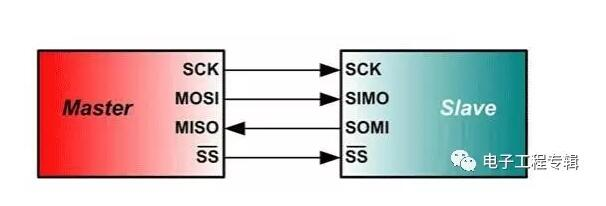
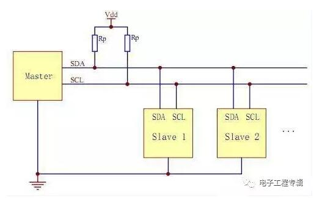
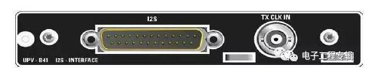

总的来说，总线有三种：`内部总线`、`系统总线`和`外部总线`。

* 1.内部总线是微机内部各外围芯片与处理器之间的总线，用于**芯片一级**的互连；
* 2.而系统总线是微机中各插件板与系统板之间的总线，用于**插件板一级**的互连；
* 3.外部总线则是微机和外部设备之间的总线，微机作为一种设备，通过该总线和其他设备进行信息与数据交换，它用于**设备一级**的互连。

除了总线外，还有一些接口，它们是**多种总线的集合体**，或者说来者不拒。

# 1.SPI(Serial Peripheral Interface)
MOTOROLA公司提出的同步串行总线方式。高速同步串行口。3～4线接口，收发独立、可同步进行。

因其硬件功能强大而被广泛应用。在单片机组成的智能仪器和测控系统中。如果对`速度要求不高`，采用SPI总线模式是个不错的选择。

它可以`节省I/O端口`,提高`外设的数目`和`系统的性能`。标准SPI总线由四根线组成：`串行时钟线(SCK)`、`主机输入/从机输出线(MISO)`。`主机输出/从机输入线(MOSI)`和片选信号(CS)。有的SPI接口芯片`带有中断信号线`或没`有MOSI`。

SPI总线由三条信号线组成：`串行时钟(SCLK)`、`串行数据输出(SDO)`、`串行数据输入(SDI)`。SPI总线可以实现多个SPI设备互相连接。提供SPI串行时钟的SPI设备为SPI主机或主设备(Master)，其他设备为SPI从机或从设备(Slave)。主从设备间可以实现全双工通信，当有`多个从设备时`，还可以增加一条从设备选择线。

**如果用通用IO口模拟SPI总线**，必须要有一个`输出口(SDO)`，`一个输入口(SDI)`，另一个口则视实现的设备类型而定，如果要实现主从设备，则需输入输出口，若只实现主设备，则需输出口即可，若只实现从设备，则只需输入口即可。

# I2C(Inter-Intergrated Circuit)
由PHILIPS公司开发的两线式串行总线，用于连接微控制器及其外围设备。

I2C总线用两条线(SDA和SCL)在总线和装置之间传递信息，在微控制器和外部设备之间进行串行通讯或在主设备和从设备之间的双向数据传送。I2C是OD输出的，大部分I2C都是2线的（时钟和数据），一般用来传输控制信号。

I2C是`多主控总线`，所以任何一个设备都能像主控器一样工作，并控制总线。总线上每一个设备都有一个独一无二的地址，根据设备它们自己的能力，它们可以作为发射器或接收器工作。多路微控制器能在同一个I2C总线上共存。

# UART
UART：通用异步串行口，按照标准波特率完成双向通讯，速度慢。

UART总线是异步串口，因此一般比前两种同步串口的结构要复杂很多，一般由波特率产生器(产生的波特率等于传输波特率的16倍)、UART接收器、UART发送器组成，硬件上由两根线，一根用于发送，一根用于接收。

UART是用于控制计算机与串行设备的芯片。有一点要注意的是，它提供了RS-232C数据终端设备接口，这样计算机就可以和调制解调器或其它使用RS-232C接口的串行设备通信了。作为接口的一部分，UART还提供以下功能：

将由计算机内部传送过来的并行数据转换为输出的串行数据流。将计算机外部来的串行数据转换为字节，供计算机内部使用并行数据的器件使用。在输出的串行数据流中加入奇偶校验位，并对从外部接收的数据流进行奇偶校验。在输出数据流中加入启停标记，并从接收数据流中删除启停标记。处理由键盘或鼠标发出的中断信号（键盘和鼠标也是串行设备）。可以处理计算机与外部串行设备的同步管理问题。有一些比较高档的UART还提供输入输出数据的缓冲区，现在比较新的UART是16550，它可以在计算机需要处理数据前在其缓冲区内存储16字节数据，而通常的UART是8250。现在如果您购买一个内置的调制解调器，此调制解调器内部通常就会有16550 UART。

# SPI、I2C和UART做个比较
SPI 和I2C这两种通信方式都是短距离的，芯片和芯片之间或者其他元器件如传感器和芯片之间的通信。SPI和IIC是板上通信,IIC有时也会做板间通信,不过距离甚短,不过超过一米,例如一些触摸屏,手机液晶屏那些薄膜排线很多用IIC,I2C能用于替代标准的并行总线，能连接的各种集成电路和功能模块。I2C是多主控总线，所以任何一个设备都能像主控器一样工作，并控制总线。总线上每一个设备都有一个独一无二的地址，根据设备它们自己的能力，它们可以作为发射器或接收器工作。多路微控制器能在同一个I2C总线上共存这两种线属于低速传输。

而UART是应用于两个设备之间的通信，如用单片机做好的设备和计算机的通信。这样的通信可以做长距离的。UART速度比上面两者者快,最高达100K左右,用与计算机与设备或者计算机和计算之间通信,但有效范围不会很长,约10米左右,UART优点是支持面广,程序设计结构很简单,随着USB的发展,UART也逐渐走向下坡。

# I2S(Inter-IC Sound Bus)
I2S（Inter-IC Sound Bus）是飞利浦公司为数字音频设备之间的音频 数据传输而制定的一种总线标准。

I2S则大部分是3线的（除了时钟和数据外，还有一个左右声道的选择信号），I2S主要用来传输音频信号。如STB、DVD、MP3等常用

I2S标准中，既规定了硬件接口规范，也规定了数字音频数据的格式。I2S有3个主要信号：1）串行时钟SCLK，也叫位时钟（BCLK），即对应数字音频的每一位数据，SCLK都有1个脉冲。SCLK的频率=2×采样频率×采样位数。2）帧时钟LRCK，(也称WS)，用于切换左右声道的数据。LRCK为“1”表示正在传输的是左声道的数据，为“0”则表示正在传输的是右声道的数据。LRCK的频率等于采样频率。3） 串行数据SDATA，就是用二进制补码表示的音频数据。

有时为了使系统间能够更好地同步，还需要另外传输一个信号MCLK，称为主时钟，也叫系统时钟（Sys Clock），是采样频率的256倍或384倍。

# GPIO
GPIO (General Purpose Input Output 通用输入/输出)或总线扩展器，利用工业标准I2C、SMBus或SPI接口简化了I/O口的扩展。

当微控制器或芯片组没有足够的`I/O`端口，或当系统 需要采用`远端串行通信`或`控制`时，GPIO产品能够提供`额外的控制`和`监视功能`(也就是输入和输出，是否有输入和输出)。每个GPIO端口可通过软件分别配置成输入或输出。Maxim的GPIO产品线包括8端口至28端口的GPIO，提供推挽式输出或漏极开路输出。提供微型3mm x 3mm QFN封装。

GPIO的优点(**端口扩展器**)：

* 低功耗：GPIO具有更低的功率损耗(大约1μA，μC的工作电流则为100μA)。
* 集成IIC从机接口：GPIO内置IIC从机接口，即使在待机模式下也能够全速工作。
* 小封装：GPIO器件提供最小的封装尺寸 ― 3mm x 3mm QFN!
* 低成本：您不用为没有使用的功能买单！
* 快速上市：不需要编写额外的代码、文档，不需要任何维护工作！
* 灵活的灯光控制：内置多路高分辨率的PWM输出。
* 可预先确定响应时间：缩短或确定外部事件与中断之间的响应时间。
* 更好的灯光效果：匹配的电流输出确保均匀的显示亮度。
* 布线简单：仅需使用2条IIC总线或3条SPI总线

# SDIO

SDIO是SD型的扩展接口，除了可以接SD卡外，还可以接支持SDIO接口的设备，插口的用途不止是插存储卡。支持 SDIO接口的PDA，笔记本电脑等都可以连接象GPS接收器，Wi-Fi或蓝牙适配器，调制解调器，局域网适配器，条型码读取器，FM无线电，电视接收 器，射频身份认证读取器，或者数码相机等等采用SD标准接口的设备。
SDIO协议是由SD卡的协议演化升级而来的，很多地方保留了SD卡的读写协议，同时SDIO协议又在SD卡协议之上添加了CMD52和CMD53命令。由于这个，SDIO和SD卡规范间的一个重要区别是增加了低速标准，低速卡的目标应用是以最小的硬件开始来支持低速I/O能力。低速卡支持类似调制解调器,条形码扫描仪和GPS接收器等应用。高速卡支持网卡，电视卡还有“组合”卡等，组合卡指的是存储器+SDIO。

SDIO和SD卡的SPEC间的又一个重要区别是增加了低速标准。SDIO卡只需要SPI和1位SD传输模式。低速卡的目标应用是以最小的硬件开支来支持低速I/O能力，低速卡支持类似MODEM，条形扫描仪和GPS接收器等应用。对组合卡来说，全速和4BIT操作对卡内存储器和SDIO部分都是强制要求的。

在非组合卡的SDIO设备里，其最高速度要只有达到25M，而组合卡的最高速度同SD卡的最高速度一样，要高于25M。

# CAN
CAN，全称为“Controller Area Network”，即控制器局域网，是国际上应用最广泛的现场总线之一。最初，CAN被设计作为汽车环境中的微控制器通讯，在车载各电子控制装置ECU之 间交换信息，形成汽车电子控制网络。比如：发动机管理系统、变速箱控制器、仪表装备、电子主干系统中，均嵌入CAN控制装置。

一个由CAN 总线构成的单一网络中，理论上可以挂接无数个节点。实际应用中，节点数目受网络硬件的电气特性所限制。例如，当使用Philips P82C250作为CAN收发器时，同一网络中允许挂接110个节点。CAN 可提供高达1Mbit/s的数据传输速率，这使实时控制变得非常容易。另外，硬件的错误检定特性也增强了CAN的抗电磁干扰能力。

CAN总线的特点：
1)可以多主方式工作，网络上任意一个节点均可以在任意时刻主动地向网络上的其他节点发送信息，而不分主从，通信方式灵活。
2)网络上的节点可分成不同的优先级，可以满足不同的实时要求。
3)采用非破坏性位仲裁总线结构机制，当两个节点同时向网络上传送信息时，优先级低的节点主动停止数据发送，而优先级高的节点可不受影响地继续传送数据。
4)可以点对点，一点对多点及全局广播几种传送方式接收数据。
5)直接通信距离最远可达10km(速率4Kbps以下)。
6)通信速率最高可达1MB/s(此时距离最长40m)。