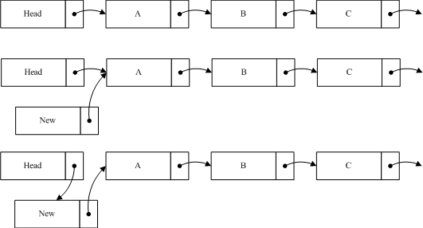

# 简介
RCU（Read-Copy Update）是数据同步的一种方式.RCU主要针对的数据对象是**链表**，目的是提高遍历读取数据的效率，为了达到目的使用RCU机制读取数据的时候不对链表进行耗时的加锁操作。这样在同一时间可以有多个线程同时读取该链表，并且允许一个线程对链表进行修改（修改的时候，需要加锁）。RCU适用于需要**频繁的读取数据**，而相应**修改数据并不多**的情景。

例如在**文件系统**中，经常需要查找定位目录，而对目录的修改相对来说并不多，这就是RCU发挥作用的最佳场景。

[RCU文章](http://www2.rdrop.com/users/paulmck/RCU/)

在RCU的实现过程中，我们主要解决以下问题：

* 1.在读取过程中，另外一个线程删除了一个节点。删除线程可以把这个节点从链表中移除，但它不能直接销毁这个节点，必须等到所有的读取线程读取完成以后，才进行销毁操作。RCU中把这个过程称为**宽限期**（Grace period）。
* 2.在读取过程中，另外一个线程插入了一个新节点，而读线程读到了这个节点，那么需要保证读到的这个节点是完整的。这里涉及到了`发布-订阅机制`（Publish-Subscribe Mechanism）。
* 3.保证读取链表的**完整性**。新增或者删除一个节点，不至于导致遍历一个链表从中间断开。但是RCU并不保证一定能读到新增的节点或者不读到要被删除的节点。

## 1.宽限期
通过例子，方便理解这个内容。以下例子修改于Paul的文章。

```c
strcut foo {
	int a;
	char b;
	long c;
};
DEFINE_SPINLOCK(foo_mutex);

struct foo *gbl_foo;

void foo_read(void)
{
	foo *fp = gbl_foo;
	if(fp != NULL)
		do_something(fp->a, fp->b, fp->c);
}

void foo_update(foo *new_fp)
{
	spin_lock(&foo_mutex);
	foo *old_fp = gbl_foo;
	gbl_foo = new_fp;
	spin_unlock(&foo_mutex);
	kfree(old_fp);
}
```

如上的程序，是针对于全局变量`gbl_foo`的操作。 假设以下场景。有两个线程同时运行 `foo_read`和`foo_update`的时候，当`foo_ read`执行完赋值操作后，线程发生切换；此时另一个线程开始执行`foo_update`并执行完成。当`foo_read`运行的进程切换回来后，运行dosomething 的时候，fp已经被删除，这将对系统造成危害。为了防止此类事件的发生，RCU里增加了一个新的概念叫宽限期（Grace period）。如下图所示：


图中每行代表一个线程，最下面的一行是删除线程，当它执行完删除操作后，线程进入了宽限期。宽限期的意义是，在一个删除动作发生后，它必须等待所有在宽限期开始前已经开始的读线程结束，才可以进行销毁操作。这样做的原因是这些线程有可能读到了要删除的元素。图中的宽限期必须等待1和2结束；而读线程5在宽限期开始前已经结束，不需要考虑；而3,4,6也不需要考虑，因为在宽限期结束后开始后的线程不可能读到已删除的元素。为此RCU机制提供了相应的API来实现这个功能。                             

```c
void foo_read(void)
{
	rcu_read_lock();
	foo *fp = gbl_foo;
	if(fp != NULL)
		dosomething(fp->a, fp->b, fp->c);
	rcu_read_unlock();
}

void foo_update(foo *new_fp)
{
	spin_lock(&foo_mutex);
	foo *old_fp = gbl_foo;
	gbl_foo = new_fp;
	spin_unlock(&foo_mutex);
	synchronize_rcu();
	kfree(old_fp);
}
```
其中foo_read中增加了rcu_read_lock和rcu_read_unlock，这两个函数用来标记一个RCU读过程的开始和结束。其实作用就是帮助检测宽限期是否结束。

foo_update增加了一个函数`synchronize_rcu()`，调用该函数意味着一个宽限期的开始，而直到宽限期结束，该函数才会返回。

我们再对比着图看一看，线程1和2，在synchronize_rcu之前可能得到了旧的gbl_foo，也就是foo_update中的old_fp，如果不等它们运行结束，就调用`kfee(old_fp)`，极有可能造成系统崩溃。而3,4,6在synchronize_rcu之后运行，此时它们已经不可能得到old_fp，此次的kfee将不对它们产生影响。

宽限期是RCU实现中最复杂的部分,原因是在提高读数据性能的同时，删除数据的性能也不能太差。

## 2.订阅——发布机制
当前使用的编译器大多会对代码做一定程度的优化，CPU也会对执行指令做一些优化调整,目的是提高代码的执行效率，但这样的优化，有时候会带来不期望的结果。如例：

```c
void foo_update(foo *new_fp)
{
	spin_lock(&foo_mutex);
	foo *old_fp = gbl_foo;
	
	new_fp->a = 1;
	new_fp->b = 'b';
	new_fp->c = 100;
	gbl_foo = new_fp;
	spin_unlock(&foo_mutex);
	synchrinize_rcu();
	kfree(old_fp_;
}
```
这段代码中，我们期望的是6，7，8行的代码在第10行代码之前执行(a,b,c赋值和gbl_foo赋值)。但优化后的代码并不对执行顺序做出保证。在这种情形下，一个读线程很可能读到 new_fp，但new_fp的成员赋值还没执行完成。当读线程执行`dosomething(fp->a, fp->b , fp->c)`的 时候，就有不确定的参数传入到dosomething，极有可能造成不期望的结果，甚至程序崩溃。

可以通过优化屏障来解决该问题，RCU机制对**优化屏障**做了包装，提供了专用的API来解决该问题。这时候，第十行不再是直接的指针赋值，而应该改为`rcu_assign_pointer(gbl_foo,new_fp);`:

`rcu_assign_pointer`的实现比较简单，如下：

```c
//路径：include/linux/rcupdate.h>
#define rcu_assign_pointer(p, v)\
	__rcu_assign_pointer((p),(v),__rcu)

#define __rcu_assign_pointer(p,v,space) \
	do{\
		smp_wmb(); \
		(p)=(typeof(*v) __force space *)(v);
	} while(0);
```
我们可以看到它的实现只是在赋值之前加了**优化屏障** `smp_wmb`来确保代码的执行顺序。另外就是宏中用到的`__rcu`，只是作为编译过程的检测条件来使用的，`#define __rcu __attribute__((noderef, address_space(4)))`。

在DEC Alpha CPU机器上还有一种更强悍的优化，如下所示：

```c
void foo_read(void)  
{         
    rcu_read_lock();  
    foo *fp = gbl_foo;  
    if ( fp != NULL )  
        dosomething(fp->a, fp->b ,fp->c);  
    rcu_read_unlock();  
}  
```
第六行的 `fp->a`,`fp->b`,`fp->c`会在第3行:`foo *fp = gbl_foo;`还没执行的时候就预先判断运行，当他和foo_update同时运行的时候，可能导致传入dosomething的一部分属于旧的gbl_foo，而另外的属于新的。这样导致运行结果的错误。为了避免该类问题，RCU还是提供了宏来解决该问题：

```c
#define rcu_dereference(p) rcu_dereference_check(p, 0)   
  
  
#define rcu_dereference_check(p, c) \   
         __rcu_dereference_check((p), rcu_read_lock_held() || (c), __rcu)  
  
#define __rcu_dereference_check(p, c, space) \   
         ({ \  
                 typeof(*p) *_________p1 = (typeof(*p)*__force )ACCESS_ONCE(p); \  
                 rcu_lockdep_assert(c, "suspicious rcu_dereference_check()" \  
                                       " usage"); \  
                 rcu_dereference_sparse(p, space); \  
                 smp_read_barrier_depends(); \  
                 ((typeof(*p) __force __kernel *)(_________p1)); \  
         })  
static inline int rcu_read_lock_held(void)  
{  
         if (!debug_lockdep_rcu_enabled())  
                 return 1;  
         if (rcu_is_cpu_idle())  
                 return 0;  
         if (!rcu_lockdep_current_cpu_online())  
                 return 0;  
         return lock_is_held(&rcu_lock_map);  
}  
```
 这段代码中加入了调试信息，去除调试信息，可以是以下的形式（其实这也是旧版本中的代码）：

```c
#define rcu_dereference(p) ({\
	typeof(p) __p1 = p;\
	smp_read_barrier_depends(); \
	(__p1);
	})
```
在赋值后加入优化屏障`smp_read_barrier_depends()。`
我们之前的第四行代码改为`foo *fp = rcu_dereference(gbl_foo);`，就可以防止上述问题。

## 3.数据读取的完整性
还是通过例子来说明这个问题：


如图我们在原list中加入一个节点new到A之前，所要做的第一步是将new的指针指向A节点，第二步才是将Head的指针指向new。这样做的目的是当插入操作完成第一步的时候，对于链表的读取并不产生影响，而执行完第二步的时候，读线程如果读到new节点，也可以继续遍历链表。如果把这个过程反过来，第一步head指向new，而这时一个线程读到new，由于new的指针指向的是Null，这样将导致读线程无法读取到A，B等后续节点。从以上过程中，可以看出RCU并不保证读线程读取到new节点。如果该节点对程序产生影响，那么就需要外部调用做相应的调整。如在文件系统中，通过RCU定位后，如果查找不到相应节点，就会进行其它形式的查找，相关内容等分析到文件系统的时候再进行叙述。

我们再看一下删除一个节点的例子：


如图我们希望删除B，这时候要做的就是将A的指针指向C，保持B的指针，然后删除程序将进入宽限期检测。由于B的内容并没有变更，读到B的线程仍然可以继续读取B的后续节点。B不能立即销毁，它必须等待宽限期结束后，才能进行相应销毁操作。由于A的节点已经指向了C，当宽限期开始之后所有的后续读操作通过A找到的是C，而B已经隐藏了，后续的读线程都不会读到它。这样就确保宽限期过后，删除B并不对系统造成影响。

## 4.小节

RCU的原理并不复杂，应用也很简单。但代码的实现确并不是那么容易，难点都集中在了宽限期的检测上，后续分析源代码的时候，我们可以看到一些极富技巧的实现方式。

