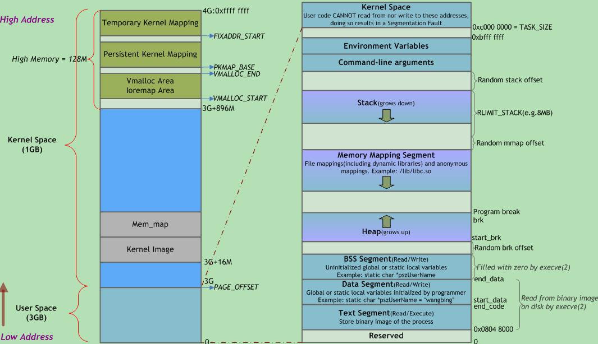
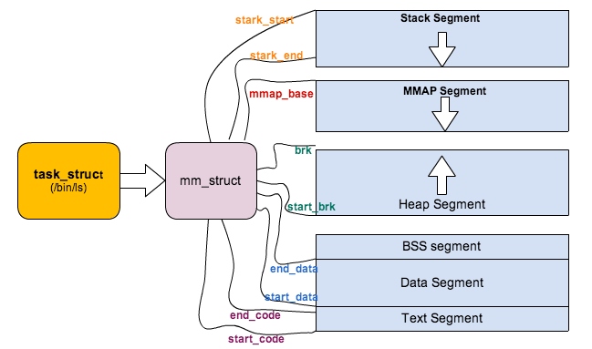

# 1.进程地址空间划分
## 1.1 段及其作用

首先通过下图简单看一下，进程地址空间从低地址开始依次是代码段(Text)、数据段(Data)、BSS段、堆、**内存映射段**(mmap)、栈。



### 1.1.1 代码段(text)
代码段也称正文段或文本段，通常用于存放程序执行代码(即CPU执行的机器指令)。一般C语言执行语句都编译成机器代码保存在代码段。通常代码段是可共享的，因此频繁执行的程序只需要在**内存中拥有一份拷贝即可**。

**代码段通常属于只读**，以防止其他程序意外地修改其指令(对该段的写操作将导致段错误)。某些架构也允许代码段为可写，即允许修改程序。

代码段指令根据程序设计流程依次执行，对于顺序指令，只会执行一次(每个进程)；若有反复，则需使用跳转指令；若进行递归，则需要借助**栈**来实现。

代码段指令中包括操作码和操作对象(或对象地址引用)。

* 若操作对象是**立即数**(具体数值)，将直接包含在代码中；
* 若是局部数据，将在栈区分配空间，然后**引用该数据地址**；
* 若位于BSS段和数据段，同样**引用该数据地址**。

代码段最容易受优化措施影响。

### 1.1.2 数据段(Data)

数据段通常用于存放程序中已初始化且初值不为0的**全局变量**和**静态局部变量**。数据段属于静态内存分配(静态存储区)，可读可写。

数据段保存在目标文件中(在嵌入式系统里一般固化在镜像文件中)，其内容由程序初始化。例如，对于全局变量`int gVar = 10;`，必须在目标文件数据段中保存10这个数据，然后在程序加载时复制到相应的内存。

数据段与BSS段的区别如下： 

*  1).BSS段不占用物理文件尺寸，但占用**内存空间**；数据段占用物理文件，也占用内存空间。
   *  对于大型数组如`int ar0[10000] = {1, 2, 3, ...}`和`int ar1[10000]`，ar1放在BSS段，只记录共有`10000*4`个字节需要初始化为0，而不是像ar0那样记录每个数据1、2、3...，此时BSS为目标文件所节省的磁盘空间相当可观。
* 2) 当程序读取数据段的数据时，系统会出发缺页故障，从而分配相应的物理内存；当程序读取BSS段的数据时，内核会将其转到一个全零页面，不会发生缺页故障，也不会为其分配相应的物理内存。

运行时数据段和BSS段的整个区段通常称为数据区。某些资料中“数据段”指代数据段 + BSS段 + 堆。

### 1.1.3 BSS 段

BSS(Block Started by Symbol)段中通常存放程序中以下符号：

* 未初始化的全局变量和静态局部变量
* 初始值为0的全局变量和静态局部变量(依赖于编译器实现)
* 未定义且初值不为0的符号(该初值即**common block**的大小)

 C语言中，未显式初始化的静态分配变量被初始化为0(算术类型)或空指针(指针类型)。由于程序加载时，BSS会被操作系统清零，所以未赋初值或初值为0的全局变量都在BSS中。BSS段仅为未初始化的静态分配变量预留位置，**在目标文件中并不占据空间**，这样可减少目标文件体积。但**程序运行时需为变量分配内存空间**，故目标文件必须记录所有未初始化的静态分配变量大小总和(通过`start_bss`和`end_bss`地址写入机器代码)。

 当加载器(loader)加载程序时，将为BSS段分配的内存初始化为0。在嵌入式软件中，进入main()函数之前BSS段被C运行时系统映射到初始化为全零的内存(效率较高)。

 注意，尽管均放置于BSS段，但初值为0的全局变量是**强符号**，而未初始化的全局变量是**弱符号**。若其他地方已定义同名的强符号(初值可能非0)，则弱符号与之链接时不会引起重定义错误，但运行时的初值可能并非期望值(会被强符号覆盖)。

 因此，定义全局变量时
 
 * 若只有本文件使用，则尽量使用static关键字修饰；
 * 否则需要为全局变量定义赋初值(哪怕0值)，保证该变量为强符号，以便链接时发现变量名冲突，而不是被未知值覆盖。

某些编译器将**未初始化**的全局变量保存在`common`段，**链接时**再将其放入BSS段。在编译阶段可通过`-fno-common`选项来禁止将未初始化的全局变量放入common段。

### 1.1.4堆(heap)

堆用于存放进程运行时动态分配的内存段，可动态扩张或缩减。

堆中内容是**匿名的**，不能按名字直接访问，只能通过**指针间接**访问。当进程调用`malloc(C)/new(C++)`等函数分配内存时，新分配的内存动态添加到堆上(扩张)；当调用`free(C)/delete(C++)`等函数释放内存时，被释放的内存从堆中剔除(缩减) 。

 分配的堆内存是经过**字节对齐的空间**，以适合原子操作。堆管理器通过链表管理每个申请的内存，由于堆申请和释放是无序的，最终会产生内存碎片。堆内存一般由应用程序分配释放，回收的内存可供重新使用。若程序员不释放，程序结束时操作系统可能会自动回收。

 堆的末端由**break指针**标识，当堆管理器需要更多内存时，可通过系统调用`brk()`和`sbrk()`来移动break指针以扩张堆，一般由系统自动调用。

 使用堆时经常出现两种问题：
 
 * 1) 释放或改写仍在使用的内存(“内存破坏”)；
 * 2)未释放不再使用的内存(“内存泄漏”)。当释放次数少于申请次数时，可能已造成内存泄漏。泄漏的内存往往比忘记释放的数据结构更大，因为所分配的内存通常会圆整为下个大于申请数量的2的幂次(如申请212B，会圆整为256B)。

### 1.1.5 内存映射段(mmap)

此处，内核将**硬盘文件**的内容直接映射到内存, 任何应用程序都可通过Linux的`mmap()`系统调用请求这种映射。

内存映射是一种方便高效的文件`I/O`方式， 因而被用于**装载动态共享库**。用户也可创建匿名内存映射，该映射没有对应的文件, 可用于存放程序数据。在 Linux中，若通过`malloc()`请求一大块内存，C运行库将创建一个匿名内存映射，而不使用堆内存。”大块” 意味着比阈值`MMAP_THRESHOLD`还大，缺省为128KB，可通过`mallopt()`调整。

 该区域用于映射可执行文件用到的动态链接库。
 
 * 在Linux 2.4版本中，若可执行文件依赖共享库，则系统会为这些动态库在从0x40000000开始的地址分配相应空间，并在程序装载时将其载入到该空间。
 * 在Linux 2.6内核中，共享库的起始地址被往上移动至更靠近栈区的位置。

从进程地址空间的布局可以看到，在有共享库的情况下，留给**堆**的可用空间还有两处：

* 一处是从`.bss段`到`0x40000000`，约不到1GB的空间；
* 另一处是从共享库到栈之间的空间，约不到2GB

这两块空间大小取决于栈、共享库的大小和数量。这样来看，是否应用程序可申请的最大堆空间只有2GB？事实上，这与Linux内核版本有关。在上面给出的进程地址空间经典布局图中，共享库的装载地址为0x40000000，这实际上是Linux kernel 2.6版本之前的情况了，在2.6版本里，共享库的装载地址已经被挪到靠近栈的位置，即位于0xBFxxxxxx附近，因此，此时的堆范围就不会被共享库分割成2个“碎片”，故kernel 2.6的32位Linux系统中，malloc申请的最大内存理论值在2.9GB左右。

### 1.1.6 栈(stack)
栈又称**堆栈**，由`编译器`自动分配释放，行为类似数据结构中的栈(先进后出)。堆栈主要有三个用途：

* 为函数内部声明的非静态局部变量(C语言中称“自动变量”)提供存储空间。
* 记录函数调用过程相关的维护性信息，称为**栈帧**(Stack Frame)或**过程活动记录**(Procedure Activation Record)PAR。
  * 它包括函数返回地址，不适合装入寄存器的函数参数及一些寄存器值的保存。
  * 除递归调用外，**堆栈**并非必需。因为编译时可获知局部变量，参数和返回地址所需空间，并将其分配于BSS段。
* 临时存储区，用于暂存长算术表达式部分计算结果或`alloca()`(allocate memory that is automatically freed)函数分配的栈内内存。

  持续地重用栈空间有助于使活跃的栈内存保持在CPU缓存中，从而加速访问。进程中的每个线程都有属于自己的栈。向栈中不断压入数据时，若超出其容量就会耗尽栈对应的内存区域，从而触发一个页错误。此时若栈的大小低于堆栈最大值RLIMIT_STACK(通常是8M)，则栈会动态增长，程序继续运行。映射的栈区扩展到所需大小后，不再收缩。

   Linux中`ulimit -s`命令可查看和设置堆栈最大值，当程序使用的堆栈超过该值时, 发生栈溢出(Stack Overflow)，程序收到一个段错误(Segmentation Fault)。注意，**调高堆栈容量可能会增加内存开销和启动时间**。

堆栈既可向下增长(向内存低地址)也可向上增长, 这依赖于具体的实现。本文所述堆栈向下增长。

栈的大小在运行时由内核动态调整。

## 2.栈和堆的区别

①管理方式：栈由编译器自动管理；堆由程序员控制，使用方便，但易产生内存泄露。

②生长方向：栈向低地址扩展(即”向下生长”)，是连续的内存区域；堆向高地址扩展(即”向上生长”)，是不连续的内存区域。这是由于系统用链表来存储空闲内存地址，自然不连续，而链表从低地址向高地址遍历。

③空间大小：栈顶地址和栈的最大容量由系统预先规定(通常默认2M或10M)；堆的大小则受限于计算机系统中有效的虚拟内存，32位Linux系统中堆内存可达2.9G空间。

④存储内容：栈在函数调用时，首先压入主调函数中下条指令(函数调用语句的下条可执行语句)的地址，然后是函数实参，然后是被调函数的局部变量。本次调用结束后，局部变量先出栈，然后是参数，最后栈顶指针指向最开始存的指令地址，程序由该点继续运行下条可执行语句。堆通常在头部用一个字节存放其大小，堆用于存储生存期与函数调用无关的数据，具体内容由程序员安排。

⑤分配方式：栈可静态分配或动态分配。静态分配由编译器完成，如局部变量的分配。动态分配由alloca函数在栈上申请空间，用完后自动释放。堆只能动态分配且手工释放。

⑥分配效率：栈由计算机底层提供支持：分配专门的寄存器存放栈地址，压栈出栈由专门的指令执行，因此效率较高。堆由函数库提供，机制复杂，效率比栈低得多。Windows系统中VirtualAlloc可直接在进程地址空间中分配一块内存，快速且灵活。

⑦分配后系统响应：只要栈剩余空间大于所申请空间，系统将为程序提供内存，否则报告异常提示栈溢出。

     操作系统为堆维护一个记录空闲内存地址的链表。当系统收到程序的内存分配申请时，会遍历该链表寻找第一个空间大于所申请空间的堆结点，然后将该结点从空闲结点链表中删除，并将该结点空间分配给程序。若无足够大小的空间(可能由于内存碎片太多)，有可能调用系统功能去增加程序数据段的内存空间，以便有机会分到足够大小的内存，然后进行返回。，大多数系统会在该内存空间首地址处记录本次分配的内存大小，供后续的释放函数(如free/delete)正确释放本内存空间。

     此外，由于找到的堆结点大小不一定正好等于申请的大小，系统会自动将多余的部分重新放入空闲链表中。

⑧碎片问题：栈不会存在碎片问题，因为栈是先进后出的队列，内存块弹出栈之前，在其上面的后进的栈内容已弹出。而频繁申请释放操作会造成堆内存空间的不连续，从而造成大量碎片，使程序效率降低。

     可见，堆容易造成内存碎片；由于没有专门的系统支持，效率很低；由于可能引发用户态和内核态切换，内存申请的代价更为昂贵。所以栈在程序中应用最广泛，函数调用也利用栈来完成，调用过程中的参数、返回地址、栈基指针和局部变量等都采用栈的方式存放。所以，建议尽量使用栈，仅在分配大量或大块内存空间时使用堆。

     使用栈和堆时应避免越界发生，否则可能程序崩溃或破坏程序堆、栈结构，产生意想不到的后果。

# 3.段和mm_struct关系

`struct mm_struct`是进程内存结构体，里面的参数和各段地址对应关系如下图。

```c
struct mm_struct {
    struct vm_area_struct *mmap; // list of VMAs
...
    unsigned long mmap_base;    // base of mmap area
    unsigned long mmap_legacy_base; // base of mmap area in bottom-up allocations
    unsigned long start_code,end_code, start_data, end_data;
    unsigned long start_brk, brk, start_stack;
...
    struct mm_rss_stat rss_stat;
...
};
```

mm_strutc数据结构和段对应关系如下：

