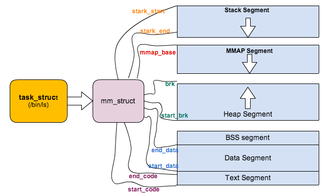

# Linux 中的各种栈：进程栈 线程栈 内核栈 中断栈

# 1.栈是什么？栈有什么作用？
首先，栈 (stack) 是一种串列形式的 数据结构。这种数据结构的特点是 后入先出 (LIFO, Last In First Out)，数据只能在串列的一端 (称为：栈顶 top) 进行 推入 (push) 和 弹出 (pop) 操作。根据栈的特点，很容易的想到可以利用数组，来实现这种数据结构。但是本文要讨论的并不是软件层面的栈，而是**硬件层面**的栈。

大多数的处理器架构，都有实现硬件栈。有专门的`栈指针寄存器`，以及特定的硬件指令来完成 `入栈/出栈` 的操作。例如在 ARM 架构上，R13 (SP) 指针是堆栈指针寄存器，而 PUSH 是用于压栈的汇编指令，POP 则是出栈的汇编指令。

上面是栈的原理和实现，下面我们来看看栈有什么作用。栈作用可以从两个方面体现：函数调用 和 多任务支持 。

## 1.1 函数调用
我们知道一个函数调用有以下三个基本过程：

* 调用参数的传入
* 局部变量的空间管理
* 函数返回

函数的调用必须是高效的，而数据存放在 CPU通用寄存器 或者 RAM 内存 中无疑是最好的选择。以传递调用参数为例，我们可以选择使用 CPU通用寄存器 来存放参数。但是通用寄存器的数目都是有限的，当出现函数嵌套调用时，子函数再次使用原有的通用寄存器必然会导致冲突。因此如果想用它来传递参数，那在调用子函数前，就必须先 保存原有寄存器的值，然后当子函数退出的时候再 恢复原有寄存器的值 。

函数的调用参数数目一般都相对少，因此通用寄存器是可以满足一定需求的。但是局部变量的数目和占用空间都是比较大的，再依赖有限的通用寄存器未免强人所难，因此我们可以采用某些 RAM 内存区域来存储**局部变量**。但是存储在哪里合适？既不能让函数嵌套调用的时候有冲突，又要注重效率。

这种情况下，栈无疑提供很好的解决办法。一、对于通用寄存器传参的冲突，我们可以再调用子函数前，将通用寄存器临时压入栈中；在子函数调用完毕后，在将已保存的寄存器再弹出恢复回来。二、而局部变量的空间申请，也只需要向下移动下栈顶指针；将栈顶指针向回移动，即可就可完成局部变量的空间释放；三、对于函数的返回，也只需要在调用子函数前，将返回地址压入栈中，待子函数调用结束后，将函数返回地址弹出给 PC 指针，即完成了函数调用的返回；

于是上述函数调用的三个基本过程，就演变记录一个栈指针的过程。每次函数调用的时候，都配套一个栈指针。即使循环嵌套调用函数，只要对应函数栈指针是不同的，也不会出现冲突。


### 1.1.1 函数栈帧(stack frame)

函数调用经常是嵌套的，在同一时刻，栈中会有多个函数的信息。**每个未完成运行的函数占用一个独立的连续区域**，称作栈帧(Stack Frame)。栈帧存放着函数参数，局部变量及恢复前一栈帧所需要的数据等，函数调用时入栈的顺序为：

`实参N~1` → `主调函数返回地址` → `主调函数帧基指针EBP` → `被调函数局部变量1~N`

栈帧的边界由 `栈帧基地址指针EBP`和`栈指针 ESP 界定`

* EBP 指向当前栈帧底部(高地址)，在当前栈帧内位置固定；
* ESP指向当前栈帧顶部(低地址)，当程序执行时ESP会随着数据的入栈和出栈而移动。

因此函数中对大部分数据的访问都基于EBP进行。函数调用栈的典型内存布局如下图所示：


## 1.2 多任务支持
然而栈的意义还不只是函数调用，有了它的存在，才能构建出操作系统的多任务模式。我们以 main 函数调用为例，main 函数包含一个无限循环体，循环体中先调用 A 函数，再调用 B 函数。

```C
func B():
  return;

func A():
  B();

func main():
  while (1)
    A();
```

试想在单处理器情况下，程序将永远停留在此 main 函数中。即使有另外一个任务在等待状态，程序是没法从此 main 函数里面跳转到另一个任务。因为如果是函数调用关系，本质上还是属于 main 函数的任务中，不能算多任务切换。此刻的 main 函数任务本身其实和它的栈绑定在了一起，无论如何嵌套调用函数，栈指针都在本栈范围内移动。
由此可以看出一个任务可以利用以下信息来表征：

1. main 函数体代码
2. main 函数栈指针
3. 当前 CPU 寄存器信息

假如我们可以保存以上信息，则完全可以强制让出 CPU 去处理其他任务。只要将来想继续执行此 main 任务的时候，把上面的信息恢复回去即可。有了这样的先决条件，多任务就有了存在的基础，也可以看出栈存在的另一个意义。

在多任务模式下，当**调度程序认为有必要进行任务切换的话**，**只需保存任务的信息**（即上面说的三个内容）。恢复另一个**任务的状态**，**然后跳转到上次运行的位置**，就可以恢复运行了。

可见每个任务都有自己的栈空间，正是有了独立的栈空间，为了代码重用，不同的任务甚至可以混用任务的函数体本身，例如可以一个main函数有两个任务实例。至此之后的操作系统的框架也形成了，譬如任务在调用 sleep() 等待的时候，可以主动让出 CPU 给别的任务使用，或者分时操作系统任务在时间片用完是也会被迫的让出 CPU。不论是哪种方法，只要想办法切换任务的上下文空间，切换栈即可。


* 任务、线程、进程 三者关系:任务是一个抽象的概念，即指软件完成的一个活动；而线程则是完成任务所需的动作；进程则指的是完成此动作所需资源的统称；关于三者的关系，有一个形象的比喻：
  * 任务 = 送货
  * 线程 = 开送货车
  * 系统调度 = 决定合适开哪部送货车
  * 进程 = 道路 + 加油站 + 送货车 + 修车厂

# 2.Linux 中有几种栈？各种栈的内存位置？
介绍完栈的工作原理和用途作用后，我们回归到 Linux 内核上来。内核将栈分成四种：

进程栈、线程栈、内核栈、中断栈

## 2.1 进程栈
进程栈是属于**用户态栈**，和进程`虚拟地址空间` (Virtual Address Space) 密切相关。那我们先了解下什么是虚拟地址空间：在 32 位机器下，虚拟地址空间大小为 4G。这些虚拟地址通过页表 (Page Table) 映射到物理内存，页表由操作系统维护，并被处理器的内存管理单元 (MMU) 硬件引用。每个进程都拥有一套属于它自己的页表，因此对于每个进程而言都好像独享了整个虚拟地址空间。

Linux 内核将这 4G 字节的空间分为两部分，将最高的 1G 字节（0xC0000000-0xFFFFFFFF）供内核使用，称为 内核空间。而将较低的3G字节（0x00000000-0xBFFFFFFF）供各个进程使用，称为 用户空间。每个进程可以通过系统调用陷入内核态，因此内核空间是由所有进程共享的。虽然说内核和用户态进程占用了这么大地址空间，但是并不意味它们使用了这么多物理内存，仅表示它可以支配这么大的地址空间。它们是根据需要，将物理内存映射到虚拟地址空间中使用。

Linux 对进程地址空间有个标准布局，地址空间中由各个不同的内存段组成 (Memory Segment)，主要的内存段如下：

程序段 (Text Segment)：可执行文件代码的内存映射
* 数据段 (Data Segment)：可执行文件的已初始化全局变量的内存映射
*  BSS段 (BSS Segment)：未初始化的全局变量或者静态变量（用零页初始化）
*  堆区 (Heap) : 存储动态内存分配，匿名的内存映射
*  栈区 (Stack) : 进程用户空间栈，由编译器自动分配释放，存放函数的参数值、局部变量的值等
*  映射段(Memory Mapping Segment)：任何内存映射文件

而上面进程虚拟地址空间中的栈区，正指的是我们所说的进程栈。进程栈的初始化大小是由编译器和链接器计算出来的，但是栈的实时大小并不是固定的，Linux 内核会根据入栈情况对栈区进行动态增长（其实也就是添加新的页表）。但是并不是说栈区可以无限增长，它也有最大限制`RLIMIT_STACK`(一般为8M)，我们可以通过 ulimit 来查看或更改 RLIMIT_STACK 的值。

### 2.1.1 如何确认进程栈的大小

我们要知道栈的大小，那必须得知道栈的起始地址和结束地址。

* 栈起始地址 获取很简单，只需要嵌入汇编指令获取栈指针 esp 地址即可。
* 栈结束地址 的获取有点麻烦，我们需要先利用**递归函数**把栈搞溢出了，然后再GDB中把栈溢出的时候把栈指针 esp 打印出来即可。代码如下：

```c
// file name:stacksize.c
void *orig_stack_pointer;

void blow_stack() {
    blow_stack();
}
int main(){
    __asm__("movl %esp, orig_stack_pointer");

    blow_stack();
    return 0;
}
```

编译和调试过程

```
$ g++ -g stacksize.c -o ./stacksize
$ gdb ./stacksize
(gdb) r
Starting program: /home/home/misc-code/setrlimit

Program received signal SIGSEGV, Segmentation fault.
blow_stack () at setrlimit.c:4
4       blow_stack();
(gdb) print (void *)$esp
$1 = (void *) 0xffffffffff7ff000
(gdb) print (void *)orig_stack_pointer
$2 = (void *) 0xffffc800
(gdb) print 0xffffc800-0xff7ff000
$3 = 8378368    // Current Process Stack Size is 8M
```

上面对进程的地址空间有个比较全局的介绍，那我们看下 Linux 内核中是怎么体现上面内存布局的。内核使用内存描述符来表示进程的地址空间，该描述符表示着进程所有地址空间的信息。内存描述符由 mm_struct 结构体表示，下面给出内存描述符结构中各个域的描述，请大家结合前面的 进程内存段布局 图一起看：

```c
struct mm_struct {
    struct vm_area_struct *mmap;           /* 内存区域链表 */
    struct rb_root mm_rb;                  /* VMA 形成的红黑树 */
    ...
    struct list_head mmlist;               /* 所有 mm_struct 形成的链表 */
    ...
    unsigned long total_vm;                /* 全部页面数目 */
    unsigned long locked_vm;               /* 上锁的页面数据 */
    unsigned long pinned_vm;               /* Refcount permanently increased */
    unsigned long shared_vm;               /* 共享页面数目 Shared pages (files) */
    unsigned long exec_vm;                 /* 可执行页面数目 VM_EXEC & ~VM_WRITE */
    unsigned long stack_vm;                /* 栈区页面数目 VM_GROWSUP/DOWN */
    unsigned long def_flags;
    unsigned long start_code, end_code, start_data, end_data;    /* 代码段、数据段 起始地址和结束地址 */
    unsigned long start_brk, brk, start_stack;                   /* 栈区 的起始地址，堆区 起始地址和结束地址 */
    unsigned long arg_start, arg_end, env_start, env_end;        /* 命令行参数 和 环境变量的 起始地址和结束地址 */
    ...
    /* Architecture-specific MM context */
    mm_context_t context;                  /* 体系结构特殊数据 */

    /* Must use atomic bitops to access the bits */
    unsigned long flags;                   /* 状态标志位 */
    ...
    /* Coredumping and NUMA and HugePage 相关结构体 */
};
```



### 2.1.2 进程栈的动态增长实现
进程在运行的过程中，通过不断向栈区压入数据，当超出栈区容量时，就会耗尽栈所对应的内存区域，这将触发一个 缺页异常 (page fault)。通过异常陷入内核态后，异常会被内核的 `expand_stack()` 函数处理，进而调用 `acct_stack_growth()` 来检查是否还有合适的地方用于栈的增长。

如果栈的大小低于**RLIMIT_STACK**（通常为8MB），那么一般情况下栈会被加长，程序继续执行，感觉不到发生了什么事情，这是一种将栈扩展到所需大小的常规机制。然而，如果达到了最大栈空间的大小，就会发生 栈溢出（stack overflow），进程将会收到内核发出的段错误（segmentation fault） 信号。

动态栈增长是唯一一种访问未映射内存区域而被允许的情形，其他任何对未映射内存区域的访问都会触发页错误，从而导致段错误。一些被映射的区域是只读的，因此企图写这些区域也会导致段错误。

## 2.2 线程栈
从 Linux 内核的角度来说，其实它并没有线程的概念。Linux 把所有线程都当做进程来实现，它将线程和进程不加区分的统一到了 task_struct 中。**线程仅仅被视为一个与其他进程共享某些资源的进程**，而是否共享地址空间几乎是进程和 Linux 中所谓线程的唯一区别。线程创建的时候，加上了`CLONE_VM`标记，这样**线程的内存描述符将直接指向父进程的内存描述符**。

```c
if (clone_flags & CLONE_VM) {
    // current 是父进程而tsk在fork()执行期间是共享子进程
    atomic_inc(&current->mm->mm_users);
    tsk->mm = current->mm;
}
```

虽然线程的地址空间和进程一样，但是对待其地址空间的 stack 还是有些区别的。对于 Linux 进程或者说主线程，其 stack 是在 fork 的时候生成的，实际上就是复制了父亲的 stack 空间地址，然后写时拷贝 (cow) 以及动态增长。然而对于**主线程生成的子线程而言**，其stack将不再是这样的了，而是事**先固定下来的**，使用`mmap`系统调用，它不带有`VM_STACK_FLAGS`标记。这个可以从glibc的`nptl/allocatestack.c`中的 `allocate_stack()`函数中看到：

```c
mem =mmap(NULL, size, prot, MAP_PRIVATE | MAP_ANONYMOUS | MAP_STACK, -1, 0);
```
由于线程的`mm->start_stack`栈地址和所属进程相同，所以线程栈的起始地址并没有存放在 task_struct 中，应该是使用`pthread_attr_t`中的`stackaddr`来初始化`task_struct->thread->sp`（sp 指向 struct pt_regs 对象，该结构体用于保存用户进程或者线程的寄存器现场）。这些都不重要，重要的是，**线程栈不能动态增长**，一旦用尽就没了，这是和生成进程的 fork 不同的地方。由于线程栈是从进程的地址空间中map出来的一块内存区域，原则上是线程私有的。但是同一个进程的所有线程生成的时候浅拷贝生成者的task_struct的很多字段，其中包括所有的`vma`，如果愿意，**其它线程也还是可以访问到的**，于是一定要注意。

## 2.3 内核栈

在每一个进程的生命周期中，必然会通过到**系统调用陷入内核**。在执行系统调用陷入内核之后，这些内核代码所使用的栈并不是原先进程用户空间中的栈，而是一个**单独内核空间的栈**，这个称作`进程内核栈`。进程内核栈在进程创建的时候，通过 slab 分配器从`thread_info_cache`缓存池中分配出来，其大小为`THREAD_SIZE`，一般来说是一个页大小4K；

```c
union thread_union {
    struct thread_info thread_info;
    unsigned long stack[THREAD_SIZE/sizeof(long)];
};
```

`thread_union`进程内核栈 和`task_struct`进程描述符有着紧密的联系。由于内核经常要访问 task_struct，高效获取当前进程的描述符是一件非常重要的事情。因此内核将进程内核栈的头部一段空间，用于存放 thread_info 结构体，而此结构体中则记录了对应进程的描述符，两者关系如下图（对应内核函数为 `dup_task_struct()`）：


有了上述关联结构后，内核可以先获取到栈顶指针`esp`，然后通过esp来获取 thread_info。

这里有一个**小技巧**，直接将`esp`的地址`与`上`~(THREAD_SIZE - 1)`后即可直接获得 thread_info 的地址。

由于thread_union结构体是从thread_info_cache的Slab缓存池中申请出来的，而`thread_info_cache`在 `kmem_cache_create`创建的时候，保证了地址是THREAD_SIZE对齐的。因此**只需要对栈指针进行THREAD_SIZE对齐**，即可获得thread_union的地址，也就获得了thread_union的地址。成功获取到thread_info后，直接取出它的task成员就成功得到了task_struct。其实上面这段描述，也就是current宏的实现方法：

```c
register unsigned long current_stack_pointer asm("sp");

static inline struct thread_info *current_thread_info(void)
{
    return (struct thread_info *)(current_stack_pointer & ~(THREAD_SIZE -1));
}

#define get_current() (current_thread_info()->task);
#define current get_current()
```

n 个字节对齐的技巧

* 1.`x & ~(n - 1)`
* 2.(x + (n -1)) / n) * n

## 2.4 中断栈

进程陷入内核态的时候，需要内核栈来支持内核函数调用。中断也是如此，当系统收到中断事件后，进行中断处理的时候，也需要中断栈来支持函数调用。由于系统中断的时候，系统当然是处于内核态的，所以中断栈是可以和内核栈共享的。但是具体是否共享，这和具体处理架构密切相关。

X86 上中断栈就是独立于内核栈的；独立的中断栈所在内存空间的分配发生在`arch/x86/kernel/irq_32.c`的 `irq_ctx_init()`函数中(如果是多处理器系统，那么每个处理器都会有一个独立的中断栈)，函数使用 `__alloc_pages`在低端内存区分配 2个物理页面，也就是8KB大小的空间。有趣的是，这个函数还会为`softirq`分配一个同样大小的独立堆栈。如此说来，softirq 将不会在 hardirq 的中断栈上执行，而是在自己的上下文中执行。


而 ARM 上中断栈和内核栈则是共享的；中断栈和内核栈共享有一个负面因素，如果中断发生嵌套，可能会造成栈溢出，从而可能会破坏到内核栈的一些重要数据，所以栈空间有时候难免会捉襟见肘。

Linux 为什么需要区分这些栈？

为什么需要区分这些栈，其实都是设计上的问题。这里就我看到过的一些观点进行汇总，供大家讨论：

1.为什么需要单独的进程内核栈？

* 所有进程运行的时候，都可能通过系统调用陷入内核态继续执行。假设第一个进程 A 陷入内核态执行的时候，需要等待读取网卡的数据，主动调用 schedule() 让出 CPU；此时调度器唤醒了另一个进程 B，碰巧进程 B 也需要系统调用进入内核态。那问题就来了，**如果内核栈只有一个**，那进程 B 进入内核态的时候产生的压栈操作，必然会破坏掉进程 A 已有的内核栈数据；一但进程 A 的内核栈数据被破坏，很可能导致进程 A 的内核态无法正确返回到对应的用户态了；

2.为什么需要单独的线程栈？

* Linux 调度程序中并没有区分线程和进程，当调度程序需要唤醒”进程”的时候，必然需要恢复进程的上下文环境，也就是进程栈；但是线程和父进程完全共享一份地址空间，如果栈也用同一个那就会遇到以下问题。假如进程的栈指针初始值为 0x7ffc80000000；父进程 A 先执行，调用了一些函数后栈指针 esp 为 0x7ffc8000FF00，此时父进程主动休眠了；接着调度器唤醒子线程 A1：
  * 1.此时 A1 的栈指针 esp 如果为初始值 0x7ffc80000000，则线程 A1 一但出现函数调用，必然会破坏父进程 A 已入栈的数据。
  * 2.如果此时线程 A1 的栈指针和父进程最后更新的值一致，esp 为 0x7ffc8000FF00，那线程 A1 进行一些函数调用后，栈指针 esp 增加到 0x7ffc8000FFFF，然后线程 A1 休眠；调度器再次换成父进程 A 执行，那这个时候父进程的栈指针是应该为 0x7ffc8000FF00 还是 0x7ffc8000FFFF 呢？无论栈指针被设置到哪个值，都会有问题不是吗？

3.进程和线程是否共享一个内核栈？
* **No**，线程和进程创建的时候都调用`dup_task_struct`来创建task相关结构体，而内核栈也是在此函数中 `alloc_thread_info_node`出来的。因此虽然线程和进程共享一个地址空间mm_struct，但是并不共享一个内核栈。

4.为什么需要单独中断栈？

这个问题其实不对，ARM 架构就没有独立的中断栈。
