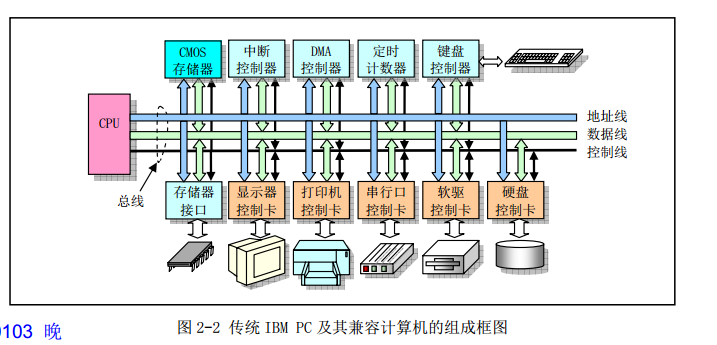
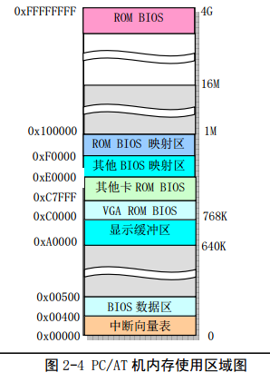
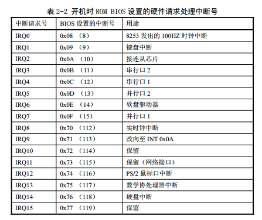

# 微型计算机组成结构

基于intel 80x86中央处理器(CPU)的IBM PC微型计算机及其兼容机的硬件系统。CPU芯片可以直接作为系统处理中心，通过总线接口和其他部分相连。属于PC/AT指具有80386或以上CPU的IBM PC及其兼容微机，PC则泛指微机，包括IBM PC/XT及其兼容微机

# 1 微型计算机组成原理
传统计算机组成：

其中：

* CPU通过地址线、数据线和控制信号组成的本地总线(内部总线)与其他部分进行数据通信。
	* 地址纵向用于提供内存或I/O设备的地址(指明`读/写`数据的具体位置)
	* 数据线用于CPU和内部I/O设备之间提供数据传输的通道
	* 控制线负责执行具体`读/写`操作

80386 CPU的PC机内部地址线和数据线分别为32根，都是32位。寻址空间范围有2的32次方，从0到4GB。

* 上部控制器和存储接口通常集成在计算机主板上，控制器都是一块大规模集成电路芯片为主组成的功能电路。
* 下方控制卡(适配器)则是通过扩展插槽与主板系统总线连接。总线插槽是系统地址总线、数据总线和控制线与扩展设备控制器的标准连接接口。这些总线接口标准通常有：
	* ISA:工业标准总线
	* EISA：扩展工业标准结构总线
	* PCI外围组件互连总线
	* AGP加速图形端口
	
处理CPU以外，现代PC机主板猪油使用2个超大规模芯片构成的芯片组或芯片集组成：`北桥(Northbridge)芯片`和`南桥(Southbridge)芯片`

* 北桥芯片，主要用于与CPU、内存和AGP视频接口，很高的传输速率。北桥芯片还起着存储器控制作用，intel 把芯片标号为MCH（Memory Controller Hub）芯片。
* 南桥芯片用来管理低、中速的组件，如PCI总线、IDE硬盘接口、USB端口等，南桥芯片也叫(I/O Controller Hub).
* 主板位置上北下南，起着CPU桥梁作用。

# 2.I/O端口寻址和访问控制方式
## 2.1 I/O端口和寻址

CPU访问`I/O接口控制器`或`控制卡上的数据`和状态信息，首先指定它们的地址。(I/O端口地址或者简称端口)。

通常一个`I/O控制器`包含访问数据的`数据端口`、输出命令的`命令端口`和访问控制器执行的`状态端口`。端口地址设置两种方式：`统一编址`和`独立编址`。

* 统一编址：把I/O控制器中地址端口地址放入存储器寻址空间范围内。(成为存储器映像地址)，这样CPU范围一个端口和访问内存操作一样。
* 独立编制：I/O控制器和控制卡的寻址空间独立作为地址空间对待，称为I/O地址空间。每个端口有一个I/O控制器地址与之对应，并且使用专门的I/O指令来访问端口。现代PC机，有64KB的I/O地址空间可供使用，Linux查看方式`/proc/ioports`文件看到相关控制器或设置使用的I/O地址范围

## 2.2 接口访问控制

PC机I/O接口`数据传输控制方式`：

* 程序循环查询方式：CPU通过程序中循环查询指定的设置控制中的状态来判断是否与设置进行数据交换。(不需要硬件支持，编程简单，但是耗CPU)
* 中断处理方式：需要中断控制器支持。只有I/O设备通过中断向CPU提出处理请求，CPU才会暂停中断当前执行的程序去执行相应的I/O中断处理服务过程。Linux操作系统大多数设备I/O采用中断方式
* DMA传输方式：(Direct Memory Access)I/O设备与系统内存之间进行批量数据传送，整个过程使用专门DMA控制器来进行无需CPU插手。Linux操作系统中，软盘驱动程序使用中断和DMA方式配合来实现数据的传输工作

# 3.主存储、BIOS和CMOS存储器
## 3.1 主存储器
RAM（内存）

为了与原来PC机软件兼容，系统1MB一下物理内存仍原来一样，只是原来系统的ROM中基本输入输出程序BIOS一直处于CPU能寻址地址的内存最高端位置，而BIOS原来所在位置在计算机开机初始化被用作BIOS影子(Shadow)区域。即BIOS代码仍然会被复制到这个区域中。

## 3.2 基本输入/输出程序BIOS
## 3.3 CMOS存储器
处使用内存和ROM BIOS以外，还需要很少存储容量来存放CMOS(Compementary Metal Oxide Semiconductor，互补金属氧化物半导体)存放计算机实时时钟信息和系统硬件配置信息。CMOS内存的地址空间在基本内存地址空间之前，需要使用I/O指令来访问.

# 4.控制器和控制卡
## 4.1 中断控制器

Linux系统并不直接使用这些PC机默认设置好的中断向量号，初始化时，重新设置中断请求号与中断向量号的对应关系
## 4.2 DMA控制器

PC/AT机Intel 8237芯片使用了两片，因此DMA控制器有8个独立的通道可使用。其中后4个是16位通道。在使用一个通道之前必须首先对其设置，涉及三个端口的操作

* 页面寄存器端口
* (偏移)地址寄存器端口
* 数据计数寄存器端口

由于DMA寄存器是8位，而地址与计数值是16位值，因此各自需要发送两次。
## 4.3 定时/计数器
## 4.4 键盘控制器
## 4.5 串行控制卡
### 4.5.1 异步串行通信原理

## 4.6 显示控制卡
## 4.7 软盘和硬盘控制器
