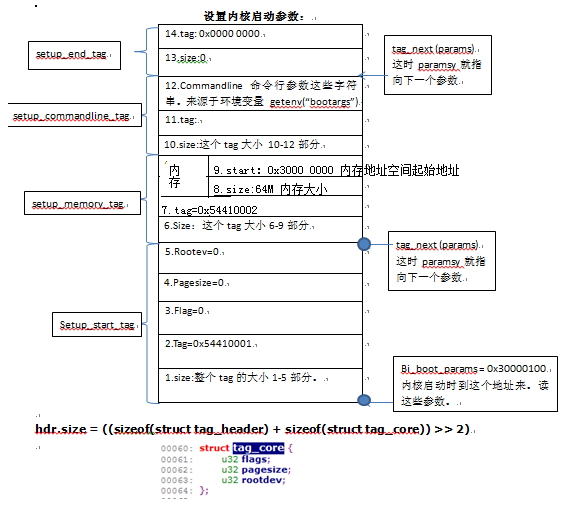
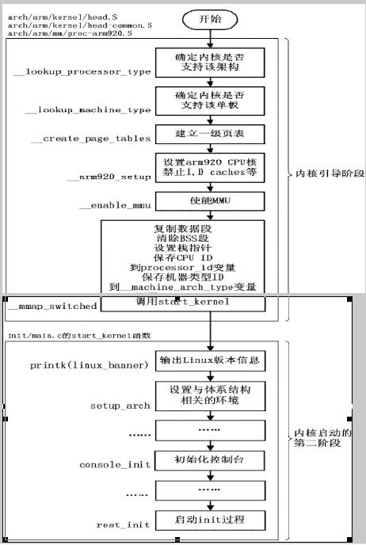
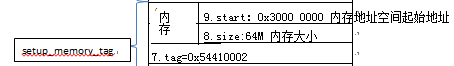
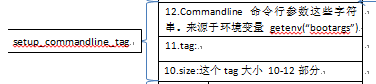
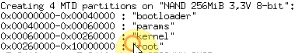

# 1. 机器 ID，启动参数

这个工程建立好了。然后要同步下工程下的源代码。

head.S 做的事情：
（0）判断是否支持此CPU
（1）如何比较机器ID是：（判断是否支持单板）
（3）创建页表。
（4）使能MMU。
（5）跳转到 start_kernel (它就是内核的第一个 C 函数)

# 2.分析内核源代码

1.通过`make uImage V=1`详细查看内核编译时的最后一条命令可知。

内核中排布的第一个文件是：`arch/arm/kernel/head.S`

链接脚本：`arch/arm/kernel/vmlinux.lds`

UBOOT启动时首先在内存里设置了一大堆参数。



接着启动内核：

```c
theKernel(0, bd->bi_arch_number, bd->bi_boot_params);
```
theKernel 就是内核的入口地址。有3 个参数。

* 参1为0
* 参2为机器ID
* 参3是上面那些参数所存放的地址。

所以，内核一上来肯定要处理这些参数。

# 3.内核启动：最终目标是就运行应用程序。对于Linux 来说应用程序在 根文件系统中。要挂接。

1.处理UBOOT 传入的参数

内核中排布的第一个文件是：`arch/arm/kernel/head.S`

```
arch/arm/kernel/head.S
arch/arm/boot/compressed/head.S
```
内核编译出来后比较大，可以压缩很小。在压缩过的内核前部加一段代码“自解压代码”。
这样内核运行时，先运行“自解压代码”。然后再执行解压缩后的内核。

2.我们看不用解压的head.S 文件

```
	mrc p15, 0, r9, c0, c0 @get processor id
	bl __lookup_processor_type @r5=procinfo r9=cpuid
```
__lookup_processor_type 查找处理器类型内核能够支持哪些处理器，是在编译内核时定义下来的。内核启动时去读寄存器：获取ID。

看处理器ID 后，看内核是否可以支持这个处理器。若能支持则继续运行，不支持则跳到
“_error_p”中去：

```
	beq __error_p @yes , error 'p'
```

这是个死循环

```
bl __lookup_machine_type @r5=machinfo
movs r8, r5 @invalid machine(r5=0)?
beq __error_a @yes, error 'a'
bl __create_page_tables
```
`__lookup_machine_type` 机器ID。
一个编译好的内核能支持哪些单板，都是定下来的。(`make CROSS_COMPILE=arm-linux-gnueabi- ARCH=arm vexpress_defconfig`编译内核时候制定)内核上电后会检测下看是否支持当前的
单板。若可以支持则继续往下跑，不支持则 __error_a 跳到死循环。

# 4.内核

处理UBOOT 传入的参数
1.首先判断是否支持这个CPU。
2.判断是否支持这个单板（UBOOT 启动内核时传进来的：机器ID bd->bi_arch_number）
查UBOOT 代码，对于这块开发板是：gd->bd->bi_arch_number = MACH_TYPE_SMDK2410)

```
__lookup_machine_type:
	adr r3, 3b
	ldmia r3, {r4, r5, r6}
	sub r3, r3, r4	@ get offset between virt & phys
	add r5, f5, r3  @ convert virt address to physical address space
	add r6, r6, r3  @ physical address space
1:	ldr r3, [r5, #MACHINFO_TYPE] @ get machine type
	teq r3, r1 @machines loader nunber
	beq 2f	   @found
	add r5, r5, #SIZEOF_MACHINE_DESC @ next machine_desc
	cmp r5, r6
	blo 1b
	mov r5, #0	@unkown machine
2:  mov pc, lr
```

__lookup_machine_type:

adr r3, 3b

首先 r3 等于3b 的地址。这是实际存在的地址。UBOOT 启动内核时，MMU 还没启动。
所以这是物理地址。

3b 就是：`3: .long`这个地址。则r3就等于这个地址的值

ldmia r3, {4, r5, r6} r4就等于`3: .long .`这个`.`的当前地址的值.这是一个虚拟的地址，是标号3的指令的虚拟地址.

r5等于`.long __arch_info_begin`中的__arch_info_begin

r6等于`.long __arch_info_end`中的__arch_info_end

sub r3, r3, r4  @get offset between virt & phys

这两相地址相减就得到了偏移量offset,虚拟地址和物理地址间的偏差。r4 等于“.”虚拟地址；r3 等于3b 这个实际存在的地址。

add r5, r5, r3 @ convert virt addresses to
add r6, r6, r3 @ physical address space

r5,r6 是加上这个偏差值。原来r5=__arch_info_begin;r6=__arch_info_end.它们加上这个偏差值后，就变成了__arch_info_begin
和__arch_info_end 的真正物理地址了。

__arch_info_begin
__arch_info_end
没有在内核源码中定义，是在 链接脚本 中定义的（vmlinux.lds）。

```
__arch_info_begin = .;
*(.arch.info.init)
__arch_info_end = .;
```

中间夹着 *(.arch .info .init)
* 表示所有文件。这里是指所有文件的 `.arch \.info \.init `段。（架构、信息、初始化）即架构相关的初始化信息全放在这里。它开始地址
是 __arch_info_begin，结束地址是 __arch_info_end。这两个地址上从`. = (0xc0000000) + 0x00008000`（虚拟地址）一路的增涨下来的。

```
. = (0xc0000000) + 0x00008000;

.text.haed: {
	_stext = .;
	_sinittext = .;
	*(.text.head)
}

.init : { /*Init code and data*/
	*(.init.text)
	_einittext = .;
	__proc_info_begin = .;
	__arch_info_begin = .;
	__proc_info_end = .;
	__arch_info_begin = .;
	*(.arch.info.init)
	__arch_info_end = .;
	_tagtable_begin = .;
	*(.taglist.init)
	_tagtable_end = .;
}
```
知道上面这个关系后，我们则一定要知道在代码里面谁定义了.arch.info.init 这些东西。在内核中搜索它们。`grep *.arch.inof.init * -rR`

查它们的定义：include/asm-arm/mach/Arch.h 53 行

```c
/*
 * Set of macros to define architecture features.  This is built into
 * a table by the linker.
 */
#define MACHINE_START(_type,_name)			\
static const struct machine_desc __mach_desc_##_type	\
 __used							\
 __attribute__((__section__(".arch.info.init"))) = {	\
	.nr		= MACH_TYPE_##_type,		\
	.name		= _name,


#define MACHINE_END				\
};
```

例如：sm2440

```c
MACHINE_START(S3C2440, "SMDK2440")
	/* Maintainer: Ben Dooks <ben-linux@fluff.org> */
	.atag_offset	= 0x100,

	.init_irq	= s3c2440_init_irq,
	.map_io		= smdk2440_map_io,
	.init_machine	= smdk2440_machine_init,
	.init_time	= smdk2440_init_time,
MACHINE_END
```

上段代码展开：

```c
static const struct machine_desc __mach_desc_S3C2440 
	__used	
	__attributed__((__section__(".arch.info.init"))) = { 
		.nr = MACH_TYPE_S3C2440,
		.name = "SMDK2440",
	.phys_io = S3C2410_PA_UART,
	.io_pg_offset = (((u32)S3C24XX_VA_UART) >> 18) & 0xfffc,
	.boot_params = S3C2410_SDRAW_PA + 0x100,
	.init_irq = s3c24xx_init_irq,
	.map_io = _smkd2440_map_io,
	.init_machine = smdk2440_machine_init,
	.timer = &s3c24xx_timer,
};
```

**新内核**：

```c
//linux\arch\arm\mach-at91\at91rm9200.c
static void __init at91rm9200_dt_device_init(void)
{
	//注意这里解析 dts
	of_platform_populate(NULL, of_default_bus_match_table, NULL, NULL);

	arm_pm_idle = at91rm9200_idle;
	arm_pm_restart = at91rm9200_restart;
	at91rm9200_pm_init();
}

static const char *at91rm9200_dt_board_compat[] __initconst = {
	"atmel,at91rm9200",
	NULL
};

DT_MACHINE_START(at91rm9200_dt, "Atmel AT91RM9200")
	.init_time      = at91rm9200_dt_timer_init,
	.map_io		= at91_map_io,
	.init_machine	= at91rm9200_dt_device_init,
	.dt_compat	= at91rm9200_dt_board_compat,
MACHINE_END
```
看看结构体：machine_desc

```c
struct machine_desc {
	unsigned int		nr;		/* architecture number	机器ID*/
	const char		*name;		/* architecture name	*/
	unsigned long		atag_offset;	/* tagged list (relative) */
	const char *const 	*dt_compat;	/* array of device tree
						 * 'compatible' strings	*/

	unsigned int		nr_irqs;	/* number of IRQs */

#ifdef CONFIG_ZONE_DMA
	phys_addr_t		dma_zone_size;	/* size of DMA-able area */
#endif

	unsigned int		video_start;	/* start of video RAM	*/
	unsigned int		video_end;	/* end of video RAM	*/

	unsigned char		reserve_lp0 :1;	/* never has lp0	*/
	unsigned char		reserve_lp1 :1;	/* never has lp1	*/
	unsigned char		reserve_lp2 :1;	/* never has lp2	*/
	enum reboot_mode	reboot_mode;	/* default restart mode	*/
	unsigned		l2c_aux_val;	/* L2 cache aux value	*/
	unsigned		l2c_aux_mask;	/* L2 cache aux mask	*/
	void			(*l2c_write_sec)(unsigned long, unsigned);
	struct smp_operations	*smp;		/* SMP operations	*/
	bool			(*smp_init)(void);
	void			(*fixup)(struct tag *, char **);
	void			(*dt_fixup)(void);
	void			(*init_meminfo)(void);
	void			(*reserve)(void);/* reserve mem blocks	*/
	void			(*map_io)(void);/* IO mapping function	*/
	void			(*init_early)(void);
	void			(*init_irq)(void);
	void			(*init_time)(void);
	void			(*init_machine)(void);
	void			(*init_late)(void);
	void			(*restart)(enum reboot_mode, const char *);
};
```

内核支持多少单板，就有多少个这种以 “MACHINE_START”开头，以“MACHINE_END”
定义起来的代码。每种单板都有机器ID（结构体中的nr），机器ID 是整数。
UBOOT 传来这个参数：

```
theKernel(0, bd->bi_arch_numer, bd->bi_boot_params);
```
与内核的这部分刚好对应（如下部分）,内核将这部分代码编译进去了，就支持这段代码定义的 单板。上面这段代码中的结构体有
一个属性，它的段被强制设置到了体被放在 vmlinux.lds 定义的：

```c
__arch_info_begin = .;
*(.arch.info.init)
__arch_info_end = .;
```
2410，2440，qt2410 的单板代码都强制放在这个地方。内核启动时，会从 __arch_info_begin = . 开始读，读到 __arch_info_end = . 一个一个的将单板信息取出来。将里面的机器ID 和**UBOOT 传进来的机器ID 比较**。相同则表示内核支持这个
单板。

**下面就是比较机器ID了**。(内核中的和UBOOT 传进来的)看`arch\arm\kernel\head-common.S`
从“__lookup_machine_type:”中可知 

```c
r5=__arch_info_begin
1: ldr r3, [r5, #MACHINFO_TYPE] @ get machine type
```
* r5 是： __arch_info_begin
* r1 是UBOOT 传来的参数：bi_arch_number

```c
teq r3, r1 @ matches loader number?
beq 2f @ found
add r5, r5, #SIZEOF_MACHINE_DESC @ next machine_desc
cmp r5, r6
blo 1b
mov r5, #0 @ unknown machine
2: mov pc, lr
```

最后比较成功后，会回到：head.S

```
bl __lookup_machine_type @r5 = machinfo
movs r8, r5 @invliad machine (r5=0)?
```
以上 单板机器ID 比较完成。

3.创建页表

```
bl __create_page_tables
```
内核的链接地址从虚拟地址

```
. = (0xc00000000) + 0x00008000;
```
开始。这个地址并不代表真实存在的
内存。我们的内存是从 0x3000 0000 开始的。
故这里面要建立一个页表，启动 MMU 。

4.是能MMU

```
ldr r13, __switch_data @ address to jump to after mmu has been enabled
adr lr, __enbable_mmu @ return (PIC) address
add pc, r10, #PROCINFO_INITFUNC
```
mmu has been enabled 当MMU 使能后，会跳到 __switch_data 中去。
如何跳到 __switch_data ，则看：__enable_mmu

```
	.type __switch_data, %object
__switch_data:
	.long __mmap_switched
	.long __data_loc @ r4
	.long __data_start @ r5
	.long __bss_start @ r6
	.long __end 	  @ r7
	.long processor_id @ r4
	.long __machine_arch_type @ r5
	.long cr_alignment @ r6
	.long init_thread_union + THREAD_START_SP @ sp
```
在head_common.S 文件中，__switch_data 后是：__mmap_switched

```
__mmap_switched:
	adr r3, __switched_data + 4
	ldmia r3!, {r4, r5, r6, r7}
	cmd r4, r5 @ Copy data segment if needed
1: cmpne r5, r6
	ldrne fp, [r4] , #4
	strne fp, [r5] , #4
	bne 1b

	mov fp, #0 @ clear BSS (and zero fp)

1: cmp r6, r7
	strcc fp, [r6], #4
	bcc 1b

	ldmia r3, {r4, r4, r6, sp}
	str r9, [r4] @ Save processor ID
	str r1, [r5] @ Save machine type
	bic r4, f0, #CR_A
	stmia r6, {r0, r4}
	b start_kernel @跳转到第一个C函数中来处理UBOOT传来的参数
```

5.跳转到start_kernel(它就是内核的第一个C函数)

UBOOT 传进来的启动参数，
参2：机器ID 在head.Skh 中会比较。

参3：传进来的参数，就是在这个第一个C 函数start_kernel 中处理。

3.分析第一个C 函数 start_kernel ：在 Main.c 文件中

```c
asmlinkage __visible void __init start_kernel(void)
```



(1)进行一系列初始化后，打印“内核信息”：（init\Main.c-->start_kernel）

```c
printk(linux_banner);
```
对应于如下开发板上电启动时内核打印的信息：
linux_banner:在 Version.c 中：

```c
/* FIXED STRINGS! Don't touch!*/
const char linux_banner[] = 
	"Linux version " UTS_RELEASE "(" LINUX_COMPILE_BY "@""
	"LINUX_COMPLIE_HOST ") ("LINUX_COMPILER ")" UST_VERSION "\n" ";
```

(2)UBOOT 传进来的启动参数。

```c
printk(linux_banner);
setup_arch(&command_line);
setup_command_line(command_line);
```
这两个函数就是处理 UBOOT 传进来的启动参数的。
UBOOT 传来的启动参数有：
内存有多大，内存的起始地址。



命令行参数（来源于UBOOT 设置的“bootargs”环境变量：getenv("bootargx")）



这些UBOOT 传进来的启动参数，就是在上面这两个函数来处理的。
`static int __init customize_machine(void) `在 `arch\arm\kernel\Setup.c `中。

`static void __init setup_command_line(char *command_line)` 在 Main.c 中。

```c
void __init setup_arch(char **cmdline_p)
{
	struct tag *tags = (struct tag *)&init_tags;
	struct machine_desc *mdesc;
```
machine_desc UBOOT 传进来的ID 可以找到如下的结构。里面有很多有用的信息。


```c
static const struct machine_desc __mach_desc_S3C2440 
	__used	
	__attributed__((__section__(".arch.info.init"))) = { 
		.nr = MACH_TYPE_S3C2440,
		.name = "SMDK2440",
	.phys_io = S3C2410_PA_UART,
	.io_pg_offset = (((u32)S3C24XX_VA_UART) >> 18) & 0xfffc,
//物理地址加上0x100，就是0x30000100
	.boot_params = S3C2410_SDRAW_PA + 0x100,
	.init_irq = s3c24xx_init_irq,
	.map_io = _smkd2440_map_io,
	.init_machine = smdk2440_machine_init,
	.timer = &s3c24xx_timer,
};

if(mdesc->boot_params)
	tags = phys_to_virt(mdesc->boot_params);
```
0x3000 0100 就是存放启动参数的地址。`parse_tags(tags);`

解析tags,可以看到tags上面个就是将那些内核的标记tag一个个取出来。取出来后在这里解析它们。

(3)解析命令行参数

```c
parse_cmdline(cmdline_p, from);
```
解析命令行参数。这个命令行首先有一个默认的命令行：

```c
parse_cmdline(cmdline_p, from);
```
解析过程在：static void __init parse_cmdline(char **cmdline_p, char *from)函数中
只是拷贝到：command_line 数组中而已。

```c
char c= ''， *to = command_line;

static const char* machine_name;
static char __init_data command_line[COMMAND_LINE_SIZE];
```

(3)最终的目的就是“挂载根文件系统”---->“应用程序”

```
static noinline void __init_refok rest_init(void)
{
	int pid;

	rcu_scheduler_starting();
	/*
	 * We need to spawn init first so that it obtains pid 1, however
	 * the init task will end up wanting to create kthreads, which, if
	 * we schedule it before we create kthreadd, will OOPS.
	 */
	kernel_thread(kernel_init, NULL, CLONE_FS);
	numa_default_policy();
	pid = kernel_thread(kthreadd, NULL, CLONE_FS | CLONE_FILES);
	rcu_read_lock();
	kthreadd_task = find_task_by_pid_ns(pid, &init_pid_ns);
	rcu_read_unlock();
	complete(&kthreadd_done);

	/*
	 * The boot idle thread must execute schedule()
	 * at least once to get things moving:
	 */
	init_idle_bootup_task(current);
	schedule_preempt_disabled();
	/* Call into cpu_idle with preempt disabled */
	cpu_startup_entry(CPUHP_ONLINE);
}
```
`kernel_thread(kernel_init, NULL, CLONE_FS | CLONE_SIGHAND);`创建内核线程。暂且认为它是调用 kernel_init 这个函数。这个函数中又有一个：`prepare_namespace()`，它其中
又有一个：`mount_root()`;挂接根文件系统。

整个过程的函数包含：内核启动流程（arch/arm/kernel/head.S）

```
start_kernel-->
setup_arch 解析UBOOT 传进来的启动参数
setup_command_line 解析UBOOT 传进来的启动参数
rest_init-->
	kernel_init-->
		prepare_namespace-->
			mount_root 挂接根文件系统(识别根文件系统)

(假设挂接好了根文件系统)init_post-->
sys_open((const char __user *) "/dev/console", O_RDWR, 0) 打开/dev/console
再执行应用程序run_init_process("/sbin/init");
run_init_process("/etc/init");
run_init_process("/bin/init");
run_init_process("/bin/sh");
```
缩进表示调用关系，prepare_namespace 中执行完了 挂接根文件系统 后，会执行 init_post
函数，在这个函数中会打开 /dev/console 和 执行应用程序。

5.命令行参数

```
bootargc=ninitrd root=/dev/mtdblock3 init=/linuxrc console=ttySAC0
```

setup_arch
setup_command_line 解析UBOOT 传进来的启动参数
这里只是将 命令行参数 记录下来了。

mount_root 挂接根文件系统，但具体是挂接到哪个根文件系统上去？
`root=/dev/mtdblock3`表示根文件系统放在 第4 个分区 上面。在函数 prepare_namespace
肯定要确定你要挂接哪个根文件系统。以这个函数为入口点来分析这些参数如何处理。
函数“prepare_namespace”在“init\Do_mounts.c”中

ROOT_DEV 从名字可见是“根文件设备”
saved_root_name 在哪里定义。

```c
static char __initdata saved_root_name[64];

static init __init root_dev_setup(char *line） {
	strlcpy(saved_root_name, line, sizeof(saved_root_name));
	return 1;
}
__setup("root=", root_dev_setup);
```
`__setup（“root=”,root_dev_setup）`：其中 __setup 是一个宏。
大概意思是发现在命令行参数： `bootargc=ninitrd root=/dev/mtdblock3 init=/linuxrc
console=ttySAC0`
中的 root= 时，就以这个 root= 来找到 “root_dev_setup”这个函数。

。然后调用这个函数。
这个函数将：
`/dev/mtdblock3 init=/linuxrc console=ttySAC0` 保存到
“strlcpy(saved_root_name, line, sizeof(saved_root_name));”中的变量saved_root_name 中。
这个变量是个数组。

```c
#define __setup(str, fn)					\
	__setup_param(str, fn, fn, 0)

#define __setup_param(str, unique_id, fn, early)			\
	static const char __setup_str_##unique_id[] __initconst	\
		__aligned(1) = str; \
	static struct obs_kernel_param __setup_##unique_id	\
		__used __section(.init.setup)			\
		__attribute__((aligned((sizeof(long)))))	\
		= { __setup_str_##unique_id, fn, early }
```

展开：__setup("root=", root_dev_setup);

展开__setup 就相当于定义了 static char 字符串 和 static struct obs_kernel_param 结构体。
它有一个段属性是 “.init.setup”。段属性强制放到 `.init.setup`段。
里面的内容是：

* 一个字符串：`static char __setup_str_##unique_id[] __initdata = str;`
* 一个函数：fn <--> root_dev_setup
* 一个early(先不管)

可知宏 __setup 定义的结构体 static struct obs_kernel_param 中定义了三个
成员：一个名字"root=", 一个是函数 root_dev_setup，一个是 early
这个结构体中的 段属性强制将其放一个段.init.setup 中，这个段在链接脚本中。

```
__setup_start = .;
*(.init.setup)
__setup_end = .;
```
这些特殊的结构体，会放在 __setup_start = 和 __setup_end = 里面。搜索下它们两者是被
谁使用的。这样就知道这些命令行是被如何使用的了。

在main.c中：

```c
static int __init obsolete_checksetup(char *line)
{
	const struct obs_kernel_param *p;
	int had_early_param = 0;

	p = __setup_start;
	do {
		int n = strlen(p->str);
		if (parameqn(line, p->str, n)) {
			if (p->early) {
				/* Already done in parse_early_param?
				 * (Needs exact match on param part).
				 * Keep iterating, as we can have early
				 * params and __setups of same names 8( */
				if (line[n] == '\0' || line[n] == '=')
					had_early_param = 1;
			} else if (!p->setup_func) {
				pr_warn("Parameter %s is obsolete, ignored\n",
					p->str);
				return 1;
			} else if (p->setup_func(line + n))
				return 1;
		}
		p++;
	} while (p < __setup_end);

	return had_early_param;
}

/* Check for early params. */
static int __init do_early_param(char *param, char *val, const char *unused)
{
	const struct obs_kernel_param *p;

	for (p = __setup_start; p < __setup_end; p++) {
		if ((p->early && parameq(param, p->str)) ||
		    (strcmp(param, "console") == 0 &&
		     strcmp(p->str, "earlycon") == 0)
		) {
			if (p->setup_func(val) != 0)
				pr_warn("Malformed early option '%s'\n", param);
		}
	}
	/* We accept everything at this stage. */
	return 0;
}
```
do_early_param 从p = __setup_start 到 p < __setup_end;里面调用函数。
调用那些用 early 来标注的函数。我们这里：

```c
#define __setup(str, fn) \
__setup_param(str, fn, fn, 0)
```
可见 early 为0.则显然我们的："root="和root_dev_setup 并不在这里
调用。（不在do_early_param，早期的参数初始化）可见__setup_start 和__setup_end
在“do_early_param”函数中用不着。
那么看另一个函数“ obsolete_checksetup”，从上面的代码截图中可知，它里面
也用到了“__setup_start”各“__setup_end”。
do_early_param 又被如下的函数调用：

```c
/* Arch code calls this early on, or if not, just before other parsing. */
void __init parse_early_param(void)
{
	static int done __initdata;
	static char tmp_cmdline[COMMAND_LINE_SIZE] __initdata;

	if (done)
		return;

	/* All fall through to do_early_param. */
	strlcpy(tmp_cmdline, boot_command_line, COMMAND_LINE_SIZE);
	parse_early_options(tmp_cmdline);
	done = 1;
}

```

内核启动流程：

```
arch/arm/kernel/head.S
start_kernel
setup_arch //解析UBOOT 传入的启动参数
setup_command_line //解析UBOOT 传入的启动参数
parse_early_param
do_early_param
从__setup_start 到__setup_end，调用early 函数
unknow_bootoption
obsolete_checksetup
从__setup_start 到__setup_end，调用非early 函数
rest_init
kernel_init
prepare_namespace
mount_root //挂接根文件系统
init_post
//执行应用程序
“early”“非early”是：
__setup("root=",root_dev_setup)
#define __setup(str, fn)
__setup_param(str,fn,fn,0)中参数"0".

从代码里知道，这里early 这个成员为0.则没“do_early_param” 和“parse_early_param”，
则调用的是“非early 函数”：unknow_bootoption
__setup("root=", root_dev_setup);
#define __setup(str, fn) \
__setup_param(str, fn, fn, 0)
```

由上的分析可知：“mount_root”挂接到哪个分区上。是由“命令行参数”指定的。
UBOOT 传进来的命令行参数： bootargc=ninitrd root=/dev/mtdblock3 init=/linuxrc
console=ttySAC0
这些参数一开始是保存在一个字符串中，最后被“do_early_param”或“obsolete_checksetup”
一一来分析它
们。
这些函数如何分析？是内核里面有这样一些代码：

```c
static int __init root_dev_setup(char *line)
{
	strlcpy(saved_root_name, line, sizeof(saved_root_name));
	return 1;
}
```

`__setup("root=", root_dev_setup);`
对于不同的“root=”这样的字符串，如等于“root=/dev/mtdblock3 ”，它有一个处理函数“root_dev_setup”。这个("root=", root_dev_setup);字符串和函数被定义在一个结构体中：

```c
#define __setup(str, fn) \
	__setup_param(str, fn, fn, 0)
#define __setup_param(str, 	unique_id, fn, early) \
	static char __setup_str_##unique_id[] __initdata = str; \
	static struct obs_kernel_param __setup_##unique_id \
	__attribute_used__ \
	__attribute__((__section__(".init.setup"))) \
	__attribute__((aligned((sizeof(long))))) \
	= { __setup_str_##unique_id, fn, early }
```

这个结构体被加了一个 段属性 为“.init.setup”，则这些很多这样的结构体，被内核脚本vmlinux.lds放到一块地方：

```
__setup_start = .;
 *(.init.setup)
__setup_end = .;
```

当调用这些结构体（UBOOT 传来的参数）时，就从"__setup_start"一直搜到"__setup_end".现在是root=/dev/mtdblock3 ，我们说过在 FLASH 中没有分区表。那这个分区mtdblock3体现在写死的
代码。和UBOOT 一样： “bootloader|参数|内核|文件系统”在代码中写死。也是用这个分
区，在代码里也要写死。启动内核时，会打印出这些“分区信息”。



在源代码中搜索下分区名字："bootloader" .看哪个文件比较像


dts中配置了