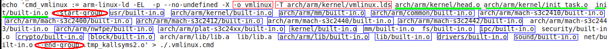

# 内核Makefile

分析Makefile:找到第一个目标文件和链接文件。

* 第一个目标文件（一路跟踪启动过程）
* 链接文件：它表示内核应该放在哪里，里面的代码是如何排布的。

Linux内核Makefile文件分类

* 顶层Makefile:是所有Makefile文件的核心，从总体上控制着内核的编译，链接
* config：配置文件，在配置内核时生成所有Makefile文件(包含顶层目录及子目录)都是根据config来决定使用哪些文件
* arch/$(ARCH)/Makefile:对应体系结构的Makefile，它用来决定哪些体系结构相关的文件与内核的生成，并提供一些规则来生成特定格式的内核映像
* scripts/Makefile.*:Makefile共用的通用规则，脚本等.
* kbuild Makefiles:各级目录下的Makefiles，它们相对简单，被上一层Makefile调用来编译当前目录下的文件

对于Makefile 的文档在`Documentation\kbuild`下的 makefiles.txt 对内核的makefile 讲的很透彻。

# 1.从子目录Makefile看起

每个子目录下都会有个 Makefile 文件

```
obj-$(CONFIG_A2232) += ser_a2232.o generic_serial.o
```

* 若这个变量CONFIG_A2232 在配置文件中被定义成 y 时，则 ser_a2232.c 和generic_serial.c文件会编译成如上图的 .o 文件。最后会链接到内核中去。
* 若这个变量定义成 m 时，则 ser_a2232.c 和generic_serial.c 文件会编译成`.ko`模块文件。

# 2.架构相关的 Makefile 。（arch/$(ARCH)/Makefile）

分析一个 Makefile 时，从它的命令开始分析。编译内核时是直接make 或 make uImage
从顶层Makefile 一直往下走时会涉及到所有的东西。

* 1.`make uImage`                                                                                                                                                                                                                                                                                                                                                                                                                                                                                                                                                                                                                                                                                                                                                                                                                                                                                                                                                                                                                                                                                                                                                                                                                                                                                                                                                                                                                                                                                                                                                                                                                                                                                                                                                                                                                                                                                                                                                                                                                                                                                                                                                                                                                                                                                                                                                                                                                                                                                                                                                                                                                                                                                                                                                                                                                                                                                                                                                                                                                                       
时这个目标 uImage 不在顶层的Makefile 中，在`arch/arm/Makefile`中定义了这个目标。

我们是在顶层目录`make uImage`的，则可知顶层 Makefile 会包含`arch/arm/Makefile`。
在顶层目录的 Makefile 中搜索 “include”:

```
# srctree源码树，ARCH是arm
include $(srctree)/arch/$(ARCH)/Makefile
```

* 2.顶层的`.config`最终会生成`include/linux/autoconf.h`头文件给源码用，另一个是`include/config/auto.config`文件

```
# Read in config
-include include/config/auto.conf
```
* 可见配置文件也被包含到了顶层Makefile 中。

* 可见，配置文件，子目录下的Makefile 都会被包含进顶层的Makefile 中去。则重点分析顶
层Makefile.

# 3.顶层目录的 Makefile.
从make uImage 命令往下分析。

1.目标 uImage 定义在`arch/arm/Makefile `中，找到uImage 目标所在行，查看它相关
的依赖。

```makefile
# Convert bzImage to zImage
bzImage: zImage

BOOT_TARGETS	= zImage Image xipImage bootpImage uImage

$(BOOT_TARGETS): vmlinux
	$(Q)$(MAKE) $(build)=$(boot) MACHINE=$(MACHINE) $(boot)/$@
```
可见 uImage 依赖于 vmlinux

uImage 是一个**头部**+**真正的内核**。所以制作这个uImage 时需要编译出真正的内核。这
个真正的内核显然就是 vmlinux 。
vmlinux 的依赖在顶层目录的 Makefile 中。：`all: vmlinux`

在顶层目录直接输入 make ，默认就是执行第一个目标，"all"就是第一个目标。这个目标也
是依赖于 vmlinux 。即都是要先生成 vmlinux .

2.vmlinux的依赖：

顶层Makefile中

```makefile
# Include targets which we want to
# execute if the rest of the kernel build went well.
vmlinux: scripts/link-vmlinux.sh $(vmlinux-deps) FORCE
ifdef CONFIG_HEADERS_CHECK
	$(Q)$(MAKE) -f $(srctree)/Makefile headers_check
endif
ifdef CONFIG_SAMPLES
	$(Q)$(MAKE) $(build)=samples
endif
ifdef CONFIG_BUILD_DOCSRC
	$(Q)$(MAKE) $(build)=Documentation
endif
ifdef CONFIG_GDB_SCRIPTS
	$(Q)ln -fsn `cd $(srctree) && /bin/pwd`/scripts/gdb/vmlinux-gdb.py
endif
	+$(call if_changed,link-vmlinux)
```

* `scripts/link-vmlinux.sh`:shell脚本
* `$(vmlinux-deps)`：`vmlinux-deps := $(KBUILD_LDS) $(KBUILD_VMLINUX_INIT) $(KBUILD_VMLINUX_MAIN)`
	* `$(KBUILD_LDS)`:链接脚本
	* `$(KBUILD_VMLINUX_INIT)`:一些初始化代码
	* `$(KBUILD_VMLINUX_MAIN)`:一些主要代码


3.分别分析这些变量：在顶层Makefile中

```makefile
# Externally visible symbols (used by link-vmlinux.sh)
export KBUILD_VMLINUX_INIT := $(head-y) $(init-y)
export KBUILD_VMLINUX_MAIN := $(core-y) $(libs-y) $(drivers-y) $(net-y)
export KBUILD_LDS          := arch/$(SRCARCH)/kernel/vmlinux.lds
```

* `$(head-y)`:在顶层目录的Makefile 中没有定义，则会在架构目录下（`arch/arm/Makefile`）的Makefile 中。MMUEXT等于空，相当于`head-y=head.o`

```makefile
#Default value
head-y		:= arch/arm/kernel/head$(MMUEXT).o
```

* `init-y`在顶层 Makefile 中。

```
init-y		:= init/
init-y		:= $(patsubst %/, %/built-in.o, $(init-y))
```

* `%/`代表的是`init/`目录下的所有文件。
* `%/built-in.o` 相当于在 `init/`下的文件全部编译成 `built-in.o`。这个函数的意思是：`init-y := $(patsubst %/, %/built-in.o, $(init-y)) = $(patsubst %/, %/built-in.o, init/) = init/built-in.o`即 init-y 等于 init 目录下所有涉及的那些文件，这些文件会被编译成一个`built-in.o`。,也可以使用`obj=$(dir:%.c=%.o)`效果一样的

vmlinux-main := $(core-y) $(libs-y) $(drivers-y) $(net-y)

* `core-y ：核心`

```
core-y		:= usr/
core-y		+= kernel/ mm/ fs/ ipc/ security/ crypto/ block/
 		     $(core-y) $(core-m) $(drivers-y) $(drivers-m) \

# core-y = usr/built-in.o
core-y		:= $(patsubst %/, %/built-in.o, $(core-y))
```

意思是最后 core-y = usr/built-in.o
+= kernel/built-in.o
+= mm/built-in.o
+= fs/built-in.o
+= ipc/built-in.o
+= security/built-in.o
+= crypto/built-in.o
+= block/built-in.o

就是将这些目录（usr、kernel、mm、fs、ipc、security、crypto、block）下涉及的文件分别
编译成built-in.o 不是所有文件，而是涉及到的文件。

* libs-y：库

```makefile
libs-y		:= lib/
		     $(net-y) $(net-m) $(libs-y) $(libs-m)))
libs-y1		:= $(patsubst %/, %/lib.a, $(libs-y))
libs-y2		:= $(patsubst %/, %/built-in.o, $(libs-y))
libs-y		:= $(libs-y1) $(libs-y2)
```
最后 libs-y = lib/lib.a
+= lib/built-in.o

* drivers-y：驱动

```makefile
drivers-y	:= drivers/ sound/ firmware/
		     $(core-y) $(core-m) $(drivers-y) $(drivers-m) \
drivers-y	:= $(patsubst %/, %/built-in.o, $(drivers-y))
```
意思是最后 drivers-y = drivers/built-in.o (将 drivers 目录下所有涉及的文件编译成
built-in.o 文件)
+= sound/built-in.o (将 sound 目录下所有涉及的编译成 built-in.o 文件)
+= firmware/built-in.o

* net-y：网络

```makefile
net-y		:= net/
		     $(net-y) $(net-m) $(libs-y) $(libs-m)))
net-y		:= $(patsubst %/, %/built-in.o, $(net-y))
```
意思是最后，将 net/目录下的所有涉及到的文件编译 built-in.o 这个文件。

从面的依赖文件展开来看，源材料就是上面这一大堆东西。这些东西如何组合成一个内核
（链接成在一块），要看 vmlinux 如何编译的。

4.vmlinux如何编译

编译时是通过这些命令来编译的。这些命令最终会生成什么东西？可以通过这里一一分析下
去。这里涉及的脚本、函数太庞大了。没精
力去做。想知道上在的源材料如何编译成内核：
方法1：分析 Makefile .
方法2：直接编译内核。看编译过程。
a.rm vmlinux 先删除原来编译得到的内核。
b.make uImage V=1 (V=1 是更加详细的列出那些命令。)
我们关心详细命令的最后一条

我们关心详细命令的最后一条。



```
arm-linux-ld -EL -p --no-undefined -X -o vmlinux （-o 这里生成 vmlinux 了）
-T arch/arm/kernel/vmlinux.lds 链接脚本

arch/arm/kernel/head.o
arch/arm/kernel/init_task.o
init/built-in.o

--start-group
usr/built-in.o
arch/arm/kernel/built-in.o
arch/arm/mm/built-in.o
arch/arm/common/built-in.o
arch/arm/mach-s3c2410/built-in.o
arch/arm/mach-s3c2400/built-in.o
arch/arm/mach-s3c2412/built-in.o
arch/arm/mach-s3c2440/built-in.o
arch/arm/mach-s3c2442/built-in.o
arch/arm/mach-s3c2443/built-in.o
arch/arm/nwfpe/built-in.o
arch/arm/plat-s3c24xx/built-in.o
kernel/built-in.o
mm/built-in.o
fs/built-in.o
ipc/built-in.o
security/built-in.o
crypto/built-in.o
block/built-in.o
arch/arm/lib/lib.a
lib/lib.a
arch/arm/lib/built-in.o
lib/built-in.o
drivers/built-in.o
sound/built-in.o
net/built-in.o
--end-group .tmp_kallsyms2.o
```

链接脚本：`arch/arm/kernel/vmlinux.lds`(决定内核如何排布).
链接脚本vmlinux.lds 是由vmlinux.lds.S 文件生成的。

```lds
# arch/arm/kernel/vmlinux.lds.S
. = (0xc0000000) + 0x0008000;
```
这里一开始便指定了内核放在哪里。这显然是虚拟的地址。

```makefile
.text.head : {
	_stext = .;
	_sinittext = .;
	*(.text.head)
}
```
一开始是放“*”（指所有文件）的 “.text.head”段。

```
.init : { /*Init code and data*/
	*(.init.text)
```

再接着是放所有文件的“.init.text”段。这些所有文件排放在相应的 “段” 中，排放的顺序就是如下“链接脚本”后面“.o”文件的排布顺序：首先放 head.o 的，等等。文件的顺序由上面这些“.o”文件出现的顺序为准。里面的代码段等等其他段的排放由“vmlinux.lds”决定，首先放“.text.head”段，其次是“.init.text”段等依次往下排（参见“vmlinux.lds”内容）。