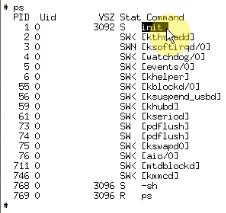

# 1.根文件系统启动分析
## 1.1 启动根文件系统过程
UBOOT:启动内核
内核：启动应用程序
应用程序又是根文件系统上。（要挂接根文件系统）

```
start_kernel
	setup_arch //解析UBOOT 传入的启动参数
	setup_command_line //解析UBOOT 传入的启动参数
	parse_early_param
		do_early_param
			从__setup_start 到__setup_end，调用early 函数
unknow_bootoption
		obsolete_checksetup
从__setup_start 到__setup_end，调用非early 函数
	rest_init
		kernel_init
			prepare_namespace
				mount_root //挂接根文件系统
			init_post
			//执行应用程序
```
执行应用程序在“init_post”这个函数中。

```c
static int noinline init_post(void)
{
	free_initmem();
	unlock_kernel();
	mark_rodata_ro();
	system_state = SYSMTEM_RUNNING;
	numa_default_policy();
	
    // 这里打开 /dev/console 设备
	if(sys_open((const char __user *)"/dev/console", O_RDWR, 0) < 0)
		printk(KERN_WARNNING, "Warning:unable to open an initial console.\n");
	
	(void)sys_dup(0);
	(void)sys_dup(0);
	
	if(ramdisk_execute_command) {
		run_init_process(ramdisk_execute_command);
		printk(KERN_WARNNING , "Failed to execute %s\n",
					ramdisk_executable_command);
	}
	
	/*
	 * We try each of these until one succedds
	 * The Bourne shell can be used instead of init if we are
	 * trying to recover a really broken machine
	 */
	 if(execute_command) {
		run_init_process(execute_command);
		printk(KERN_WARRNING "Failed to execute %s, Attemptiong"
			"default...\n", execute_command);
	 }
	
	 run_init_process("/sbin/init");
	 run_init_process("/etc/init");
	 run_init_process("/bin/init");
	 run_init_process("/bin/sh");

	 panic("Not init found, Try passing init = option to kernel.");
}
```

## 1.2内核如何打开第一个应用程序

1.打开一个设备

```
open(/dev/console)
(void)sys_dup(0)
(void)sys_dup(0)
(void)sys_dup(0)
```
(这三个文件代表标准输入，标准输出，标准错误),写程序时经常用到 printf 标准输出,scanf 标准输入,err()标准错误。它们是指3 个文件。

假设 `open(dev/console)` 是打开的第0 个文件。 sys_dup(0)是指复制的意思，
复制后是第1 个文件，则有了第0 个文件和第1 个文件。第1 个文件也是指向 `/dev/console`
另一个 sys_dup(0) 也是复制文件，则这个是第3 个文件，也是指向 `/dev/console` 这个文件。意思是，所有的printf 打印信息都会从 `/dev/console` 打印出来。

输入时也是从 `/dev/console` 这个文件输入的。想输入错误信息也是从 `/dev/console` 这个文件输出的。这个文件 `/dev/console`对应终端。在我们这个例子中`/dev/console` 对应串口0.
对于其他设备，这个 `/dev/console` 可能是 键盘液晶。

2.用run_init_process 启动第一个应用程序
一般来说第一个应用程序运行后，就不会从系统返回了。这个应用程序：

* 1.要么是UBOOT 传进来的命令行参数： `init=linuxrc`这个样子
* 2.要么是`sbin/init`,要是`sbin/init`不成功，则还有`/etc/init`或`bin/init,bin/sh`

```c
if(execute_command) {
		run_init_process(execute_command);
		printk(KERN_WARRNING "Failed to execute %s, Attemptiong"
			"default...\n", execute_command);
	 }
```
如果有 execute_command 则执行：`run_init_process(execute_command);` 查找execute_command 可知：

```c
static int __init init_setup(char *str)
{
	unsigned init i;
	
	execute_command = str;

	/*In case LILO i going to boot us with default command line,
	 * it prepends "auto" before the whole cmdline which makes
	 * the shell think it should execute a sript whit sucn name,
	 * so we ignore all arguments entered _before_ init = ... [MJ]
	 */
	 for(i = 1; i< MAX_INIT_ARGS; i++)
		argv_init[i] = NULL;

     return 1;
}
__setup("init=", init_setup);
```
`__setup("init=", init_setup);`这是UBOOT 传递给内核的命令行参数。如果
涉及了 "init=" 什么东西，显然这个 execute_command 就是等于 "init=" 后面的
东西。

```
boorargs=noinitrd root=/dev/mtdblock3 init=/linuxrc console=ttySAC0
```
如果设置了 init= 某个文件（linuxrc） ,那么这个 execute_command 就等于这个
文件(linuxrc).如果定义了 execute_command ，则会用run_init_process 启动这个应用程序execute_command。run_init_process(execute_command);若这个程序没有死掉没有返回，那么函数run_init_process 就不会返回。我们第一个程序一般来说都是一个死循环。

若没有定义execute_command，则往下执行：

```c
run_init_process("/sbin/init");
run_init_process("/etc/init");
run_init_process("/bin/init");
run_init_process("/bin/sh");
```
第一个程序一般是死循环，一旦执行了`/sbin/init`这样的程序，就一去不复返了。如这里
若是执行的第一个程序是 "/sbin/init",则就不返回了，不会执行下面的`/etc/init`等另几个
可能作为第一个应用程序的程序。（这里是`/sbin/init`执行不成功，便执行`/etc/init`。这个
也不成功，则继续去执行`/bin/init`等）。

## 1.3测试
先在UBOOT 中擦除文件系统：`nand erase root`,再启动 boot.


这是删除掉根文件系统时的打印信息。
要打开应用程序，首先要挂接根文件系统。打印信息中显示已经挂接上根文件系统了：

```
VFS:Mounted root(yaffs filesystem)
```

对于FLASH 来说，把FLASH 擦除了就相当于格式化了。你可以把它当成任何一种文件系统。
这里显示是默认当成 yaffs filesystem。这里已经挂接上去了。但是里面是没有内容的。就
没法启动应用程序了。这样打开显然是会失败的：

```c
if(sys_open((const char __user *)"/dev/console", O_RDWR, 0) < 0)
		printk(KERN_WARNNING, "Warning:unable to open an initial console.\n");
```

再看

```
boorargs=noinitrd root=/dev/mtdblock3 init=/linuxrc console=ttySAC0
```
可见 execute_command 定义的是 init=/linuxrc ，擦除了FLASH 后也找不到了。故错误：

再次关开发板电再上电，在UBOOT 中：dowload root_yaffs image 下载文件系统。再输入“b”
启动。
最后串口可以接收输入，是因为有应用程序在跑了。




可见第一个应用程序：init 是内核启动的第一个应用程序。
其中的 -sh 就是当前的应用的程序，就是当前接收这个串口。输入字符回显字符。就是
sh 这个程序接收这些东西。
# 2.根文件系统源码分析1
想知道这个文件系统里有哪些东西。就得跟着 init 进程分析，看下这个朝向需要哪些东西。

```c
run_init_process("/sbin/init");
```
文件系统中有很多命令。若很多，则一个一个编译会很麻烦。在嵌入式中有个busybox.它是
一系列命令的组合。编译busybox 时，得到一个应用程序busybox,像ls,cp 等命令就是到这
个busybox的链接。执行ls 时，实质上是执行busybox ls.这个init 进程也是到busybox 的链接。所以要知道 init 进制做的哪些事，就得看 busybox 源码。

## 2.1 建立 busybox 源码SI 工程，加入全部代码

我们执行cp 命令时，最终busybox 会调用这个子函数 int cp_main()
```c
int cp_main(int argc, char **argv);
```
也有一个 init.c 的程序。也有 init_main 函数。

```c
int init_main(int argc, char **argv)
```
**猜测init程序要做的事情**

UBOOT 的目标是启动内核，内核的目的是启动应用程序，第一个应用程序是`/sbin/init`或
其他init），但最终目标还是启动客户的“用户应用程序”。如手机程序；监控程序等。

这样显然会有一个“配置文件”，在这个文件里指定需要执行哪些不同客户的“应用程序”。
故 init 程序要读取这个：配置文件.再解析这个：配置文件
根据这个“配置文件”：执行客户的用户程序

分析init.c源码：

```c
signal(SIGHUP, exec_signal);
signal(SIGQUIT, exec_signal);
signal(SIGUSR1, shtdown_signal);
signal(SIGUSR2, shtdown_signal);
signal(SIGINT, ctraltdel_signal);
signal(SIGTERM, shutdown_signal);
signal(SIGCONT, cont_handler);
signal(SIGSTOP, stop_handler);
signal(SIGTSTP, stop_handler);
```
这些是信号处理函数。里面有 ctrl+alt+del 信号。

`console_init();`控制台初始化。

```c
if(sys_open((const char __user *)"/dev/console", O_RDWR, 0) < 0)
		printk(KERN_WARNNING, "Warning:unable to open an initial console.\n");
	
	(void)sys_dup(0);
	(void)sys_dup(0);
```
这里初始化这3 个文件（标准输入、输出、错误）。3 个文件都指向 /dev/console 设备。

1.找到配置文件。`/etc/inittab`
linux 内核启动`run_init_process("/sbin/init");`这个应用程序时，没有给参数。

```c
if(argc > 1  //linux 内核启动没有参数
	&& （!strcmp(argv[1], "single") || !strcmp(argv[1], "-s") || LONE_CHAR(argv[1], '1')）{
		/* Start a shell on console*/
		new_init_action(REPSAWN, bb_default_login_shell, "");
	} else {
		/*Not in single user mode -- see what inittab says
		 * then parse_inittab() simply adds in some default
		 * action(i,e., runs INIT_SCRIPT and then starts a pair
		 * of "askfirst" shells
		 */
		 parse_inittab();
	}
```
Busybox 调init_main，init_main 调用 parse_inittab()这个函数。从名字可知是“解析inittab”
表。
分析这个函数（解析 inittab 文件）。

```c
	file = fopen(INITTAB, "r");
#define INITTAB "/etc/initab"
```
这就是配置文件。linux 系统中，配置文件一般放在 /etc/ 目录下。

2.分析/etc/initab配置文件
在busybox 中有inittab 说明文档。

```
inittab格式: <id>:<runlevels>:<action>:<process>
```
是启动不同用户的应用程序。则会有:
指定要执行的程序。
何时执行程序。

id 项：/dev/id 用作终端（终端：stdin-printf,stdout-scanf,stderr-err）
会加上一个 /dev 前缀。作为“控制终端”（controlling tty）。
id 可以省略。
runlevels 项：
完全可以忽略掉。
action 项：
指示程序何时执行。
process 项：
是应用程序或脚本。

3.配置文件结构体和链表

```c
	file = fopen(INITAB, "r");
	if(file == NULL) {
		/* No inittab file -- set up some default behavior*/
#endif
		// Reboot on Ctrl-Alt-Del
		new_init_action(CTRLALTDEL, "reboot");
		//Unmount all fileystems on halt/reboot
		new_init_aciton(SHUTDOWN, "unmount -a -r", "");
		//Swapoff on ahlt/reboot
		if(ENABLE_SWAPONOFF) new_init_action(SHUTDOWN, "swapoff -a");
		//Prepare to restart init when a HUP is received
		new_init_action(RESTART, "init", "");
		//Askfirst shell tty1-4
		new_init_action(ASKFIRST, bb_default_login_shell, "");
		new_init_action(ASKFIRST, bb_default_login_shell, VC_2);
		new_init_action(ASKFIRST, bb_default_login_shell, VC_3);
		new_init_action(ASKFIRST, bb_default_login_shell, VC_4);

		//sysinit
		new_init_action(SYSINIT, INIT_SCRIPT, "");
		return;
#if ENABLE_FEATURE_USE_INITAB
	}
```
可见如果 INITTAB 文件不能打开"if(file==NULL)"，则会有“默认配置项”。上面是默认项。

```c
	while(fgets(buf, INIT_BUFFS_SIZE, file) != NULL) {
```

如果 file 接收文件 INITTAB 可以找开，则放到一个缓冲区去解析。

```c
//如果遇到 # 号，则跳过去忽略不执行。
if(*id == '#' || *id == '\n')
	continue;

// id 加一个 /dev 前缀。
if(strncmp(id, "/dev/", 5) == 0)
	id += 5;
```
解析完后，最终执行:

```c
new_init_action(a->action, command, id);
```
不论是否有 inittab 这个文件，都会用到这个函数 new_init_action，则需要分析它。以下面例子来分析：`new_init_action(ASKFIRST, bb_default_login_shell, VC_2);`

```c
// VC_2等于 "/dev/tty2"
new_init_action(ASKFIRST, bb_default_login_shell, VC_2)
#define ASKFIRST 0x004
extern const char bb_default_login_shell[];

// Message.c中
const char bb_default_login_shell[] ALIGN1 = LIBBB_DEFAULT_LOGIN_SHELL //"- bin/sh"
```
变为：`new_init_action(0x004, "-/bin/sh", "/dev/tty2")`

函数原型：`static void new_init_action(int action, const char *command, const char *cons)`

* 参一 action ：应用程序执行的时机。
* 参二 *command ：应用程序或脚本----“"-/bin/sh"”
* 参三 *cons ：这是 id 应用终端---“"/dev/tty2"”

```c
static void new_init_action(int action, const char *command, const char *cons)
{
	struct init_action *new_action, *a, *last;

	if(strcmp(cons, bb_dev_null) == 0 && (action & ASKFIRST))
		return;

	// Append to the end of the list
	for(a = last = init_action_list; a; a= a->next) {
		//don;t enter action if it's already in the list,
	    // but do overwrite existing actions
		if((strcmp(a->command, command)==0) && (strcmp(a->terminal, cons)==0) {
			a->action = action;
			return;
		}
		last = a;
	}

	new_action = xzalloc(sizeof(struct init_action));
	if(last) {
		last->next = new_aciton;
	} else {
		init_aciton = new_action;
	}
	strcpy(new_action->command, command);
	new_aciton=>action = action;
	strcpy(new_action->terminal, cons);
	messageD(L_LOG | L_CONSOLE, "command='%s' action=%d tty='%s'\n",
			new_aciton->command, new_action->action, new_action->termianl);
}
```
里面有一个链表： init_action_list .和结构体：

```c
struct init_action {
	struct init_action *new; //链表
	init action;	//执行时机
	pid_t pid;      //进程号
	char command[INIT_BUFFS_SIZE]; //对应执行程序 bin/sh
	char termianl[CONSOLE_NAME_SIZE]; // /dev/tty2
};
```
从上面可知：new_init_action 这个函数
①.创建结构体 init_action，填充：执行时机，对应执行程序，终端
②.将结构体放入链表 init_action_list

若原来链表中已经有个结构和传进来的`action,*command,*cons` 一样就覆盖它。若没有，则分配一块内存，相当于创建一个init_action 结构。将传进来的
action,command,cons 写进链表。

4.从默认的new_init_aciton反推默认的配置文件

```
/* Reboot on Ctrl-Alt-Del */
new_init_action(CTRLALTDEL, "reboot", "");
这里id为空，runlevels 忽略。action是“CTRLALTDEL”;应用程序是“reboot”。
：：ctrlaltdel:reboot
/* Umount all filesystems on halt/reboot */ 当关闭或重启系统时卸载所有的文件系统
new_init_action(SHUTDOWN, "umount -a -r", "");
::shutdown:umount -a -r
/* Swapoff on halt/reboot */
当PC机有资源不够用时，会将当前内存中的某些应用程序置换到硬盘上。嵌入式中不同这项。
if (ENABLE_SWAPONOFF) new_init_action(SHUTDOWN, "swapoff -a", "");
/* Prepare to restart init when a HUP is received */
new_init_action(RESTART, "init", "");
::restart:init
/* Askfirst shell on tty1-4 */
new_init_action(ASKFIRST, bb_default_login_shell, "");
::askfirst:-/bin/sh
new_init_action(ASKFIRST, bb_default_login_shell, VC_2);
tty2::askfirst:-/bin/sh
new_init_action(ASKFIRST, bb_default_login_shell, VC_3);
tty3::askfirst:-/bin/sh
new_init_action(ASKFIRST, bb_default_login_shell, VC_4);
tty4::askfirst:-/bin/sh
/* sysinit */
new_init_action(SYSINIT, INIT_SCRIPT, "");
::sysinit:/etc/init.d/rcS
```
则如果UBOOT 没有传配置文件，则会构造出如上这些默认内容。
ENABLE_SWAPONOFF 在PC 机上如果系统资源不够。会将当前内存中的某些应用程序置放
到硬盘上去，
再将新的程序调到内存中。但嵌入式系统一般不会用。

5.可见，parse_ininttab 解析这个inittab 时，先打开`/etc/inittab`。
再创建很多结构放到链表中

①.程序调用关系：

```c
busybox--> init_main
parse_inittab
file = fopen(INITTAB,"r") //打开配置文件 /etc/inittab
new_init_action // 创建 init_action 结构，填充数据，将结构放到链表init_action_list
// 可见解析inittab后（parse_inittab）得到链表init_action_list，
// 链表里面放有id,执行时机，应用程序。接着再执行。
run_actions(SYSINIT) // 执行，run_actions是复数，故这里是运行 SYSINIT 这一类的动作
waitfor(a, 0); // 执行应用程序，等待它执行完毕。

run(a) // 创建process子进程，就是inittab结构中的 process中指定的应用程序（如-/bin/sh）
waitpid(runpid, &status, 0) //等待它结束

delete_init_action(a); // 将这个init_action结构从init_action_list链表中删除掉。
// 所以用SYSINIT定义的应用程序，执行完一次就扔掉了。
run_actions(WAIT) //与SYSINIT是一样的，只是比SYSINIT后执行。（和上面SYSINIT执行过程一样)

(a->action & (SYSINIT | WAIT | CTRALLTDEL | SHUTDOWN | RESTART))
waitfor(a, 0);

run(a)
waitpid(runpid, &status, 0)
delete_init_action(a);
run_actions(ONCE) //对于“ONCE”这类程序，init进程不会等待它执行完毕（无waitfor函数下调用的waitpid
函数）。
run(a);
delete_init_action(a);
接着是“run_actions中的

(a->action & (RESPAWN | ASKFIRST))
”先运行RESPAWN类，再运行ASKFIRST类。
while (1) {  //这是个死循环。
	run_actions(RESPAWN);
	if (a->pid == 0) {//只有它们的pid为0时才执行，开始pid是等于0的，若使用了它则给你赋个PID。
	a->pid = run(a);
}
run_actions(ASKFIRST);
if (a->pid == 0) { //只有pid为0时才执行。
	a->pid = run(a);
打印nPlease press Enter to activate this console.
```
等待回车：`while(read(0, &c, 1) == 1 && c != '\n')`不会不往下走
接着创建子进程BB_EXECVP

`wpid = wait(NULL); //等待子进程退出。`只要任意一个子进程退出时，这个子进程的pid 就设
置为0。然后回到`while(1)`开始处重新运行，但并不是重新运行所有的子进程，而是运行
那个已经退出来的子进程。

```c
while(wpid > 0) {
	a->pid = 0; //推出后，就使pid = 0,就退出了上面的循环
}

else if(a->action & (SYSINIT | WAIT | CTRLALTDEL | SHUTDOWN | RESTART)) {
	waitfor(a, 0);
	delete_init_aciton(a);
}
```
run_actions(SYSINIT) 与 run_actions(WAIT) 一样。只是SYSINIT 先执行。

```c
else if(a->action & ONCE) {
	run(a);
	delete_init_action(a);
}
```
但 ONCE 和 SYSINIT、WAIT 不一样。init 程序不会等待 ONCE 这一类程序执行完毕。
`run_actions(ASKFIRST);`如果是ASKFIRST 时，在run(a)函数中也有区别，会打印信息：

```c
	if(a->action & ASKFIRST) {
		static const cahr press_enter[] ALIGN1 =
#ifdef CUSTOMIZED_BANNER
#include CUTOMIZED_BANNER
#endif
	"\nPlease press Enter to acivate this console.";
full_write(1, press_enter, sizeof(press_enter) -1);
while(read(0, &c, 1) ==1 && c != '\n') //等待回车
```
“1”是标准输出。“\nPlease press Enter to activate this console.”再等待“回车键”。
以上便是SYSINIT ASKFIRST,

什么时候执行是由 action 决定的，action 的状态：`sysinit`, `respawn`, `askfirst`, `wait`, `once`,`restart`, `ctrlaltdel`, and `shutdown`.
还有其他action 状态（restart,shutdown 等）。一开始时，有设置“信号量

```c
signal(SIGHUP, exec_signal);
signal(SIGQUIT, exec_signal);
signal(SIGUSR1, shtdown_signal);
signal(SIGUSR2, shtdown_signal);
signal(SIGINT, ctraltdel_signal);
signal(SIGTERM, shutdown_signal);
signal(SIGCONT, cont_handler);
signal(SIGSTOP, stop_handler);
signal(SIGTSTP, stop_handler);
```
如上按下ctrlaltdel 时，内核会给 init 进程发一个信号 SIGINT。init 收到SIGINT 信号时，就
会执行“ctrlaltdel_signal”信号处理函数。

```c
static void ctrlaltdel_signal(int sig ATTRIBUTE_UNUSED)
{
	run_actions(CTRLALTDEL);
}
```
表明会去执行 CTRLALTDEL 这一类的应用程序。这些状态是什么，busybox 的文档说明中没有，这里只能看源码。如上，run_actions(SYSINIT)
首先执行的是 SYSINIT 这一类，依次如上。（接着执行“run_actions(WAIT)”--"run_actions(ONCE)"）
如上执行关系表。

2.分析run_aciton()

```c
static void run_actions(int action)
{
	struct init_action *a, *tmp;
	for(a = init_aciton_list; a; a = tmp) {
		tmp = a->next;
		if(a->aciton = action) {
			//a->terminal of "" means init's console
			if(a->terminal[0] && access(a->terminal, R_OK | W_OK) {
				delete_init_action(a);
			} else if(a->action & (SYSINIT | WAIT | CTRLALTDEL | SHUTDOWN | RESTART)) {
				//等待执行完毕
				waitfor(a, 0);
				//执行完就扔掉这个aciton
				delete_init_action(a);
			} else if(a->action & ONCE) {
				run(a);
				delete_init_aciton(a);
			} else if(a->action & (RESPAWN | ASKFIRST) {
				// Only run stuff with pid == 0, If they have
				// a pid, that means it is still running
				if(a->pid == 0) {
					a->pid = run(a);
				}
			}
		}
	}
}
```
`run_actions(SYSINIT)`,SYSINIT 故名系统初始化，用SYSINIT 定义了那些inittab 结构中的
process 进程。是在最开始时便执行的。并且执行的时候，这个 init 程序会等待这个子进程
结束（waitfor(a, 0);）。结束后再将这个子进程从链表中删掉，（delete_init_action(a); 将这个init_action 结构从init_action_list 链表中删除掉。

```c
static int waitfor(const init_action *a, pid_t pid)
{
	int runpid;
	int status, wpid;
	
	runpid = (NULL == a) ? pid : run(a);
	while (1) {
		wpid = waitpid(runpid, &status, 0);
		if(wpid == runpid)
			break;
		
		if (wpid == -1 && errno == ECHILD)
			break;

		//FIXME other errors should maybe trigger an error, but allow
		// to programe to continue
	}
	
	return wpid;
}
```

init.c 中还有如下：

```c
BB_EXECVP(cmdpath, cmd);

#define BB_EXECVP(prog, cmd) excvp(prog, cmd)
```
这是个系统调用，创建子进程。

### 总结：最小的根文件系统需要的项：（init 进程需要）
1.打开终端：`/dev/console`，`/dev/NULL`
不设置inittab 格式中的id(标准输入、输出和标准错误)时，就定位到 `/dev/NULL` 中去。
2.init 程序本身就是 busybox .
3.需要配置文件：`/etc/inittab`
4.配置文件若指定了某些应用程序或执行脚本--这些必须存在，不存在会有默认的。
5.应用程序需要 库（fopen、fwrite 等函数需要

