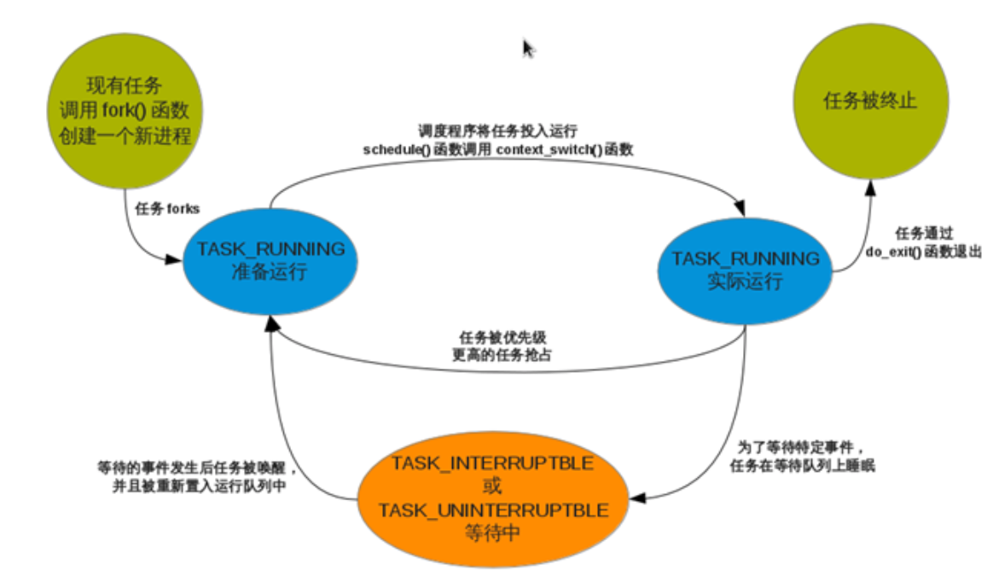
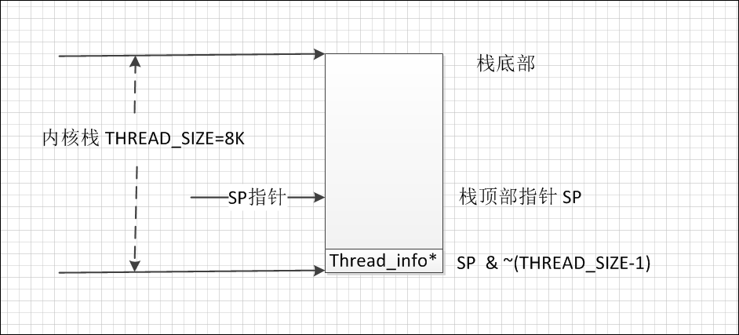

进程是所有操作系统的核心概念，同样在linux上也不例外。

主要内容:

* 进程和线程
* 进程的生命周期
* 进程的创建
* 进程的终止

# 1.进程和线程

进程和线程是程序运行时状态，是动态变化的，进程和线程的管理操作(比如，创建，销毁等)都是有内核来实现的。

Linux中的进程于Windows相比是很轻量级的，而且不严格区分进程和线程，线程不过是一种特殊的进程。

所以下面只讨论进程，只有当线程与进程存在不一样的地方时才提一下线程。

进程提供2种虚拟机制：**虚拟处理器**和**虚拟内存**

* 每个进程有独立的虚拟处理器和虚拟内存，
* 每个线程有独立的虚拟处理器，同一个进程内的线程有可能会共享虚拟内存。

内核中进程的信息主要保存在task_struct中(`include/linux/sched.h`)

进程标识PID和线程标识TID对于同一个进程或线程来说都是相等的。Linux中可以用ps命令查看所有进程的信息：`ps -eo pid,tid,ppid,comm`

# 2.进程的生命周期
进程的各个状态之间的转化构成了进程的整个生命周期。



# 3.进程的创建
Linux中创建进程与其他系统有个主要区别，Linux中创建进程分2步：`fork()`和`exec()`。

* fork: 通过拷贝当前进程创建一个子进程
* exec: 读取可执行文件，将其载入到内存中运行

fork查找方法:

`arch/arm/kernel/calls.S`文件中,CALL(sys_fork)，可以跳转到`kernel/fork.c`中

```c
#ifdef __ARCH_WANT_SYS_FORK
SYSCALL_DEFINE0(fork)
{
#ifdef CONFIG_MMU
    return do_fork(SIGCHLD, 0, 0, NULL, NULL);
#else
    /* can not support in nommu mode*/
    return -EINVAL;
#endif
}
```
其中`SYSCALL_DEFINE0`定义在`include/linux/syscalls.h`中

```c
#define SYSCALL_DEFINE0(sname)  \
    SYSCALL_METADATA(_##sname, 0);  \
    asmlinkage long sys_##sname(void)
```

* 其中下面函数声明很好理解展开函数形式:

```c
asmlinkage long sys_fork(void) 
{
}
```
* METADATA展开,syscall traces 使用

```c
#define SYSCALL_METADATA(sname, nb, ...)    \
    static const char *type_##sname[] = {   \
        __MAP(nb,__SC_STR_TDECL,__VA_ARGS__) \
    };                                      \
    static const char *arg_##sname[] = {    \
        __MAP(nb, __SC_STR_ADECL,__VA_ARGS__) \
    };                                      \
    SYSCALL_TRACE_ENTER_EVENT(sname);       \
    SYSCALL_TRACE_EXIT_EVENT(sname);        \
    static struct syscall_metadata __used   \
        __syscall_meta_##sname = {        \
            .name = "sys"#sname,        \
            .syscall_nr = -1, /* Filled in at boot */ \
            .nb_args = nb,           \
            .types = nb ? types_##sanme : NULL ,\
            .args = nb ? args_##sname : NULL, \
            .enter_event = &event_enter_##sname, \
            .exit_event = &event_exit_##sname, \
            .enter_fileds = LIST_HEAD_INIT(__syscall_meta_##sname.enter_fields), \
    };                                          \
    static struct syscall_metadata __used \
        __attribute__((section("__syscalls_metadata"))) \
        *__p_syscall_meta_##sname = &__syscall_meta_##sname;
```
## 3.1创建的流程：

* 1.调用`dup_task_struct(current)`为新进程分配内核栈，task_struct等，其中的内容与父进程相同。

关于current分析,current类型为`task_struct`,表示当前进程结构体。来自宏`#define current get_current()`,其中`get_current()`也是一个宏`#define get_current() (current_thread_info()->task)`(路径：`include/asm-generic/current.h`)



arm的具体实现是在`arch/arm/include/asm/thread_info.h`

```c
/* how to get the current stack pointer in C*/
register unsigned long current_statck_pointer asm("sp");

/* how to get the thread information struct from C*/
static inline struct thread_info *current_thread_info(void) __attribute_const__;
static inline struct thread_info *current_thread_info(void)
{
    return (struct thread_info *)
        (current_stack_pointer & ~(THREAD_SIZE -1));
}
```

其中thread_info结构体:

```c
struct thread_info {
    unsigned long flags; /* low level flags*/
    int preempt_count; /* 0=> preemptable(抢占), <0 =>bug*/
    mm_segment_t addr_limit; /* address limit */
    struct task_struct *task; /* main task structure*/
    __u32 cpu; 
    __32 cpu_domain;
    struct cpu_context_save cpu_context;
    __u32 syscall; /* syscall number*/
    __u8 used_cp[16]; /* thread used copro(协同处理) */
    unsigned long tp_value[2]; /* TLS registers */
    union fp_state fpstate __attribute__((aligned(8)));
    union vfp_state vfpstate;
};
```
当内核线程执行到此处时，其SP堆栈指针指向调用进程所对应的内核线程的栈顶。通过`sp & ~(THREAD_SIZE-1)`向上对齐，达到栈底部。
 将结果强制类型转换为thread_info类型，此类型中有一个成员为task_struct，它就是 当前正在运行进程的 task_struct指针。
备注：
 在内核中，进程的task_struct是由slab分配器来分配的，slab分配器的优点是对象复用和缓存着色
 联合体：

```c
#define THREAD_SIZE 8192 //内核线程栈8k
union thread_union {
    struct thread_info thread_info;
    unsigned long stack[THREAD_SIZE/sizeof(long)];//stack 8k,union 联合体的地址严格按照小端排布
    //因此内核栈的低位地址是thread_info结构体
};
```

整个8K的空间，顶部供进程堆栈使用，最下部为thread_info。从用户态切换到内核态时，进程的内核栈还是空的，所以sp寄存器指向栈顶，一旦有数据写入，sp的值就会递减，内核栈按需扩展，理论上最大可扩展到`8192- sizeof(thread_info)`大小，考虑到函数的现场保护，往往不会有这么大的栈空间。内核在代表进程执行时和所有的中断服务程序执行时，共享8K的内核栈。


* 2.check新进程(进程数目是否超出上限等)

3. 清理新进程的信息(比如PID置0等)，使之与父进程区别开。
4. 新进程状态置为`TASK_UNINTERRUPTIBLE`
5. 更新task_struct的flags成员。
6. 调用`alloc_pid()`为新进程分配一个有效的PID
7. 根据`clone()`的参数标志，拷贝或共享相应的信息
8. 做一些扫尾工作并返回新进程指针

创建进程的`fork()`函数和`clone()`实际上最终是调用`do_fork()`函数。创建线程和进程的步骤一样，只是最终传给`do_fork()`函数的参数不同。比如，

* 通过一个普通的fork来创建进程，相当于：`do_fork(SIGCHLD, 0)`
* 创建一个和父进程共享地址空间，文件系统资源，文件描述符和信号处理程序的进程，即一个线程:`do_fork(CLONE_VM | CLONE_FS | CLONE_FILES | CLONE_SIGHAND, 0)`

在内核中创建的内核进程与普通的进程之间还有个主要区别在于：内核线程没有独立的地址空间，它们只能在内核空间运行。这与之前提到的Linux内核是个**单内核有关**。

# 4.进程的终止

和创建进程一样，终结一个进程同样有很多步骤：

* 子进程上的操作(do_exit)
	1. 设置task_struct中的标识成员设置为PF_EXITING
	2. 调用`del_timer_sync()`删除内核定时器, 确保没有定时器在排队和运行
	3. 调用`exit_mm()`释放进程占用的mm_struct
	4. 调用`sem__exit()`，使进程离开等待IPC信号的队列
	5. 调用`exit_files()`和`exit_fs()`，释放进程占用的文件描述符和文件系统资源
	6. 把`task_struct`的exit_code设置为进程的返回值
	7. 调用`exit_notify()`向父进程发送信号，并把自己的状态设为EXIT_ZOMBIE
	8. 切换到新进程继续执行

子进程进入EXIT_ZOMBIE之后，虽然永远不会被调度，关联的资源也释放掉了，但是它本身占用的内存还没有释放，比如创建时分配的内核栈，task_struct结构等。这些由父进程来释放。

* 父进程上的操作(release_task)

父进程收到子进程发送的`exit_notify()`信号后，将该子进程的进程描述符和所有进程独享的资源全部删除。

从上面的步骤可以看出，必须要确保每个子进程都有父进程，如果父进程在子进程结束之前就已经结束了会怎么样呢？

子进程在调用`exit_notify()`时已经考虑到了这点。如果子进程的父进程已经退出了，那么子进程在退出时，`exit_notify()`函数会先调用`forget_original_parent()`，然后再调用`find_new_reaper()`来寻找新的父进程。`find_new_reaper()`函数先在当前线程组中找一个线程作为父亲，如果找不到，就让init做父进程。(init进程是在linux启动时就一直存在的)

