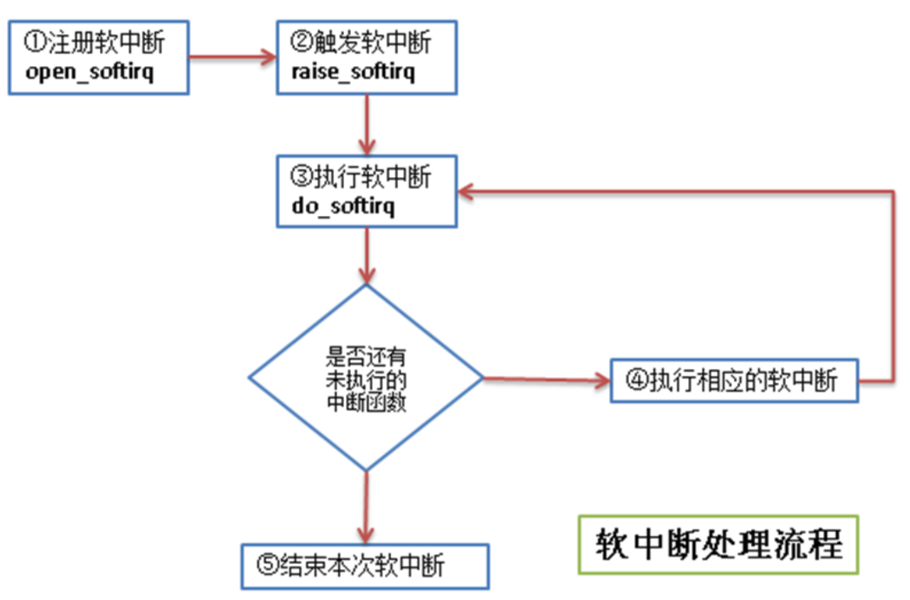
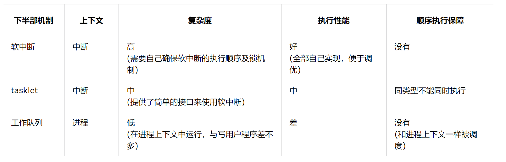

在前一章也提到过，之所以中断会分成上下两部分，是由于中断对时限的要求非常高，需要尽快的响应硬件。

主要内容：

* 中断下半部处理
* 实现中断下半部的机制
* 总结中断下半部的实现
* 中断实现示例

# 1.中断下半部处理
那么对于一个中断，如何划分上下两部分呢？哪些处理放在上半部，哪些处理放在下半部？

这里有一些经验可供借鉴：

1. 如果一个任务对时间十分敏感，将其放在上半部
2. 如果一个任务和硬件有关，将其放在上半部
3. 如果一个任务要保证不被其他中断打断，将其放在上半部
4. 其他所有任务，考虑放在下半部

# 2.实现中断下半部的机制
实现下半部的方法很多，随着内核的发展，产生了一些新的方法，也淘汰了一些旧方法。

目前使用最多的是以下3中方法

* 软中断
* tasklet
* 工作队列

## 2.1 软中断
软中断的代码在：`kernel/softirq.c`

软中断的流程如下：



流程图中几个步骤的说明：
① 注册软中断的函数 open_softirq参见 `kernel/softirq.c`文件)

```
/* 
 * 将软中断类型和软中断处理函数加入到软中断序列中
 * @nr                                 - 软中断类型
 * @(*action)(struct softirq_action *) - 软中断处理的函数指针
 */
void open_softirq(int nr, void (*action)(struct softirq_action *))
{
    /* softirq_vec是个struct softirq_action类型的数组 */
    softirq_vec[nr].action = action;
}
```
软中断类型目前有10个，其定义在 `include/linux/interrupt.h` 文件中：

```
enum
{
    HI_SOFTIRQ=0,
    TIMER_SOFTIRQ,
    NET_TX_SOFTIRQ,
    NET_RX_SOFTIRQ,
    BLOCK_SOFTIRQ,
    BLOCK_IOPOLL_SOFTIRQ,
    TASKLET_SOFTIRQ,
    SCHED_SOFTIRQ,
    HRTIMER_SOFTIRQ,
    RCU_SOFTIRQ,    /* Preferable RCU should always be the last softirq */

    NR_SOFTIRQS
};
```
struct softirq_action 的定义也在 `include/linux/interrupt.h` 文件中

```
/*
 * 这个结构体的字段是个函数指针，字段名称是action
 * 函数指针的返回指是void型
 * 函数指针的参数是 struct softirq_action 的地址，其实就是指向 softirq_vec 中的某一项
 *     如果 open_softirq 是这样调用的： open_softirq(NET_TX_SOFTIRQ, my_tx_action);
 *     那么 my_tx_action 的参数就是 softirq_vec[NET_TX_SOFTIRQ]的地址
 */
struct softirq_action
{
    void    (*action)(struct softirq_action *);
};
```
② 触发软中断的函数 raise_softirq 参见 `kernel/softirq.c`文件

```
/*
 * 触发某个中断类型的软中断
 * @nr - 被触发的中断类型
 * 从函数中可以看出，在处理软中断前后有保存和恢复寄存器的操作
 */
void raise_softirq(unsigned int nr)
{
    unsigned long flags;

    local_irq_save(flags);
    raise_softirq_irqoff(nr);
    local_irq_restore(flags);
}
```

③ 执行软中断 do_softirq 参见 `kernel/softirq.c`文件

```
asmlinkage void do_softirq(void)
{
    __u32 pending;
    unsigned long flags;

    /* 判断是否在中断处理中，如果正在中断处理，就直接返回 */
    if (in_interrupt())
        return;

    /* 保存当前寄存器的值 */
    local_irq_save(flags);

    /* 取得当前已注册软中断的位图 */
    pending = local_softirq_pending();

    /* 循环处理所有已注册的软中断 */
    if (pending)
        __do_softirq();

    /* 恢复寄存器的值到中断处理前 */
    local_irq_restore(flags);
}
```
④ 执行相应的软中断 - 执行自己写的中断处理
linux中，执行软中断有专门的内核线程，每个处理器对应一个线程，名称`ksoftirqd/n` (n对应处理器号)

通过top命令查看我的单核虚拟机，CentOS系统中的ksoftirqd线程如下：

```
[root@vbox ~]# top | grep ksoftirq
    4 root      20   0     0    0    0 S  0.0  0.0   0:00.02 ksoftirqd/0
```

## 2.2 tasklet
tasklet也是利用软中断来实现的，但是它提供了比软中断更好用的接口(其实就是基于软中断又封装了一下)，

所以除了对性能要求特别高的情况，一般建议使用tasklet来实现自己的中断。

tasklet对应的结构体在 `<linux/interrupt.h>` 中

```
struct tasklet_struct
{
    struct tasklet_struct *next; /* 链表中的下一个tasklet */
    unsigned long state;         /* tasklet状态 */
    atomic_t count;              /* 引用计数器 */
    void (*func)(unsigned long); /* tasklet处理函数 */
    unsigned long data;          /* tasklet处理函数的参数 */
};
```
tasklet状态只有3种值：

* 值 0 表示该tasklet没有被调度
* 值 TASKLET_STATE_SCHED 表示该tasklet已经被调度
* 值 TASKLET_STATE_RUN 表示该tasklet已经运行

引用计数器count 的值不为0，表示该tasklet被禁止。

tasklet使用流程如下：

1. 声明tasklet (参见`<linux/interrupt.h>`)

```
/* 静态声明一个tasklet */
#define DECLARE_TASKLET(name, func, data) \
struct tasklet_struct name = { NULL, 0, ATOMIC_INIT(0), func, data }

#define DECLARE_TASKLET_DISABLED(name, func, data) \
struct tasklet_struct name = { NULL, 0, ATOMIC_INIT(1), func, data }

/* 动态声明一个tasklet 传递一个tasklet_struct指针给初始化函数 */
extern void tasklet_init(struct tasklet_struct *t,
             void (*func)(unsigned long), unsigned long data);
```

2. 编写处理程序

参照tasklet处理函数的原型来写自己的处理逻辑

```
void tasklet_handler(unsigned long date)
```

3. 调度tasklet
中断的上半部处理完后调度tasklet，在适当时候进行下半部的处理

```
tasklet_schedule(&my_tasklet)  /* my_tasklet就是之前声明的tasklet_struct */
```

## 2.3 
工作队列子系统是一个用于创建内核线程的接口，通过它可以创建一个工作者线程来专门处理中断的下半部工作。

工作队列和tasklet不一样，不是基于软中断来实现的。
缺省的工作者线程名称是 `events/n` (n对应处理器号)。

通过top命令查看我的单核虚拟机，CentOS系统中的events线程如下：

```
[root@vbox ~]# top | grep event
    7 root      20   0     0    0    0 S  0.0  0.0   0:03.71 events/0
```
工作队列主要用到下面3个结构体，弄懂了这3个结构体的关系，也就知道工作队列的处理流程了。

```
/* 在 include/linux/workqueue.h 文件中定义 */
struct work_struct {
    atomic_long_t data;             /* 这个并不是处理函数的参数，而是表示此work是否pending等状态的flag */
#define WORK_STRUCT_PENDING 0        /* T if work item pending execution */
#define WORK_STRUCT_FLAG_MASK (3UL)
#define WORK_STRUCT_WQ_DATA_MASK (~WORK_STRUCT_FLAG_MASK)
    struct list_head entry;         /* 中断下半部处理函数的链表 */
    work_func_t func;               /* 处理中断下半部工作的函数 */
#ifdef CONFIG_LOCKDEP
    struct lockdep_map lockdep_map;
#endif
};

/* 在 kernel/workqueue.c文件中定义
 * 每个工作者线程对应一个 cpu_workqueue_struct ，其中包含要处理的工作的链表
 * (即 work_struct 的链表，当此链表不空时，唤醒工作者线程来进行处理)
 */
/*
 * The per-CPU workqueue (if single thread, we always use the first
 * possible cpu).
 */
struct cpu_workqueue_struct {

    spinlock_t lock;                   /* 锁保护这种结构 */

    struct list_head worklist;         /* 工作队列头节点 */
    wait_queue_head_t more_work;
    struct work_struct *current_work;

    struct workqueue_struct *wq;       /* 关联工作队列结构 */
    struct task_struct *thread;        /* 关联线程 */
} ____cacheline_aligned;

/* 也是在 kernel/workqueue.c 文件中定义的
 * 每个 workqueue_struct 表示一种工作者类型，系统默认的就是 events 工作者类型
 * 每个工作者类型一般对应n个工作者线程，n就是处理器的个数
 */
/*
 * The externally visible workqueue abstraction is an array of
 * per-CPU workqueues:
 */
struct workqueue_struct {
    struct cpu_workqueue_struct *cpu_wq;  /* 工作者线程 */
    struct list_head list;
    const char *name;
    int singlethread;
    int freezeable;        /* Freeze threads during suspend */
    int rt;
#ifdef CONFIG_LOCKDEP
    struct lockdep_map lockdep_map;
#endif
};
```
使用工作者队列的方法见下图：
① 创建推后执行的工作 - 有静态创建和动态创建2种方法

```
/* 静态创建一个work_struct 
 * @n - work_struct结构体，不用事先定义
 * @f - 下半部处理函数
 */
#define DECLARE_WORK(n, f)                    \
    struct work_struct n = __WORK_INITIALIZER(n, f)

/* 动态创建一个 work_struct
 * @_work - 已经定义好的一个 work_struct
 * @_func - 下半部处理函数
 */
#ifdef CONFIG_LOCKDEP
#define INIT_WORK(_work, _func)                        \
    do {                                \
        static struct lock_class_key __key;            \
                                    \
        (_work)->data = (atomic_long_t) WORK_DATA_INIT();    \
        lockdep_init_map(&(_work)->lockdep_map, #_work, &__key, 0);\
        INIT_LIST_HEAD(&(_work)->entry);            \
        PREPARE_WORK((_work), (_func));                \
    } while (0)
#else
#define INIT_WORK(_work, _func)                        \
    do {                                \
        (_work)->data = (atomic_long_t) WORK_DATA_INIT();    \
        INIT_LIST_HEAD(&(_work)->entry);            \
        PREPARE_WORK((_work), (_func));                \
    } while (0)
#endif
```
工作队列处理函数的原型：

```
typedef void (*work_func_t)(struct work_struct *work);
```
② 刷新现有的工作，这个步骤不是必须的，可以直接从第①步直接进入第③步
刷新现有工作的意思就是在追加新的工作之前，保证队列中的已有工作已经执行完了。

```
/* 刷新系统默认的队列，即 events 队列 */
void flush_scheduled_work(void);

/* 刷新用户自定义的队列
 * @wq - 用户自定义的队列
 */
void flush_workqueue(struct workqueue_struct *wq);
```
③ 调度工作 - 调度新定义的工作，使之处于等待处理器执行的状态

```
/* 调度第一步中新定义的工作，在系统默认的工作者线程中执行此工作
 * @work - 第一步中定义的工作
 */
schedule_work(struct work_struct *work);

/* 调度第一步中新定义的工作，在系统默认的工作者线程中执行此工作
 * @work  - 第一步中定义的工作
 * @delay - 延迟的时钟节拍
 */
int schedule_delayed_work(struct delayed_work *work, unsigned long delay);

/* 调度第一步中新定义的工作，在用户自定义的工作者线程中执行此工作
 * @wq   - 用户自定义的工作队列类型
 * @work - 第一步中定义的工作
 */
int queue_work(struct workqueue_struct *wq, struct work_struct *work);

/* 调度第一步中新定义的工作，在用户自定义的工作者线程中执行此工作
 * @wq    - 用户自定义的工作队列类型
 * @work  - 第一步中定义的工作
 * @delay - 延迟的时钟节拍
 */
int queue_delayed_work(struct workqueue_struct *wq,
            struct delayed_work *work, unsigned long delay);
```

## 3.总结中断下半部的实现

下面对实现中断下半部工作的3种机制进行总结，便于在实际使用中决定使用哪种机制


# 4.中断实现示例
## 4.1 软中断的实现

本来想用内核模块的方法来测试一下软中断的流程，但是编译时发现软中断注册函数(open_softirq)和触发函数(raise_softirq)

并没有用EXPORT_SYMBOL导出，所以自定义的内核模块中无法使用。

测试的代码如下：

```
#include <linux/interrupt.h>
#include "kn_common.h"

MODULE_LICENSE("Dual BSD/GPL");

static void my_softirq_func(struct softirq_action*);

static int testsoftirq_init(void)
{
    // 注册softirq，这里注册的是定时器的下半部
    open_softirq(TIMER_SOFTIRQ, my_softirq_func);
    
    // 触发softirq
    raise_softirq(TIMER_SOFTIRQ);

    return 0;
    
}

static void testsoftirq_exit(void)
{
    printk(KERN_ALERT "*************************\n");
    print_current_time(0);
    printk(KERN_ALERT "testrbtree is exited!\n");
    printk(KERN_ALERT "*************************\n");
        
}

static void my_softirq_func(struct softirq_action* act)
{
    printk(KERN_ALERT "=========================\n");
    print_current_time(0);
    printk(KERN_ALERT "my softirq function is been called!....\n");
    printk(KERN_ALERT "=========================\n");
}


module_init(testsoftirq_init);
module_exit(testsoftirq_exit);
```
由于内核没有用**EXPORT_SYMBOL**导出open_softirq和raise_softirq函数，所以编译时有如下警告:

```
WARNING: "open_softirq" [/root/chap08/mysoftirq.ko] undefined!
WARNING: "raise_softirq" [/root/chap08/mysoftirq.ko] undefined!
```
没办法，只能尝试修改内核代码(将open_softirq和raise_softirq用EXPORT_SYMBOL导出)，再重新编译内核，然后再尝试能否测试软中断。

主要修改2个文件，(既然要修改代码，干脆加了一种软中断类型)：

```
/* 修改 kernel/softirq.c */
// ... 略 ...
char *softirq_to_name[NR_SOFTIRQS] = {
    "HI", "TIMER", "NET_TX", "NET_RX", "BLOCK", "BLOCK_IOPOLL",
    "TASKLET", "SCHED", "HRTIMER",  "RCU", "WYB"
};  /* 追加了一种新的softirq，即 "WYB"，我名字的缩写 ^_^ */

// ... 略 ...

void raise_softirq(unsigned int nr)
{
    unsigned long flags;

    local_irq_save(flags);
    raise_softirq_irqoff(nr);
    local_irq_restore(flags);
}
EXPORT_SYMBOL(raise_softirq);   /* 追加的代码 */

void open_softirq(int nr, void (*action)(struct softirq_action *))
{
    softirq_vec[nr].action = action;
}
EXPORT_SYMBOL(open_softirq);    /* 追加的代码 */

// ... 略 ...


/* 还修改了 include/linux/interrupt.h */
enum
{
    HI_SOFTIRQ=0,
    TIMER_SOFTIRQ,
    NET_TX_SOFTIRQ,
    NET_RX_SOFTIRQ,
    BLOCK_SOFTIRQ,
    BLOCK_IOPOLL_SOFTIRQ,
    TASKLET_SOFTIRQ,
    SCHED_SOFTIRQ,
    HRTIMER_SOFTIRQ,
    RCU_SOFTIRQ,    /* Preferable RCU should always be the last softirq */

    WYB_SOFTIRQS,   /* 追加的一种中断类型 */
    NR_SOFTIRQS
};
```
重新编译内核后，在新的内核上再次实验软中断代码：

测试软中断的代码：testsoftirq.c

```
#include <linux/interrupt.h>
#include "kn_common.h"

MODULE_LICENSE("Dual BSD/GPL");

static void my_softirq_func(struct softirq_action*);

static int testsoftirq_init(void)
{
    printk(KERN_ALERT "interrupt's top half!\n");
    
    // 注册softirq，这里注册的是自定义的软中断类型
    open_softirq(WYB_SOFTIRQS, my_softirq_func);
    
    // 触发softirq
    raise_softirq(WYB_SOFTIRQS);

    return 0;
    
}

static void testsoftirq_exit(void)
{
    printk(KERN_ALERT "*************************\n");
    print_current_time(0);
    printk(KERN_ALERT "testsoftirq is exited!\n");
    printk(KERN_ALERT "*************************\n");
        
}

static void my_softirq_func(struct softirq_action* act)
{
    printk(KERN_ALERT "=========================\n");
    print_current_time(0);
    printk(KERN_ALERT "my softirq function is been called!....\n");
    printk(KERN_ALERT "=========================\n");
}


module_init(testsoftirq_init);
module_exit(testsoftirq_exit);
```
Makefile

```
obj-m += mysoftirq.o
mysoftirq-objs := testsoftirq.o kn_common.o

#generate the path
CURRENT_PATH:=$(shell pwd)
#the current kernel version number
LINUX_KERNEL:=$(shell uname -r)
#the absolute path
LINUX_KERNEL_PATH:=/usr/src/kernels/$(LINUX_KERNEL)
#complie object
all:
    make -C $(LINUX_KERNEL_PATH) M=$(CURRENT_PATH) modules
    rm -rf modules.order Module.symvers .*.cmd *.o *.mod.c .tmp_versions *.unsigned
#clean
clean:
    rm -rf modules.order Module.symvers .*.cmd *.o *.mod.c *.ko .tmp_versions *.unsigned
```
测试软中断的方法如下：

```
make
insmod mysoftirq.ko
rmmod mysoftirq
dmesg | tail -9

# 运行结果
interrupt's top half!
=========================
2013-4-22 14:4:57
my softirq function is been called!....
=========================
*************************
2013-4-22 14:5:2
testsoftirq is exited!
*************************
```

## 4.2 
tasklet的实验用默认的内核即可，我们切换到centos6.3的默认内核(uname -r: 2.6.32-279.el6.x86_64)

从中我们也可以看出，内核之所以没有导出open_softirq和raise_softirq函数，可能还是因为提倡我们尽量用tasklet来实现中断的下半部工作。

tasklet测试代码：testtasklet.c

```
#include <linux/interrupt.h>
#include "kn_common.h"

MODULE_LICENSE("Dual BSD/GPL");

static void my_tasklet_func(unsigned long);

/* mytasklet 必须定义在testtasklet_init函数的外面，否则会出错 */
DECLARE_TASKLET(mytasklet, my_tasklet_func, 1000);

static int testtasklet_init(void)
{
    printk(KERN_ALERT "interrupt's top half!\n");

    // 如果在这里定义的话，那么 mytasklet是函数的局部变量，
    // 后面调度的时候会找不到 mytasklet
    // DECLARE_TASKLET(mytasklet, my_tasklet_func, 1000);

    // 调度tasklet， 处理器会在适当时候执行这个tasklet
    tasklet_schedule(&mytasklet);
    
    return 0;
    
}

static void testtasklet_exit(void)
{
    printk(KERN_ALERT "*************************\n");
    print_current_time(0);
    printk(KERN_ALERT "testtasklet is exited!\n");
    printk(KERN_ALERT "*************************\n");
        
}

static void my_tasklet_func(unsigned long data)
{
    printk(KERN_ALERT "=========================\n");
    print_current_time(0);
    printk(KERN_ALERT "my tasklet function is been called!....\n");
    printk(KERN_ALERT "parameter data is %ld\n", data);
    printk(KERN_ALERT "=========================\n");
}


module_init(testtasklet_init);
module_exit(testtasklet_exit);
```
Makefile：

```
obj-m += mytasklet.o
mytasklet-objs := testtasklet.o kn_common.o

#generate the path
CURRENT_PATH:=$(shell pwd)
#the current kernel version number
LINUX_KERNEL:=$(shell uname -r)
#the absolute path
LINUX_KERNEL_PATH:=/usr/src/kernels/$(LINUX_KERNEL)
#complie object
all:
    make -C $(LINUX_KERNEL_PATH) M=$(CURRENT_PATH) modules
    rm -rf modules.order Module.symvers .*.cmd *.o *.mod.c .tmp_versions *.unsigned
#clean
clean:
    rm -rf modules.order Module.symvers .*.cmd *.o *.mod.c *.ko .tmp_versions *.unsigned
```

测试tasklet的方法如下：

```
make
insmod mytasklet.ko
rmmod mytasklet
dmesg | tail -10

# 运行结果
interrupt's top half!
=========================
2013-4-22 14:53:14
my tasklet function is been called!....
parameter data is 1000
=========================
*************************
2013-4-22 14:53:20
testtasklet is exited!
*************************
```

## 4.3 工作队列的实现
workqueue的例子的中静态定义了一个工作，动态定义了一个工作。

静态定义的工作由系统工作队列（`events/n`）调度，

动态定义的工作由自定义的工作队列（myworkqueue）调度。

测试工作队列的代码：testworkqueue.c

```
#include <linux/workqueue.h>
#include "kn_common.h"

MODULE_LICENSE("Dual BSD/GPL");

static void my_work_func(struct work_struct *);
static void my_custom_workqueue_func(struct work_struct *);

/* 静态创建一个工作，使用系统默认的工作者线程，即 events/n */
DECLARE_WORK(mywork, my_work_func);

static int testworkqueue_init(void)
{
    /*自定义的workqueue */
    struct workqueue_struct *myworkqueue = create_workqueue("myworkqueue");

    /* 动态创建一个工作 */
    struct work_struct *mywork2;
    mywork2 = kmalloc(sizeof(struct work_struct), GFP_KERNEL);
    INIT_WORK(mywork2, my_custom_workqueue_func);
                  
    printk(KERN_ALERT "interrupt's top half!\n");

    /* 刷新系统默认的队列 */
    flush_scheduled_work();
    /* 调度工作 */
    schedule_work(&mywork);

    /* 刷新自定义的工作队列 */
    flush_workqueue(myworkqueue);
    /* 调度自定义工作队列上的工作 */
    queue_work(myworkqueue, mywork2);

    return 0;
}

static void testworkqueue_exit(void)
{
    printk(KERN_ALERT "*************************\n");
    print_current_time(0);
    printk(KERN_ALERT "my workqueue test is exited!\n");
    printk(KERN_ALERT "*************************\n");
        
}

static void my_work_func(struct work_struct *work)
{
    printk(KERN_ALERT "=========================\n");
    print_current_time(0);
    printk(KERN_ALERT "my workqueue function is been called!....\n");
    printk(KERN_ALERT "=========================\n");
}

static void my_custom_workqueue_func(struct work_struct *work)
{
    printk(KERN_ALERT "=========================\n");
    print_current_time(0);
    printk(KERN_ALERT "my cutomize workqueue function is been called!....\n");
    printk(KERN_ALERT "=========================\n");
    kfree(work);
}

module_init(testworkqueue_init);
module_exit(testworkqueue_exit);
```
Makefile:

```
obj-m += myworkqueue.o
myworkqueue-objs := testworkqueue.o kn_common.o

#generate the path
CURRENT_PATH:=$(shell pwd)
#the current kernel version number
LINUX_KERNEL:=$(shell uname -r)
#the absolute path
LINUX_KERNEL_PATH:=/usr/src/kernels/$(LINUX_KERNEL)
#complie object
all:
    make -C $(LINUX_KERNEL_PATH) M=$(CURRENT_PATH) modules
    rm -rf modules.order Module.symvers .*.cmd *.o *.mod.c .tmp_versions *.unsigned
#clean
clean:
    rm -rf modules.order Module.symvers .*.cmd *.o *.mod.c *.ko .tmp_versions *.unsigned
```

测试workqueue的方法如下：

```
make
insmod myworkqueue.ko
rmmod myworkqueue
dmesg | tail -13

# 运行结果
interrupt's top half!
=========================
2013-4-23 9:55:29
my workqueue function is been called!....
=========================
=========================
2013-4-23 9:55:29
my cutomize workqueue function is been called!....
=========================
*************************
2013-4-23 9:55:29
my workqueue is exited!
*************************
```
