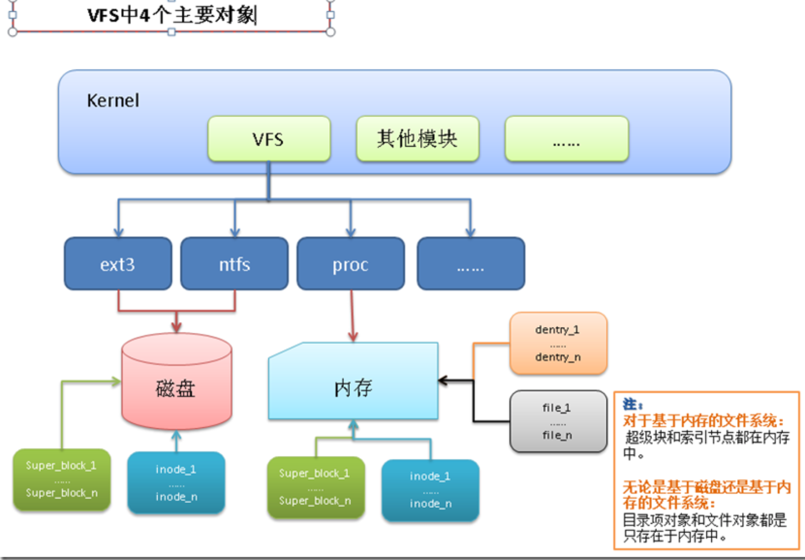
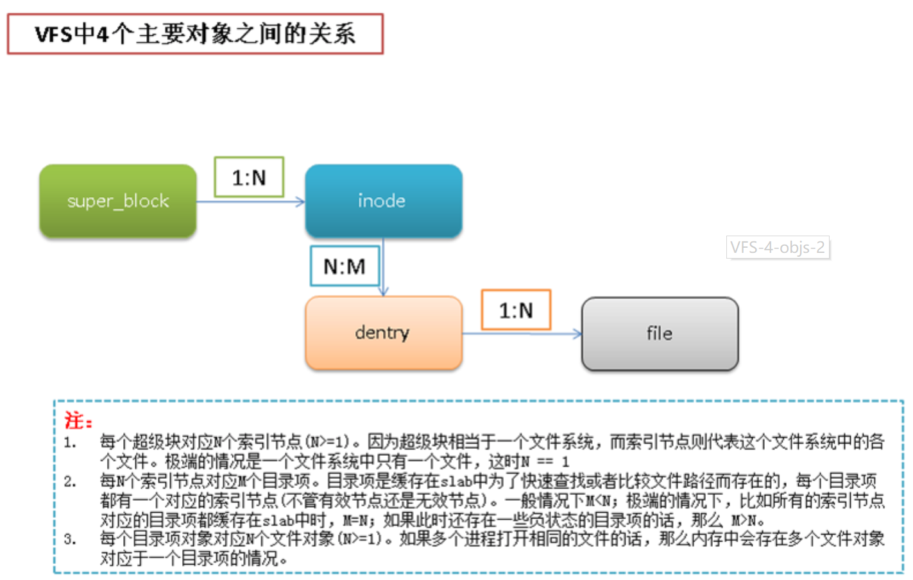

虚拟文件系统（VFS）是linux内核和具体`I/O`设备之间的封装的一层共通访问接口，通过这层接口，linux内核可以以同一的方式访问各种I/O设备。

虚拟文件系统本身是linux内核的一部分，是纯软件的东西，并不需要任何硬件的支持。

主要内容：

* 虚拟文件系统的作用
* 虚拟文件系统的4个主要对象
* 文件系统相关的数据结构
* 进程相关的数据结构
* 小结

# 1.虚拟文件系统的作用
虚拟文件系统(VFS)是linux内核和存储设备之间的抽象层，主要有以下好处。

* 简化了应用程序的开发：应用通过统一的系统调用访问各种存储介质
* 简化了新文件系统加入内核的过程：新文件系统只要实现VFS的各个接口即可，不需要修改内核部分

# 2.虚拟文件系统的4个主要对象
虚拟文件中的4个主要对象，具体每个对象的含义参见如下的详细介绍。

## 2.1 超级块
超级块(super_block)主要存储文件系统相关的信息，这是个针对**文件系统级别**的概念。它一般存储在磁盘的特定扇区中，但是对于那些基于内存的文件系统(比如proc,sysfs)，**超级块**是在使用时创建在内存中的。

超级块的定义在：`<linux/fs.h>`

```c
/* 
 * 超级块结构中定义的字段非常多，
 * 这里只介绍一些重要的属性
 */
struct super_block {
    struct list_head    s_list;               /* 指向所有超级块的链表 */
    const struct super_operations    *s_op; /* 超级块方法 */
    struct dentry        *s_root;           /* 目录挂载点 */
    struct mutex        s_lock;            /* 超级块信号量 */
    int            s_count;                   /* 超级块引用计数 */

    struct list_head    s_inodes;           /* inode链表 */
    struct mtd_info        *s_mtd;            /* 存储磁盘信息 */
    fmode_t            s_mode;                /* 安装权限 */
};

/*
 * 其中的 s_op 中定义了超级块的操作方法
 * 这里只介绍一些相对重要的函数
 */
struct super_operations {
    struct inode *(*alloc_inode)(struct super_block *sb); /* 创建和初始化一个索引节点对象 */
    void (*destroy_inode)(struct inode *);                /* 释放给定的索引节点 */

    void (*dirty_inode) (struct inode *);                 /* VFS在索引节点被修改时会调用这个函数 */
    int (*write_inode) (struct inode *, int);             /* 将索引节点写入磁盘，wait表示写操作是否需要同步 */
    void (*drop_inode) (struct inode *);                  /* 最后一个指向索引节点的引用被删除后，VFS会调用这个函数 */
    void (*delete_inode) (struct inode *);                /* 从磁盘上删除指定的索引节点 */
    void (*put_super) (struct super_block *);             /* 卸载文件系统时由VFS调用，用来释放超级块 */
    void (*write_super) (struct super_block *);           /* 用给定的超级块更新磁盘上的超级块 */
    int (*sync_fs)(struct super_block *sb, int wait);     /* 使文件系统中的数据与磁盘上的数据同步 */
    int (*statfs) (struct dentry *, struct kstatfs *);    /* VFS调用该函数获取文件系统状态 */
    int (*remount_fs) (struct super_block *, int *, char *); /* 指定新的安装选项重新安装文件系统时，VFS会调用该函数 */
    void (*clear_inode) (struct inode *);                 /* VFS调用该函数释放索引节点，并清空包含相关数据的所有页面 */
    void (*umount_begin) (struct super_block *);          /* VFS调用该函数中断安装操作 */
};
```

## 2.2 索引节点
索引节点是VFS中的核心概念，它包含内核在操作文件或目录时需要的全部信息。一个索引节点代表文件系统中的一个文件(这里的文件不仅是指我们平时所认为的普通的文件，还包括目录，特殊设备文件等等)。索引节点和超级块一样是实际存储在磁盘上的，当被应用程序访问到时才会在内存中创建。

索引节点定义在：`<linux/fs.h>`

```c
/* 
 * 索引节点结构中定义的字段非常多，
 * 这里只介绍一些重要的属性
 */
struct inode {
    struct hlist_node   i_hash;     /* 散列表，用于快速查找inode */
    struct list_head    i_list;     /* 索引节点链表 */
    struct list_head    i_sb_list;  /* 超级块链表超级块  */
    struct list_head    i_dentry;   /* 目录项链表 */
    unsigned long       i_ino;      /* 节点号 */
    atomic_t            i_count;    /* 引用计数 */
    unsigned int        i_nlink;    /* 硬链接数 */
    uid_t               i_uid;      /* 使用者id */
    gid_t               i_gid;      /* 使用组id */
    struct timespec        i_atime;    /* 最后访问时间 */
    struct timespec        i_mtime;    /* 最后修改时间 */
    struct timespec        i_ctime;    /* 最后改变时间 */
    const struct inode_operations    *i_op;  /* 索引节点操作函数 */
    const struct file_operations    *i_fop;    /* 缺省的索引节点操作 */
    struct super_block    *i_sb;              /* 相关的超级块 */
    struct address_space    *i_mapping;     /* 相关的地址映射 */
    struct address_space    i_data;         /* 设备地址映射 */
    unsigned int        i_flags;            /* 文件系统标志 */
    void            *i_private;             /* fs 私有指针 */
};

/*
 * 其中的 i_op 中定义了索引节点的操作方法
 * 这里只介绍一些相对重要的函数
 */
struct inode_operations {
    /* 为dentry对象创造一个新的索引节点 */
    int (*create) (struct inode *,struct dentry *,int, struct nameidata *);
    /* 在特定文件夹中寻找索引节点，该索引节点要对应于dentry中给出的文件名 */
    struct dentry * (*lookup) (struct inode *,struct dentry *, struct nameidata *);
    /* 创建硬链接 */
    int (*link) (struct dentry *,struct inode *,struct dentry *);
    /* 从一个符号链接查找它指向的索引节点 */
    void * (*follow_link) (struct dentry *, struct nameidata *);
    /* 在 follow_link调用之后，该函数由VFS调用进行清除工作 */
    void (*put_link) (struct dentry *, struct nameidata *, void *);
    /* 该函数由VFS调用，用于修改文件的大小 */
    void (*truncate) (struct inode *);
};
```

## 2.3目录项
和超级块和索引节点不同，目录项并不是实际存在于磁盘上的。

在使用的时候在内存中创建目录项对象，其实通过索引节点已经可以定位到指定的文件，但是索引节点对象的属性非常多，在查找，比较文件时，直接用索引节点效率不高，所以引入了目录项的概念。

路径中的每个部分都是一个目录项，比如路径：`/mnt/cdrom/foo/bar` 其中包含5个目录项，`/`,`mnt`,`cdrom`,`foo`,`bar`

每个目录项对象都有3种状态：`被使用`，`未使用`和`负状态`

* 被使用：对应一个有效的索引节点，并且该对象由一个或多个使用者
* 未使用：对应一个有效的索引节点，但是VFS当前并没有使用这个目录项
* 负状态：没有对应的有效索引节点（可能索引节点被删除或者路径不存在了）

目录项的目的就是**提高文件查找**，比较的效率，所以访问过的目录项都会缓存在slab中。slab中缓存的名称一般就是 dentry，可以通过如下命令查看：

```c
[wangyubin@localhost kernel]$ sudo cat /proc/slabinfo | grep dentry
dentry            212545 212625    192   21    1 : tunables    0    0    0 : slabdata  10125  10125      0
```

目录项定义在：`<linux/dcache.h>`

```c
/* 目录项对象结构 */
struct dentry {
    atomic_t d_count;       /* 使用计数 */
    unsigned int d_flags;   /* 目录项标识 */
    spinlock_t d_lock;        /* 单目录项锁 */
    int d_mounted;          /* 是否登录点的目录项 */
    struct inode *d_inode;    /* 相关联的索引节点 */
    struct hlist_node d_hash;    /* 散列表 */
    struct dentry *d_parent;    /* 父目录的目录项对象 */
    struct qstr d_name;         /* 目录项名称 */
    struct list_head d_lru;        /* 未使用的链表 */
    /*
     * d_child and d_rcu can share memory
     */
    union {
        struct list_head d_child;    /* child of parent list */
         struct rcu_head d_rcu;
    } d_u;
    struct list_head d_subdirs;    /* 子目录链表 */
    struct list_head d_alias;    /* 索引节点别名链表 */
    unsigned long d_time;        /* 重置时间 */
    const struct dentry_operations *d_op; /* 目录项操作相关函数 */
    struct super_block *d_sb;    /* 文件的超级块 */
    void *d_fsdata;            /* 文件系统特有数据 */

    unsigned char d_iname[DNAME_INLINE_LEN_MIN];    /* 短文件名 */
};

/* 目录项相关操作函数 */
struct dentry_operations {
    /* 该函数判断目录项对象是否有效。VFS准备从dcache中使用一个目录项时会调用这个函数 */
    int (*d_revalidate)(struct dentry *, struct nameidata *);
    /* 为目录项对象生成hash值 */
    int (*d_hash) (struct dentry *, struct qstr *);
    /* 比较 qstr 类型的2个文件名 */
    int (*d_compare) (struct dentry *, struct qstr *, struct qstr *);
    /* 当目录项对象的 d_count 为0时，VFS调用这个函数 */
    int (*d_delete)(struct dentry *);
    /* 当目录项对象将要被释放时，VFS调用该函数 */
    void (*d_release)(struct dentry *);
    /* 当目录项对象丢失其索引节点时（也就是磁盘索引节点被删除了），VFS会调用该函数 */
    void (*d_iput)(struct dentry *, struct inode *);
    char *(*d_dname)(struct dentry *, char *, int);
};
```

## 2.4  文件对象
文件对象表示进程已打开的文件，从用户角度来看，我们在代码中操作的就是一个文件对象。文件对象反过来指向一个目录项对象（目录项反过来指向一个索引节点.其实只有目录项对象才表示一个已打开的实际文件，虽然一个文件对应的文件对象不是唯一的，但其对应的索引节点和目录项对象却是唯一的。

文件对象的定义在: `<linux/fs.h>`

```c
/* 
 * 文件对象结构中定义的字段非常多，
 * 这里只介绍一些重要的属性
 */
struct file {
    union {
        struct list_head           fu_list;    /* 文件对象链表 */
        struct rcu_head            fu_rcuhead; /* 释放之后的RCU链表 */
    } f_u;
    struct path        f_path;             /* 包含的目录项 */
    const struct file_operations    *f_op; /* 文件操作函数 */
    atomic_long_t        f_count;        /* 文件对象引用计数 */
};

/*
 * 其中的 f_op 中定义了文件对象的操作方法
 * 这里只介绍一些相对重要的函数
 */
struct file_operations {
    /* 用于更新偏移量指针,由系统调用lleek()调用它 */
    loff_t (*llseek) (struct file *, loff_t, int);
    /* 由系统调用read()调用它 */
    ssize_t (*read) (struct file *, char __user *, size_t, loff_t *);
    /* 由系统调用write()调用它 */
    ssize_t (*write) (struct file *, const char __user *, size_t, loff_t *);
    /* 由系统调用 aio_read() 调用它 */
    ssize_t (*aio_read) (struct kiocb *, const struct iovec *, unsigned long, loff_t);
    /* 由系统调用 aio_write() 调用它 */
    ssize_t (*aio_write) (struct kiocb *, const struct iovec *, unsigned long, loff_t);
    /* 将给定文件映射到指定的地址空间上,由系统调用 mmap 调用它 */
    int (*mmap) (struct file *, struct vm_area_struct *);
    /* 创建一个新的文件对象,并将它和相应的索引节点对象关联起来 */
    int (*open) (struct inode *, struct file *);
    /* 当已打开文件的引用计数减少时,VFS调用该函数 */
    int (*flush) (struct file *, fl_owner_t id);
};
```

## 2.5 四个对象之间关系图
上面分别介绍了4种对象分别的属性和方法,下面用图来展示这4个对象的和VFS之间关系以及4个对象之间的关系。





# 3.文件系统相关的数据结构
处理上面4个主要的对象之外，VFS中还有2个专门针对文件系统的2个对象，

* `struct file_system_type`: 用来描述文件系统的类型（比如ext3,ntfs等等）
* `struct vfsmount ` : 描述一个安装文件系统的实例
file_system_type 结构体位于：`<linux/fs.h>`

```c
struct file_system_type {
    const char *name;   /* 文件系统名称 */
    int fs_flags;       /* 文件系统类型标志 */
    /* 从磁盘中读取超级块,并且在文件系统被安装时,在内存中组装超级块对象 */
    int (*get_sb) (struct file_system_type *, int,
               const char *, void *, struct vfsmount *);
    /* 终止访问超级块 */
    void (*kill_sb) (struct super_block *);
    struct module *owner;           /* 文件系统模块 */
    struct file_system_type * next; /* 链表中下一个文件系统类型 */
    struct list_head fs_supers;     /* 超级块对象链表 */

    /* 下面都是运行时的锁 */
    struct lock_class_key s_lock_key;
    struct lock_class_key s_umount_key;

    struct lock_class_key i_lock_key;
    struct lock_class_key i_mutex_key;
    struct lock_class_key i_mutex_dir_key;
    struct lock_class_key i_alloc_sem_key;
};
```
每种文件系统,不管由多少个实例安装到系统中,还是根本没有安装到系统中,都只有一个 file_system_type 结构。

当文件系统被实际安装时，会在安装点创建一个 vfsmount 结构体。结构体代表文件系统的实例，也就是文件系统被安装几次，就会创建几个 vfsmount

vfsmount 的定义参见：`<linux/mount.h>`

```c
struct vfsmount {
    struct list_head mnt_hash;      /* 散列表 */
    struct vfsmount *mnt_parent;    /* 父文件系统，也就是要挂载到哪个文件系统 */
    struct dentry *mnt_mountpoint;    /* 安装点的目录项 */
    struct dentry *mnt_root;        /* 该文件系统的根目录项 */
    struct super_block *mnt_sb;        /* 该文件系统的超级块 */
    struct list_head mnt_mounts;    /* 子文件系统链表 */
    struct list_head mnt_child;        /* 子文件系统链表 */
    int mnt_flags;                  /* 安装标志 */
    /* 4 bytes hole on 64bits arches */
    const char *mnt_devname;        /* 设备文件名 e.g. /dev/dsk/hda1 */
    struct list_head mnt_list;      /* 描述符链表 */
    struct list_head mnt_expire;    /* 到期链表的入口 */
    struct list_head mnt_share;        /* 共享安装链表的入口 */
    struct list_head mnt_slave_list;/* 从安装链表 */
    struct list_head mnt_slave;        /* 从安装链表的入口 */
    struct vfsmount *mnt_master;    /* 从安装链表的主人 */
    struct mnt_namespace *mnt_ns;    /* 相关的命名空间 */
    int mnt_id;            /* 安装标识符 */
    int mnt_group_id;        /* 组标识符 */
    /*
     * We put mnt_count & mnt_expiry_mark at the end of struct vfsmount
     * to let these frequently modified fields in a separate cache line
     * (so that reads of mnt_flags wont ping-pong on SMP machines)
     */
    atomic_t mnt_count;         /* 使用计数 */
    int mnt_expiry_mark;        /* 如果标记为到期，则为 True */
    int mnt_pinned;             /* "钉住"进程计数 */
    int mnt_ghosts;             /* "镜像"引用计数 */
#ifdef CONFIG_SMP
    int *mnt_writers;           /* 写者引用计数 */
#else
    int mnt_writers;            /* 写者引用计数 */
#endif
};
```

# 4.进程相关的数据结构

以上介绍的都是在内核角度看到的 VFS 各个结构，所以结构体中包含的属性非常多.而从进程的角度来看的话，大多数时候并不需要那么多的属性，所有VFS通过以下3个结构体和进程紧密联系在一起。

* struct files_struct  :由进程描述符中的 files 目录项指向，所有与单个进程相关的信息(比如打开的文件和文件描述符)都包含在其中。
* struct fs_struct     :由进程描述符中的 fs 域指向，包含文件系统和进程相关的信息。
* struct mmt_namespace :由进程描述符中的 mmt_namespace 域指向。

struct files_struct 位于：`<linux/fdtable.h>`

```c
struct files_struct {
    atomic_t count;      /* 使用计数 */
    struct fdtable *fdt; /* 指向其他fd表的指针 */
    struct fdtable fdtab;/* 基 fd 表 */
    spinlock_t file_lock ____cacheline_aligned_in_smp; /* 单个文件的锁 */
    int next_fd;                                       /* 缓存下一个可用的fd */
    struct embedded_fd_set close_on_exec_init;         /* exec()时关闭的文件描述符链表 */
    struct embedded_fd_set open_fds_init;              /* 打开的文件描述符链表 */
    struct file * fd_array[NR_OPEN_DEFAULT];           /* 缺省的文件对象数组 */
};
```
struct fs_struct 位于：`<linux/fs_struct.h>`

```c
struct fs_struct {
    int users;               /* 用户数目 */
    rwlock_t lock;           /* 保护结构体的读写锁 */
    int umask;               /* 掩码 */
    int in_exec;             /* 当前正在执行的文件 */
    struct path root, pwd;   /* 根目录路径和当前工作目录路径 */
};
```
struct mmt_namespace 位于：`<linux/mmt_namespace.h>`但是在2.6内核之后似乎没有这个结构体了，而是用`struct nsproxy`来代替。以下是 struct task_struct 结构体中关于文件系统的3个属性。
struct task_struct 的定义位于：`<linux/sched.h>`

```c
/* filesystem information */
    struct fs_struct *fs;
/* open file information */
    struct files_struct *files;
/* namespaces */
    struct nsproxy *nsproxy;
```

# 5.小结
VFS 统一了文件系统的实现框架，使得在linux上实现新文件系统的工作变得简单。目前linux内核中已经支持60多种文件系统，具体支持的文件系统可以查看 内核源码 fs 文件夹下的内容。
