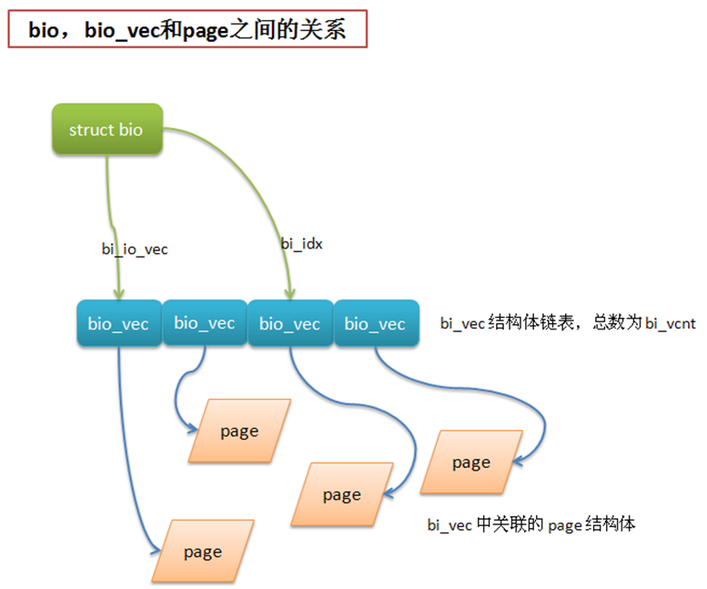

主要内容：

* 块设备简介
* 内核访问块设备的方法
* 内核`I/O`调度程序

# 1.块设备简介

`I/O`设备主要有2类:

* 字符设备：只能顺序读写设备中的内容，比如 串口设备，键盘
* 块设备：能够随机读写设备中的内容，比如 硬盘，U盘

字符设备由于只能顺序访问，所以应用场景也不多，这篇文章主要讨论块设备。

块设备是随机访问的，所以块设备在不同的应用场景中存在很大的优化空间。

块设备中最重要的一个概念就是块设备的最小寻址单元。块设备的最小寻址单元就是**扇区**，扇区的大小是2的整数倍，一般是 512字节。

扇区是物理上的最小寻址单元，而逻辑上的最小寻址单元是块。为了便于文件系统管理，块的大小一般是扇区的整数倍，并且小于等于页的大小。

查看扇区和`I/O`块的方法：

```
[wangyubin@localhost]$ sudo fdisk -l

WARNING: GPT (GUID Partition Table) detected on '/dev/sda'! The util fdisk doesn't support GPT. Use GNU Parted.


Disk /dev/sda: 500.1 GB, 500107862016 bytes, 976773168 sectors
Units = sectors of 1 * 512 = 512 bytes
Sector size (logical/physical): 512 bytes / 4096 bytes
I/O size (minimum/optimal): 4096 bytes / 4096 bytes
Disk identifier: 0x00000000
```
面的 Sector size 就是扇区的值，`I/O` size就是 块的值
从上面显示的结果，我们发现有个奇怪的地方，扇区的大小有2个值，逻辑大小是 512字节，而物理大小却是 4096字节。

其实逻辑大小 512字节是为了兼容以前的软件应用，而实际物理大小 4096字节是由于硬盘空间越来越大导致的。

# 2.内核访问块设备的方法
内核通过文件系统访问块设备时，需要先把块读入到内存中。所以文件系统为了管理块设备，必须管理[块]和内存页之间的映射。

内核中有2种方法来管理 [块] 和内存页之间的映射。

* 缓冲区和缓冲区头
* bio

## 2.1 缓冲区和缓冲区头
每个 [块] 都是一个缓冲区，同时对每个 [块] 都定义一个缓冲区头来描述它。

由于 [块] 的大小是小于内存页的大小的，所以每个内存页会包含一个或者多个 [块]
缓冲区头定义在 `<linux/buffer_head.h>`: `include/linux/buffer_head.h`

```c
struct buffer_head {
    unsigned long b_state;            /* 表示缓冲区状态 */
    struct buffer_head *b_this_page;/* 当前页中缓冲区 */
    struct page *b_page;            /* 当前缓冲区所在内存页 */

    sector_t b_blocknr;        /* 起始块号 */
    size_t b_size;            /* buffer在内存中的大小 */
    char *b_data;            /* 块映射在内存页中的数据 */

    struct block_device *b_bdev; /* 关联的块设备 */
    bh_end_io_t *b_end_io;        /* I/O完成方法 */
     void *b_private;             /* 保留的 I/O 完成方法 */
    struct list_head b_assoc_buffers;   /* 关联的其他缓冲区 */
    struct address_space *b_assoc_map;    /* 相关的地址空间 */
    atomic_t b_count;                    /* 引用计数 */
};
```
整个 buffer_head 结构体中的字段是减少过的，以前的内核中字段更多。

各个字段的含义通过注释都很明了，只有 b_state 字段比较复杂，它涵盖了缓冲区可能的各种状态。

```c
enum bh_state_bits {
    BH_Uptodate,    /* 包含可用数据 */
    BH_Dirty,    /* 该缓冲区是脏的(说明缓冲的内容比磁盘中的内容新，需要回写磁盘) */
    BH_Lock,    /* 该缓冲区正在被I/O使用，锁住以防止并发访问 */
    BH_Req,        /* 该缓冲区有I/O请求操作 */
    BH_Uptodate_Lock,/* 由内存页中的第一个缓冲区使用，使得该页中的其他缓冲区 */

    BH_Mapped,    /* 该缓冲区是映射到磁盘块的可用缓冲区 */
    BH_New,        /* 缓冲区是通过 get_block() 刚刚映射的，尚且不能访问 */
    BH_Async_Read,    /* 该缓冲区正通过 end_buffer_async_read() 被异步I/O读操作使用 */
    BH_Async_Write,    /* 该缓冲区正通过 end_buffer_async_read() 被异步I/O写操作使用 */
    BH_Delay,    /* 缓冲区还未和磁盘关联 */
    BH_Boundary,    /* 该缓冲区处于连续块区的边界，下一个块不在连续 */
    BH_Write_EIO,    /* 该缓冲区在写的时候遇到 I/O 错误 */
    BH_Ordered,    /* 顺序写 */
    BH_Eopnotsupp,    /* 该缓冲区发生 “不被支持” 错误 */
    BH_Unwritten,    /* 该缓冲区在磁盘上的位置已经被申请，但还有实际写入数据 */
    BH_Quiet,    /* 该缓冲区禁止错误 */

    BH_PrivateStart,/* 不是表示状态，分配给其他实体的私有数据区的第一个bit */
};
```
在2.6之前的内核中，主要就是通过缓冲区头来管理 [块] 和内存之间的映射的。

用缓冲区头来管理内核的 I/O 操作主要存在以下2个弊端，所以在2.6开始的内核中，缓冲区头的作用大大降低了。

* **弊端 1**:对内核而言，操作内存页是最为简便和高效的，所以如果通过缓冲区头来操作的话（缓冲区 即[块]在内存中映射，可能比页面要小），效率低下。而且每个 [块] 对应一个缓冲区头的话，导致内存的利用率降低（缓冲区头包含的字段非常多）
* **弊端 2**:每个缓冲区头只能表示一个 [块]，所以内核在处理大数据时，会分解为对一个个小的 [块] 的操作，造成不必要的负担和空间浪费。

## 2.2 bio
bio结构体的出现就是为了改善上面缓冲区头的2个弊端，它表示了一次 `I/O` 操作所涉及到的所有内存页。

```c
/*
 * I/O 操作的主要单元，针对 I/O块和更低级的层 (ie drivers and
 * stacking drivers)
 */
struct bio {
    sector_t        bi_sector;    /* 磁盘上相关扇区 */
    struct bio        *bi_next;    /* 请求列表 */
    struct block_device    *bi_bdev; /* 相关的块设备 */
    unsigned long        bi_flags;    /* 状态和命令标志 */
    unsigned long        bi_rw;        /* 读还是写 */

    unsigned short        bi_vcnt;    /* bio_vecs的数目 */
    unsigned short        bi_idx;        /* bio_io_vect的当前索引 */

    /* Number of segments in this BIO after
     * physical address coalescing is performed.
     * 结合后的片段数目
     */
    unsigned int        bi_phys_segments;

    unsigned int        bi_size;    /* 剩余 I/O 计数 */

    /*
     * To keep track of the max segment size, we account for the
     * sizes of the first and last mergeable segments in this bio.
     * 第一个和最后一个可合并的段的大小
     */
    unsigned int        bi_seg_front_size;
    unsigned int        bi_seg_back_size;

    unsigned int        bi_max_vecs;    /* bio_vecs数目上限 */
    unsigned int        bi_comp_cpu;    /* 结束CPU */

    atomic_t        bi_cnt;        /* 使用计数 */
    struct bio_vec        *bi_io_vec;    /* bio_vec 链表 */
    bio_end_io_t        *bi_end_io; /* I/O 完成方法 */
    void            *bi_private;    /* bio结构体创建者的私有方法 */
#if defined(CONFIG_BLK_DEV_INTEGRITY)
    struct bio_integrity_payload *bi_integrity;  /* data integrity */
#endif
    bio_destructor_t    *bi_destructor;    /* bio撤销方法 */
    /*
     * We can inline a number of vecs at the end of the bio, to avoid
     * double allocations for a small number of bio_vecs. This member
     * MUST obviously be kept at the very end of the bio.
     * 内嵌在结构体末尾的 bio 向量，主要为了防止出现二次申请少量的 bio_vecs
     */
    struct bio_vec        bi_inline_vecs[0];
};
```
几个重要字段说明：


* bio结构体表示正在执行的 `I/O` 操作相关的信息。
* bio_io_vec 链表表示当前 `I/O` 操作涉及到的内存页
* bio_vec 结构体表示 `I/O` 操作使用的片段
* bi_vcnt bi_io_vec链表中bi_vec的个数
* bi_idx 当前的 bi_vec片段，通过 bi_vcnt（总数）和 * bi_idx（当前数），就可以跟踪当前 `I/O` 操作的进度

bio_vec 结构体很简单，定义如下：

```c
struct bio_vec {
    struct page    *bv_page;       /* 对应的物理页 */
    unsigned int    bv_len;     /* 缓冲区大小 */
    unsigned int    bv_offset;  /* 缓冲区开始的位置 */
};
```
每个 bio_vec 都是对应一个页面，从而保证内核能够方便高效的完成 `I/O` 操作



## 2.3 方法的对比(2种)

缓冲区头和bio并不是相互矛盾的，bio只是缓冲区头的一种改善，将以前缓冲区头完成的一部分工作移到bio中来完成。

bio中对应的是内存中的一个个页，而缓冲区头对应的是磁盘中的一个块。对内核来说，配合使用bio和缓冲区头 比 只使用缓冲区头更加的方便高效。

bio相当于在缓冲区上又封装了一层，使得内核在 I/O操作时只要针对一个或多个内存页即可，不用再去管理磁盘块的部分。使用bio结构体还有以下好处：

* bio结构体很容易处理高端内存，因为它处理的是内存页而不是直接指针
* bio结构体既可以代表普通页`I/O`，也可以代表直接`I/O`
* bio结构体便于执行分散-集中（矢量化的）块`I/O`操作，操作中的数据可以取自多个物理页面

# 3.内核I/O调度程序
缓冲区头和bio都是内核处理一个具体`I/O`操作时涉及的概念。但是内核除了要完成`I/O`操作以外，还要调度好所有`I/O`操作请求，尽量确保每个请求能有个合理的响应时间。

下面就是目前内核中已有的一些 I/O 调度算法。

## 3.1linus电梯
为了保证磁盘寻址的效率，一般会尽量让磁头向一个方向移动，等到头了再反过来移动，这样可以缩短所有请求的磁盘寻址总时间。

磁头的移动有点类似于电梯，所有这个 I/O 调度算法也叫电梯调度。linux中的第一个电梯调度算法就是 linus本人所写的，所有也叫做 linus 电梯。

linus电梯调度主要是对I/O请求进行合并和排序。当一个新请求加入I/O请求队列时，可能会发生以下4种操作:

1. 如果队列中已存在一个对相邻磁盘扇区操作的请求，那么新请求将和这个已存在的请求合并成一个请求
2. 如果队列中存在一个驻留时间过长的请求，那么新请求之间查到队列尾部，防止旧的请求发生饥饿
3. 如果队列中已扇区方向为序存在合适的插入位置，那么新请求将被插入该位置，保证队列中的请求是以被访问磁盘物理位置为序进行排列的
4. 如果队列中不存在合适的请求插入位置，请求将被插入到队列尾部

linus电梯调度程序在2.6版的内核中被其他调度程序所取代了。

## 3.2最终期限I/O调度

linus电梯调度主要考虑了系统的全局吞吐量，对于个别的I/O请求，还是有可能造成饥饿现象。

而且读写请求的响应时间要求也是不一样的，一般来说，写请求的响应时间要求不高，写请求可以和提交它的应用程序异步执行，

但是读请求一般和提交它的应用程序时同步执行，应用程序等获取到读的数据后才会接着往下执行。

因此在 linus 电梯调度程序中，还可能造成 写-饥饿-读（wirtes-starving-reads）这种特殊问题。
为了尽量公平的对待所有请求，同时尽量保证读请求的响应时间，提出了最终期限`I/O`调度算法。最终期限`I/O`调度 算法给每个请求设置了超时时间，默认情况下，读请求的超时时间500ms，写请求的超时时间是5s

但一个新请求加入到`I/O`请求队列时，最终期限`I/O`调度和linus电梯调度相比，多出了以下操作:

1. 新请求加入到 排序队列(order-FIFO)，加入的方法类似 linus电梯新请求加入的方法
2. 根据新请求的类型，将其加入 读队列(read-FIFO) 或者写队列(wirte-FIFO) 的尾部（读写队列是按加入时间排序的，所以新请求都是加到尾部）
3. 调度程序首先判断 读，写队列头的请求是否超时，如果超时，从读，写队列头取出请求，加入到派发队列(dispatch-FIFO)
4. 如果没有超时请求，从 排序队列(order-FIFO)头取出一个请求加入到 派发队列(dispatch-FIFO)
5. 派发队列(dispatch-FIFO)按顺序将请求提交到磁盘驱动，完成`I/O`操作

最终期限`I/O`调度 算法也不能严格保证响应时间，但是它可以保证不会发生请求在明显超时的情况下仍得不到执行。

最终期限`I/O`调度 的实现参见: `block/deadline-iosched.c`

## 3.3 预测I/O调度
最终期限`I/O`调度算法优先考虑读请求的响应时间，但系统处于写操作繁重的状态时，会大大降低系统的吞吐量。

因为读请求的超时时间比较短，所以每次有读请求时，都会打断写请求，让磁盘寻址到读的位置，完成读操作后再回来继续写。

这种做法保证读请求的响应速度，却损害了系统的全局吞吐量（磁头先去读再回来写，发生了2次寻址操作）

预测`I/O`调度算法是为了解决上述问题而提出的，它是基于最终期限`I/O`调度算法的。

但有一个新请求加入到`I/O`请求队列时，预测`I/O`调度与最终期限`I/O`调度相比，多了以下操作:

1. 新的读请求提交后，并不立即进行请求处理，而是有意等待片刻(默认是6ms)
2. 等待期间如果有其他对磁盘相邻位置进行读操作的读请求加入，会立刻处理这些读请求
3. 等待期间如果没有其他读请求加入，那么等待时间相当于浪费掉
4. 等待时间结束后，继续执行以前剩下的请求
 

预测I/O调度算法中最重要的是保证等待期间不要浪费，也就是提高预测的准确性，

目前这种预测是依靠一系列的启发和统计工作，预测I/O调度程序会跟踪并统计每个应用程序的I/O操作习惯，以便正确预测应用程序的读写行为。

 

如果预测的准确率足够高，那么预测I/O调度和最终期限I/O调度相比，既能提高读请求的响应时间，又能提高系统吞吐量。

预测I/O调度的实现参见: `block/as-iosched.c`

**注**:预测I/O调度是linux内核中缺省的调度程序。

## 3.4 完全公正的排队I/O调度
完全公正的排队(Complete Fair Queuing, CFQ)I/O调度 是为专有工作负荷设计的，它和之前提到的I/O调度有根本的不同。

CFQ I/O调度 算法中，每个进程都有自己的I/O队列，

CFQ I/O调度程序以时间片轮转调度队列，从每个队列中选取一定的请求数(默认4个)，然后进行下一轮调度。

CFQ I/O调度在进程级提供了公平，它的实现位于: `block/cfq-iosched.c`

## 3.5 空操作的I/O调度
空操作(noop)`I/O`调度几乎不做什么事情，这也是它这样命名的原因。

空操作`I/O`调度只做一件事情，当有新的请求到来时，把它与任一相邻的请求合并。

空操作I/O调度主要用于闪存卡之类的块设备，这类设备没有磁头，没有寻址的负担。

空操作I/O调度的实现位于: `block/noop-iosched.c`

## 3.6  I/O调度程序的选择

2.6内核中内置了上面4种`I/O`调度，可以在启动时通过命令行选项 `elevator=xxx` 来启用任何一种。

elevator选项参数如下:

* as:预测
* cfq:完全公正排队
* deadline:最终期限
* noop:空操作
 
如果启动预测I/O调度，启动的命令行参数中加上 elevator=as
