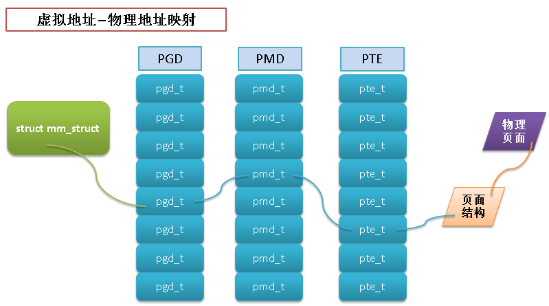

进程地址空间也就是每个进程所使用的内存，内核对进程地址空间的管理，也就是对用户态程序的内存管理。

主要内容：

* 地址空间(mm_struct)
* 虚拟内存区域(VMA)
* 地址空间和页表

# 1.地址空间(mm_struct)
地址空间就是每个进程所能访问的内存地址范围。这个地址范围不是真实的，是**虚拟地址**的范围，有时甚至会超过实际物理内存的大小。

现代的操作系统中进程都是在**保护模式下**运行的，地址空间其实是操作系统给进程用的一段连续的虚拟内存空间。地址空间最终会通过页表映射到物理内存上，因为内核操作的是物理内存。

虽然地址空间的范围很大，但是进程也不一定有权限访问全部的地址空间(一般都是只能访问地址空间中的一些地址区间)，进程能够访问的那些地址区间也称为**内存区域**。

进程如果访问了有效内存区域以外的内容就会报 “段错误” 信息。内存区域中主要包含以下信息：

* 代码段(text section)，即可执行文件代码的内存映射
* 数据段(data section)，即可执行文件的已初始化全局变量的内存映射
* bss段的零页(页面信息全是0值)，即未初始化全局变量的内存映射
* 进程用户空间栈的零页内存映射
* 进程使用的C库或者动态链接库等共享库的代码段，数据段和bss段的内存映射
* 任何内存映射文件
* 任何共享内存段
* 任何匿名内存映射，比如由 malloc() 分配的内存

**注**：bss是 block started by symbol 的缩写。

linux中内存相关的概念稍微整理了一下，供参考：

* SIZE:进程映射的内存大小，这不是进程实际使用的内存大小
* RSS(Resident set size):实际驻留在“内存”中的内存大小，不包含已经交换出去的内存
* SHARE:RSS中与其他进程共享的内存大小
* VMSIZE:进程占用的总地址空间，包含没有映射到内存中的页
* Private RSS:仅由进程单独占用的RSS，也就是进程实际占用的内存

## 1.1 mm_struct介绍
linux中的地址空间是用 mm_struct 来表示的。

下面对其中一些关键的属性进行了注释

```c
struct mm_struct {
    struct vm_area_struct * mmap;        /* [内存区域]链表 */
    struct rb_root mm_rb;               /* [内存区域]红黑树 */
    struct vm_area_struct * mmap_cache;    /* 最近一次访问的[内存区域] */
    unsigned long (*get_unmapped_area) (struct file *filp,
                unsigned long addr, unsigned long len,
                unsigned long pgoff, unsigned long flags);  /* 获取指定区间内一个还未映射的地址，出错时返回错误码 */
    void (*unmap_area) (struct mm_struct *mm, unsigned long addr);  /* 取消地址 addr 的映射 */
    unsigned long mmap_base;        /* 地址空间中可以用来映射的首地址 */
    unsigned long task_size;        /* 进程的虚拟地址空间大小 */
    unsigned long cached_hole_size;     /* 如果不空的话，就是 free_area_cache 后最大的空洞 */
    unsigned long free_area_cache;        /* 地址空间的第一个空洞 */
    pgd_t * pgd;                        /* 页全局目录 */
    atomic_t mm_users;            /* 使用地址空间的用户数 */
    atomic_t mm_count;            /* 实际使用地址空间的计数， (users count as 1) */
    int map_count;                /* [内存区域]个数 */
    struct rw_semaphore mmap_sem;   /* 内存区域信号量 */
    spinlock_t page_table_lock;        /* 页表锁 */

    struct list_head mmlist;        /* 所有地址空间形成的链表 */

    /* Special counters, in some configurations protected by the
     * page_table_lock, in other configurations by being atomic.
     */
    mm_counter_t _file_rss;
    mm_counter_t _anon_rss;

    unsigned long hiwater_rss;    /* High-watermark of RSS usage */
    unsigned long hiwater_vm;    /* High-water virtual memory usage */

    unsigned long total_vm, locked_vm, shared_vm, exec_vm;
    unsigned long stack_vm, reserved_vm, def_flags, nr_ptes;
    unsigned long start_code, end_code, start_data, end_data; /* 代码段，数据段的开始和结束地址 */
    unsigned long start_brk, brk, start_stack; /* 堆的首地址，尾地址，进程栈首地址 */
    unsigned long arg_start, arg_end, env_start, env_end; /* 命令行参数，环境变量首地址，尾地址 */

    unsigned long saved_auxv[AT_VECTOR_SIZE]; /* for /proc/PID/auxv */

    struct linux_binfmt *binfmt;

    cpumask_t cpu_vm_mask;

    /* Architecture-specific MM context */
    mm_context_t context;

    /* Swap token stuff */
    /*
     * Last value of global fault stamp as seen by this process.
     * In other words, this value gives an indication of how long
     * it has been since this task got the token.
     * Look at mm/thrash.c
     */
    unsigned int faultstamp;
    unsigned int token_priority;
    unsigned int last_interval;

    unsigned long flags; /* Must use atomic bitops to access the bits */

    struct core_state *core_state; /* coredumping support */
#ifdef CONFIG_AIO
    spinlock_t        ioctx_lock;
    struct hlist_head    ioctx_list;
#endif
#ifdef CONFIG_MM_OWNER
    /*
     * "owner" points to a task that is regarded as the canonical
     * user/owner of this mm. All of the following must be true in
     * order for it to be changed:
     *
     * current == mm->owner
     * current->mm != mm
     * new_owner->mm == mm
     * new_owner->alloc_lock is held
     */
    struct task_struct *owner;
#endif

#ifdef CONFIG_PROC_FS
    /* store ref to file /proc/<pid>/exe symlink points to */
    struct file *exe_file;
    unsigned long num_exe_file_vmas;
#endif
#ifdef CONFIG_MMU_NOTIFIER
    struct mmu_notifier_mm *mmu_notifier_mm;
#endif
};
```
**补充说明1**： 上面的属性中，mm_users 和 mm_count 很容易混淆，这里特别说明一下：(下面的内容有网上查找的，也有我自己理解的)

mm_users 比较好理解，就是 mm_struct 被用户空间进程(线程)引用的次数。如果进程A中创建了3个新线程，那么 进程A(这时候叫线程A也可以)对应的 mm_struct 中的 mm_users = 4

补充一点，linux中进程和线程几乎没有什么区别，就是看它是否共享进程地址空间，共享进程地址空间就是线程，反之就是进程。所以，如果子进程和父进程共享了进程地址空间，那么父子进程都可以看做线程。如果父子进程没有共享进程地址空间，就是2个进程

mm_count 则稍微有点绕人，其实它记录就是 mm_struct 实际的引用计数。简单点说，当 mm_users=0 时，并不一定能释放此 mm_struct，只有当 mm_count=0 时，才可以确定释放此 mm_struct

 

从上面的解释可以看出，可能引用 mm_struct 的并不只是用户空间的进程(线程)

当 mm_users>0 时， mm_count 会增加1, 表示有用户空间进程(线程)在使用 mm_struct。不管使用 mm_struct 的用户进程(线程)有几个， mm_count 都只是增加1。

也就是说，如果只有1个进程使用 mm_struct，那么 mm_users=1，mm_count也是 1。

如果有9个线程在使用 mm_struct，那么 mm_users=9，而 mm_count 仍然为 1。

 

那么 mm_count 什么情况下会大于 1呢？

当有内核线程使用 mm_struct 时，mm_count 才会再增加 1。内核线程为何会使用用户空间的 mm_struct 是有其他原因的，这个后面再阐述。这里先知道内核线程使用 mm_struct 时也会导致 mm_count 增加 1。

在下面这种情况下，mm_count 就很有必要了：

* 进程A启动，并申请了一个 mm_struct，此时mm_users=1, mm_count=1
* 进程A中新建了2个线程，此时 mm_users=3,mm_count=1
* 内核调度发生，进程A及相关线程都被挂起，一个内核线程B 使用了进程A 申请的 mm_struct，此时 mm_users=3, mm_count=2
* CPU的另一个core调度了进程A及其线程，并且执行完了进程A及其线程的所有操作，也就是进程A退出了。此时 mm_users=0, mm_count=1
* 在这里就看出 mm_count 的用处了，如果只有 mm_users 的话，这里 mm_users=0 就会释放 mm_struct，从而有可能导致 内核线程B 异常。
* 内核线程B 执行完成后退出，这时 mm_users=0，mm_count=0，可以安全释放 mm_struct 了

**补充说明2**：为何内核线程会使用用户空间的 mm_struct？

对Linux来说，用户进程和内核线程都是task_struct的实例，唯一的区别是内核线程是没有进程地址空间的（内核线程使用的内核地址空间），内核线程的mm描述符是NULL，即内核线程的tsk->mm域是空（NULL）。

内核调度程序在进程上下文的时候，会根据tsk->mm判断即将调度的进程是用户进程还是内核线程。

但是虽然内核线程不用访问用户进程地址空间，但是仍然需要页表来访问内核自己的空间。

而任何用户进程来说，他们的内核空间都是100%相同的，所以内核会借用上一个被调用的用户进程的mm_struct中的页表来访问内核地址，这个mm_struct就记录在active_mm。

简而言之就是，对于内核线程，tsk->mm == NULL表示自己内核线程的身份，而tsk->active_mm是借用上一个用户进程的mm_struct，用mm_struct的页表来访问内核空间。

对于用户进程，tsk->mm == tsk->active_mm。

**补充说明3**：除了 mm_users 和 mm_count 之外，还有 mmap 和 mm_rb 需要说明以下：

其实 mmap 和 mm_rb 都是保存此 进程地址空间中所有的内存区域(VMA)的，前者是以链表形式存放，后者以红黑树形式存放。用2种数据结构组织同一种数据是为了便于对VMA进行高效的操作。

## 1.2 mm_struct操作
1. 分配进程地址空间

参考`kernel/fork.c`中的宏 allocate_mm

```c
#define allocate_mm()    (kmem_cache_alloc(mm_cachep, GFP_KERNEL))
#define free_mm(mm)    (kmem_cache_free(mm_cachep, (mm)))
```
其实分配进程地址空间时，都是从slab高速缓存中分配的，可以通过`/proc/slabinfo` 查看 mm_struct 的高速缓存

```c
# cat /proc/slabinfo | grep mm_struct
mm_struct             35     45   1408    5    2 : tunables   24   12    8 : slabdata      9      9      0
```
2. 撤销进程地址空间
参考`kernel/exit.c`中的`exit_mm()`函数,该函数会调用`mmput()`函数减少mm_users的值，当 mm_users=0 时，调用`mmdropo()`函数， 减少 mm_count 的值，

如果 mm_count=0，那么调用 free_mm 宏，将 mm_struct 还给 slab高速缓存

3. 查看进程占用的内存：

```c
cat /proc/<PID>/maps
或者
pmap PID
```

# 2.虚拟内存区域(VMA)
内存区域在linux中也被称为虚拟内存区域(VMA)，它其实就是进程地址空间上一段连续的内存范围

## 2.1VMA介绍
VMA的定义也在 `<linux/mm_types.h>` 中

```c
struct vm_area_struct {
    struct mm_struct * vm_mm;    /* 相关的 mm_struct 结构体 */
    unsigned long vm_start;        /* 内存区域首地址 */
    unsigned long vm_end;        /* 内存区域尾地址 */

    /* linked list of VM areas per task, sorted by address */
    struct vm_area_struct *vm_next, *vm_prev;  /* VMA链表 */

    pgprot_t vm_page_prot;        /* 访问控制权限 */
    unsigned long vm_flags;        /* 标志 */

    struct rb_node vm_rb;       /* 树上的VMA节点 */

    /*
     * For areas with an address space and backing store,
     * linkage into the address_space->i_mmap prio tree, or
     * linkage to the list of like vmas hanging off its node, or
     * linkage of vma in the address_space->i_mmap_nonlinear list.
     */
    union {
        struct {
            struct list_head list;
            void *parent;    /* aligns with prio_tree_node parent */
            struct vm_area_struct *head;
        } vm_set;

        struct raw_prio_tree_node prio_tree_node;
    } shared;

    /*
     * A file's MAP_PRIVATE vma can be in both i_mmap tree and anon_vma
     * list, after a COW of one of the file pages.    A MAP_SHARED vma
     * can only be in the i_mmap tree.  An anonymous MAP_PRIVATE, stack
     * or brk vma (with NULL file) can only be in an anon_vma list.
     */
    struct list_head anon_vma_node;    /* Serialized by anon_vma->lock */
    struct anon_vma *anon_vma;    /* Serialized by page_table_lock */

    /* Function pointers to deal with this struct. */
    const struct vm_operations_struct *vm_ops;

    /* Information about our backing store: */
    unsigned long vm_pgoff;        /* Offset (within vm_file) in PAGE_SIZE
                       units, *not* PAGE_CACHE_SIZE */
    struct file * vm_file;        /* File we map to (can be NULL). */
    void * vm_private_data;        /* was vm_pte (shared mem) */
    unsigned long vm_truncate_count;/* truncate_count or restart_addr */

#ifndef CONFIG_MMU
    struct vm_region *vm_region;    /* NOMMU mapping region */
#endif
#ifdef CONFIG_NUMA
    struct mempolicy *vm_policy;    /* NUMA policy for the VMA */
#endif
};
```
这个结构体各个字段的英文注释都比较详细，就不一一翻译了。上述属性中的 vm_flags 标识了此VM 对 VMA和页面的影响：

vm_flags 的宏定义参见 `<linux/mm.h>`

* VM_READ:页面可读取
* VM_WRITE:页面可写
* VM_EXEC:页面可执行
* VM_SHARED	页面可共享
* VM_MAYREAD:VM_READ标志可被设置
* VM_MAYWRITER:VM_WRITE 标志可被设置
* VM_MAYEXEC:VM_EXEC 标志可被设置
* VM_MAYSHARE:VM_SHARE 标志可被设置
* VM_GROWSDOWN:区域可向下增长
* VM_GROWSUP:区域可向上增长
* VM_SHM:区域可用作共享内存
* VM_DENYWRITE:区域映射一个不可写文件
* VM_EXECUTABLE:区域映射一个可执行文件
* VM_LOCKED:区域中的页面被锁定
* VM_IO:区域映射设备I/O空间
* VM_SEQ_READ:页面可能会被连续访问
* VM_RAND_READ:页面可能会被随机访问
* VM_DONTCOPY:区域不能在`fork()`时被拷贝
* VM_DONTEXPAND:区域不能通过`mremap()`增加
* VM_RESERVED:区域不能被换出
* VM_ACCOUNT:该区域时一个记账 VM 对象
* VM_HUGETLB:区域使用了 hugetlb 页面
* VM_NONLINEAR:该区域是非线性映射的

## 2.2 VMA操作
vm_area_struct 结构体定义中有个 vm_ops 属性，其中定义了内核操作 VMA 的方法

```c
/*
 * These are the virtual MM functions - opening of an area, closing and
 * unmapping it (needed to keep files on disk up-to-date etc), pointer
 * to the functions called when a no-page or a wp-page exception occurs. 
 */
struct vm_operations_struct {
    void (*open)(struct vm_area_struct * area);  /* 指定内存区域加入到一个地址空间时，该函数被调用 */
    void (*close)(struct vm_area_struct * area); /* 指定内存区域从一个地址空间删除时，该函数被调用 */
    int (*fault)(struct vm_area_struct *vma, struct vm_fault *vmf); /* 当没有出现在物理页面中的内存被访问时，该函数被调用 */

    /* 当一个之前只读的页面变为可写时，该函数被调用，
     * 如果此函数出错，将导致一个 SIGBUS 信号 */
    int (*page_mkwrite)(struct vm_area_struct *vma, struct vm_fault *vmf);

    /* 当 get_user_pages() 调用失败时, 该函数被 access_process_vm() 函数调用 */
    int (*access)(struct vm_area_struct *vma, unsigned long addr,
              void *buf, int len, int write);
#ifdef CONFIG_NUMA
    /*
     * set_policy() op must add a reference to any non-NULL @new mempolicy
     * to hold the policy upon return.  Caller should pass NULL @new to
     * remove a policy and fall back to surrounding context--i.e. do not
     * install a MPOL_DEFAULT policy, nor the task or system default
     * mempolicy.
     */
    int (*set_policy)(struct vm_area_struct *vma, struct mempolicy *new);

    /*
     * get_policy() op must add reference [mpol_get()] to any policy at
     * (vma,addr) marked as MPOL_SHARED.  The shared policy infrastructure
     * in mm/mempolicy.c will do this automatically.
     * get_policy() must NOT add a ref if the policy at (vma,addr) is not
     * marked as MPOL_SHARED. vma policies are protected by the mmap_sem.
     * If no [shared/vma] mempolicy exists at the addr, get_policy() op
     * must return NULL--i.e., do not "fallback" to task or system default
     * policy.
     */
    struct mempolicy *(*get_policy)(struct vm_area_struct *vma,
                    unsigned long addr);
    int (*migrate)(struct vm_area_struct *vma, const nodemask_t *from,
        const nodemask_t *to, unsigned long flags);
#endif
};
```
除了以上的操作之外，还有一些辅助函数来方便内核操作内存区域。

这些辅助函数都可以在`<linux/mm.h>`中找到

1.查找地址空间

```c
/* Look up the first VMA which satisfies  addr < vm_end,  NULL if none. */
extern struct vm_area_struct * find_vma(struct mm_struct * mm, unsigned long addr);
extern struct vm_area_struct * find_vma_prev(struct mm_struct * mm, unsigned long addr,
                         struct vm_area_struct **pprev);

/* Look up the first VMA which intersects the interval start_addr..end_addr-1,
   NULL if none.  Assume start_addr < end_addr. */
static inline struct vm_area_struct * find_vma_intersection(struct mm_struct * mm, unsigned long start_addr, unsigned long end_addr)
{
    struct vm_area_struct * vma = find_vma(mm,start_addr);

    if (vma && end_addr <= vma->vm_start)
        vma = NULL;
    return vma;
}
```
2.创建地址区间

```c
static inline unsigned long do_mmap(struct file *file, unsigned long addr,
    unsigned long len, unsigned long prot,
    unsigned long flag, unsigned long offset)
{
    unsigned long ret = -EINVAL;
    if ((offset + PAGE_ALIGN(len)) < offset)
        goto out;
    if (!(offset & ~PAGE_MASK))
        ret = do_mmap_pgoff(file, addr, len, prot, flag, offset >> PAGE_SHIFT);
out:
    return ret;
}
```

3.删除地址区间 

```c
extern int do_munmap(struct mm_struct *, unsigned long, size_t);
```

# 3.地址空间和页表

地址空间中的地址都是虚拟内存中的地址，而CPU需要操作的是物理内存，所以需要一个将虚拟地址映射到物理地址的机制。

这个机制就是页表，linux中使用3级页面来完成虚拟地址到物理地址的转换。

1. PGD - 全局页目录，包含一个 pgd_t 类型数组，多数体系结构中 pgd_t 类型就是一个无符号长整型
2. PMD - 中间页目录，它是个 pmd_t 类型数组
3. PTE - 简称页表，包含一个 pte_t 类型的页表项，该页表项指向物理页面

虚拟地址 - 页表 - 物理地址的关系如下图：


