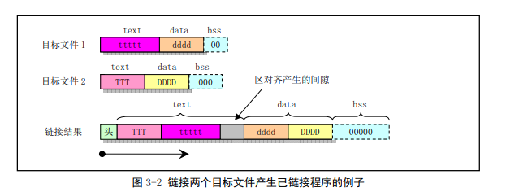

# 区与重定位
区(Section)表示一个地址范围，系统相同方式对待和处理该地址范围。区概念主要用来表示编译器生成的目标文件(或可执行文件)中不同的信息区域，目标文件中的正文信息或数据区。

链接器ld会把输入的目标文件中的内容按照一定规律组合生成一个可执行程序。当as汇编器输出一个目标文件时，该目标文件中代码被默认设置成从地址0开始。此后ld会将会在链接过程中不同目标文件的各个部分分配不同的最终地址位置。ld会把程序中的字节块移动到程序运行时的地址处。这些作为固定单元进行移动的，长度以及字节次序都不会改变。这样固定单元被称作区。

区分配运行时刻的地址操作就被称为重定位(Relocation)操作,其中包括调整目标文件中的记录地址，从而让它们对应到恰当的运行时刻地址上。


as汇编器输出产生的目标文件至少有3个区，正文`text`,数据`data`和bss区。每个区都可能是空的。在一个目标文件中，其text区从地址0开始，随后是data区，后面是bss区。

当重定位时，链接器ld需要知道哪些数据发生变化，以及如何修改数据，as汇编器也会往目标文件写入所需要的重定位信息。重定位操作，每次涉及目标文件中的一个地址时，ld必须知道：

* 目标文件中一个地址的引用是从什么地方算起
* 该引用的自己长度是多少
* 该地址引用是哪个区？(地址)-(区的开始地址)的值等于多少？
* 对地址引用于程序计数器PC相关吗？

as使用所有地址可表示为：`区 + 区中偏移`。用记号`{secname N}`来表示区secname的偏移N。

除了text、data和bss区，还需要绝对区(`{absolute 0}`).链接器把各个目标文件组合在一起时，absolute区中地址将始终不变。如：ld会把地址`{absolute 区}`重定位到运行时刻地址0.尽管链接器在链接后决不会把两个目标文件中的data区安排成重叠地址处，但目标文件中absolute区必会重叠而覆盖

还有一个未定义区(`Undefined section`).汇编时不能确定所在区的任何地址被设置成`{Undefined U}`,其中U将会在以后填上

## 链接器涉及的区

链接器ld只涉及如下4类区：

* text区、data区--这两个区用于保存程序。as和ld分别独立而同等地对待他们。text区描述同样适合于data区，程序运行时，有区别：
	* 程序运行时，text区不会改变，text区通常会被进程共享，其中含有指令代码和常数等内容
	* 程序运行时data区内容通常是会变化的，C变量一般存放在data区中
* bss区--程序运行时，这个区含有0值字节。该区域用于存放未初始化变量或作为公共存储空间。虽然程序每个目标文件中bss区长度信息很重要，但是该区中存放的是0值字节，因此无须在目标文件中保存bss区。设置bss区目的为了从目标文件中明确地排除0值字节
* absolute区-- 该区地址0总是重定位到运行时刻地址0处。如果不想让ld在重定位时改变你所引用的地址，那就使用这个区。绝对地址称为不可重定位的，重定位期间不可改变
* undefined区-- 对不在先前所描述各个区中对象的地址引用所属于本区




## 子区

汇编取得自己数据通常位于text或data区中，有时在汇编程序某个区可能分布着一些不相邻的数据组，但是想让他们汇编后聚集在一起。as汇编器允许利用子区来完成。

`.text 0`

## bss区
bss区用于存储局部公共变量。可以bss区中分配空间，但是程序运行前不能在其中放置数据。因为当程序刚开始执行时，bss区中所有字节内容都将被清零。`.lcomm`汇编命令用于bss区中定义一个符号。`.comm`可用于在bss区中声明一个公共符号

使用`.section`指令定义段，如：

```asm
.section .data
.section .bss
.section .text
```


起始点:

gnu 汇编器使用`_start`标签表示默认的起始点,此外如果想要汇编**内部的标签能够被外部程序访问**,需要使用`.globl`指令,如:`.globl _start`

使用通用库函数时可以使用:

```asm
ld -dynamic-linker /lib/ld-linux.so.2
```
