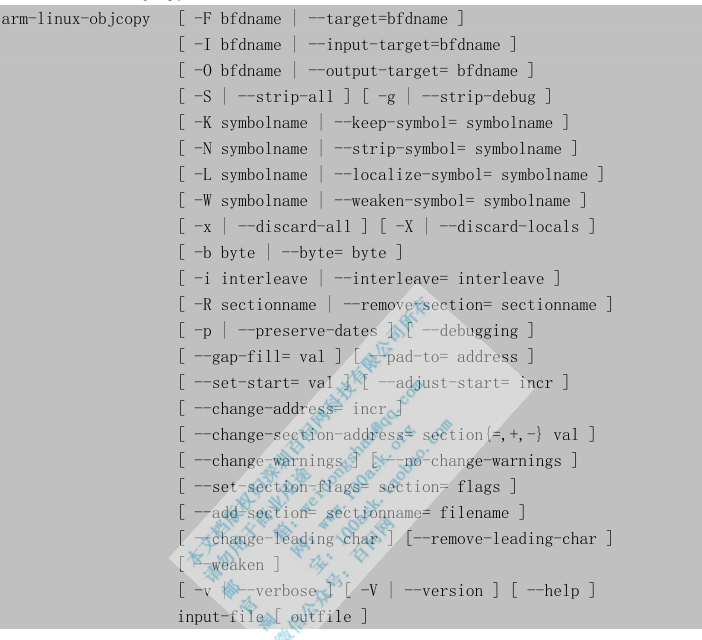

arm-linux-objcopy 被用来拷贝一个目标文件的内容到另一个文件中，可以使用不同于**源文件的格式**来输出目的文件，即可以进行格式转换.
常用 arm-linux-objcopy 来将 ELF 格式的可执行文件转换为二进制文件:

arm-linux-objcopy使用格式如下:




常用选项：

# 1.input-file、outfile
参数 input-file 和 outfile 分别表示输入目标文件(源目标文件)和输出目标文件(目的目标文件)。如果在命令行中没有明确地指定 outfile，那么 arm-linux-objcopy 将创建一个临时文件来存放目标结果，然后使用 input-file 的名字来重命名这个临时文件(这时候，原来的 input-file 将被覆盖)。

# 2.`-I bfdname` 或`--input-target=bfdname`
用来指明源文件的格式，bfdname 是 BFD 库中描述的标准格式名。如果不指明源文件格式，arm-linux-objcopy 会自己去分析源文件的格式，然后去和 BFD 中描述的各种格式比较，从而得知源文件的目标格式名。

# 3.`-O bfdname` 或`--output-target= bfdname`
使用指定的格式来输出文件，bfdname 是 BFD 库中描述的标准格式名

# 4.`-F bfdname` 或`--target= bfdname`
同时指明源文件、目的文件的格式。将源目标文件中的内容拷贝到目的目标文件的过程中，只进行拷贝不做格式转换，源目标文件是什么格式，目的目标文件就是什么格式。

# 5.`-R sectionname` 或`--remove-section= sectionname`
从输出文件中删掉所有名为 sectionname 的段。这个选项可以多次使用。

注意：不恰当地使用这个选项可能会导致输出文件不可用。

# 6.`-S` 或`--strip-all`(strip，剥去、剥)
不从源文件中拷贝重定位信息和符号信息到目标文件中去。

# 7.`-g` 或`--strip-debug`
不从源文件中拷贝调试符号到目标文件中去。


# 使用
在编译 bootloader、内核时，常用 arm-linux-objcopy 命令将 ELF 格式的生成结果转换为二进制文件，比如：

```
arm-linux-objcopy -O binary -S elf_file bin_file
```

