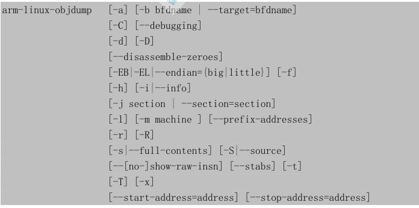

arm-linux-objdump 用于显示二进制文件信息，本书中常用来查看反汇编代码。

# 常用选项

* 1.-b bfdname 或--target=bfdname：指定目标码格式。这不是必须的，arm-linux-objdump 能自动识别许多格式。可以使用“arm-linux-objdump –i”命令查看支持的目标码格式列表。
* 2.--disassemble 或-d：反汇编可执行段(executable sections)。
* 3.--disassemble-all 或-D：与-d 类似，反汇编所有段。
* 4.-EB 或-EL 或--endian={big|little}：指定字节序。
* 

