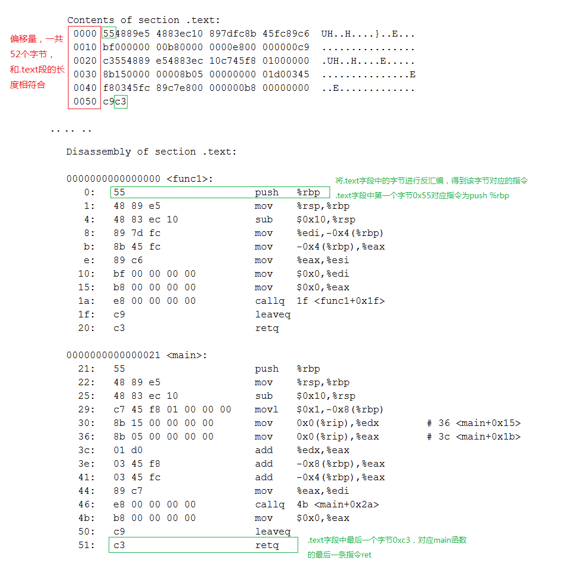

# ELF文件格式
对于计算机来说，它只懂得机器语言，它更喜欢二进制，将0转换为低电平，1转换成高电平，这样一个程序就可以跑起来了。我们可以使用工具readelf 和objdump对目标文件simple.o进行分析。为了加深对目标文件的理解，在使用readelf & objdump进行前，需要先要了解ELF文件的结构。

重要的概念：

```
.data 数据段，存放已经初始化的全局/静态变量
.bss(Block Started by Symbol) 存放未初始化的全局变量和静态变量，因为这些变量在程序加载的时候都会被初始化为零，所以不需要存放实际的数据，只需要预留位置就可以了。
.text 代码段，存放源代码编译后的机器指令
.rodata 只读数据段，存放只读变量
.symtab(Symbol Table) **符号表**
.strtab(String Table) **字符串表**
.plt(Procedure Linkage Table) 动态链接跳转表
.got(Global Offset Table) 动态链接全局入口表
```
## ELF文件结构
ELF文件存放数据的格式也是固定的，计算机在解析目标文件时，就是按照它每个字段的数据结构进行逐字解析的。ELF文件结构信息定义在`/usr/include/elf.h`中，整个ELF文件的结构如下图：


### ELF Header
ELF Header是ELF文件的第一部分，64 bit的ELF文件头的结构体如下：

```c
typedef struct
{
  unsigned char e_ident[EI_NIDENT]; /* Magic number and other info */
  Elf64_Half    e_type;         /* Object file type */
  Elf64_Half    e_machine;      /* Architecture */
  Elf64_Word    e_version;      /* Object file version */
  Elf64_Addr    e_entry;        /* Entry point virtual address */
  Elf64_Off e_phoff;        /* Program header table file offset */
  Elf64_Off e_shoff;        /* Section header table file offset */
  Elf64_Word    e_flags;        /* Processor-specific flags */
  Elf64_Half    e_ehsize;       /* ELF header size in bytes */
  Elf64_Half    e_phentsize;        /* Program header table entry size */
  Elf64_Half    e_phnum;        /* Program header table entry count */
  Elf64_Half    e_shentsize;        /* Section header table entry size */
  Elf64_Half    e_shnum;        /* Section header table entry count */
  Elf64_Half    e_shstrndx;     /* Section header string table index */
} Elf64_Ehdr;
```
接下来我们会使用到第一个分析目标文件的工具readelf，通过`man readelf`命令，我们可以查到readelf的作用就是用来显示ELF文件的信息

```
DESCRIPTION
   readelf displays information about one or more ELF format object files.
```
使用`readelf -h simple.o`来进行对Header的解析，通过`man readelf`命令同样可以查询到对-h参数的说明，
`-h`用来显示ELF header的相关信息。

```
OPTIONS
   -h
   --file-header
       Displays the information contained in the ELF header at the start of the file.
```
Header中主要存放的是一些基本信息，通过Header中的信息，我们可以确定后面其他字段的大小和起始地址，通常比较关心的部分是：ELF文件类型、是32bit还是64bit、Header部分大小、Section部分大小和拥有Section的个数等。
结合Elf64_Ehdr来看，对应解析结果如下：

```
ELF Header:
  Magic:   7f 45 4c 46 02 01 01 00 00 00 00 00 00 00 00 00 
  Class:                             ELF64
  Data:                              2's complement, little endian
  Version:                           1 (current)
  OS/ABI:                            UNIX - System V
  ABI Version:                       0
  Type:                              EXEC (Executable file)
  Machine:                           Advanced Micro Devices X86-64
  Version:                           0x1
  Entry point address:               0x4005a0
  Start of program headers:          64 (bytes into file)
  Start of section headers:          4472 (bytes into file)
  Flags:                             0x0
  Size of this header:               64 (bytes)
  Size of program headers:           56 (bytes)
  Number of program headers:         9
  Size of section headers:           64 (bytes)
  Number of section headers:         30
  Section header string table index: 27

```
### ELF section
完成了对Header的解析，再接着分析Section部分，Section对应结构体如下：

```c
typedef struct
{
  Elf64_Word  sh_name;    /* Section name (string tbl index) */
  Elf64_Word  sh_type;    /* Section type */
  Elf64_Xword sh_flags;   /* Section flags */
  Elf64_Addr  sh_addr;    /* Section virtual addr at execution */
  Elf64_Off sh_offset;    /* Section file offset */
  Elf64_Xword sh_size;    /* Section size in bytes */
  Elf64_Word  sh_link;    /* Link to another section */
  Elf64_Word  sh_info;    /* Additional section information */
  Elf64_Xword sh_addralign;   /* Section alignment */
  Elf64_Xword sh_entsize;   /* Entry size if section holds table */
} Elf64_Shdr;
```
Section部分主要存放的是机器指令代码和数据，执行命令`readelf -S -W simple.o`对Section部分的解析，解析结果和Elf64_Shdr也是一一对应的。

```
ckt@ubuntu:~/work/elf$ readelf -S -W simple.o
There are 11 section headers, starting at offset 0x108:

Section Headers:
  [Nr] Name              Type            Address          Off    Size   ES Flg Lk Inf Al
  [ 0]                   NULL            0000000000000000 000000 000000 00      0   0  0
  [ 1] .text             PROGBITS        0000000000000000 000040 000006 00  AX  0   0  4
  [ 2] .data             PROGBITS        0000000000000000 000048 000000 00  WA  0   0  4
  [ 3] .bss              NOBITS          0000000000000000 000048 000000 00  WA  0   0  4
  [ 4] .comment          PROGBITS        0000000000000000 000048 00002b 01  MS  0   0  1
  [ 5] .note.GNU-stack   PROGBITS        0000000000000000 000073 000000 00      0   0  1
  [ 6] .eh_frame         PROGBITS        0000000000000000 000078 000038 00   A  0   0  8
  [ 7] .rela.eh_frame    RELA            0000000000000000 0004b0 000018 18      9   6  8
  [ 8] .shstrtab         STRTAB          0000000000000000 0000b0 000054 00      0   0  1
  [ 9] .symtab           SYMTAB          0000000000000000 0003c8 0000d8 18     10   8  8
  [10] .strtab           STRTAB          0000000000000000 0004a0 00000e 00      0   0  1
Key to Flags:
  W (write), A (alloc), X (execute), M (merge), S (strings), l (large)
  I (info), L (link order), G (group), T (TLS), E (exclude), x (unknown)
  O (extra OS processing required) o (OS specific), p (processor specific)

```
对于这部分内容，通常我们比较的Section是`.text`（存放代码）、`.data`（存放全局静态变量和局部静态变量）和`.bss`（存未初始化的全局变量和局部静态变量） ，在后面会对这几个段分别分进行解析。

根据`readelf -S -W simple.o`的输出结果，我们可以算出整个simple.o的组成部分和起始地址，使用`ls -l`命令查看simple.o的大小，和simple.o结束地址0x0000048c是吻合的。

```
kt@ubuntu:~/work/elf$ ls -l simple.o
-rw-rw-r-- 1 ckt ckt 1224 Apr 12 18:42 simple.o
```


# 0.ls
查看文件大小和类型(设备，文件，等)

# 1.file

查看文件类型:`file hello`

目标文件只是ELF文件的**可重定位文件**(Relocatable file)，ELF文件一共有4种类型：`Relocatable file`、`Executable file`、`Shared object file`和`Core Dump file`[coredump]()

```
hello: ELF 64-bit LSB  executable, x86-64, version 1 (SYSV), dynamically linked (uses shared libs), for GNU/Linux 2.6.24, BuildID[sha1]=4586dccff97d22d477a5ab4552bebcda43105b9a, not stripped
```

* Eelocatable file:`func.o: ELF 64-bit LSB  relocatable, x86-64, version 1 (SYSV), not stripped`
* Shared object file:`libfunc.so: ELF 64-bit LSB  shared object, x86-64, version 1 (SYSV), dynamically linked, BuildID[sha1]=b9dbb361bbff61d53a9d5759ee7f5dedecd82855, not stripped`
* Executable file:`/usr/bin/lnstat: ELF 64-bit LSB  executable, x86-64, version 1 (SYSV), dynamically linked (uses shared libs), for GNU/Linux 2.6.24, BuildID[sha1]=0f1b609991057ddaf0b8464f9b955afb591cfb22, stripped`

# 2.readelf


# 3.ar
linux 静态库 ar命令用法.ar命令可以用来**创建**、**修改库**，也可以**从库中提出单个模块**。库是一单独的文件，里面包含了按照特定的结构组织起来的其它的一些文件（称做此库文件的member）。原始文件的内容、模式、时间戳、属主、组等属性都保留在库文件中。
下面是ar命令的格式：

```
ar [-]{dmpqrtx}[abcfilNoPsSuvV] [membername] [count] archive files...
```
例如我们可以用`ar rv libtest.a hello.o hello1.o`来生成一个库，库名字是test，链接时可以用`-ltest`链接。该库中存放了两个模块hello.o和hello1.o。选项前可以有`-`字符，也可以没有。

下面我们来看看命令的操作选项和任选项。现在我们把`{dmpqrtx}`部分称为操作选项，而`[abcfilNoPsSuvV]`部分称为任选项。补充说明：ar可让您集合许多文件，成为单一的备存文件。在备存文件中，所有成员文件皆保有原来的属性与权限。

## 3.1参　　数

指令参数

* `-d`:删除库文件中的成员文件。 
* `-m `:变更成员文件在库文件中的次序。
* `-p`:显示库文件中的成员文件内容。 
* `-q`:将问家附加在库文件末端。 
* `-r`:将文件插入库文件中。 
* `-t`:显示库文件中所包含的文件。 
* `-x`:自库文件中取出成员文件。 

选项参数 

* `a<成员文件>` :将文件插入库文件中指定的成员文件之后。 
* `b<成员文件>` :将文件插入库文件中指定的成员文件之前。 
* `c `建立库文件。
* `f`:为避免过长的文件名不兼容于其他系统的ar指令指令，因此可利用此参数，截掉要放入库文件中过长的成员文件名称。 
* `i<成员文件> `将问家插入库文件中指定的成员文件之前。
*  `o`:保留库文件中文件的日期。 
*  `s`:若库文件中包含了对象模式，可利用此参数建立备存文件的符号表。 
*  `S`:不产生符号表。 
*  `u`:只将日期较新文件插入库文件中。 
*  `v`:程序执行时显示详细的信息。
*  `V`:显示版本信息。

ar用来管理一种文档。这种文档中可以包含多个其他任意类别的文件。这些被包含的文件叫做这个文档的成员。ar用来向这种文档中添加、删除、解出成员。成员的原有属性（权限、属主、日期等）不会丢失。

实际上通常只有在开发中的目标连接库是这种格式的，所以尽管不是，我们基本可以认为ar是用来操作这种目标链接库（.a文件）的。

ar的常用用法见正文。

1. 创建库文件

我 不知道怎么创建一个空的库文件。好在这个功能好像不是很需要。通常人们使用`ar cru liba.a a.o`这样的命令来创建一个库并把a.o添加进去。"c"关键字告诉ar需要创建一个新库文件，如果没有指定这个标志则ar会创建一个文件，同时会给出 一个提示信息，`"u"`用来告诉ar如果a.o比库中的同名成员要新，则用新的a.o替换原来的。但是我发现这个参数也是可有可无的，可能是不同版本的ar 行为不一样吧。实际上用`ar -r liba.a a.o`在freebsd5上面始终可以成功。

2. 加入新成员

使用`ar -r liba.a b.o`即可以将b.o加入到liba.a中。默认的加入方式为append，即加在库的末尾。`r`关键字可以有三个修饰符`a`, `b`和`i`。

"a"表示after，即将新成员加在指定成员之后。例`ar -ra a.c liba.a b.c`表示将b.c加入liba.a并放在已有成员a.c之后；
"b"表示before，即将新成员加在指定成员之前。例如`ar -rb a.c liba.a b.c`;
"i"表示insert，跟"b"作用相同。

3. 列出库中已有成员

`ar -t liba.a`即可。如果加上`v`修饰符则会一并列出成员的日期等属性。

4. 删除库中成员

`ar -d liba.a a.c`表示从库中删除a.c成员。如果库中没有这个成员ar也不会给出提示。如果需要列出被删除的成员或者成员不存在的信息，就加上"v"修饰符。

5. 从库中解出成员

`ar -x liba.a b.c`

6. 调整库中成员的顺序

使用`m`关键字。与`r`关键字一样，它也有3个修饰符"a","b", "i"。如果要将b.c移动到a.c之前，则使用`ar -mb a.c liba.a b.c`

//生成静态库文件

`ar –rc test.a test.o `

# 4.nm
最近在调试动态库时常用到，其中用的最多的用法:
`nm -A * |grep “aaa” | c++filt`  // -A 为了显示文件， `c++filt`转换为可读风格，好像有个参数也能实现类似功能

```
nm [‘-a’|‘--debug-syms’] [‘-g’|‘--extern-only’]
         [‘-B’] [‘-C’|‘--demangle’[=style]] [‘-D’|‘--dynamic’]
         [‘-S’|‘--print-size’] [‘-s’|‘--print-armap’]
         [‘-A’|‘-o’|‘--print-file-name’][‘--special-syms’]
         [‘-n’|‘-v’|‘--numeric-sort’] [‘-p’|‘--no-sort’]
         [‘-r’|‘--reverse-sort’] [‘--size-sort’] [‘-u’|‘--undefined-only’]
         [‘-t’ radix|‘--radix=’radix] [‘-P’|‘--portability’]
         [‘--target=’bfdname] [‘-f’format|‘--format=’format]
         [‘--defined-only’] [‘-l’|‘--line-numbers’] [‘--no-demangle’]
        [‘-V’|‘--version’] [‘-X 32_64’] [‘--help’] [objfile...]
```
对于每一个符号，nm列出其值(the symbol value)，类型（the symbol type）和其名字(the symbol name)。
如下例：
 
```
     00000024 T cleanup_before_linux
     00000018 T cpu_init
     00000060 T dcache_disable
     00000054 T dcache_enable
     0000006c T dcache_status
     00000000 T do_reset
     0000003c T icache_disable
     00000030 T icache_enable
     00000048 T icache_status
```

上面的显示是使用nm cpu.o的输出，对于cleanup_before_linux这个符号来说，00000024是以16进制显示的其值，T为其类型，而cleanup_before_linux是其名字。可以看出，上面显示的cleanup_before_linux这个symbol的值实际上是该函数在text section中的偏移。但是，每个符号的值的具体含义依其类型而异。当然，对于每个符号的值，其类型、其值以及它们所属的section是密切相关的。
下面说明符号类型：对于每一个符号来说，其类型如果是小写的，则表明该符号是local的；大写则表明该符号是global(external)的。

* A	该符号的值是绝对的，在以后的链接过程中，不允许进行改变。这样的符号值，常常出现在中断向量表中，例如用符号来表示各个中断向量函数在中断向量表中的位置。
* B	该符号的值出现在非初始化数据段(bss)中。例如，在一个文件中定义全局static int test。则该符号test的类型为b，位于bss section中。其值表示该符号在bss段中的偏移。一般而言，bss段分配于RAM中
* C	该符号为common。common symbol是未初始话数据段。该符号没有包含于一个普通section中。只有在链接过程中才进行分配。符号的值表示该符号需要的字节数。例如在一个c文件中，定义int test，并且该符号在别的地方会被引用，则该符号类型即为C。否则其类型为B。
* D	该符号位于初始话数据段中。一般来说，分配到`data section`中。例如定义全局`int baud_table[5] = {9600, 19200, 38400, 57600, 115200}`，则会分配于初始化数据段中。
* G	该符号也位于初始化数据段中。主要用于small object提高访问small data object的一种方式。
* I	该符号是对另一个符号的间接引用。
* N	该符号是一个debugging符号。
* R	该符号位于只读数据区。例如定义全局`const int test[] = {123, 123};`则test就是一个只读数据区的符号。注意在cygwin下如果使用gcc直接编译成MZ格式时，源文件中的test对应_test，并且其符号类型为D，即初始化数据段中。但是如果使用m6812-elf-gcc这样的交叉编译工具，源文件中的test对应目标文件的test,即没有添加下划线，并且其符号类型为R。一般而言，位于`rodata section。值得注意的是，如果在一个函数中定义const char *test = “abc”, const char test_int = 3`。使用nm都不会得到符号信息，但是字符串“abc”分配于只读存储器中，test在rodata section中，大小为4。
* S	符号位于非初始化数据区，用于small object。
* T	该符号位于代码区text section。
* U	该符号在当前文件中是未定义的，即该符号的定义在别的文件中。例如，当前文件调用另一个文件中定义的函数，在这个被调用的函数在当前就是未定义的；但是在定义它的文件中类型是T。但是对于全局变量来说，在定义它的文件中，其符号类型为C，在使用它的文件中，其类型为U。
* V	该符号是一个weak object。
* W	The symbol is a weak symbol that has not been specifically tagged as a weak object symbol.
* -	该符号是a.out格式文件中的stabs symbol。
* ?	该符号类型没有定义

# 5.objdump
分析完ELF文件结构，接着来解析一个目标文件。首先，准备好源码SimpleSection.c，执行命令`gcc -c SimpleSection.c`生成目标文件SimpleSection.o。

```c
int printf(const char* format, ...);

int global_init_var = 84;
int global_uninit_var;

void func1(int i)
{
    printf("%d\n", i);
}

int main(void)
{
    static int static_var = 85;
    static int static_var2;

    int a = 1;
    int b;
    func1(static_var + static_var2 + a + b);
    return 0;
}
```
在这部分，我们会使用另外一个命令objdump，使用man objdump查看该命令，objdump是用来显示目标文件相关信息的。

```
DESCRIPTION
   objdump displays information about one or more object files. 
```

## 查看目标文件的Section
执行命令`objdump -h SimpleSection.o`对Section部分进行解析，我们可以得到每个段的大小

```
ckt@ubuntu:~/work/elf$ objdump -h SimpleSection.o

SimpleSection.o:     file format elf64-x86-64

Sections:
Idx Name          Size      VMA               LMA               File off  Algn
  0 .text         00000052  0000000000000000  0000000000000000  00000040  2**2
                  CONTENTS, ALLOC, LOAD, RELOC, READONLY, CODE
  1 .data         00000008  0000000000000000  0000000000000000  00000094  2**2
                  CONTENTS, ALLOC, LOAD, DATA
  2 .bss          00000004  0000000000000000  0000000000000000  0000009c  2**2
                  ALLOC
  3 .rodata       00000004  0000000000000000  0000000000000000  0000009c  2**0
                  CONTENTS, ALLOC, LOAD, READONLY, DATA
  4 .comment      0000002b  0000000000000000  0000000000000000  000000a0  2**0
                  CONTENTS, READONLY
  5 .note.GNU-stack 00000000  0000000000000000  0000000000000000  000000cb  2**0
                  CONTENTS, READONLY
  6 .eh_frame     00000058  0000000000000000  0000000000000000  000000d0  2**3
                  CONTENTS, ALLOC, LOAD, RELOC, READONLY, DATA
```
我们的代码是存放到`.text`中，已初始化全局变量和局部静态变量存放在`.data`中，未初始化全局变量和局部静态变量存放在`.bss`中


## 代码段
执行命令`objdump -s -d SimpleSection.o`对代码段(`.text`)的解析结果如下：



## 数据段和只读数据段
执行命令`objdump -s -d SimpleSection.o`对数据段和只读数据段解析结果如下：


## BSS段
执行命令`objdump -x -s -d SimpleSection.o`打印出目标文件的符号表，通过符号表我们可以知道各个变量的存放位置，只有未初始化的局部静态变量static_var2被放到了`.bss`段，而global_uninit_var被放入了comment段


另外，被初始化为0的静态变量也会被放入`.bss`段，因为未初始变量的值也是0，经过优化后被放入`.bss`段，这样可以节省磁盘空间，因为.bss不占磁盘空间

例如，下面的代码中x1会被放入`.bss`段，而x2被放入`.data`段

```c
static int x1 = 0;
static int x2 = 12;
```
