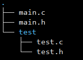
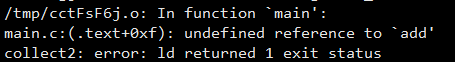
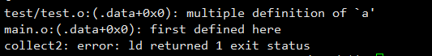

# 1.全局变量
## 1.1 只include，不连接

代码结构如下：



主文件内容如下：

```c
//main.c
#include "main.h"

int main() {
    printf("a = %d \n",a);
    return 0;
}

//main.h
#include <stdio.h>
#include "test.h" 
```
**注意**：这个`test.h`目录层级关系是相对于`-I`指定的相对路径，比如这个项目执行`-I test`，那么就是写为`#include "test.h"`，如果不写，那么应该写为`#include "test/test.h"`这样才能通过编译。

test文件内容如下：

```c
//test.c
//该文件内容为空

//test.h
int a = 20;
```

编译的命令为:

```
gcc -o main main.c -I test
```

**结果**：编译结果正常。 能够正常打印出正确结果。

**分析**：这里为什么没有出现重复定义的现象，这里只进行了`main.h`的一次include操作，连接文件`main.c`的展开内容应该为:

```c
#include <stdio.h>
int a = 20;
int main() {
    printf("a = %d \n",a);
    return 0;
}
```
所以，通过编译，且能够正常运行。

## 1.2 既要编译也要连接情况
代码结果不变:


主文件内容为,多加一个add实现，在test中实现该函数：

```c
//main.c
#include "main.h"

int main() {
	add(4,5);
    printf("a = %d \n",a);
    return 0;
}

//main.h
#include <stdio.h>
#include "test.h" 
```
 test的内容为：

```c
//test.c
void add(int a,int b) {
    printf("a + b = %d\n",a + b);
}
//test.h
int a = 20;
void add(int a,int b);
```
 


执行**编译**命令:**能够通过编译**

```
gcc -c -o main.o main.c -I test

```
但是利用同样的**链接**命令：
```
gcc -o main main.c -I test
```

**链接出错**：


**分析**：将链接文件main.c展开为：

```c
#include <stdio.h>
int a = 20;
void add(int a, int b);
int main() {
	add(4,5);
	printf("a = %d\n",a);
	return 0;
}
```

**注意**：**当函数只声明找不到函数的实现也会报undefined reference链接错误**.也就是需要将函数add实现的地方也要链接到可执行程序main中。(这里只需要链接通过，所以可以实现为一个空的，通过编译，然后具体实现可以由其他公司实现，然后他们自己来将实现体来进行链接编译)

> 链接需要函数体具体实现，编译找到声明就可以

所以需要先将test.c编译，然后再进行链接成main程序：

```
//进入test目录，执行
gcc -c -o test.o test.c
```
这里会报`printf`未声明警告，需要将test文件修改为：

```c
//test.c
//注意：这个stdio标准文件放在这里比较合适，如果放在test.h中，可能导致include时候重复。原则应该是哪里用到放在哪里比较合适，一般解决重复包含的问题使用宏ifndef define解决
#include <stdio.h>
#include "test.h"
void add(int a,int b) {
    printf("a + b = %d\n",a + b);
}
//test.h
int a = 20;
void add(int a,int b);
```


再执行main程序的链接：

```
gcc -o main main.c test/test.o -I test
```

出现错误：



**分析**：链接内容展开

```c
//test.o
#include <stdio.h>
int a = 20;
void add(int a,int b);
void add(int a,int b){
	printf("a + b = %d\n",a + b);
}

//main.o
#include <stdio.h>
int a = 20;
void add(int a, int b);
int main() {
	add(4,5);
	printf("a = %d\n",a);
	return 0
```

将test.o和main.o链接到一起，发现`int a = 20;`和`void add(int a,int b);`都会重复，但是只报了`a multiple definition`,看来链接检查**definition**,不检查**declartion**.(我的猜测。。。)

对于这个全局变量问题，一般讲全局变量定义在`.c`中，即满足**在`.h`中声明在`.c`中定义和实现**。

可以这样修改test文件

```c
//test.c
int a = 20;
void add(int a,int b) {
    printf("a + b = %d\n",a + b);
}
//test.h
extern int a;
void add(int a,int b);
```

再次编译，即可解决重复定义问题