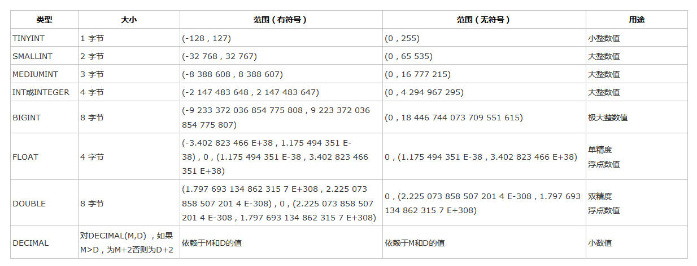
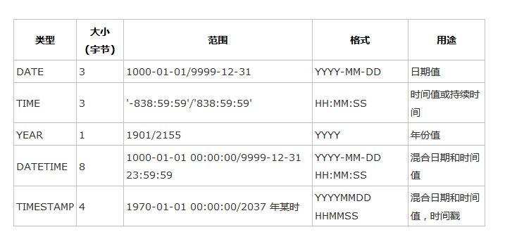
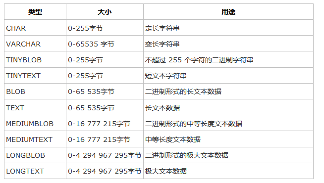

# 1.操作
## 1.1 显示

> show databases;

默认数据库：

* mysql - 用户权限相关数据
* test - 用于用户测试数据
* information_schema - MySQL本身架构相关数据

## 1.2 创建

> create database 数据库名称 default charset utf8 collate utf8_general_ci;

实例

```
create database derek default charset utf8 collate utf8_general_ci;
```

## 1.3 删除

> drop database derek;

## 1.4 使用

* use derek;        进入数据库
* show tables;      查看表
* select database();查看当前使用的数据库

## 1.5 用户管理

* use mysql;                        #进mysql数据库
* `SELECT HOST,USER FROM USER;`     #查看目前的用户
* `create user '用户名'@'IP地址' identified by '密码';` #创建用户
  * `create user 'zx'@'%' identified by '111';`
  * 账户名zx，ip地址任意（可以在任意ip下访问），密码‘’111‘’可以使用该用户
* `drop user '用户名'@'IP地址';` # 删除用户
* `rename user '用户名'@'IP地址' to '新用户名'@'IP地址';` #修改用户
* `set password for '用户名'@'IP地址' = Password('新密码')` # 修改密码

> 忘记密码

```sql
# 启动免授权服务端
mysqld --skip-grant-tables

# 客户端
mysql -u root -p

# 修改用户名密码
update mysql.user set authentication_string=password('666') where user='root';
flush privileges;
```

## 1.6授权管理

* 查看权限：`show grants for '用户'@'IP地址'`
* 授权:`grant 权限 on 数据库.表 to '用户'@'IP地址'`
* 取消权限：`revoke 权限 on 数据库.表 from '用户'@'IP地址'`
* `flush privileges`:将数据读取到内存中，从而立即生效  

```sql
show grants for 'zx'@'%';

grant select on *.* to 'zx'@'%';

grant all privileges on *.* to 'zx'@'%';

revoke select on *.* from 'zx'@'%';

revoke all privileges on *.* from 'zx'@'%';
```

所有权限

```
* 1 all privileges  除grant外的所有权限
* 2 select          仅查权限
* 3 select,insert   查和插入权限
* 4 usage           无访问权限
* 5 alter           使用alter table
* 6 alter routine   使用alter procedure和drop procedure
* 7 create          使用create table
* 8 create routine  使用create procedure
* 9 create temporary tables 使用create temporary tables
* 10 create user     使用create user,drop user,rename user和revoke all privileges
* 11 create view     使用create view
* 12 delete          使用delete
* 13 drop            使用drop table
* 14 execute         使用call和存储过程
* 15 file            使用select into outfile 和 load data infile
* 16 grant option    使用grant 和 revoke
* 17 index           使用index
* 18 insert          使用insert
* 19 lock tables     使用lock table
* 20 process         使用show full processlist
* 21 select          使用select
* 22 show databases  使用show databases
* 23 show view       使用show view
* 24 update          使用update
* 25 reload          使用flush
* 26 shutdown        使用mysqladmin shutdown(关闭MySQL)
* 27 super           使用change master,kill,logs,purge,master和set global,还允* 许                    mysqladmin调试登陆
* 28 replication client      服务器位置的访问
* 29 replication slave       由复制从属使用
* 30 flush privileges　　　    　将数据读取到内存中,从而立即生效
```

# 2.Mysql数据类型
MySQL支持多种类型，大致可以分为三类：**数值**、**日期/时间**和**字符串(字符)类型**。

## 2.1 数值



## 2.2 日期和时间类型



## 2.3 字符串类型

