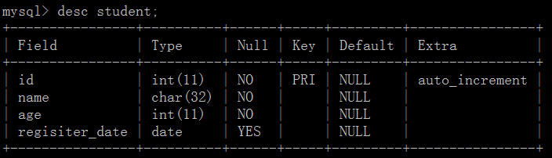
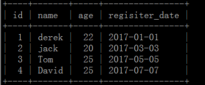

# 1.数据之表操作
## 1.1 创建表

> 语法：CREATE TABLE table_name (column_name column_type);

```sql
create table student(
    -> id INT NOT NULL AUTO_INCREMENT,
    -> name CHAR(32) NOT NULL,
    -> age INT NOT NULL,
    -> register_date DATE,
    -> PRIMARY KEY(id)         
    -> );
```

* auto_increment 表示：自增1。写入内容为空时，默认从1,2,3...往下填充写入表格中。
* primary key：  表示约束(不能重复且不能为空); 加速查找
* not null: 不为空

**查看表**

* show tables;      -->查看有哪些表
* desc student;     --> 查看student表的信息
* show create table student;    -->查看表student创建的信息



## 1.2 删除表

```sql
#drop table 表名

drop table student;
```

## 1.3 修改表

> 方法

```sql
添加列：alter table 表名 add 列名 类型
删除列：alter table 表名 drop column 列名
修改列：
        alter table 表名 modify column 列名 类型;  -- 类型
        alter table 表名 change 原列名 新列名 类型; -- 列名，类型
   
添加主键：
        alter table 表名 add primary key(列名);
删除主键：
        alter table 表名 drop primary key;
        alter table 表名  modify  列名 int, drop primary key;
   
添加外键：alter table 从表 add constraint 外键名称（形如：FK_从表_主表） foreign key 从表(外键字段) references 主表(主键字段);
删除外键：alter table 表名 drop foreign key 外键名称
   
修改默认值：ALTER TABLE testalter_tbl ALTER i SET DEFAULT 1000;
删除默认值：ALTER TABLE testalter_tbl ALTER i DROP DEFAULT;
```
> 实例

```sql
1.增加
ALTER TABLE student ADD sex CHAR(32);    #-->增加一列


2.删除
ALTER TABLE student DROP sex;     #-->删除一列


3.修改表名
ALTER TABLE student RENAME TO students;   #-->重命名4.修改列名ALTER TABLE students CHANGE regisiter_date register_date DATE;#change 字段名，类型都可以改，modify只能改类型
```

# 2.表内容操作
## 2.1 插入数据
**语法**

```
INSERT INTO table_name ( field1, field2,...fieldN )
                       VALUES
                       ( value1, value2,...valueN );
```

**插入数据**

```sql
mysql> INSERT INTO student(name,age,regisiter_date)
       -> VALUES('derek',22,'2017-01-01');
mysql> INSERT INTO student(name,age,regisiter_date)
         -> VALUES('jack',20,'2017-03-03');
```

`INSERT INTO student(name,age,regisiter_date) VALUES('Tom',25,'2017-05-05');`
`INSERT INTO student(name,age,regisiter_date) VALUES('David',25,'2017-07-07');`

* `SELECT * FROM student;`  -->看表里面的内容



## 2.2 查看数据

语法

```sql
1.SELECT column_name,column_name
2.FROM table_name
3.[WHERE Clause]
4.[OFFSET M ][LIMIT N]
```

* 查询语句中你可以使用**一个或者多个表**，表之间使用逗号(,)分割，并使用WHERE语句来设定查询条件。
* SELECT 命令可以读取一条或者多条记录。
* 你可以使用星号（*）来代替其他字段，SELECT语句会返回表的所有字段数据
* 你可以使用 WHERE 语句来包含任何条件。
* 你可以通过OFFSET指定SELECT语句开始查询的数据偏移量。默认情况下偏移量为0。
* 你可以使用 LIMIT 属性来设定返回的记录数。

实例

```sql
1.SELECT * FROM student LIMIT 2 OFFSET 2;

#limit： 查几条数据
#offset: 从第几个开始查


2.SELECT * FROM student where id>1;

#条件判断

3.SELECT * FROM student where id>1 and age<22;

#多个条件

4.SELECT * FROM student where name like "De%";

#like模糊查询
```

## 2.3 修改

```sql
update students set name = "Eric" where id=3;  
```

## 2.4 删除

```sql
delete from students where id>3;
```

## 2.5 排序

```sql
select * from 表 order by 列 asc              - 根据 “列” 从小到大排列
select * from 表 order by 列 desc             - 根据 “列” 从大到小排列
select * from 表 order by 列1 desc,列2 asc    - 根据 “列1” 从大到小排列，如果相同则按列2从小到大排
```

实例

```sql
#--->按id倒叙排列
select * from students order by id desc;
```

## 2.6 分组

```sql
1.按名字分组后，并且统计名字出现的次数
select name,count(*) from students group by name;

2.按名字分组后，把年龄加起来
select name,sum(age) from students group by name;

select name,sum(age) as rename_sumage from students group by name;
#加as，可以自定义sum(age)的名字
```