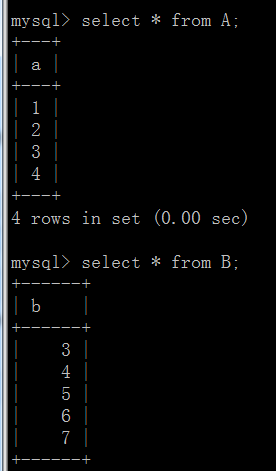

# 1.Mysql 连接
JOIN 按照功能大致分为如下三类：

* INNER JOIN（内连接,或等值连接）：获取两个表中字段匹配关系的记录。
* LEFT JOIN（左连接）：获取左表所有记录，即使右表没有对应匹配的记录。
* RIGHT JOIN（右连接）： 与 LEFT JOIN 相反，用于获取右表所有记录，即使左表没有对应匹配的记录。



```sql
交集
select * from A inner join B on A.a=B.b;

差集
select * from A left join B on A.a=B.b;
select * from A right join B on A.a=B.b;

并集
select * from A left join B on A.a=B.b union select * from A right join B on A.a=B.b;
```

# 2.事务
MySQL 事务主要用于处理操作量大，复杂度高的数据。特性：　

* 1.事务的原子性：一组事务，要么成功；要么撤回。
* 2、稳定性 ： 有非法数据（外键约束之类），事务撤回。
* 3、隔离性：事务独立运行。一个事务处理后的结果，影响了其他事务，那么其他事务会撤回。事务的100%隔离，需要牺牲速度。
* 4、可靠性：软、硬件崩溃后，InnoDB数据表驱动会利用日志文件重构修改。可靠性和高速度不可兼得， innodb_flush_log_at_trx_commit选项 决定什么时候吧事务保存到日志里。

```
begin                   -->开启

insert into  ......     -->要写入的内容

rollback;               -->回滚到原来状态

commit;                 -->确认提交
```

# 3.外键
MySQL支持外键的存储引擎只有InnoDB , 在创建外键的时候 , 要求父表必须有对应的索引 , 子表在创建外键的时候也会自动创建对应的索引

# 4.索引类型
先创建表

```sql
mysql> CREATE TABLE test(
    -> id INT,
    -> username VARCHAR(16),
    -> city VARCHAR(16),
    -> age INT
    -> );
```

## 4.1 普通索引

是最基本的索引，它没有任何的限制。有以下几种创建方式

* （1）直接创建索引：`CREATE INDEX index_name ON table(column(length))`

实例：`CREATE INDEX test_username ON test (username(10));` -->单列索引
indexName为索引名，mytable表名，username和city为列名，10为前缀长度，即索引在该列从最左字符开始存储的信息长度，单位字节

如果是CHAR，VARCHAR类型，前缀长度可以小于字段实际长度；如果是BLOB和TEXT类型，必须指定 前缀长度，下同。

* （2）修改表结构的方式添加索引:`ALTER TABLE table_name ADD INDEX index_name ON (column(length)`

实例:`ALTER TABLE test ADD INDEX test_username(username(10));`
此处 indexName 索引名可不写，系统自动赋名 username ，username_2 ，username_3，...

* （3）创建表的时候同时创建索引

```sql
mysql> CREATE TABLE test(
    -> id INT,
    -> username VARCHAR(16),
    -> city VARCHAR(16),
    -> age INT,
    -> INDEX test_username (username（10）)
    -> );
```

## 4.2 唯一索引
与前面的普通索引类似，不同的就是：索引列的值必须唯一，但允许有空值。如果是组合索引，则列值的组合必须唯一。它有以下几种创建方式：

* （1）创建唯一索引:`CREATE UNIQUE INDEX indexName ON table(column(length))`

实例:`CREATE UNIQUE INDEX test_city ON test(city(10));`

* （2）修改表结构:`ALTER TABLE table_name ADD UNIQUE indexName ON (column(length))`

* （3）创建表的时候直接指定

```sql
mysql> CREATE TABLE test(
    -> id INT,
    -> username VARCHAR(16),
    -> city VARCHAR(16),
    -> age INT,
    -> UNIQUE test_username (username（10）)
    -> );
```

## 4.3 主键索引
是一种特殊的唯一索引，一个表只能有一个主键，不允许有空值。一般是在建表的时候同时创建主键索引：

主键索引无需命名，一个表只能有一个主键。主键索引同时可是唯一索引或者全文索引，但唯一索引或全文索引不能共存在同一索引

* （1）修改表结构创建：`ALTER TABLE test ADD PRIMARY KEY (id);`
* （2）创建表的时候直接指定

```sql
mysql> CREATE TABLE test(
    -> id INT,
    -> username VARCHAR(16),
    -> city VARCHAR(16),
    -> age INT,
    -> PRIMARY KEY(id)
    -> );
```

## 4.4 组合索引
指多个字段上创建的索引，只有在查询条件中使用了创建索引时的第一个字段，索引才会被使用。使用组合索引时遵循最左前缀集合

```sql
ALTER TABLE test ADD INDEX test_username_city (username,city);
```

## 4.5 全文索引
主要用来查找文本中的关键字，而不是直接与索引中的值相比较。fulltext索引跟其它索引大不相同，它更像是一个搜索引擎，而不是简单的where语句的参数匹配。fulltext索引配合match against操作使用，而不是一般的where语句加like。它可以在create table，alter table ，create index使用，不过目前只有char、varchar，text 列上可以创建全文索引。值得一提的是，在数据量较大时候，现将数据放入一个没有全局索引的表中，然后再用CREATE index创建fulltext索引，要比先为一张表建立fulltext然后再将数据写入的速度快很多。