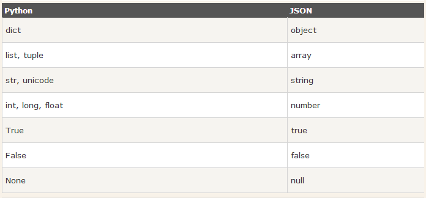

# Json和pickle模块
> 什么是序列化？

我们把对象(变量)从内存中变成可存储或传输的过程称之为序列化

> 为什么要序列化？

* 1.持久保存状态

需知一个`软件/程序`的执行就在处理一系列状态的变化，在编程语言中，'状态'会以各种各样有结构的数据类型(也可简单的理解为变量)的形式被保存在内存中。

内存是无法永久保存数据的，当程序运行了一段时间，我们断电或者重启程序，内存中关于这个程序的之前一段时间的数据（有结构）都被清空了。

在断电或重启程序之前将程序当前内存中所有的数据都保存下来（保存到文件中），以便于下次程序执行能够从文件中载入之前的数据，然后继续执行，这就是序列化。

具体的来说，你玩使命召唤闯到了第13关，你保存游戏状态，关机走人，下次再玩，还能从上次的位置开始继续闯关。或如，虚拟机状态的挂起等。

* 2.跨平台数据交互

序列化之后，不仅可以把序列化后的内容写入磁盘，还可以通过网络传输到别的机器上，如果收发的双方约定好实用一种序列化的格式，那么便打破了平台/语言差异化带来的限制，实现了跨平台数据交互。

反过来，把变量内容从序列化的对象重新读到内存里称之为反序列化，即unpickling。

JSON和Python内置的数据类型对应如下：



# 1.json

```python
import json
dic={'name':'alvin','age':23,'sex':'male'}
print(type(dic)) #<class 'dict'>

j=json.dumps(dic)
print(type(j)) ##<class 'str'>
f=open('序列化对象','w')
f.write(j)  #-------------------等价于json.dump(dic,f)
f.close()

# 读取序列化对象
import json
f=open('序列化对象')
data=json.loads(f.read())#  等价于data=json.load(f)
f.close()
```

```python
import json
#dct="{'1':111}"#json 不认单引号
#dct=str({"1":111})#报错,因为生成的数据还是单引号:{'one': 1}

dct='{"1":"111"}'
print(json.loads(dct))

#conclusion:
#        无论数据是怎样创建的，只要满足json格式，就可以json.loads出来,不一定非要dumps的数据才能loads
```

## 1.1 json实例

```python
import json
# 序列化
info = {'name':'derek','age':'22'}

with open('test','w') as f:
    f.write(json.dumps(info))

# 反序列化
with open('test','r') as f:
    info = json.loads(f.read())
    print(info)
```