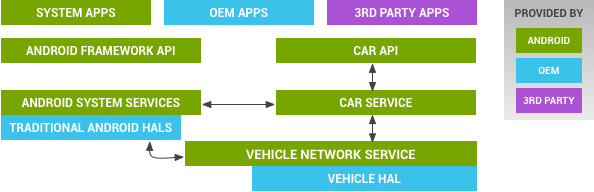

# 1.概述

汽车通过总线拓扑实现**子系统相互连接**和**车载娱乐系统**(IVI,in-vehicle infotainment)连接。

总线确切的类型和协议在制造商差别很大(同一品牌可能也会出现)。例如包括如下总线：

* 控制器局域网总线（CAN，Controller Area Network bus）
* 本地互连网络总线（LAN，Local Interconnect Network bus）
* 面向媒体的系统传输(MOST, Media Oriented Systems Transport )
* 汽车级以太网(automotive-grade Ethernet)
* `TCP/IP`网络类型如，BroadR-Reach

安卓汽车HAL向framework层提供一致接口，这样不用管物理传输层。HAL层由安卓汽车厂商实现。

系统集成厂商通过车辆HAL（通过实现特定平台HAL接口如，HVAC）与技术特定网络接口(如CAN总线)连接来实现车辆HAL模块。**典型的实现**可能需要包含一个运行在一个实时系统(RTOS,real-time operating system)特定MCU（dedicated Microcontroller Unit）控制单元来给CAN总线访问(或类似总线)，这个CAN总线通过一些链路连接着运行Android Automotive的CPU。  只要是硬件实现了HAL层，不一定是一个MCU，可以一个虚拟的CPU。

**简单说：**HAL实现需要CAN总线的CPU与MCU进行通信，来实现整个Android automotive系统。

# 2.架构

车辆HAL层是定义汽车和车辆网络服务之间的接口

* `Car API`:APIs包含`CarHvacManager`和`CarSensorManager`。具体支持的在`/platform/packages/services/Car/car-lib`
* `CarService`:在`/platform/packages/services/Car`
* `VehicleNetworkService`:通过内置安全器控制车辆HAL。只有系统组件能够获取(非系统组件应该使用car API).OEMs通过`vns_policy.xml`和`vendor_vns_policy.xml`控制权限。在`/platform/packages/services/Car/vehicle_network_service/`中。为了库来获得车辆网络，参照`/platform/packages/services/Car/libvehiclenetwork/`
* `Vehicle HAL`:OEMs厂商实现这个接口。包含属性metadata(包含系统属性时候是一个int,哪个允许改变模式)。位于`hardware/libhardware/include/hardware/vehicle.h`.基本实现参考`hardware/libhardware/modules/vehicle/`.

# 3.安全

车辆HAL支持三种级别获取数据权限：

* 只能系统的(由`vns_policy.xml`控制)
* 通过APP权限控制(通过car service)
* 无需权限(通过汽车服务)

直接获取汽车属性只能通过vechicle网络服务选择的系统组件，vehicle network service像一个看门的。 大多数系统应用程序通过汽车服务进行额外的守门(如，系统应用程序可以控制HVAC，因此它需要仅授予系统应用程序的系统权限)

# 4.验证

AOSP包含如下开发的测试资源:

* `hardware/libhardware/tests/vehicle/vehicle-hal-tool.c`用于加载车辆HAL并执行简单操作的命令行本机工具。有助于在开发的早期阶段启动和运行系统。
* `packages/services/Car/tests/carservice_test/`包含使用模拟车辆HAL属性的汽车服务测试。对于每个属性，预期行为在测试中实现。这可以是理解预期行为的良好起点。
* `hardware/libhardware/modules/vehicle/`基本参考实现。