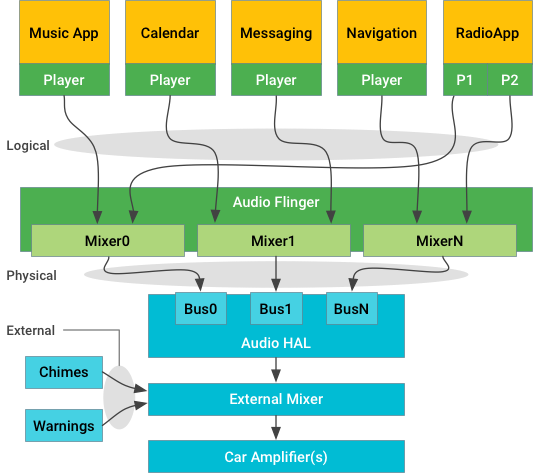

# 1.关键概念

Android主要负责娱乐声音(即媒体，导航和通信)，但不直接负责有严格时序性和可用性的铃声(chimes)和警告(warning)。外部源由应用来显示，主要负责音频焦点。但是，不能依赖声音焦点来选择和混合声音。

Android 9声音先关支持改变：

# 2.Android 声音和流

车辆声音系统处理下面的声音和流：

Android主要负责来自Android app的声音，控制这些app和在HAL层，根据声音的类型路由声音独立的流：

* Logical 流，（称为核心音频命名法中的源）使用音频属性进行标记
* Physical流，核心音频命名法中的设备，在混合后没有上下文信息

为了可靠性，外部声音(如完全带警告声音来自独立的源)不是由Android管理的，是在HAL层下面，甚至是独立的硬件。系统实现者必须提供一个混合器，来接收一个或多个声音来自Android的输入并且与外部声音进行混合以一种车辆要求的合适的方式输出。外部源可能一直有，或者通过`creaeAudioPatch`HAL层入口点。

HAL实现和外部混合是为了确保核心安全外部声音被听到，将他们混在在Android提供的流，路由他们能够被合适的外放上。

# 2.Android sounds
APP可能有一个或多个player通过标准API交互。(AudioManager来焦点控制，MediaPlayer播放流)类忽略一个或多个逻辑声音流数据。这个数据可能是一个单通道mono或者7.1声音，但是被路由或认为一个单一的源。应用的流带有`AudioAttributes`提示这个流应该如何显示出来。

logical流通过`AudioService`发送和路由到一个(只有一个)可用的物理输出源，每个都在`AudioFlinger`输入混合器。当`AudioAttributes`混合传输成物理流，这些属性不再被获得。

每个物理流被发送到Audio HAL层来在硬件渲染。在车辆应用中，渲染硬件可以是一个本地的编解码器或者一个远程处理通过车辆物理网络。另外，发送实际采样的数据是Audio HAL层的职责让它可听见。

# 3.External streams

声音流，不应该通过Android来路由(出于认证或时间原因)应该直接发送到外部混合器。大多数情况下，Android 不需要知道这些声音的存在在外部混合器能够将他们与Android声音混合。如果一个声音需要被ducked(避开)或者路由到不同的外放，外部混合器能够自己实现不用告诉Android系统。

如果外部流是媒体资源应该和Android环境产生的声音进行交互。(例如，停止MP3播放当外部通道打开的时候)，这些外部流应该通过Android App显示出来。这样App应该申请音频焦点并且对焦点通知做反应，如果必要的话，通过开始或停止外部资源来适应Andorid焦点的策略。一个建议机制来控制外部设备是`AudioManager.createAudioPatch()`

# 4.Audio focus

在开始logic流之前，应用程序应`AudioAttributes`使用与其逻辑流相同的方式请求音频焦点。系统不强求，发送这个请求只是建议的。一些应用可以明确跳过发送请求来获得特殊的行为(如，在来电话故意播放声音)

如果这个原因，应该考虑焦点一个直接控制方式并且不要和媒体播放相冲突，不是原始音频控制机制(车辆不该依赖焦点系统，操作音频子系统)
焦点通知不是HAL层的一部分并且不应该用在音频路由的过程中。

# 5.Output BUS

在音频HAL层，设备类型`AUDIO_DEVICE_OUT_BUS`对车辆音频系统提供通用输出设备。BUS设备支持地址端口(每个端口是物理流的终点)并且应该是在车辆中唯一支持的外围设备。

一个系统实现能够使用一个BUS端口对整个Android系统声音，这个时候Android混合所有并且发送就好像只有一个流。可选的，HAL能够提供一个BUS端口对每个Context允许发送所有声音类型。这个对HAL来混合或者避开不同需要的声音提供可能。

这个对BUS端口Contexts分配通过Audio Control HAL层来完成和创建Context和BUS端口之间多对一的关系。

# 6.Micphone输入
当捕获音频时，音频HAL接口一个`openInputStream`调用，不含一个`AudioSource`参数表示这个micphone输入应该被如何处理。

`VOICE_`