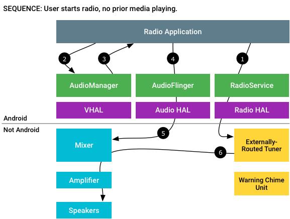
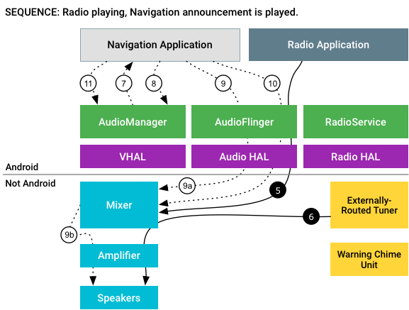
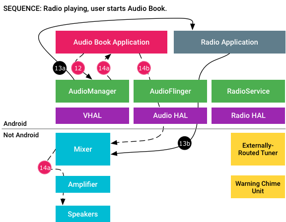
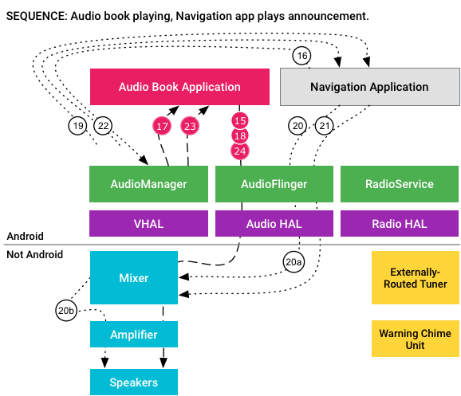

# example interaction sequences

下面车辆音频样例，Vehicle Head Unit跑在Android 9上并且包含一个音频应用和一个导航应用。另外，车辆tuner额外被路由的并且通过speaker播放。真实使用的情形，可能可能将tuner作为Android输入更有利并且一个Radio应用从tuner中读和写入到一个`AudioTrack`对象。

# 1.用户启动收音机radio
在这个交互序列中，在一个预设频率手机应用中，当用户按Play时候，没有媒体在汽车上播放。收音机应用对tuner必需获得焦点来通过外放播放声音。

图1  Radio gains focus and tuner play over speakers

* 1.Radio:“"Tune to FM 96.5."”
* 2.Radio:获得焦点GAIN
* 3.AudioManager:GAIN授权
* 4.Radio:`createAudioPatch()`
* 5.Radio:播放tuner输出
* 6.Externally-routed tuner：混合器让Tuner音频路由到放大器中。

# 2.Radio避免导航弹出

这个交互流程，当导航应用弹出下一个转弯的提示时候，正在播放收音机。导航引用必须一个从`AudioManager`获得焦点来播放导航提示

图2. 收音机回避导航弹出

* 5.Radio:"play tuner output"
* 6.Externally-routed tuner:混合器能够让Tuner音频路由到放大器。
* 7.Navigation:从`AudioManager`中获得GAIN TRANSIENT。
* 8.AudioManager:GAIN TRANSIENT 给导航
* 9.Navigation:打开流，发送包
	* a.导航：GUIDANCE上下文路由到bus1
	* b.混合器：回避Tuner在bus1GUIDANCE外放上播放
* 10.导航：提示结束，关闭流
* 11.导航：放弃焦点

`AudioManager`认为收音机播放能够回避并且将能够对音乐流使用回避因素而不用通知音频应用。然而，框架回避跳过通过复写`framework/base/core/res/res/values/config.xml`和设置`config_applyInternalDucking`为`false`,所以外部tuner继续使用提供的声音，收音机应用仍然不知道任何改变。混合器(HAL层下)负责混合连个输入并且能够选择回避收音机播放或者移动收音机播放到后置扬声器中。

当导航提示完成，导航引用释放焦点收音机播放重新获得焦点。

# 3.用户启动预定音频应用
这个流程，用户启动一个音频预定应用，导致收音机停止播放(播放音乐播放会有相同的触发)

图3.预定音频从收音机播放获得焦点

* 12.预定音频：从`AudioManager`获得GAIN上下文`MEDIA`
* 13.收音机失去焦点：
	* a.AudioManager:LOSS
	* b.Radio:`releaseAudioPatch()`
* 14.预定音频获得焦点：
	* a.GAIN授权，MEDIA上下文路由到bus0中
	* b.打开流，发送MEDIA包。

获取预定音频应用的焦点不是一直的，和之前保持焦点(收音机应用)，接收一个永远失去焦点，收音机应用通过拆除和它相连的patch。混合器停止tuner的监听并且启动通过Audio HAL来处理音频的传递。()

# 4.导航提示获得焦点

当导航应用弹出一个导航提示的时候，audio book正在播放。

图4. 导航从audio book中提示获得焦点

* 15.Audio Book:MEDIA 包流，非并发获得焦点
* 16.Navigation:获得 GAIN TRANSIENT
* 17.AudioManager:LOSS TRANSIENT
* 18.Audio Book:Stops
* 19:Audio Manager:GAIN TRANSIENT 授权
* 20: Navigation:打开流，发送包
	* a.Navigation:GUIDACE上下文路由到bus1
	* b.Mixer:播放bus1(GUIDANCE)
* 21: Navigation:提示结束，关闭流。
* 22: Navigation:放弃焦点
* 23: Audio Book:GAIN
* 24: Audio Book:重新启动。

因为原始音频应用`AudioFocusRequest`(当启动`AudioTrack`发送)包含`AUDIOFOCUS_FLAG_PAUSES_ON_DUCKABLE_LOSS`标志，`AudioManager`决定不能够处理回避预定音频应用。代替，`AudioManager`发送一个`AUDIOFOCUS_LOSS_TRANSIENT`消息给预定应用，预期的反应是暂停当前的播放。

导航应用现在能够播放导航提示不会被中断。当导航提示完成，预定音频重新获得焦点并且重启播放。