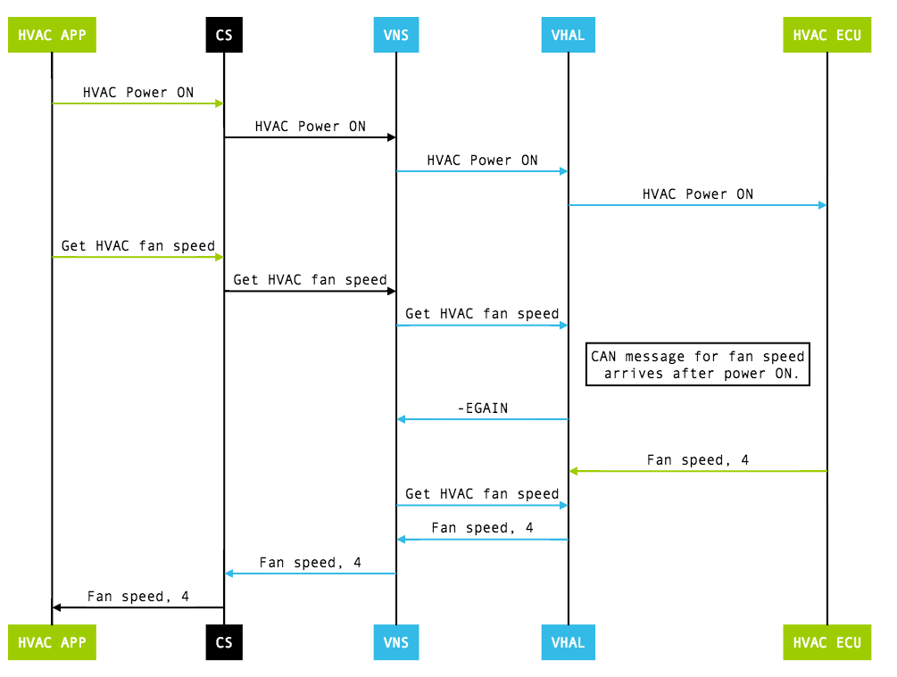
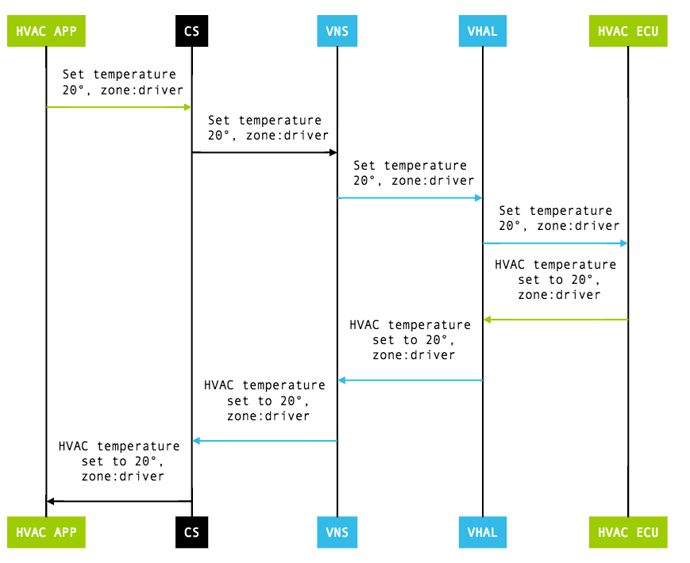

# 车辆属性
车辆HAL接口定义属性，OEMs能够实现和包含合适的metadata(例如，属性是否是一个Int和哪个模式是允许的)。车辆HAL是基于获得(读，写，订阅)一个属性，这些是一个函数的抽象。

# 1.HAL接口
车辆HAL使用如下接口:

* `vehicle_pro_config_t const *(*list_properties)(...,int*num_properties)`:列举出车辆所有支持的属性。只支持使用VNS(vehicle network service)属性。
* `(*get)(...,vehicle_pro_value_t *data)`:读当前属性值。对于区域属性，每个区域有不同的值。
* `(*set)(...,const vehicle_pro_value_t *data)`:写属性值。写的结果是每个属性定义的值
* `(*subscribe)(...,int32_t prop,float sample_rate,int32_t zones)`
	* 监控属性值的改变。对于区域属性，对请求区域进行订阅。Zone=0表示需要所有地方的都支持的。
	* 当属性值改变或者一个常量迭代，车辆HAL应该有分开的回调。
* `(*release_memory_from_get)(struct vehicle_hw_device* device,vehicle_prop_value_t *data)`释放分配的从get调用的内存。

车辆HAL使用下面的回调接口：

* `(*vehicle_event_callback_fn)(const vehicle_prop_value_t *event_data)`通知车辆属性值改变。应该只对订阅的属性有效果。
* `(*vehicle_error_callback_fn)(int32_t property,int32_t operation)`返回全局车辆HAL层错误，或者每个属性错误。全局错误导致HAL重启，这会导致其他组件重启(包括应用)。

# 2.车辆属性
属性能够使只读，只写(备用传递信息给车辆HAL层)，或者可读可写(大部分属性支持可选的)。每个属性是通过int32作为key并且有一个预定义类型(`value_type`)

* `BYTES`
* `BOOLEAN`
* `FLOAT`
* `FLOAT[]`
* `INT32`
* `INT32[]`
* `INT64`
* `INT64[]`
* `STRING`

一个区域属性可以有多个值，属性通过区域数字进行支持。

# 3.Area类型
车辆HAL定义多个Area类型：

* `GLOBAL`这个属性是单利，不支持多个areas。
* `WINDOW`Area是基于窗的，使用`VehicleAreaWindow`枚举类型.
* `MIRROR`Area是语句镜子的，使用`VehicleAreaMirror`枚举类型
* `SEAT`Area是基于座椅的。使用`VehicleAreaSeat`枚举类型
* `WHEEL`:Area是基于方向盘，使用`VehicleAreaWheel`枚举类型

每个zoned属性必须使用预定义area类型。每个area类型有一个位标志集合定义在一个area类型枚举中。例如，SEAT area定义`VehicleAreaSeat`枚举类：

* `ROW_1_LEFT=0x0001`
* `ROW_1_CENTER=0X0002`
* `ROW_1_RIGHT=0x0004`
* `ROW_2_LEFT=0x0010`
* `ROW_2_CENTER=0x020`
* `ROW_2_RIGHT=0x040`
* `ROW_3_LEFT=0x0100`

# 4.Area IDs
Zone属性通过Area IDs定位。每个zoned属性支持一个或多个Area IDs.一个Area ID有一个或多个标志位(各自枚举值)组成.例如，一个属性使用`VehicleAreaSeat`应该使用下面的IDs：

* `ROW_1_LEFT | ROW_1_RIGHT`:Area ID使用与前排座位。
* `ROW_2_LEFT`:只适用后排左座位
* `ROW_2_RIGHT`:只适用后排右座位

# 5.属性状态
每个属性伴随着`VehiclePropertyStatus`值。这个显示当前属性值的状态：

* `AVAILABLE`属性值可获得，这个值是有效的
* `UNAVALIBALE`属性值不可获得。这个用于暂时不支持的属性值。
* `ERROR`这个属性值有点问题

**注意**：如果车辆不支持这个属性，不应该被包含在VHAL中。将一个属性状态设置成永远UNAVAILABLE表示不支持该属性，这个是不被接受的。

# 6.配置一个属性值
使用`vehicle_prop_config_t`对每个属性，提供一个配置信息。信息包含如下：

* `access`(r,w,rw)
* `changeMode`(represents how property is monitored:on change vs continuous)
* `areaConfig`(areaId,min and max values)
* `configArray`(additional configuration parameters)
* `configString`(additional information passed as a string)
* `minSampleRate,max_sample_rate`
* `prop`(Property ID,int)

# 7.处理区域属性
一个zoned属性相当于一些列多个属性，它的子属性通过具体的Area ID值来获得：

* `get`zoned属性调用总是会包含Area ID进行请求，所以只有被请求的area ID值被返回。如果属性是一个global那么Area ID值为0.
* `set`zoned属性总是包含area ID请求的，所以只有那些被请求area id才会改变
* `subscribe`调用给那些Area IDs属性产生事件。

## 7.1 get调用
初始化阶段，这个属性值可能还不能够获得，因为匹配车辆网络信息还没有收到。这个时候，get调用应该返回`-EAGAIN`.一些属性(如HVAC)有单独`on/off`电源属性.调用get比如一个属性(当断电的时候)应该返回一个`UNAVAILABLE`状态而不是人会一个错误。

例如下面:get HAVC温度

图1.获得HVAC温度(CS,CarService,VNS=VehicleNetworkService,VHAL=Vehicle HAL)
## 7.2 set调用
在请求改变发出后，set包含事件通知调用是一个异步操作。典型操作，set调用导致通过车辆网络发出一个改变。ECU(eletronic control unit)有的属性产生一个改变，这个更新值是通过车辆网络被返回的。车辆HAL发送一个更新值作为事件给VNS（vehicle network service）

一些set调用可能在初始化阶段，为了让初始数据准备好，这些数据可能还不够狗获得。这情形下，set应该返回`-EAGAIN`.一些带有电源`on/off`属性应该返回`-ESHUTDOWN`当电源关闭的时候并且设置不能够完成。

直到`set`有效之前，`get`返回的不一定就是设置的值.(set生效后，get才返回set的值)

set HVAC温度

图2.设置HVAC温度(CD=CarService,VNS=VehicleNetworkService)

# 8.处理定制属性
为了支持合作商特殊要求，车辆HAL允许定制属性，只能给系统app使用。当想要定制属性，使用下面引导步骤：

* 属性ID应该属性下面属性：
	* `VehiclePropertyGroup:VENDOR`VENDOR组只能够给定制用户使用。
	* `VehicleArea`选择一个合适Area类型
	* `VehiclePropertyType`选择合适数据类型。BYTES类型允许原生数据，所以这个足够大多数情形使用。**频繁发送大数据通过定制属性会降低整车网络获取速度，当加载大负载要注意**
	* 属性ID：为自定义属性选择四个半字节ID
* 获得通过`CarPropertyManager`或者通过网络服务API(对于底层)。不要修改其他的接口，会导致将来的兼容性。

# 9.处理HVAC属性
能够使用HAL来控制HVAC，同来HVAC相关的属性。大部分属性是zoned属性，但是一些non-zoned(全局)属性。例如下面属性包含：

* `VEHICLE_PROPERTY_HVAC_TEMPERATURE_SET`设置每个zone温度
* `VEHICLE_PROPERTY_HVAC_RECIRC_ON`:控制每个区域的recircluation（再循环）

对全部列举HVAC属性，在`types.hal`中搜索`VEHICLE_PROPERTY_HVAC_*`.

当HVAC属性使用`VehicleAreaSeat`需要额外规则映射HVACzoned属性到AreaIDs。每个可获得座椅必须作为Area ID数组的一部分。

例如1:一个汽车有两个前座椅(`ROW_1_LEFT`,`ROW_1_RIGHT`)和三个后排座椅(`ROW_2_LEFT`,`ROW_2_CENTER`,`ROW_2_RIGHT`).有两个温控单元：驾驶员旁边和副驾驶旁边。

* 对于`HVAC_TEMPERATURE SET`座椅，一个有效Area IDs映射是:
	* `ROW_1_LEFT | ROW_2_LEFT`
	* `ROW_1_RIGHT | ROW_2_CENTER | ROW_2_RIGHT`
* 对同一个硬件配置，一个可选映射是：
	* `ROW_1_LEFT | ROW_2_LEFT | ROW_2_CENTER`
	* `ROW_1_RIGHT | ROW_2_RIGHT`

例子2：一个汽车有三排座椅，两个前排，第二排三个，第三排三个。三个温度控制单元：驾驶员，副驾驶和后排。一个合理的映射`HVAC_TEMEPRATURE_SET`到Area IDs是一个三个元素数组：

* `ROW_1_LEFT`
* `ROW_1_RIGHT`
* `ROW_2_LEFT | ROW_2_CENTER | ROW_2_RIGHT | ROW_3_LEFT | ROW_3_CENTER | ROW_3_RIGHT`

# 10.处理传感器属性
车辆HAL传感器属性代表真实传感器数据或者策略信息比如驾驶状态。一些传感器信息(比如驾驶状态或者`白天/夜晚`模式)可以被任何不需要权限的应用获得的，因为数据强制建立一个安全车辆的应用。其他传感器信息(比如车速)更加敏感的需要使用者管理获取特殊的权限。

支持的传感器属性包括：

* `NIGHT_MODE`应该支持。决定显示白天或黑夜模式
* `GEAR_SELECT/CURRENT_GREAR`驾驶员选择的齿轮和实际的齿轮
* `VEHICLE_SPEED`车辆速度。需要权限
* `ODOMETER`目前的里程表数。需要权限
* `FUEL_LEVEL`目前的燃油水平(%)
* `FUEL_LEVEL_LOW`燃油量是否低(boolean型)

# 11.车辆地图服务(VMS)

VMS提供一个交换地图数据机制，是在接口的客户端和支持普通车辆特性交换，比如ADAS（advanced driver assistance）.客户端可以通过车辆HAL或者高优先级Android应用的VMS属性包含车辆系统接口。在VMS上数据共享目的是限制映射数据给用户通过车辆系统和支持的应用。

VMS只给实现Android实现使用；AOSP不包含默认的客户端发布和订阅VMS。

车辆HAL中的VMS属性，消息类型和数据接口在Vehicle HAL 2.0中描述。[Vehicle HAL 2.0](https://android.googlesource.com/platform/hardware/interfaces/+/master/automotive/vehicle/2.0/types.hal)和枚举类型[VmsMessageType](https://android.googlesource.com/platform/hardware/interfaces/+/master/automotive/vehicle/2.0/types.hal#3216),列举了VMS支持消息的类型。这个枚举类在车辆数组中的第一个整数和决定后面的消息类型怎么解码。