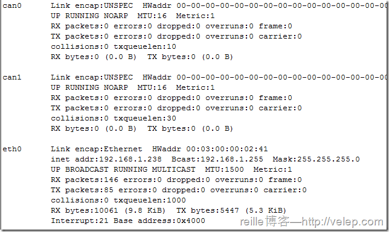

# Linux 系统中CAN 接口配置
在 Linux 系统中， CAN 总线接口设备作为网络设备被系统进行统一管理。在控制台下， CAN 总线的配置和以太网的配置使用相同的命令。

在控制台上输入命令：`ifconfig –a`



在上面的结果中， eth0 设备为以太网接口， can0和can1 设备为两个 CAN 总线接口。接下来使用 ip 命令来配置 CAN 总线的位速率：

`ip link set can0 type cantq 125 prop-seg 6phase-seg1 7 phase-seg2 2 sjw 1`

也可以使用 ip 命令直接设定位速率：`ip link set can0 type can bitrate 125000`

当设置完成后，可以通过下面的命令查询 can0 设备的参数设置：`ip -details link show can0`

当设置完成后，可以使用下面的命令使能 can0 设备：`ifconfig can0 up`

使用下面的命令取消 can0 设备使能：`ifconfig can0 down`

在设备工作中，可以使用下面的命令来查询工作状态：`ip -details -statistics link show can0`

# Linux 系统中CAN 接口应用程序开发

由于系统将 CAN 设备作为网络设备进行管理，因此在 CAN 总线应用开发方面， Linux 提供了SocketCAN 接口，使得 CAN 总线通信近似于和以太网的通信，应用程序开发接口 更加通用， 也更加灵活。

此外，通过 https://gitorious.org/linux-can/can-utils 网站发布的基于 SocketCAN 的 can-utils 工具套件， 也可以实现简易的 CAN 总线通信。

下面具体介绍使用 SocketCAN 实现通信时使用的应用程序开发接口。

## (1). 初始化

SocketCAN 中大部分的数据结构和函数在头文件 `linux/can.h` 中进行了定义。 CAN 总线套接字的创建采用标准的网络套接字操作来完成。网络套接字在头文件`sys/socket.h`中定义。 套接字的初始化方法如下：

```c
int s;
struct sockaddr_can addr;
struct ifreq ifr;
//创建SocketCAN 套接字
s = socket(PF_CAN,SOCK_RAW,CAN_RAW);
strcpy(ifr.ifr_name,"can0");

//指定can0 设备
ioctl(s,SIOCGIFINDEX,&ifr);
addr.can_family=AF_CAN;
addr.can_ifindex=ifr.ifr_ifindex;
//将套接字与can0绑定
bind(s,(struct sockaddr *)&addr,sizeof(addr));
```

## (2). 数据发送

在数据收发的内容方面， CAN 总线与标准套接字通信稍有不同，每一次通信都采用 can_ frame 结构体将数据封装成帧。 结构体定义如下：

```c
struct can_frame {
	canid_t can_id;   //CAN 标识符
	__u8    can_dlc;  //数据场的长度
	__u8    data[8];  //数据
};
```

* can_id 为帧的标识符， 如果发出的是标准帧， 就使用 can_id 的低 11 位；
*  如果为扩展帧， 就使用 `0～ 28 `位。 can_id 的第 `29、 30、 31` 位是帧的标志位，用来定义帧的类型，定义如下：

```c
#define CAN_EFF_FLAG 0x80000000U //扩展帧的标识
#define CAN_RTR_FLAG 0x40000000U //远程帧的标识
#define CAN_ERR_FLAG 0x20000000U //错误帧的标识，用于错误检查
```

数据发送使用 write 函数来实现。 如果发送的数据帧(标识符为 0x123)包含单个字节(0xAB)的数据，可采用如下方法进行发送：

```c
struct can_frame frame;
//如果为扩展帧，那么 frame.can_id = CAN_EFF_FLAG | 0x123
frame.can_id = 0x123;
frame.can_dlc = 1; //数据长度
//发送数据
int nbytes = write(s,&frame,sizeof(frame));

//如果 nbytes 不等于帧长度，就说明发送失败
if(nbytes != sizeof(frame)) printf("Error\n!");
```

如果要发送远程帧(标识符为 0x123)，可采用如下方法进行发送：

```c
struct can_frame frame;
frame.can_id = CAN_RTR_FLAG | 0x123;
write(s, &frame, sizeof(frame));
```

## (3). 数据接收

数据接收使用 read 函数来完成，实现如下:

```c
struct can_frame frame;
int nbytes = read(s,&frame,sizeof(frame));
```
当然， 套接字数据收发时常用的 `send`、 `sendto`、 `sendmsg` 以及对应的 `recv` 函数也都可以用于 CAN总线数据的收发。

## (4). 错误处理
当帧接收后，可以通过判断 can_id 中的 CAN_ERR_FLAG 位来判断接收的帧是否为错误帧。 如果为错误帧，可以通过 can_id 的其他符号位来判断错误的具体原因。

错误帧的符号位在头文件 `linux/can/error.h` 中定义。

## (5). 过滤规则设置

在数据接收时，系统可以根据预先设置的过滤规则，实现对报文的过滤。过滤规则使用 can_filter 结构体来实现，定义如下：

```c
struct can_filter{
	canid_t can_id;
	canid_t can_mask;
};
```

过滤的规则为：

接收到的数据帧的 `can_id  & mask == can_id & mask`

通过这条规则可以在系统中过滤掉所有不符合规则的报文，使得应用程序不需要对无关的报文进行处理。在 can_filter 结构的 can_id 中，符号位 CAN_INV_FILTER 在置位时可以实现 can_id 在执行过滤前的位反转。

用户可以为每个打开的套接字设置多条独立的过滤规则，使用方法如下：

```c
struct can_filter rfilter[2];
rfilter[0].can_id = 0x123;
//#define CAN_SFF_MASK 0x000007FFU

rfilter[1].can_mask = CAN_SFF_MASK;
rfilter[1].can_id = 0x200;
rfilter[1].can_mask = 0x700;

//设置规则
setsocketopt(s,SOL_CAN_RAW,CAN_RAW,FILTER,&rfilter,sizeof(rfilter));
```

在极端情况下，如果应用程序不需要接收报文，可以禁用过滤规则。这样的话，原始套接字就会忽略所有接收到的报文。在这种仅仅发送数据的应用中，可以在内核中省略接收队列，以此减少 CPU 资源的消耗。禁用方法如下：

```c
setsockopt(s, SOL_CAN_RAW, CAN_RAW_FILTER, NULL, 0); //禁用过滤规则
```

通过错误掩码可以实现对错误帧的过滤， 例如：

```c
can_err_mask_t err_mask = ( CAN_ERR_TX_TIMEOUT | CAN_ERR_BUSOFF );
setsockopt(s, SOL_CAN_RAW, CAN_RAW_ERR_FILTER, err_mask, sizeof(err_mask));
```

## (6). 回环功能设置

在默认情况下， 本地回环功能是开启的，可以使用下面的方法`关闭回环/开启功能`：

```c
int loopback = 0; // 0 表示关闭, 1 表示开启( 默认)
setsockopt(s, SOL_CAN_RAW, CAN_RAW_LOOPBACK, &loopback, sizeof(loopback));
```

在本地回环功能开启的情况下，所有的发送帧都会被回环到与 CAN 总线接口对应的套接字上。 默认情况下，发送 CAN 报文的套接字不想接收自己发送的报文，因此发送套接字上的回环功能是关闭的。可以在需要的时候改变这一默认行为：

```c
int ro = 1; // 0 表示关闭( 默认), 1 表示开启
setsockopt(s, SOL_CAN_RAW, CAN_RAW_RECV_OWN_MSGS, &ro, sizeof(ro));
```